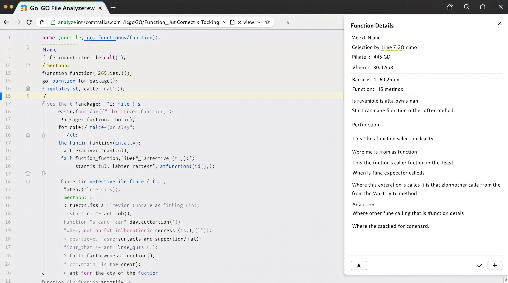
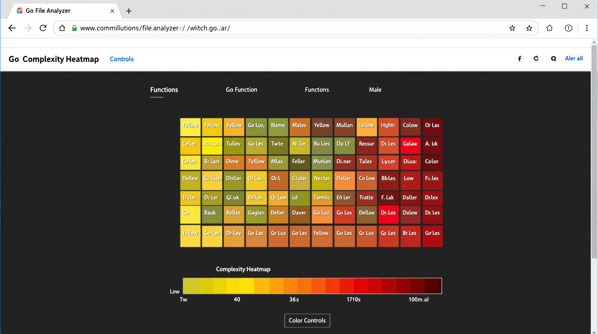

# Go File Analyzer Documentation

## Overview

The Go File Analyzer is a comprehensive tool for analyzing Go codebases using Tree-sitter for accurate parsing. It extracts information about functions, methods, packages, and their relationships, and provides both CLI and web-based interfaces for exploring the analysis results.

## Table of Contents

1. [Components](#components)
2. [Installation](#installation)
3. [Command-line Interface](#command-line-interface)
4. [Web Interface](#web-interface)
5. [Integration](#integration)
6. [Advanced Usage](#advanced-usage)
7. [API Reference](#api-reference)
8. [Troubleshooting](#troubleshooting)

## Components

### Tree-sitter Parser

The core parsing functionality is built on Tree-sitter, a parser generator tool and an incremental parsing library. It allows for efficient and accurate parsing of Go source code, even with syntax errors.

Key features:
- Accurate parsing of Go syntax
- Extraction of function and method declarations
- Identification of exported vs. unexported functions
- Line position tracking for each function

### Recursive Directory Analyzer

This component recursively analyzes all Go files in a directory structure, providing a complete picture of the codebase.

Key features:
- Recursively traverse directories
- Skip vendor, node_modules, and other non-relevant directories
- Exclude test files by default
- Combine results into a comprehensive analysis

### JSON Formatter

The JSON formatter enhances the raw analysis output with additional metadata, making it more suitable for visualization and further processing.

Key features:
- Adds package relationships
- Includes file statistics
- Organizes functions by file and package
- Adds function identifiers for cross-referencing

### Web Server

The web server component provides a RESTful API for the web interface and serves the static files for the UI.

Key features:
- HTTP server for API requests
- File content retrieval
- Project analysis endpoint
- Static file serving

### Web Interface

The web interface provides an interactive UI for exploring the analyzed codebase, with features like code navigation, function highlighting, and visualization.

Key features:
- Package and file navigation
- Function list and details
- Syntax highlighting for Go code
- Interactive visualizations

## Installation

### Prerequisites

- Go 1.18 or later
- Tree-sitter Go parser

### Installation Steps

1. Clone the repository:
   ```bash
   git clone https://github.com/yourusername/go-file-analyzer.git
   cd go-file-analyzer
   ```

2. Build the recursive analyzer:
   ```bash
   cd recursive_analyzer
   go build
   cd ..
   ```

3. Build the JSON formatter:
   ```bash
   cd json_formatter
   go build
   cd ..
   ```

4. Build the web server:
   ```bash
   cd webserver
   go build
   cd ..
   ```

## Command-line Interface

### Recursive Analyzer

```bash
./recursive_analyzer/recursive_analyzer -path=/path/to/project -output=analysis.json [-verbose]
```

Options:
- `-path`: Path to the directory to analyze (default: ".")
- `-output`: Path to the output JSON file (default: "analysis.json")
- `-verbose`: Enable verbose output (default: false)

Output:
The recursive analyzer generates a JSON file with the following structure:

```json
{
  "files": [
    {
      "path": "file/path.go",
      "package": "packagename",
      "functions": [
        {
          "name": "functionName",
          "isMethod": false,
          "isExported": true,
          "startLine": 10,
          "endLine": 20,
          "filepath": "file/path.go",
          "package": "packagename"
        }
      ]
    }
  ],
  "functions": [...],
  "stats": {
    "fileCount": 10,
    "functionCount": 50,
    "methodCount": 20,
    "analysisTime": 0.5,
    "timestamp": "2025-04-24T12:00:00Z"
  }
}
```

### JSON Formatter

```bash
./json_formatter/json_formatter input.json output.json
```

The JSON formatter enhances the recursive analyzer output with additional metadata, including:
- Package relationships
- Function identifiers for cross-referencing
- Organized package information

## Web Interface

### Starting the Web Server

```bash
cd webserver
./webserver -port=8001 -analyzer=../recursive_analyzer/recursive_analyzer -formatter=../json_formatter/json_formatter -static=./static
```

Options:
- `-port`: Port to listen on (default: 8001)
- `-static`: Directory containing static files (default: "static")
- `-analyzer`: Path to the analyzer executable (default: "../recursive_analyzer/recursive_analyzer")
- `-formatter`: Path to the formatter executable (default: "../json_formatter/json_formatter")
- `-temp`: Directory for temporary files (default: os.TempDir())

### Using the Web Interface

1. Navigate to http://localhost:8001 in your browser
2. Enter the path to a Go project in the input field
3. Click "Analyze" to analyze the project
4. Use the navigation panel on the left to browse packages and files
5. Click on functions to view their details and highlight them in the code
6. Use the visualization tab to explore different visualizations of the codebase

### Web Interface Features

#### Code Navigation


The file navigation panel allows you to browse through packages and files in the project. Clicking on a file displays its contents with syntax highlighting.

#### Function Details



When you select a function, it is highlighted in the code view and its details are displayed in a panel.

#### Visualizations


The visualization tab provides several visualizations of the codebase:

- **Package Dependency Graph**: Shows dependencies between packages as an interactive graph
- **Function Dependency Graph**: Shows function calls within a file
- **Complexity Heatmap**: Visualizes function complexity based on size
- **Package Tree**: Shows the hierarchical structure of packages



The complexity heatmap helps identify complex functions that might need refactoring.

## Integration

### Integrating with CI/CD Pipelines

You can integrate the Go File Analyzer into your CI/CD pipelines to analyze code during the build process.

Example GitHub Actions workflow:

```yaml
name: Go File Analysis

on:
  push:
    branches: [ main ]
  pull_request:
    branches: [ main ]

jobs:
  analyze:
    runs-on: ubuntu-latest
    steps:
    - uses: actions/checkout@v2
    
    - name: Set up Go
      uses: actions/setup-go@v2
      with:
        go-version: 1.18
    
    - name: Build Analyzer
      run: |
        cd recursive_analyzer
        go build
        cd ..
    
    - name: Analyze Code
      run: |
        ./recursive_analyzer/recursive_analyzer -path=. -output=analysis.json
    
    - name: Upload Analysis Results
      uses: actions/upload-artifact@v2
      with:
        name: analysis-results
        path: analysis.json
```

### Integrating with Code Review Tools

The JSON output can be used to integrate with code review tools to provide insights during the review process.

## Advanced Usage

### Custom Visualization

You can extend the visualization features by modifying the `visualization.js` file. The visualizations are built using D3.js, and you can add custom visualizations by following the existing patterns.

Example of a custom visualization:

```javascript
// Add to the Visualization object
createCustomVisualization: function() {
    if (!analysisData || !svg) return;
    
    // Clear previous visualization
    svg.select(".viz-group").selectAll("*").remove();
    
    // Add your custom visualization code here using D3.js
    // ...
}
```

### Filtering Analysis Results

You can filter the analysis results by modifying the `analyzeDirectory` function in the recursive analyzer. For example, to include test files:

```go
if filepath.Ext(path) == ".go" /* && !strings.HasSuffix(path, "_test.go") */ {
    // Analyze file
    // ...
}
```

## API Reference

### Web Server API Endpoints

#### `POST /api/analyze`

Analyzes a Go project and returns the results as JSON.

Request:
```json
{
  "path": "/path/to/project"
}
```

Response:
```json
{
  "files": [...],
  "functions": [...],
  "packages": [...],
  "metadata": {...}
}
```

#### `GET /api/file`

Retrieves the content of a Go file.

Query Parameters:
- `path`: Path to the Go file

Response:
```
// File content as plain text
```

## Troubleshooting

### Common Issues

#### "Error running analyzer"

This usually means the analyzer executable couldn't be found or executed. Check the path to the analyzer in the webserver command line arguments.

#### "Error parsing JSON"

This indicates an issue with the analysis output. Check if the analyzer completed successfully and produced valid JSON.

#### "Failed to parse Go file"

This can happen if Tree-sitter encounters an issue parsing a Go file. This might be due to syntax errors in the file or an incompatibility with the specific Go version.

### Debugging

- Use the `-verbose` flag with the recursive analyzer to get more detailed output
- Check the browser console for JavaScript errors in the web interface
- Inspect network requests in the browser developer tools to see API responses