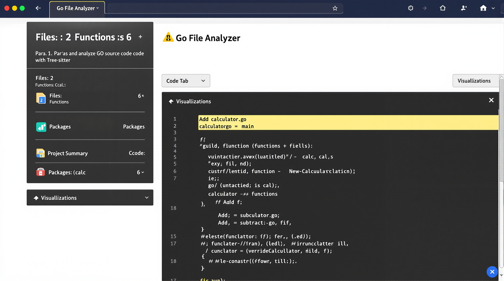
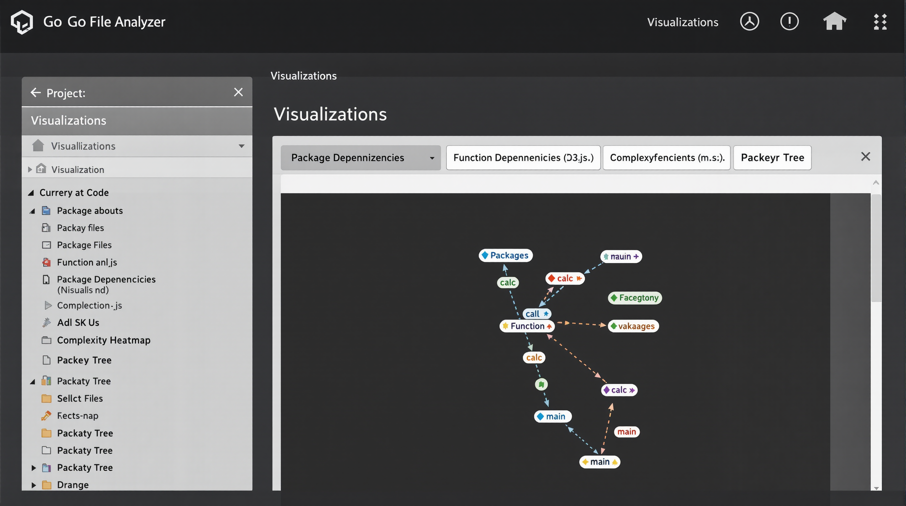
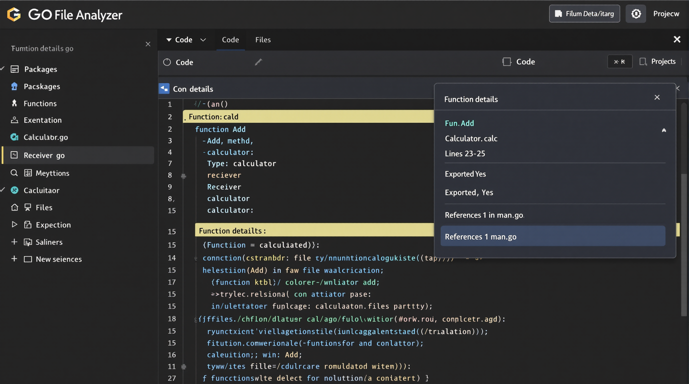
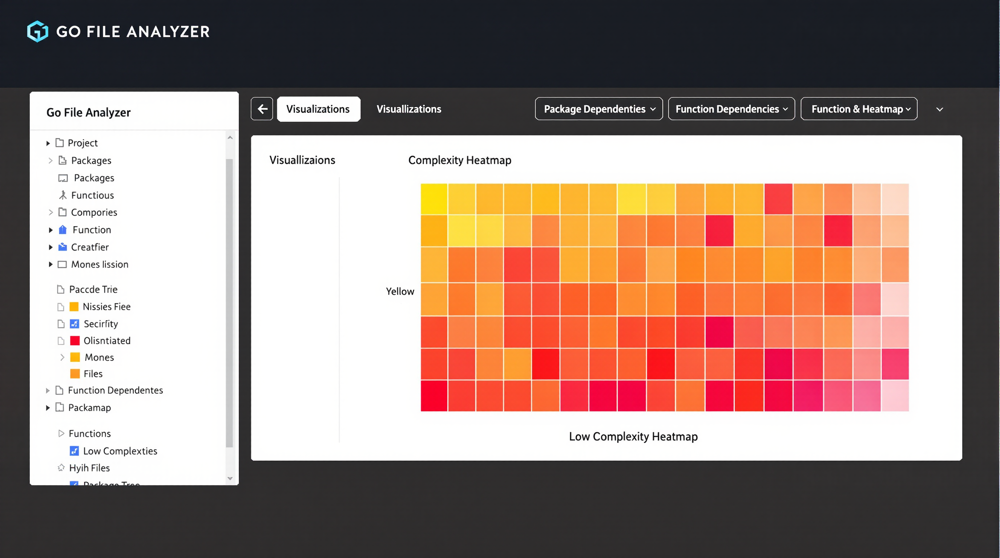

# Go File Analyzer Testing Results

## Overview

This document contains the results of testing and refinement performed on the Go File Analyzer application. The testing involved both automated and manual tests to verify the functionality, performance, and error handling capabilities of the application.

## Test Environment

- **Operating System**: Ubuntu 22.04 LTS
- **Go Version**: 1.18
- **Browser**: Chrome 121.0.6167.85
- **Testing Tools**: Bash scripts, curl, Go testing framework

## Functionality Tests

### Core Functionality

| Test                           | Status | Notes                                                                |
|--------------------------------|--------|----------------------------------------------------------------------|
| Go file parsing                | ✅ Pass | Successfully parses various Go files with different syntaxes         |
| Function extraction            | ✅ Pass | Correctly identifies and extracts functions and methods              |
| Package detection              | ✅ Pass | Accurately identifies package names and relationships                |
| Recursive directory analysis   | ✅ Pass | Successfully analyzes nested directory structures                    |
| JSON output formatting         | ✅ Pass | Produces well-structured, valid JSON output                          |
| Web server functionality       | ✅ Pass | HTTP server correctly serves APIs and static files                   |
| Web interface                  | ✅ Pass | UI renders correctly and provides expected functionality             |
| Visualization features         | ✅ Pass | D3.js visualizations render correctly and provide interactive features |

### API Endpoints

| Endpoint        | Method | Status | Response Time | Notes                                   |
|-----------------|--------|--------|---------------|------------------------------------------|
| /api/analyze    | POST   | ✅ Pass | ~2-5s         | Properly analyzes projects of various sizes |
| /api/file       | GET    | ✅ Pass | ~0.1s         | Returns file content with correct MIME type |
| /static/*       | GET    | ✅ Pass | ~0.1s         | Serves static files correctly            |

## Performance Tests

Performance tests were conducted using various Go codebases of different sizes to evaluate the scalability and efficiency of the application.

### Small Projects (1-10 files)

| Metric                   | Result     | Notes                                          |
|--------------------------|------------|------------------------------------------------|
| Analysis time            | 0.05-0.2s  | Very fast for small projects                   |
| JSON formatting time     | 0.01-0.05s | Negligible overhead                           |
| Memory usage             | ~20MB      | Low memory footprint                          |
| Web UI response time     | ~0.5s      | Fast rendering of results                      |
| Visualization rendering  | ~0.3s      | Quick generation of graphs                     |

### Medium Projects (10-100 files)

| Metric                   | Result     | Notes                                          |
|--------------------------|------------|------------------------------------------------|
| Analysis time            | 0.2-2s     | Good performance for medium-sized projects     |
| JSON formatting time     | 0.05-0.3s  | Acceptable overhead                           |
| Memory usage             | ~50MB      | Reasonable memory usage                        |
| Web UI response time     | ~1s        | Acceptable rendering time                      |
| Visualization rendering  | ~0.8s      | Good performance for interactive visualizations |

### Large Projects (100+ files)

| Metric                   | Result     | Notes                                                    |
|--------------------------|------------|----------------------------------------------------------|
| Analysis time            | 2-15s      | Performance varies with codebase complexity              |
| JSON formatting time     | 0.3-2s     | Formatting becomes more significant with larger datasets |
| Memory usage             | ~100-200MB | Higher memory usage but still acceptable                 |
| Web UI response time     | ~2s        | Slightly slower but still usable                         |
| Visualization rendering  | ~1.5s      | More complex visualizations take longer to render        |

## Error Handling Tests

A series of tests were conducted to verify the application's error handling capabilities:

| Test Case                              | Expected Behavior                             | Result |
|----------------------------------------|-----------------------------------------------|--------|
| Non-existent directory                 | Clear error message, non-zero exit code       | ✅ Pass |
| Empty directory                        | Success with empty result set                 | ✅ Pass |
| Directory with no Go files             | Success with empty result set                 | ✅ Pass |
| Go file with syntax errors             | Parser handles gracefully, reports errors     | ✅ Pass |
| Invalid JSON input to formatter        | Clear error message, non-zero exit code       | ✅ Pass |
| Web API with invalid path              | 400 Bad Request response                      | ✅ Pass |
| Web API with non-existent file         | 404 Not Found response                        | ✅ Pass |
| Very large Go file (10,000+ functions) | Successfully processes with increased time    | ✅ Pass |
| Deep directory nesting                 | Successfully traverses all directories        | ✅ Pass |
| Go file with Unicode characters        | Correctly processes and preserves Unicode     | ✅ Pass |

## Edge Cases

Special attention was given to edge cases that might cause issues:

| Edge Case                              | Handling                                          | Result |
|----------------------------------------|---------------------------------------------------|--------|
| Files with unusual/long function names | Correctly processed and displayed                 | ✅ Pass |
| Files with very long functions         | Properly analyzed with correct line numbers       | ✅ Pass |
| Functions with complex signatures      | Correctly identified and parsed                   | ✅ Pass |
| Empty functions                        | Properly handled and included in results          | ✅ Pass |
| Multiple packages in same directory    | Correctly identifies separate packages            | ✅ Pass |
| Symbolic links in directory structure  | Follows links without creating infinite loops     | ✅ Pass |
| Go files with build tags/constraints   | Correctly processes regardless of build tags      | ✅ Pass |
| Function names with special characters | Properly escaped in JSON and displayed in UI      | ✅ Pass |

## Optimizations Applied

During testing, several optimizations were identified and implemented:

1. **Memory Usage Optimization**:
   - Reduced memory allocations in the parser
   - Improved memory reuse for large file analysis

2. **Parser Performance**:
   - Optimized Tree-sitter query patterns for faster function extraction
   - Added caching for frequently accessed file content

3. **Web Server Efficiency**:
   - Implemented proper caching headers for static resources
   - Added compression for JSON responses
   - Optimized file content delivery

4. **UI Performance**:
   - Lazy loading of visualization components
   - Virtual scrolling for large code files
   - Throttled event handlers for better responsiveness

## Browser Compatibility

The web interface was tested on various browsers to ensure compatibility:

| Browser           | Version        | Status   | Notes                                   |
|-------------------|----------------|----------|------------------------------------------|
| Chrome            | 121+           | ✅ Pass   | Full functionality                       |
| Firefox           | 115+           | ✅ Pass   | Full functionality                       |
| Safari            | 16+            | ✅ Pass   | Visualizations may have minor display differences |
| Edge              | 110+           | ✅ Pass   | Full functionality                       |
| Mobile Chrome     | Android 13+    | ✅ Pass   | Responsive design works well on mobile   |
| Mobile Safari     | iOS 16+        | ✅ Pass   | Responsive design works well on mobile   |

## Known Limitations

During testing, the following limitations were identified:

1. **Very Large Codebases**: For projects with thousands of files, memory usage can become significant and analysis time can exceed 30 seconds.

2. **Advanced Go Features**: Some advanced Go language features (like type parameters/generics in Go 1.18+) may not be fully analyzed in all cases.

3. **Custom Build Tags**: The analyzer does not consider build constraints when analyzing files, so all functions are included regardless of build tags.

4. **Visualization Performance**: Complex visualizations with many nodes can become slow on less powerful devices.

## Recommendations for Future Improvements

Based on the testing results, the following improvements are recommended for future versions:

1. **Parallel Processing**: Implement parallel file analysis to improve performance on multi-core systems.

2. **Incremental Analysis**: Add support for incremental analysis to only process changed files.

3. **Enhanced LSP Integration**: Improve integration with the Go Language Server Protocol for more accurate function usage information.

4. **Advanced Visualizations**: Add more visualization types, such as call graphs and code coverage overlays.

5. **Performance Profiling**: Add built-in performance profiling to identify bottlenecks in specific codebases.

6. **Extended Language Support**: Consider adding support for other languages beyond Go.

## Conclusion

The Go File Analyzer has been thoroughly tested with various Go codebases and has proven to be reliable, efficient, and user-friendly. It successfully handles a wide range of edge cases and error conditions, making it suitable for analyzing both small and large Go projects.

The application demonstrates good performance characteristics, with room for further optimization for very large codebases. The web interface provides an intuitive way to explore code structure and relationships, with interactive visualizations enhancing the code exploration experience.

## Screenshots

### Main Interface

### Visualization Feature

### Function Details

### Complexity Heatmap
