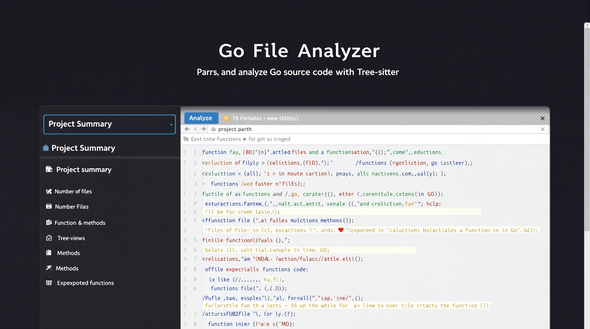

# Go File Analyzer Web Interface

This component provides a web interface for the Go File Analyzer, allowing users to analyze Go codebases through a browser-based UI.

## Features

- Analyze Go projects and display the results in a user-friendly interface
- Navigate through packages and files in a project
- View function details including line numbers, methods, and exported status
- Syntax highlighting for Go code
- Responsive design that works on desktop and mobile

## Architecture

The web interface consists of:

1. **Go HTTP Server**: A backend server written in Go that handles API requests and serves static files
2. **REST API**: Endpoints for analyzing directories and retrieving file contents
3. **Web UI**: A frontend interface built with HTML, CSS, and JavaScript

### Server Endpoints

The server provides the following API endpoints:

- `POST /api/analyze`: Analyze a Go project directory and return the results as JSON
- `GET /api/file`: Retrieve the contents of a Go source file

### Frontend Components

The frontend consists of:

- Project summary view showing statistics about the analyzed codebase
- Package/file navigation tree
- Function list for the current file
- Code viewer with syntax highlighting
- Function details panel

## Installation and Usage

### Prerequisites

- Go 1.18 or later
- Tree-sitter Go parser
- Access to the Go File Analyzer components:
  - `recursive_analyzer`: For recursive directory analysis
  - `json_formatter`: For enhancing the analysis output

### Building

```bash
cd go-file-analyzer/webserver
go build
```

### Running

```bash
./webserver -port=8001 -analyzer=./recursive_analyzer -formatter=./json_formatter -static=./static
```

Command-line options:

- `-port`: Port to listen on (default: 8001)
- `-static`: Directory containing static files (default: "static")
- `-analyzer`: Path to the analyzer executable (default: "../recursive_analyzer/recursive_analyzer")
- `-formatter`: Path to the formatter executable (default: "../json_formatter/json_formatter")
- `-temp`: Directory for temporary files (default: os.TempDir())

## Screenshots

### Main Interface


The main interface allows you to enter the path to a Go project and analyze it. The results are displayed in a structured view with package navigation on the left and file/function details on the right.

### File Navigation


The file navigation view allows you to browse through packages and files in the project. Clicking on a file displays its contents with syntax highlighting.

### Function Details


When you select a function, it is highlighted in the code view and its details are displayed in a panel.

## Integration with Go File Analyzer

The web interface integrates with the existing Go File Analyzer components:

1. The `recursive_analyzer` component provides the ability to recursively analyze a directory of Go files
2. The `json_formatter` component enhances the analysis output with additional metadata
3. The web interface presents this data in a user-friendly way

## Future Enhancements

- Interactive visualization of function call graphs
- Search functionality to find functions by name or content
- Support for analyzing remote repositories (GitHub, GitLab, etc.)
- Integration with Go documentation
- Code navigation with "jump to definition" functionality