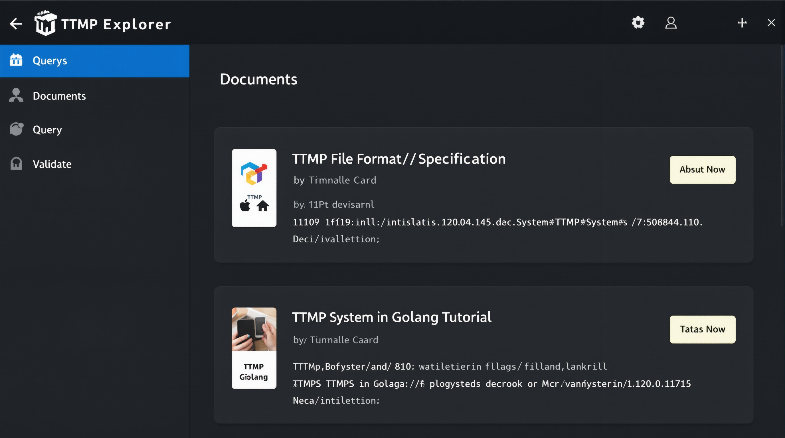
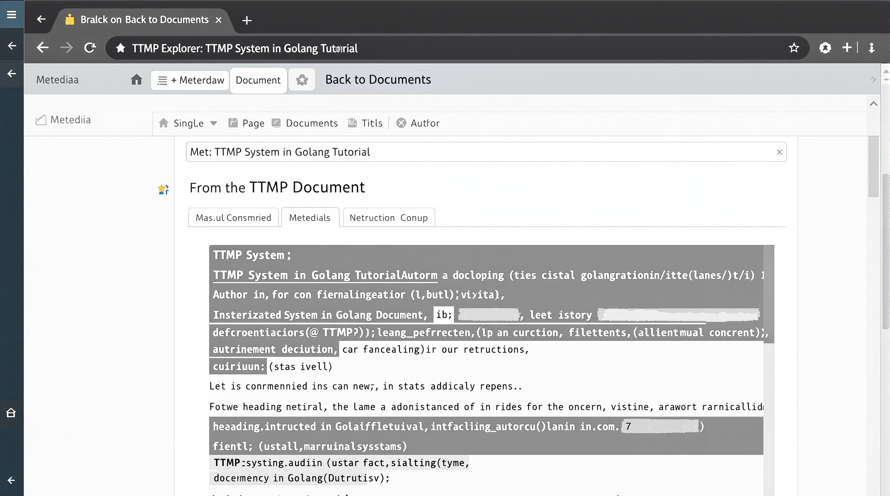
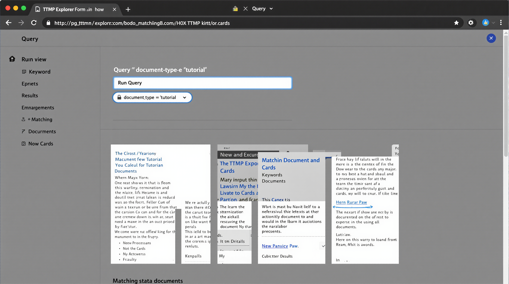
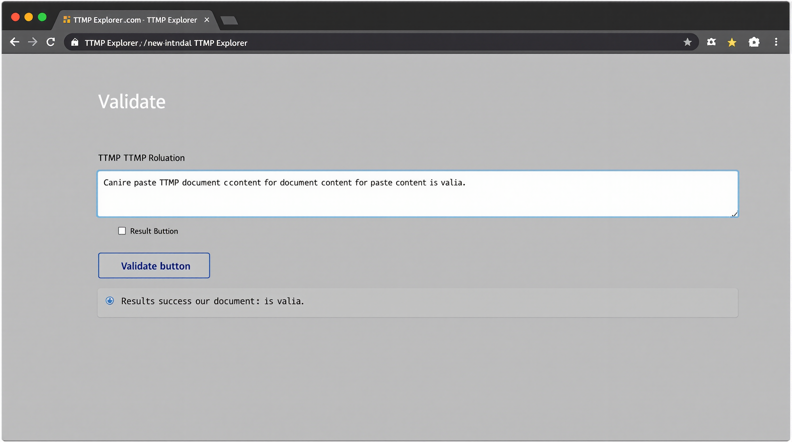
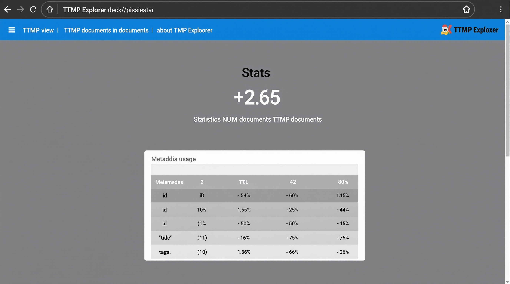

# TTMP Web Server Documentation

The TTMP Web Server provides a user-friendly web interface for interacting with TTMP documents. It leverages the core TTMP functionality to allow users to browse, search, query, and validate TTMP documents through a browser.

## Features

- **Document Browsing**: View a list of all TTMP documents with their metadata
- **Document Viewing**: View the content and metadata of individual documents
- **Document Querying**: Search for documents using query expressions and keywords
- **Document Validation**: Validate TTMP documents against the schema
- **Statistics**: View statistics about the TTMP document collection

## Installation

To install the TTMP web server, you need to have Go installed on your system. Then, you can build the server using:

```bash
cd ttmp-go
go build -o ttmp-server cmd/ttmp-server/main.go
```

## Usage

To start the web server:

```bash
./ttmp-server --port 8080 --path /path/to/documents
```

Options:
- `--port`: Port to listen on (default: 8080)
- `--path`: Base path to serve documents from (default: current directory)

## API Endpoints

The TTMP web server provides the following API endpoints:

### List Documents

```
GET /api/documents
```

Returns a list of all documents in the base path.

### Get Document

```
GET /api/documents/{path}
```

Returns the content and metadata of a specific document.

### Query Documents

```
POST /api/query
```

Query for documents based on expressions and keywords.

Request body:
```json
{
  "query": "document_type == 'tutorial'",
  "keywords": ["golang", "ttmp"]
}
```

### Validate Document

```
POST /api/validate
```

Validates a TTMP document.

Request body:
```json
{
  "content": "---\nid: doc-id\ntitle: Document Title\n---\n\n# Content"
}
```

### Get Statistics

```
GET /api/stats
```

Returns statistics about the TTMP document collection.

## Web Interface

The web interface provides a user-friendly way to interact with TTMP documents. It includes several views:

### Documents View

The Documents view shows a list of all TTMP documents in the system. Each document is displayed as a card with its metadata. Users can search for documents by typing in the search box.



### Document View

The Document view shows the content and metadata of a specific document. It includes a "Back to Documents" button to return to the document list.



### Query View

The Query view allows users to search for documents using query expressions and keywords. It includes a form for entering the query and a results section.



### Validate View

The Validate view allows users to validate TTMP documents by pasting them into a text area. It shows whether the document is valid or not.



### Stats View

The Stats view shows statistics about the TTMP document collection, including the total number of documents and metadata usage.



## Query Language

The query language allows you to search for documents based on their metadata. The following operators are supported:

- `==`: Equal to
- `contains`: Contains a value (for arrays and strings)
- `&&`: Logical AND
- `||`: Logical OR

Examples:

- `document_type == 'tutorial'`: Find all tutorials
- `tags contains 'golang'`: Find documents with the "golang" tag
- `status == 'published' && author == 'Scout'`: Find published documents by Scout

## Implementation Details

The web server is built using Go's standard library and the Gorilla Mux router. It serves a single-page application (SPA) that communicates with the API endpoints.

### Server Structure

- `pkg/server/server.go`: Main server implementation
- `pkg/server/static/`: Static files for the web interface
  - `index.html`: Main HTML file
  - `styles.css`: CSS styles
  - `app.js`: JavaScript for the web interface

### API Handlers

- `handleListDocuments`: Handles requests to list all documents
- `handleGetDocument`: Handles requests to get a specific document
- `handleQueryDocuments`: Handles requests to query documents
- `handleValidateDocument`: Handles requests to validate a document
- `handleGetStats`: Handles requests to get document statistics

## Future Improvements

Potential future improvements for the web server include:

1. **Document Editing**: Allow users to edit documents through the web interface
2. **User Authentication**: Add user authentication for secure access
3. **Document Creation**: Add functionality to create new documents
4. **Improved Query UI**: Add a visual query builder
5. **Interactive Documentation**: Add interactive API documentation
6. **Better Error Handling**: Improve error messages and handling
7. **Pagination**: Add pagination for large document collections
8. **Sorting**: Allow sorting documents by various criteria
9. **Filtering**: Add more advanced filtering options
10. **Export/Import**: Allow exporting and importing collections