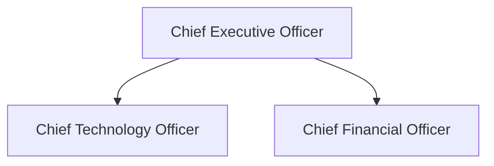
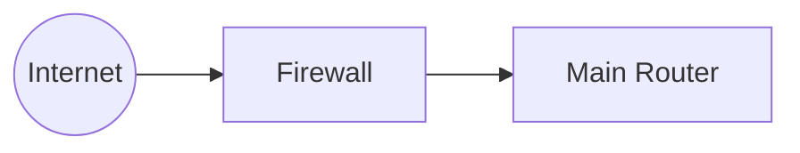
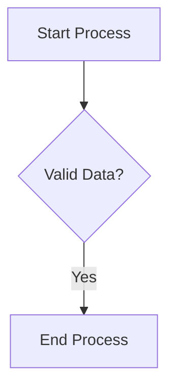

# Graph Generator TUI Application

A terminal-based interactive application built with Charm Bracelet's Bubbletea that generates ASCII diagrams from various graph types using mermaid-ascii integration.

## Features

- **Interactive TUI**: Beautiful terminal user interface with navigation and filtering
- **Multiple Graph Types**: Support for various domains including:
  - Organizational Charts (Business)
  - Network Topology (Technology)
  - Process Flows (Process)
  - System Architecture (Architecture)
  - Decision Trees (Logic)
  - Database Schemas (Database)
  - Git Workflows (Development)

- **Real-time Editing**: Multi-line text editor with syntax highlighting and line numbers
- **ASCII Diagram Generation**: Powered by mermaid-ascii for high-quality ASCII art diagrams
- **Filtering**: Search and filter graph types by name or domain
- **Responsive Design**: Adapts to terminal window size

## Technology Stack

- **Go**: Programming language
- **Bubbletea**: TUI framework by Charm Bracelet
- **Lipgloss**: Styling library for terminal interfaces
- **Bubbles**: Component library (list, textarea, viewport)
- **mermaid-ascii**: ASCII diagram generation from Mermaid syntax
- **VHS**: Terminal recording and screenshot tool for testing

## Installation

1. Clone the repository:
```bash
git clone <repository-url>
cd graph-generator
```

2. Build the application:
```bash
go build -o graph-generator main.go
```

3. Run the application:
```bash
./graph-generator
```

## Usage

### Navigation
- **Arrow keys** or **j/k**: Navigate through menu items
- **Enter**: Select a graph type
- **/** : Filter graph types
- **Escape**: Go back to previous screen
- **q**: Quit application or return to menu
- **Ctrl+C**: Exit application

### Editing
- **Ctrl+G**: Generate diagram from current mermaid code
- **Arrow keys**: Navigate within text editor
- **Page Up/Down**: Scroll through generated diagrams

### Graph Types

#### Organizational Chart


#### Network Topology


#### Process Flow


## Development

### Project Structure
```
graph-generator/
├── main.go                 # Main application code
├── mermaid-ascii/          # Modified mermaid-ascii library
├── vhs_scripts/            # VHS recording scripts
│   ├── demo_basic.tape
│   ├── demo_comprehensive.tape
│   └── final_demo.tape
└── README.md
```

### Testing with VHS

The application includes comprehensive VHS scripts for testing and demonstration:

```bash
# Run basic demo
vhs vhs_scripts/demo_basic.tape

# Run comprehensive demo
vhs vhs_scripts/demo_comprehensive.tape

# Run final demo
vhs vhs_scripts/final_demo.tape
```

### Text Screenshots

VHS generates text screenshots that can be analyzed to validate UI functionality:

- `improved_main_menu.txt`: Main menu interface
- `improved_org_input.txt`: Text editor with organizational chart template
- `improved_org_diagram.txt`: Generated ASCII diagram
- `improved_filtered_menu.txt`: Filtered search results

## Architecture

### Application States
1. **Menu State**: Display graph type selection
2. **Input State**: Edit mermaid diagram code
3. **Viewing State**: Display generated ASCII diagram

### Key Components
- **List Component**: Graph type selection with filtering
- **Textarea Component**: Multi-line code editor with line numbers
- **Viewport Component**: Scrollable diagram viewer
- **Styling**: Consistent color scheme and typography

### Mermaid-ASCII Integration
The application uses a modified version of mermaid-ascii with exported functions:
- `MermaidFileToMap()`: Parse mermaid syntax
- `DrawMap()`: Generate ASCII diagram
- Configurable rendering options (padding, ASCII-only mode, etc.)

## Contributing

1. Fork the repository
2. Create a feature branch
3. Make your changes
4. Test with VHS scripts
5. Submit a pull request

## License

MIT License - see LICENSE file for details

## Acknowledgments

- [Charm Bracelet](https://charm.sh/) for the excellent TUI libraries
- [mermaid-ascii](https://github.com/AlexanderGrooff/mermaid-ascii) for ASCII diagram generation
- [VHS](https://github.com/charmbracelet/vhs) for terminal recording capabilities

