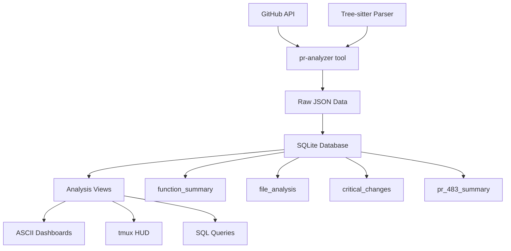

# PR Analysis System Documentation

## Overview
This system provides comprehensive analysis of GitHub Pull Requests using:
- **pr-analyzer tool**: Tree-sitter based Go code analysis
- **SQLite database**: Structured data storage and querying  
- **ASCII dashboards**: Visual representation of analysis
- **tmux HUD**: Real-time review interface

## Files Created

### Core Analysis
- `pr_analysis.db` (24K) - SQLite database with all analysis data
- `pr_analysis_schema.sql` - Complete database schema
- `functions.json` - Raw function analysis data (cleanup: removed)
- `commits.json` - Raw commit data (cleanup: removed)

### Dashboard Scripts
- `pr-review-hud.sh` - Full-featured tmux dashboard (5 panes)
- `quick-hud.sh` - Simplified 2x2 grid dashboard
- `demo-hud.sh` - Demo version for non-terminal environments

## Database Schema

### Tables

#### `functions`
```sql
CREATE TABLE functions (
    file_path TEXT,        -- Full path to the file
    function_name TEXT,    -- Name of the function
    is_changed INTEGER,    -- 1 if function was modified, 0 otherwise
    is_exported INTEGER,   -- 1 if function is exported (public), 0 otherwise
    start_line INTEGER,    -- Starting line number
    end_line INTEGER,      -- Ending line number
    receiver TEXT,         -- Method receiver (for Go methods)
    signature TEXT,        -- Full function signature
    owner TEXT,            -- GitHub repository owner
    repo TEXT,             -- GitHub repository name
    pr_number INTEGER      -- Pull request number
);
```

#### `commits`
```sql
CREATE TABLE commits (
    sha TEXT,              -- Git commit SHA
    author TEXT,           -- Commit author
    date TEXT,             -- Commit date
    message TEXT,          -- Commit message
    owner TEXT,            -- GitHub repository owner
    repo TEXT,             -- GitHub repository name
    pr_number INTEGER      -- Pull request number
);
```

### Views

#### `function_summary`
Overall statistics about function changes:
- `total_functions`: Total number of functions analyzed
- `changed_functions`: Number of functions that were modified
- `exported_functions`: Number of public/exported functions
- `changed_exported_functions`: Number of modified public functions
- `change_rate`: Percentage of functions that were changed
- `export_rate`: Percentage of functions that are exported

#### `file_analysis`
Per-file breakdown of changes:
- `file_name`: Just the filename (extracted from path)
- `file_path`: Full file path
- `total_functions`: Total functions in this file
- `changed_functions`: Functions modified in this file
- `change_rate`: Percentage of functions changed in this file
- `changed_function_names`: Comma-separated list of changed function names

#### `critical_changes`
Categorized analysis of critical changes:
- `function_name`: Name of the changed function
- `file_path`: File containing the function
- `change_category`: Categorization:
  - `CRITICAL - Entry Point`: main() functions
  - `NEW - Dual Mode API`: New dual-mode functionality
  - `CORE - Command Builder`: Core command building functions
  - `CORE - Parser Logic`: Argument parsing functions
  - `API - Configuration`: Configuration/option functions
  - `STANDARD`: Other changes
- `is_exported`: Whether function is public
- `start_line`, `end_line`: Function location

#### `pr_483_summary`
Executive summary combining key metrics for quick overview.

## Usage Examples

### Basic Analysis
```bash
# Generate analysis for any PR
./pr-analyzer analyze functions --owner go-go-golems --repo glazed --pr-number 483

# Get structured output
./pr-analyzer analyze functions --owner go-go-golems --repo glazed --pr-number 483 --with-glaze-output --output json
```

### SQL Queries
```sql
-- Get high-risk files
SELECT file_name, change_rate 
FROM file_analysis 
WHERE change_rate > 50 
ORDER BY change_rate DESC;

-- Find all main() function changes
SELECT file_path, function_name 
FROM critical_changes 
WHERE change_category = 'CRITICAL - Entry Point';

-- Risk assessment
SELECT 
    CASE 
        WHEN change_rate > 40 THEN 'HIGH RISK'
        WHEN change_rate > 20 THEN 'MEDIUM RISK'
        ELSE 'LOW RISK'
    END as risk_level,
    change_rate || '% of functions changed' as details
FROM function_summary;
```

### Dashboard Usage
```bash
# Full-featured HUD
./pr-review-hud.sh go-go-golems glazed 483

# Quick 2x2 dashboard  
./quick-hud.sh go-go-golems glazed 483

# Custom analysis
sqlite3 pr_analysis.db "SELECT * FROM critical_changes WHERE change_category LIKE 'NEW%';"
```

## Key Insights from PR #483

### Executive Summary
- **High Risk**: 47.7% of functions changed (21/44)
- **Critical File**: `cli/cobra.go` with 81% change rate (13/16 functions)
- **Integration Risk**: 3 main() functions modified
- **New Features**: 1 dual-mode API function introduced

### Risk Factors
1. **Complexity**: AI-assisted refactor with revert indicates iteration needed
2. **Core Infrastructure**: Heavy changes to command building logic
3. **Entry Points**: Multiple main() functions affect application startup
4. **New API Surface**: Dual-mode functionality needs validation

### Recommendations
- Full regression testing of CLI command creation pipeline
- Validate dual-mode toggle functionality
- Test help system integration across modified entry points
- Verify backward compatibility with existing patterns
- Load test new `BuildCobraCommandDualMode` configurations

## System Architecture



## Benefits of This Approach

### vs Manual Analysis
- **Accuracy**: Precise function-level change detection
- **Speed**: Automated analysis vs manual file review
- **Consistency**: Standardized categorization and metrics
- **Scalability**: Easy to analyze multiple PRs

### vs Simple Diff Tools
- **Context**: Understands code structure via tree-sitter
- **Categorization**: Intelligent classification of changes
- **Risk Assessment**: Quantified metrics for decision making
- **Visualization**: Multiple views of the same data

### Future Extensions
- **Trend Analysis**: Track change patterns across PRs
- **Team Metrics**: Analyze changes by author/team
- **Complexity Scoring**: More sophisticated risk models
- **Integration**: Hook into CI/CD pipelines
- **Alerting**: Automated notifications for high-risk changes

## Files Reference
- `pr_analysis.db` - Main SQLite database
- `pr_analysis_schema.sql` - Complete schema documentation
- `pr-review-hud.sh` - Full tmux dashboard
- `quick-hud.sh` - Simplified dashboard
- `PR_ANALYSIS_SYSTEM.md` - This documentation
