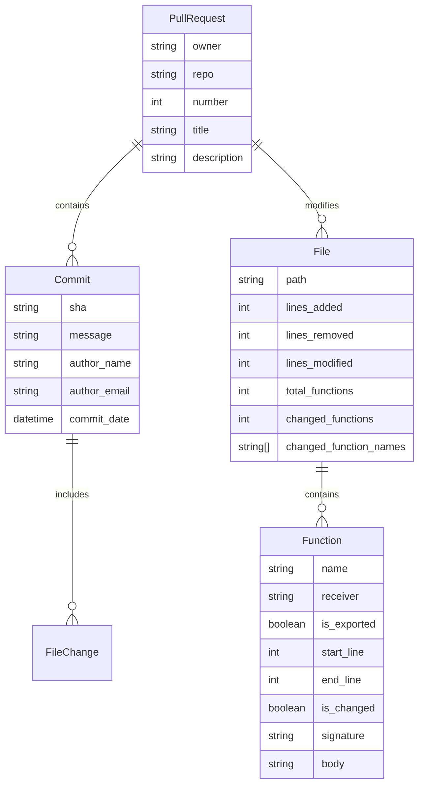

# PR Analyzer - Comprehensive Functionality Guide for TUI Design

## Overview

The PR Analyzer is a sophisticated GitHub pull request analysis tool designed to provide deep insights into code changes, helping developers and code reviewers understand the impact and context of modifications. This document outlines the complete functionality to inform the design of a Terminal User Interface (TUI) for enhanced coding agent-assisted reviews.

## Core Problem Statement

**Primary Goal**: Enable better coding agent-assisted reviews by providing comprehensive context about pull request changes, including:
- What files were changed and how
- Which functions were modified or added
- Historical context of the changes
- Structural analysis of code modifications

## Functional Categories

### 1. Pull Request Data Retrieval (`get` commands)

#### 1.1 Commit Analysis (`get commits`)
**Purpose**: Understand the development timeline and author contributions

**Data Provided**:
- Complete commit history for the PR
- Author information and timestamps
- Commit messages with development context
- SHA identifiers for each commit

**TUI Design Implications**:
- Timeline view showing commit progression
- Author-based filtering and grouping
- Commit message search functionality
- Easy SHA copying for further investigation

#### 1.2 Diff Analysis (`get diff`)
**Purpose**: See the exact code changes in unified diff format

**Data Provided**:
- Complete unified diff showing all file changes
- Line-by-line additions, deletions, and modifications
- File-level change summary

**TUI Design Implications**:
- Syntax-highlighted diff viewer
- Side-by-side or unified diff display options
- Navigation between files and hunks
- Search within diff content
- Export capabilities for external tools

#### 1.3 Context Analysis (`get context`)
**Purpose**: High-level overview of changes with function-level granularity

**Data Provided**:
- Files changed with modification statistics
- Function-level change detection
- Lines added/removed/modified per file
- Function names that were changed

**TUI Design Implications**:
- Tree view of changed files
- Expandable sections showing function changes
- Statistics dashboard with change metrics
- Quick navigation to specific files/functions

#### 1.4 File History (`get file-history`)
**Purpose**: Understand the evolution of specific files

**Data Provided**:
- Chronological commit history for individual files
- Author patterns and modification frequency
- Historical context for current changes

**TUI Design Implications**:
- File-specific timeline view
- Author activity visualization
- Integration with main PR view for context switching

### 2. Code Structure Analysis (`analyze` commands)

#### 2.1 Function Analysis (`analyze functions`)
**Purpose**: Deep dive into Go function changes with tree-sitter parsing

**Data Provided**:
- Complete function inventory with signatures
- Function body content (optional)
- Export status and receiver information
- Line number ranges for precise location
- Change status for each function

**TUI Design Implications**:
- Function browser with filtering capabilities
- Code structure visualization
- Export/visibility indicators
- Jump-to-definition functionality
- Change highlighting

## Data Model and Relationships

### Core Entities

### Data Flow Patterns

1. **Repository Context**: Owner + Repo + PR Number → All data
2. **File Focus**: Repository Context + File Path → File history and current state
3. **Function Focus**: Repository Context → Function changes → Specific function details

## Output Modes and Formats

### Human-Readable Mode (Default)
- **Markdown-formatted output** with clear hierarchical structure
- **Emoji indicators** for visual categorization (📁 files, 🔄 changes)
- **Contextual grouping** by file and function
- **Summary statistics** at the end of each section

### Structured Data Mode (`--with-glaze-output`)
- **JSON, CSV, YAML, Table formats** available
- **Field selection** for custom data extraction
- **Programmatic consumption** for automation
- **Integration capabilities** with other tools

## Key Use Cases for TUI Design

### 1. Code Review Workflow
**Scenario**: Reviewer needs to understand a complex PR

**TUI Features Needed**:
- Multi-pane layout showing overview, files, and details
- Navigation between related functions
- Context preservation when switching views
- Annotation capabilities for review notes

### 2. Coding Agent Context Building
**Scenario**: AI assistant needs comprehensive PR context

**TUI Features Needed**:
- Batch data export in structured formats
- Context aggregation across multiple data sources
- Quick access to historical information
- Integration with agent tools and APIs

### 3. Developer Investigation
**Scenario**: Developer investigating changes to understand impact

**TUI Features Needed**:
- Search and filter capabilities across all data types
- Cross-referencing between commits, files, and functions
- Visual indicators for change magnitude and type
- Export and sharing capabilities

### 4. Team Collaboration
**Scenario**: Team discussing changes and planning reviews

**TUI Features Needed**:
- Session saving and restoration
- Shareable views and bookmarks
- Collaborative annotation
- Integration with communication tools

## Technical Architecture Insights

### Dual Command Pattern
The tool implements a sophisticated dual command pattern where each command provides:
- **Default human-readable output** for interactive use
- **Structured data output** for automation and integration

This pattern enables the TUI to:
- Leverage both modes depending on the interface context
- Provide seamless switching between display modes
- Integrate with external tools while maintaining user-friendly defaults

### Tree-sitter Integration
Go code parsing provides:
- **Accurate function detection** and metadata extraction
- **Syntax-aware analysis** that understands Go semantics
- **Reliable change detection** at the function level

### GitHub API Optimization
- **Efficient data retrieval** with pagination support
- **Rate limit awareness** for API consumption
- **Authentication handling** for private repositories

## Performance and Scalability Considerations

### Data Volume Handling
- **Large PRs**: Hundreds of files and thousands of functions
- **Long histories**: Files with extensive commit histories
- **Diff size**: Very large diffs with significant changes

### TUI Performance Requirements
- **Lazy loading** for large datasets
- **Incremental rendering** for responsiveness
- **Background data fetching** for smooth user experience
- **Caching strategies** for repeated operations

## Integration Points

### External Tool Compatibility
- **Git workflows**: Integration with local git repositories
- **Editor integration**: Jump to specific lines and functions
- **CI/CD systems**: Automated analysis in pipelines
- **Code review tools**: Enhanced context for review platforms

### API and Automation
- **REST-like CLI interface** for scripting
- **JSON output** for data processing pipelines
- **Webhook integration** for real-time updates
- **Plugin architecture** for extensibility

## Advanced Features for TUI Enhancement

### Visualization Capabilities
- **Change heatmaps** showing modification intensity
- **Author activity graphs** over time
- **Function dependency graphs** (where possible)
- **Diff statistics** with visual representations

### Interactive Features
- **Real-time filtering** and search
- **Custom views** and saved layouts
- **Keyboard shortcuts** for power users
- **Mouse interaction** for accessibility

### Collaboration Features
- **Shared sessions** for team reviews
- **Comment and annotation system**
- **Review progress tracking**
- **Integration with team communication tools**

## Error Handling and Edge Cases

### Graceful Degradation
- **Missing files**: Handle deleted or renamed files
- **Parse errors**: Graceful handling of unparseable Go files
- **API failures**: Retry strategies and offline modes
- **Large data**: Progressive loading and pagination

### User Experience
- **Loading indicators** for long operations
- **Error recovery** suggestions
- **Help and documentation** integration
- **Accessibility features** for diverse users

## Conclusion

The PR Analyzer provides a comprehensive foundation for building sophisticated code review and analysis tools. The dual command pattern, rich data model, and flexible output formats make it ideal for creating a TUI that can serve both human reviewers and AI coding assistants.

The key to successful TUI design will be:
1. **Efficient data organization** and navigation
2. **Context preservation** across different views
3. **Performance optimization** for large datasets
4. **Integration capabilities** with existing workflows
5. **User experience** that scales from simple reviews to complex investigations

This functionality guide provides the foundation for creating a TUI that significantly enhances the code review process and enables more effective AI-assisted development workflows.
