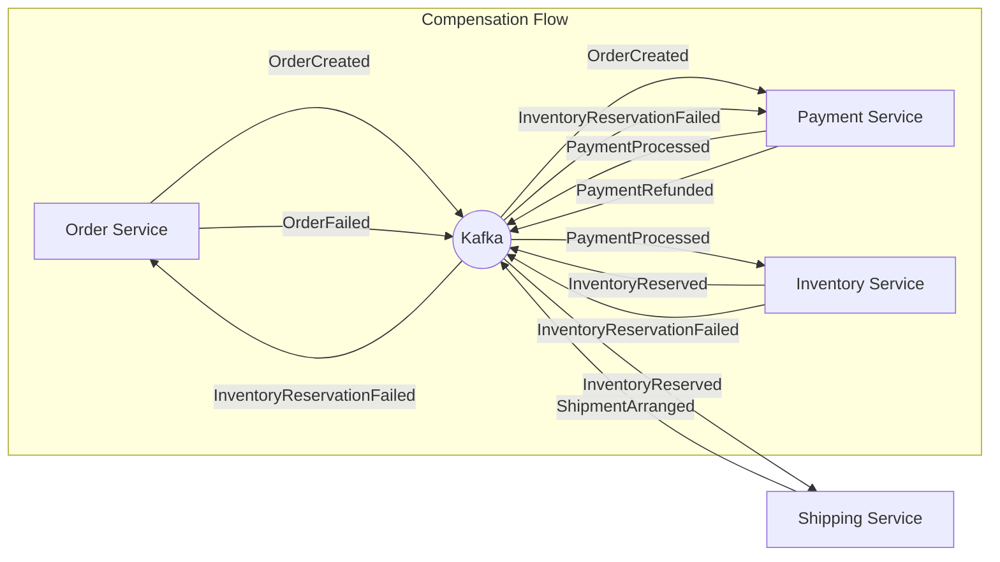
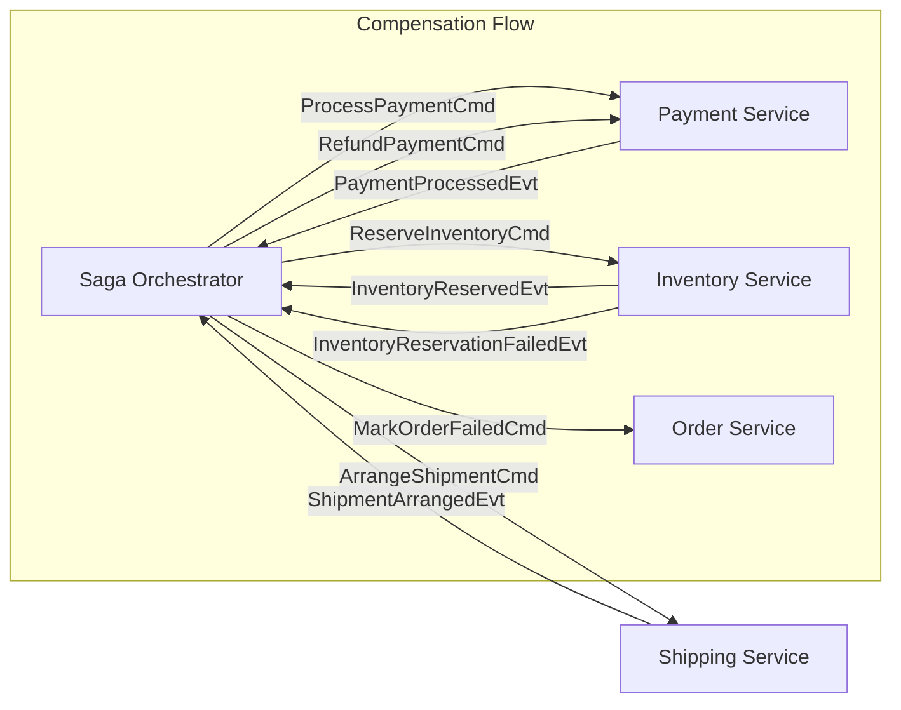

# Chapter 11: Sagas for Distributed Transactions

In distributed systems, maintaining data consistency across multiple services is a significant challenge. Traditional ACID (Atomicity, Consistency, Isolation, Durability) transactions, common in monolithic applications with a single database, are often impractical or impossible to implement across independent microservices. As discussed in Chapter 2, event-driven architectures typically embrace eventual consistency. However, many business processes require a higher degree of coordination and atomicity than simple eventual consistency provides. This is where the Saga pattern comes into play.

This chapter delves into the Saga pattern, a fundamental technique for managing distributed transactions in event-driven systems. We explore how sagas use a sequence of local transactions coordinated through events to ensure that a complex business process either completes successfully across all involved services or is correctly compensated if any step fails.

## The Problem: Atomic Operations Across Services

Consider our e-commerce order processing workflow:

1.  **Order Service**: Creates an order.
2.  **Payment Service**: Processes the payment.
3.  **Inventory Service**: Reserves the items.
4.  **Shipping Service**: Arranges shipment.

Each of these steps involves a local transaction within the respective service (e.g., updating a database). However, the overall business process (placing and fulfilling an order) requires all these steps to succeed logically. What happens if payment succeeds, but inventory reservation fails because an item is out of stock?

In a monolithic system, a distributed transaction coordinator (like JTA) might be used, or all operations might occur within a single database transaction. In a microservices architecture, these options are generally unavailable or undesirable due to tight coupling and performance implications.

We need a way to ensure that if any step fails, the effects of the preceding successful steps are undone or compensated for, effectively rolling back the business transaction.

## The Saga Pattern: A Sequence of Local Transactions

The Saga pattern addresses this challenge by breaking down a distributed transaction into a sequence of local transactions, each executed by a single service. Each local transaction updates the service's own data and publishes an event indicating its outcome.

If a step succeeds, the saga proceeds to the next step by triggering it with the published event. If a step fails, the saga executes a series of **compensating transactions** to undo the work done by the preceding successful steps.

**Key Characteristics of Sagas:**

- **Sequence of Local Transactions**: Each step is atomic within its service boundary.
- **Event-Driven Coordination**: Events trigger subsequent steps or compensating actions.
- **Compensating Transactions**: For each step that can succeed, there must be a corresponding compensating transaction to undo its effects.
- **Eventual Consistency**: Sagas achieve atomicity at the business process level, but the system may be temporarily inconsistent while the saga is in progress or compensating.

## Saga Implementation Approaches: Choreography vs. Orchestration

There are two primary ways to coordinate the steps in a saga:

### 1. Choreography: Events Trigger Actions

In a choreographed saga, there is no central coordinator. Each service listens for events from other services and reacts accordingly. If a service completes its local transaction, it publishes an event. Other services listen for this event and trigger the next step in the saga.

**Example (Order Processing - Choreography):**

1.  **Order Service**: Creates order -> Publishes `OrderCreated` event.
2.  **Payment Service**: Listens for `OrderCreated` -> Processes payment -> Publishes `PaymentProcessed` event.
3.  **Inventory Service**: Listens for `PaymentProcessed` -> Reserves inventory -> Publishes `InventoryReserved` event.
4.  **Shipping Service**: Listens for `InventoryReserved` -> Arranges shipment -> Publishes `ShipmentArranged` event.

**Compensation (Choreography):** If Inventory Service fails to reserve items, it publishes an `InventoryReservationFailed` event. Payment Service listens for this and initiates a refund (compensation for `PaymentProcessed`). Order Service listens and marks the order as failed (compensation for `OrderCreated`).



**Pros of Choreography:**
- Simple: No central point of coordination.
- Loose Coupling: Services only need to know about relevant events, not the entire workflow.

**Cons of Choreography:**
- Difficult to Track: Understanding the overall state of the saga can be challenging as the logic is distributed across services.
- Cyclic Dependencies: Can arise if services need to listen to events from services further down the chain.
- Complexity Grows: Managing compensation logic across many services can become complex.

### 2. Orchestration: A Central Coordinator

In an orchestrated saga, a central coordinator (the orchestrator) manages the sequence of steps. The orchestrator sends commands to services to execute local transactions and listens for reply events indicating the outcome.

The orchestrator maintains the state of the saga and decides the next step based on the replies. If a step fails, the orchestrator explicitly commands the preceding services to execute their compensating transactions.

**Example (Order Processing - Orchestration):**

1.  **Orchestrator**: Receives `CreateOrder` command -> Sends `ProcessPayment` command to Payment Service.
2.  **Payment Service**: Processes payment -> Publishes `PaymentProcessed` event.
3.  **Orchestrator**: Listens for `PaymentProcessed` -> Sends `ReserveInventory` command to Inventory Service.
4.  **Inventory Service**: Reserves inventory -> Publishes `InventoryReserved` event.
5.  **Orchestrator**: Listens for `InventoryReserved` -> Sends `ArrangeShipment` command to Shipping Service.
6.  **Shipping Service**: Arranges shipment -> Publishes `ShipmentArranged` event.
7.  **Orchestrator**: Listens for `ShipmentArranged` -> Marks saga as complete.

**Compensation (Orchestration):** If Inventory Service publishes `InventoryReservationFailed`, the Orchestrator receives it and sends a `RefundPayment` command to Payment Service and a `MarkOrderFailed` command to Order Service.



**Pros of Orchestration:**
- Centralized Logic: The entire workflow is defined in one place, making it easier to understand and manage.
- Explicit State Management: The orchestrator explicitly tracks the saga's state.
- Simpler Service Logic: Services only need to execute commands and publish reply events; they don't need to know about the overall saga flow.

**Cons of Orchestration:**
- Central Point of Failure: The orchestrator can become a bottleneck or single point of failure (though it can be made resilient).
- Tighter Coupling (potentially): Services are coupled to the orchestrator's commands.

## Implementing Saga Orchestration in Kotlin

Our reference implementation uses the **orchestration** approach for the shipping process, implemented within the Kotlin Shipping service (`kafka_content/kotlin-service`). Let's examine the key components.

### Saga Data (`Saga.kt`, `ShippingSaga.kt`)

We need a way to store the state associated with each saga instance. This includes the input data, intermediate results, current status, and any error information.

```kotlin
// From kafka_content/kotlin-service/src/main/kotlin/com/scrapybara/kw/shipping/saga/Saga.kt
enum class SagaStatus {
    STARTED, COMPLETED, FAILED, COMPENSATING, COMPENSATION_COMPLETED
}

interface SagaData {
    val sagaId: String
    val startTime: Instant
    var endTime: Instant?
    var currentStatus: SagaStatus
    var compensating: Boolean
    var error: String?
}

// From kafka_content/kotlin-service/src/main/kotlin/com/scrapybara/kw/shipping/saga/ShippingSaga.kt
data class ShippingSagaData(
    override val sagaId: String = UUID.randomUUID().toString(),
    override val startTime: Instant = Instant.now(),
    override var endTime: Instant? = null,
    override var currentStatus: SagaStatus = SagaStatus.STARTED,
    override var compensating: Boolean = false,
    override var error: String? = null,
    
    // Shipping-specific data
    val orderId: String,
    val allItemsAvailable: Boolean,
    var shipmentId: String? = null,
    var trackingNumber: String? = null,
    var notificationSent: Boolean = false
) : SagaData
```

The `ShippingSagaData` class holds all the information needed throughout the shipping saga, including the initial `orderId` and `allItemsAvailable` flag, as well as results from subsequent steps like `shipmentId` and `trackingNumber`.

### Saga Steps (`Saga.kt`)

Each step in the saga is defined with its forward action (handler) and its compensating action.

```kotlin
// From kafka_content/kotlin-service/src/main/kotlin/com/scrapybara/kw/shipping/saga/Saga.kt
class SagaStep<T>(
    val name: String,
    // Handler function: takes current data, performs action, returns updated data
    val handler: suspend (T) -> T,
    // Compensation function: takes current data, performs undo action, returns updated data
    val compensation: suspend (T) -> T
)
```

### Saga Coordinator (`Saga.kt`)

The `SagaCoordinator` class provides a generic mechanism to execute a list of `SagaStep`s, manage state, and handle compensation.

```kotlin
// From kafka_content/kotlin-service/src/main/kotlin/com/scrapybara/kw/shipping/saga/Saga.kt
class SagaCoordinator<T : SagaData>(
    private val sagaName: String,
    private val steps: List<SagaStep<T>>,
    private val kafkaTemplate: KafkaTemplate<String, ByteArray> // For publishing audit events
) {
    private val logger = LoggerFactory.getLogger(SagaCoordinator::class.java)

    suspend fun executeSaga(data: T): T {
        try {
            publishSagaEvent(data, "STARTED")
            var currentData = data
            
            // Execute forward steps
            steps.forEachIndexed { index, step ->
                try {
                    currentData = step.handler(currentData)
                    publishStepEvent(currentData, step.name, "COMPLETED")
                } catch (e: Exception) {
                    // Error occurred, initiate compensation
                    publishStepEvent(currentData, step.name, "FAILED", e.message)
                    currentData.compensating = true
                    currentData.error = e.message
                    currentData.currentStatus = SagaStatus.COMPENSATING
                    publishSagaEvent(currentData, "COMPENSATING")
                    
                    // Execute compensation steps in reverse
                    for (i in index - 1 downTo 0) {
                        val compensationStep = steps[i]
                        try {
                            currentData = compensationStep.compensation(currentData)
                            publishStepEvent(currentData, compensationStep.name, "COMPENSATED")
                        } catch (ce: Exception) {
                            // Log compensation error, but continue compensating
                            publishStepEvent(currentData, compensationStep.name, "COMPENSATION_FAILED", ce.message)
                        }
                    }
                    
                    currentData.currentStatus = SagaStatus.COMPENSATION_COMPLETED
                    publishSagaEvent(currentData, "COMPENSATION_COMPLETED")
                    throw e // Re-throw original error
                }
            }
            
            // Saga completed successfully
            currentData.currentStatus = SagaStatus.COMPLETED
            publishSagaEvent(currentData, "COMPLETED")
            return currentData
            
        } catch (e: Exception) {
            // Saga failed (either during forward or compensation)
            data.currentStatus = SagaStatus.FAILED
            publishSagaEvent(data, "FAILED", e.message)
            throw e
        }
    }

    // Helper methods to publish saga/step audit events to Kafka
    private fun publishSagaEvent(data: T, status: String, error: String? = null) { /* ... */ }
    private fun publishStepEvent(data: T, stepName: String, status: String, error: String? = null) { /* ... */ }
}
```

This coordinator iterates through the defined steps. If a `handler` fails, it iterates backward through the preceding steps, executing their `compensation` functions. It also publishes audit events (`SagaEvent`, `SagaStepEvent`) to Kafka topics (`saga.events`, `saga.step.events`) to provide visibility into the saga's progress.

### Defining the Shipping Saga (`ShippingSaga.kt`)

We define the specific steps for the shipping saga, injecting dependencies needed for each step (like `ShippingTrackerService`, `KafkaOperations`).

```kotlin
// From kafka_content/kotlin-service/src/main/kotlin/com/scrapybara/kw/shipping/saga/ShippingSaga.kt
@Component
class ShippingSagaManager(
    private val sagaCoordinatorFactory: SagaCoordinatorFactory,
    private val shippingTrackerService: ShippingTrackerService,
    private val kafkaOps: KafkaOperations // For publishing events like ShipmentCreated
) {
    private val logger = LoggerFactory.getLogger(ShippingSagaManager::class.java)

    private val shippingSagaCoordinator: SagaCoordinator<ShippingSagaData>

    init {
        val steps = listOf(
            SagaStep(
                name = "CreateShipment",
                handler = { data -> createShipmentHandler(data) },
                compensation = { data -> cancelShipmentCompensation(data) }
            ),
            SagaStep(
                name = "NotifyCustomer",
                handler = { data -> notifyCustomerHandler(data) },
                compensation = { data -> /* No compensation needed for notification */ data }
            )
            // Add more steps as needed (e.g., SchedulePickup, UpdateInventory)
        )
        shippingSagaCoordinator = sagaCoordinatorFactory.createCoordinator("ShippingSaga", steps)
    }

    suspend fun startShippingSaga(orderId: String, allItemsAvailable: Boolean): ShippingSagaData {
        val initialData = ShippingSagaData(
            orderId = orderId,
            allItemsAvailable = allItemsAvailable
        )
        
        // If items are not available, fail the saga immediately
        if (!allItemsAvailable) {
            logger.warn("Items not available for order $orderId, failing shipping saga early.")
            initialData.currentStatus = SagaStatus.FAILED
            initialData.error = "Inventory not available"
            // publishSagaEvent(initialData, "FAILED", initialData.error) // Coordinator handles this
            // Potentially publish OrderCancelled event here or rely on another service
            return initialData // Or throw exception if coordinator expects it
        }
        
        return shipp
(Content truncated due to size limit. Use line ranges to read in chunks)