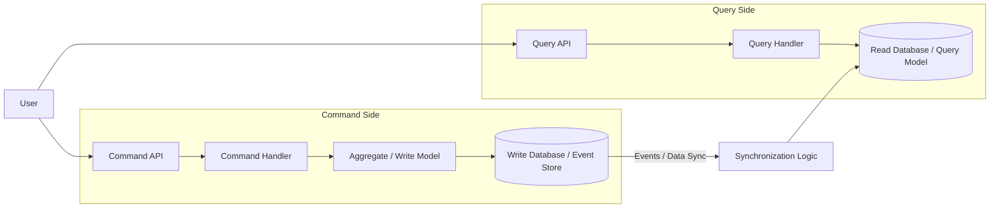

# Chapter 13: CQRS (Command Query Responsibility Segregation)

In the previous chapter, we explored Event Sourcing, a pattern that captures all changes to an application state as a sequence of events. While Event Sourcing provides a robust audit trail and enables powerful temporal queries, deriving the current state or querying across aggregates by replaying events can be inefficient for complex read requirements. This is where Command Query Responsibility Segregation (CQRS) comes into play.

CQRS is an architectural pattern that separates the model used for updating data (commands) from the model used for reading data (queries). It recognizes that the requirements for writing data (often involving complex business rules and consistency constraints) are fundamentally different from the requirements for reading data (often needing optimized performance and flexible querying capabilities).

This chapter delves into the CQRS pattern, explaining its principles, benefits, and challenges. We will explore how CQRS naturally complements Event Sourcing and how it can be implemented within our polyglot, event-driven system using Kafka.

## The Problem: One Model to Rule Them All?

Traditional application architectures often use a single data model for both commands (writes) and queries (reads). For example, an Object-Relational Mapper (ORM) like Hibernate (Java/Kotlin) or ActiveRecord (Ruby) might map domain objects directly to database tables. This single model is used for:

1.  **Executing Commands**: Loading an object, modifying its state based on business rules, and saving the changes.
2.  **Executing Queries**: Retrieving objects based on various criteria, potentially joining data from multiple tables.

While simple for basic CRUD (Create, Read, Update, Delete) applications, this unified model approach faces challenges in complex systems:

- **Conflicting Requirements**: The optimal model for enforcing business rules during writes (often normalized, focused on consistency) might be different from the optimal model for fast, flexible reads (often denormalized, tailored for specific views).
- **Performance Bottlenecks**: Complex queries on the write model can impact write performance, and vice-versa.
- **Scalability Issues**: Scaling the single model to handle both read and write loads efficiently can be difficult.
- **Complexity Creep**: The single model can become overly complex, trying to satisfy both read and write needs simultaneously.

## CQRS: Separating Commands and Queries

CQRS addresses these issues by explicitly separating the responsibilities of handling commands and queries into distinct models:

1.  **Command Model**: Responsible for processing commands, enforcing business rules and invariants, and updating the state. This model is optimized for writes and consistency.
2.  **Query Model (Read Model)**: Responsible for providing data needed for queries and display purposes. This model is optimized for reads, often denormalized and tailored to specific UI views or reporting needs.

Crucially, these two models can use entirely different representations and even different persistence mechanisms.



### Key Components of a CQRS Architecture

- **Commands**: Imperative messages representing an intent to change the system state (e.g., `CreateOrderCommand`, `ProcessPaymentCommand`). Commands are typically handled by a single handler.
- **Command Handlers**: Process commands, interact with the command model (e.g., load aggregates, validate rules), and persist changes.
- **Command Model (Write Model)**: The model used by command handlers, often involving aggregates and domain logic. It focuses on consistency and enforcing business rules.
- **Events**: Notifications that something significant has happened as a result of a command being processed (e.g., `OrderCreated`, `PaymentProcessed`). Events are the primary mechanism for synchronizing the query model.
- **Event Handlers (Projectors)**: Listen for events published by the command model and update the query model accordingly. These handlers are responsible for transforming event data into the desired read model format.
- **Query Model (Read Model)**: A data model specifically designed and optimized for querying. It can be denormalized and tailored to specific read use cases. There can be multiple query models for different purposes.
- **Queries**: Messages representing a request for data (e.g., `GetOrderByIdQuery`, `FindOrdersByCustomerQuery`). Queries do not change the system state.
- **Query Handlers**: Process queries by retrieving data directly from the query model.

## CQRS and Event Sourcing: A Powerful Combination

CQRS and Event Sourcing are distinct patterns, but they complement each other exceptionally well:

- **Event Sourcing as the Write Model**: When using Event Sourcing, the event store naturally serves as the persistence mechanism for the command model. Aggregates are loaded by replaying events, commands generate new events, and these events are appended to the store.
- **Events Drive Read Model Updates**: The stream of events produced by the event-sourced command model is the perfect input for updating the query model(s). Event handlers (projectors) can subscribe to the event stream and build or update the read models asynchronously.

```mermaid
graph LR
    User --> C[Command API]
    User --> Q[Query API]
    
    subgraph Command Side (Event Sourced)
        C --> CH[Command Handler]
        CH --> Agg[Aggregate]
        Agg -- Loads Events --> ES[(Event Store / Kafka)]
        CH -- Appends New Events --> ES
    end
    
    subgraph Query Side
        Q --> QH[Query Handler]
        QH --> RM[(Read Model Database)]
    end
    
    ES -- Events --> EH[Event Handler / Projector]
    EH --> RM
```

In this combined architecture:

1.  Commands are processed by loading the relevant aggregate from its event history.
2.  Business logic is executed, potentially generating new events.
3.  New events are appended to the event store (e.g., a Kafka topic).
4.  Event handlers (projectors) consume these events from the event store.
5.  Projectors update one or more specialized read models (e.g., relational tables, document databases, search indexes) based on the event data.
6.  Queries are served directly and efficiently from these optimized read models.

## Implementing CQRS in Our Polyglot System

While our reference implementation doesn't explicitly showcase separate read models updated by projectors, we can outline how CQRS could be applied, leveraging Kafka as the event bus.

### Command Side

- **Aggregates**: The `Order` aggregate (potentially event-sourced as described in Chapter 12) resides on the command side, handling commands like `CreateOrder`, `ProcessPayment`, `ShipOrder`.
- **Command Handlers**: Reside within services like the Order Service or Payment Service. They load aggregates, validate commands, execute business logic, and generate events.
- **Event Store**: Kafka topics (e.g., `order.events`) serve as the event store, storing the sequence of events generated by the command handlers.

### Query Side

We could introduce dedicated read models optimized for specific query needs:

1.  **Order Summary Read Model**: A denormalized view stored, perhaps, in a document database (like MongoDB) or a relational table, containing key information needed for displaying order lists or summaries (e.g., order ID, customer name, status, total amount, creation date).
2.  **Product Catalog Read Model**: A read model optimized for searching and displaying product information, potentially stored in a search engine like Elasticsearch.
3.  **Analytics Read Model**: The Ruby Analytics service already acts as a form of read model, aggregating data from various events for reporting purposes. This could be formalized further.

### Synchronization via Kafka

Kafka acts as the backbone connecting the command and query sides:

1.  **Event Publication**: When the command side processes a command and generates events (e.g., `OrderCreated`, `PaymentProcessed`), these events are published to relevant Kafka topics.
2.  **Event Consumption (Projection)**: Dedicated event handlers (projectors), potentially running as separate services or within existing services, subscribe to these Kafka topics.
3.  **Read Model Updates**: Each projector processes the events it receives and updates its corresponding read model. For example:
    - An `OrderSummaryProjector` listens to `OrderCreated`, `PaymentProcessed`, `OrderShipped`, etc., and updates the `OrderSummary` documents/rows.
    - An `AnalyticsProjector` (like our Ruby service) listens to various events and updates aggregated metrics.

### Example: Order Summary Projection

Let's imagine an `OrderSummaryProjector` implemented in Kotlin using Spring Kafka:

```kotlin
// Simplified Projector Example
@Service
class OrderSummaryProjector(
    private val orderSummaryRepository: OrderSummaryRepository // Repository for the read model DB
) {
    private val logger = LoggerFactory.getLogger(OrderSummaryProjector::class.java)

    @KafkaListener(topics = ["order.events"], groupId = "order-summary-projector-group")
    fun handleOrderEvent(payload: ByteArray, @Header(KafkaHeaders.RECEIVED_MESSAGE_KEY) key: String) {
        try {
            // Deserialize based on event type (could use headers or a wrapper envelope)
            // For simplicity, assume we can determine type
            when (val event = deserializeEvent(payload)) { 
                is OrderCreated -> {
                    logger.info("Projecting OrderCreated: ${event.orderId}")
                    val summary = OrderSummary(
                        orderId = event.orderId,
                        customerId = event.customerId,
                        status = "CREATED",
                        totalAmount = event.totalAmount,
                        createdAt = event.timestamp
                        // ... other fields
                    )
                    orderSummaryRepository.save(summary)
                }
                is PaymentProcessed -> {
                    logger.info("Projecting PaymentProcessed: ${event.orderId}")
                    orderSummaryRepository.updateStatus(event.orderId, 
                        if (event.status == "success") "PAYMENT_CONFIRMED" else "PAYMENT_FAILED")
                }
                is OrderShipped -> {
                    logger.info("Projecting OrderShipped: ${event.orderId}")
                    orderSummaryRepository.updateStatusAndTracking(event.orderId, "SHIPPED", event.trackingNumber)
                }
                // ... handle other relevant events
            }
        } catch (e: Exception) {
            logger.error("Error projecting event for key $key", e)
            // Implement error handling (e.g., DLQ)
        }
    }
    
    // Placeholder for deserialization logic
    private fun deserializeEvent(payload: ByteArray): Any { 
        // Implement logic to determine event type and deserialize (e.g., using Protobuf)
        // This might involve checking headers or using a schema registry
        return Any() // Replace with actual deserialized event
    }
}

// Simplified Read Model Repository Interface
interface OrderSummaryRepository {
    fun save(summary: OrderSummary)
    fun updateStatus(orderId: String, status: String)
    fun updateStatusAndTracking(orderId: String, status: String, trackingNumber: String)
    // ... query methods like findById, findByCustomerId, etc.
}

// Simplified Read Model Data Class
data class OrderSummary(
    val orderId: String,
    val customerId: String,
    var status: String,
    val totalAmount: Float,
    val createdAt: String,
    var trackingNumber: String? = null
    // ... other denormalized fields
)
```

This projector listens to the `order.events` topic. When an event arrives, it deserializes it, determines the type, and updates the `OrderSummary` read model accordingly using a dedicated repository. Queries for order summaries would then interact directly with this `OrderSummaryRepository`.

## Benefits of CQRS

- **Optimized Models**: Allows tailoring the command model for consistency and the query model(s) for specific read performance needs.
- **Scalability**: Read and write workloads can be scaled independently. You can add more instances to handle read traffic without impacting write operations, and vice-versa.
- **Flexibility**: Easier to introduce new ways of querying data by adding new read models without affecting the command side.
- **Technology Choice**: Allows using different persistence technologies best suited for each model (e.g., Event Store/Kafka for writes, document DB/search index/relational DB for reads).
- **Separation of Concerns**: Clear separation between command processing logic and query logic.

## Challenges of CQRS

- **Increased Complexity**: Managing separate models, synchronization logic, and potentially different databases adds complexity compared to a single-model approach.
- **Eventual Consistency**: The query model is typically updated asynchronously based on events, meaning there's a delay between a write occurring and the change being reflected in reads. Applications must be designed to handle this potential staleness.
- **Infrastructure Overhead**: Requires infrastructure for event handling and potentially managing multiple databases or data stores.
- **Code Duplication (Potentially)**: Some data structures might be duplicated (though potentially in different forms) between the command and query models.
- **Synchronization Logic**: Building reliable and resilient event handlers (projectors) to update read models requires careful design, including handling errors, retries, and idempotency.

## Conclusion

CQRS is a powerful pattern for managing the inherent differences between command and query operations in complex systems. By separating the models responsible for writes and reads, CQRS enables optimized performance, scalability, and flexibility.

When combined with Event Sourcing, CQRS provides a robust architecture where the event stream from the command side naturally drives the updates to one or more specialized read models. Kafka serves as an excellent backbone for this architecture, facilitating the asynchronous flow of events from the event store to the projectors that build the query models.

While CQRS introduces complexity and the challenge of eventual consistency, the benefits often outweigh the drawbacks in systems with demanding read/write requirements or complex domain logic. Understanding CQRS is crucial for designing scalable and maintainable event-driven microservices.

In the next chapter, we will shift our focus to a critical aspect of building reliable systems: Testing Event-Driven Architectures.
