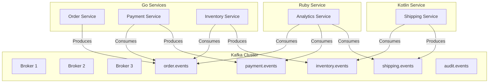
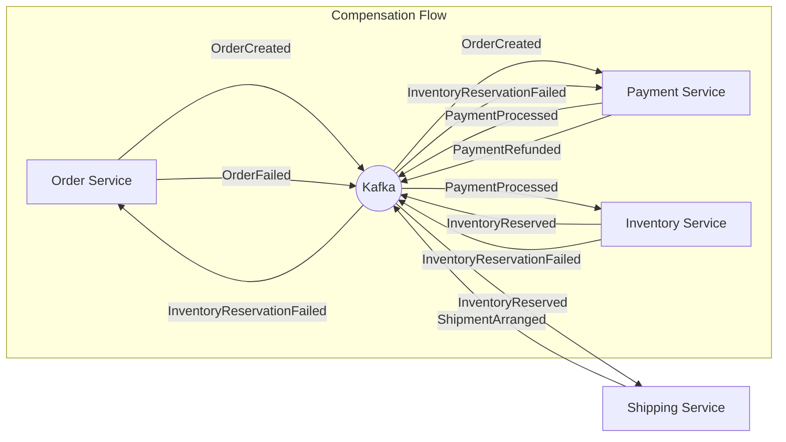
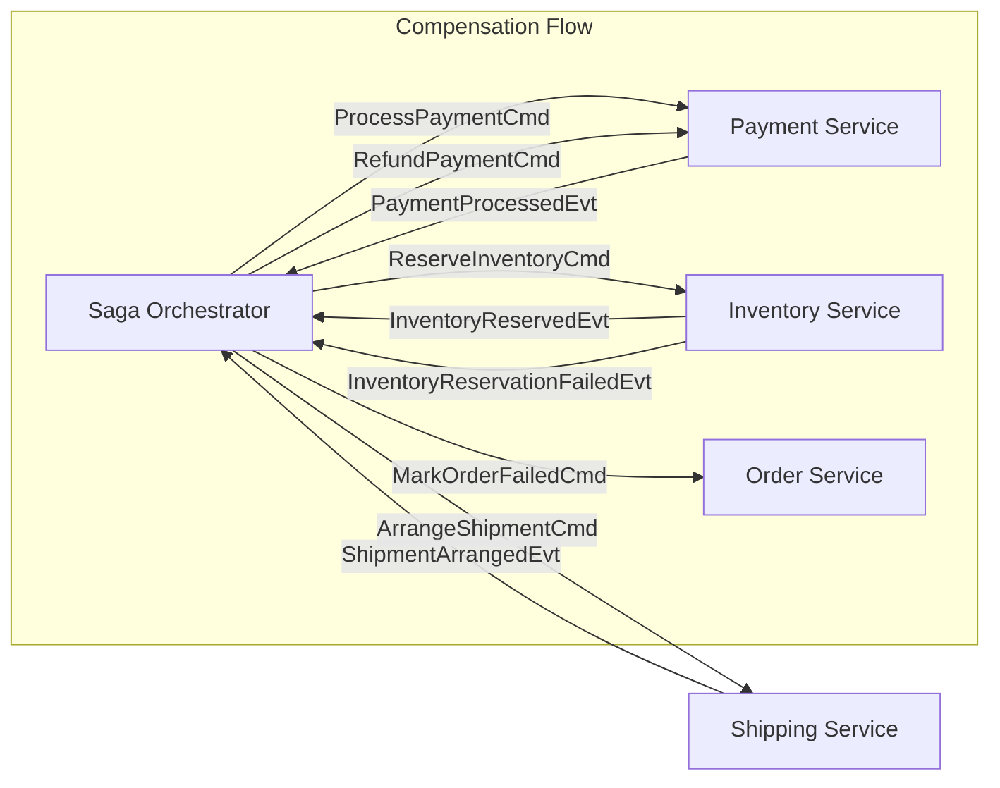
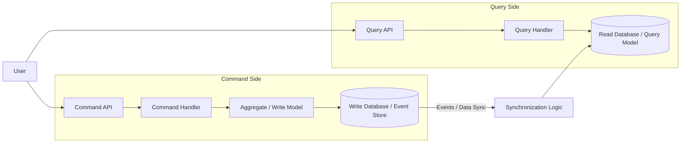

# Preface

In today's rapidly evolving software landscape, applications rarely exist in isolation. The monolithic architectures of the past are increasingly giving way to dynamic ecosystems of interconnected services. These modern systems often resemble a complex network, pulsing with data, composed of services written in multiple programming languages, deployed and managed by different teams, and crucially, expected to react to events in near real-time. This shift towards distributed, polyglot, and event-driven architectures presents both immense opportunities and significant challenges for development teams.

This book was born from the crucible of such a transformation. It chronicles a practical journey: migrating an established, primarily Go-based system onto the powerful **Apache Kafka** platform. This wasn't just a simple lift-and-shift operation. It involved strategically introducing **Kotlin** to leverage the strengths of the JVM for specific workloads while ensuring the continued operation and integration of a vital existing **Ruby** service responsible for data science tasks. The goal was not merely to replace one technology with another but to fundamentally reshape the system's communication patterns, moving away from brittle, tightly-coupled REST calls and overloaded message queues towards a more resilient, scalable, and observable event-driven paradigm.

Along this path, we encountered numerous hurdles and learned valuable lessons. We discovered that simply adopting Kafka wasn't enough. True success required revisiting fundamental principles of distributed systems and applying them rigorously. We distilled a set of **first principles**—concepts like log-centric thinking, the nuances of loose coupling, the inevitability of eventual consistency, and the practicalities of managing contracts in a polyglot world. Applying these principles allowed us to transform what could have been an overwhelming collection of disparate components into a coherent, understandable, and robust system where events form the central nervous system.

This text is intentionally **opinionated and hands-on**. We believe that practical, working code speaks louder than abstract diagrams or high-level vendor slides. Therefore, you won't find pseudo-interfaces or theoretical discussions detached from reality. Instead, we focus on showing complete, functioning slices of code, directly extracted from a reference implementation that accompanies this book. We aim to be **light on ceremony**, cutting through the buzzwords to focus on the core concepts and patterns that deliver real-world value. Our goal is to provide a pragmatic guide grounded in production experience.

## Who Is This Book For?

This book is primarily aimed at practitioners who are grappling with the complexities of modern distributed systems, particularly those considering or undergoing a transition to Kafka and event-driven architectures. Specifically, it will be most valuable for:

*   **Senior Engineers and Tech Leads:** Individuals responsible for guiding teams through the technical challenges of adopting Kafka, designing event-driven flows, and managing polyglot environments.
*   **Developers:** Engineers comfortable working in Go, Ruby, or JVM languages (like Kotlin or Java) who want to understand how different runtimes can effectively integrate and communicate using Kafka as a common backbone. It offers insights into the specific libraries and patterns used in each language.
*   **Architects:** Professionals looking for battle-tested, production-oriented patterns and strategies for building scalable, resilient event-driven systems, moving beyond theoretical concepts to see how these ideas are implemented in practice.

While we delve into specific code examples, the underlying principles and patterns discussed are broadly applicable to anyone involved in building or maintaining distributed systems.

## How This Book Is Organized

To guide you through this journey, the book is structured into five main parts, followed by appendices:

*   **Part I — Principles:** Lays the conceptual foundation. We explore the transformative power of log-centric thinking, the critical trade-offs involved in achieving loose coupling through eventual consistency, and the reasons why embracing polyglot services is often not just beneficial but necessary in modern systems.
*   **Part II — Kafka Essentials:** Dives into the core mechanics of Apache Kafka. We cover topics, partitions, brokers, consumer groups, the practical implications of different delivery semantics, and demystify the often-misunderstood concept of exactly-once processing.
*   **Part III — The Polyglot System:** Walks through the practical implementation details of integrating different languages with Kafka. We examine specific libraries and approaches for Go (using Watermill), Kotlin (using Spring Kafka), and Ruby (using `ruby-kafka`), drawing directly from the reference codebase.
*   **Part IV — Event-Driven Patterns:** Explores key architectural patterns that are essential for building robust event-driven systems. This includes managing data contracts with schemas (using Protocol Buffers), implementing reliable workflows with Sagas, leveraging Event Sourcing for immutable history, and applying Command Query Responsibility Segregation (CQRS) effectively.
*   **Part V — Operations:** Addresses the crucial aspects of running and maintaining an event-driven system in production. We cover observability strategies (logging, tracing, metrics with the ELK stack), comprehensive testing approaches (from contract tests to chaos engineering), deployment considerations (using containers, Docker Compose, and Kubernetes), and strategies for scaling and evolving the system over time.
*   **Appendices:** Provide supplementary reference material, including configuration cheat sheets for Kafka clients in different languages, a glossary of key terms, and suggestions for further reading.

## The Reference Implementation

Throughout this book, every code listing, configuration snippet, and command is derived from a fully functional, integration-tested reference implementation. This codebase embodies the principles and patterns discussed, providing a concrete example of the polyglot system built around Kafka. We strongly encourage you to clone the repository, explore the code, and run the system locally using the provided `docker-compose` setup. Following along with the running code is the best way to solidify your understanding and see these concepts in action.

We hope this practical, code-driven exploration of polyglot event-driven systems with Kafka equips you with the knowledge and confidence to build more resilient, scalable, and adaptable software.


# Preface

In today's rapidly evolving software landscape, applications rarely exist in isolation. The monolithic architectures of the past are increasingly giving way to dynamic ecosystems of interconnected services. These modern systems often resemble a complex network, pulsing with data, composed of services written in multiple programming languages, deployed and managed by different teams, and crucially, expected to react to events in near real-time. This shift towards distributed, polyglot, and event-driven architectures presents both immense opportunities and significant challenges for development teams.

This book was born from the crucible of such a transformation. It chronicles a practical journey: migrating an established, primarily Go-based system onto the powerful **Apache Kafka** platform. This wasn't just a simple lift-and-shift operation. It involved strategically introducing **Kotlin** to leverage the strengths of the JVM for specific workloads while ensuring the continued operation and integration of a vital existing **Ruby** service responsible for data science tasks. The goal was not merely to replace one technology with another but to fundamentally reshape the system's communication patterns, moving away from brittle, tightly-coupled REST calls and overloaded message queues towards a more resilient, scalable, and observable event-driven paradigm.

Along this path, we encountered numerous hurdles and learned valuable lessons. We discovered that simply adopting Kafka wasn't enough. True success required revisiting fundamental principles of distributed systems and applying them rigorously. We distilled a set of **first principles**—concepts like log-centric thinking, the nuances of loose coupling, the inevitability of eventual consistency, and the practicalities of managing contracts in a polyglot world. Applying these principles allowed us to transform what could have been an overwhelming collection of disparate components into a coherent, understandable, and robust system where events form the central nervous system.

This text is intentionally **opinionated and hands-on**. We believe that practical, working code speaks louder than abstract diagrams or high-level vendor slides. Therefore, you won't find pseudo-interfaces or theoretical discussions detached from reality. Instead, we focus on showing complete, functioning slices of code, directly extracted from a reference implementation that accompanies this book. We aim to be **light on ceremony**, cutting through the buzzwords to focus on the core concepts and patterns that deliver real-world value. Our goal is to provide a pragmatic guide grounded in production experience.

## Who Is This Book For?

This book is primarily aimed at practitioners who are grappling with the complexities of modern distributed systems, particularly those considering or undergoing a transition to Kafka and event-driven architectures. Specifically, it will be most valuable for:

*   **Senior Engineers and Tech Leads:** Individuals responsible for guiding teams through the technical challenges of adopting Kafka, designing event-driven flows, and managing polyglot environments.
*   **Developers:** Engineers comfortable working in Go, Ruby, or JVM languages (like Kotlin or Java) who want to understand how different runtimes can effectively integrate and communicate using Kafka as a common backbone. It offers insights into the specific libraries and patterns used in each language.
*   **Architects:** Professionals looking for battle-tested, production-oriented patterns and strategies for building scalable, resilient event-driven systems, moving beyond theoretical concepts to see how these ideas are implemented in practice.

While we delve into specific code examples, the underlying principles and patterns discussed are broadly applicable to anyone involved in building or maintaining distributed systems.

## How This Book Is Organized

To guide you through this journey, the book is structured into five main parts, followed by appendices:

*   **Part I — Principles:** Lays the conceptual foundation. We explore the transformative power of log-centric thinking, the critical trade-offs involved in achieving loose coupling through eventual consistency, and the reasons why embracing polyglot services is often not just beneficial but necessary in modern systems.
*   **Part II — Kafka Essentials:** Dives into the core mechanics of Apache Kafka. We cover topics, partitions, brokers, consumer groups, the practical implications of different delivery semantics, and demystify the often-misunderstood concept of exactly-once processing.
*   **Part III — The Polyglot System:** Walks through the practical implementation details of integrating different languages with Kafka. We examine specific libraries and approaches for Go (using Watermill), Kotlin (using Spring Kafka), and Ruby (using `ruby-kafka`), drawing directly from the reference codebase.
*   **Part IV — Event-Driven Patterns:** Explores key architectural patterns that are essential for building robust event-driven systems. This includes managing data contracts with schemas (using Protocol Buffers), implementing reliable workflows with Sagas, leveraging Event Sourcing for immutable history, and applying Command Query Responsibility Segregation (CQRS) effectively.
*   **Part V — Operations:** Addresses the crucial aspects of running and maintaining an event-driven system in production. We cover observability strategies (logging, tracing, metrics with the ELK stack), comprehensive testing approaches (from contract tests to chaos engineering), deployment considerations (using containers, Docker Compose, and Kubernetes), and strategies for scaling and evolving the system over time.
*   **Appendices:** Provide supplementary reference material, including configuration cheat sheets for Kafka clients in different languages, a glossary of key terms, and suggestions for further reading.

## The Reference Implementation

Throughout this book, every code listing, configuration snippet, and command is derived from a fully functional, integration-tested reference implementation. This codebase embodies the principles and patterns discussed, providing a concrete example of the polyglot system built around Kafka. We strongly encourage you to clone the repository, explore the code, and run the system locally using the provided `docker-compose` setup. Following along with the running code is the best way to solidify your understanding and see these concepts in action.

We hope this practical, code-driven exploration of polyglot event-driven systems with Kafka equips you with the knowledge and confidence to build more resilient, scalable, and adaptable software.

# Part I: Principles

# Chapter 1: The Log-centric World-view

In the realm of distributed systems, few abstractions have proven as powerful and transformative as the humble log. Despite its simplicity—or perhaps because of it—the log has emerged as a foundational concept that underpins many of today's most scalable and resilient systems. This chapter explores how adopting a log-centric perspective fundamentally changes how we design, build, and reason about distributed applications, particularly when using Apache Kafka.

## Beyond Simple Logging: The Distributed Log

When most developers hear the term "log," they immediately think of application logs—those streams of text messages that help debug issues or trace program execution. While useful, these text-based logs represent only a narrow application of a much more powerful concept.

A **distributed log** is not merely a queue with the ability to seek backward. It represents something far more profound: it is the **memory** of your system. In a log-centric architecture, the log becomes the authoritative record of everything that has happened within your system—the single source of truth from which all other state can be derived.

At its core, a log is an append-only, totally-ordered sequence of records ordered by time. Each entry is assigned a unique, sequential identifier (often called an offset or sequence number) that establishes its position in the log. This structure is deceptively simple yet incredibly powerful:

```
[0] Order #1234 created for customer C001
[1] Payment of $59.99 received for order #1234
[2] Inventory item SKU-789 reserved for order #1234
[3] Shipping label created for order #1234
[4] Order #1234 marked as shipped
```

In this example, each log entry represents an event that occurred in the system. The numbers in brackets represent the log offsets—immutable positions that define the strict ordering of events. This ordering creates a notion of "time" that is decoupled from physical clocks, providing a consistent view of causality across distributed components.

## The Inversion of Data Flow

Traditional systems often rely on mutable databases as their source of truth. Applications query these databases to retrieve the current state, modify that state, and write it back. This approach, while familiar, creates numerous challenges in distributed environments: contention, locking, consistency issues across services, and difficulties in tracking how state evolved over time.

The log-centric approach inverts this model. Instead of treating the current state as primary and changes as transient operations, it treats the **changes themselves** as the primary record. Everything that happens—an order submission, an inventory check, a payment rejection—is persisted as an **immutable, ordered event** in the log. The current state becomes a derived artifact, a point-in-time projection created by processing the log from the beginning (or from a known checkpoint) up to the present.

This inversion has profound implications:

### 1. Rebuilding State is Cheap; Snapshots are an Optimization

Since the log contains the complete history of changes, any system can reconstruct the full state by replaying events from the beginning. This property makes recovery from failures straightforward—a crashed service simply reprocesses the log to rebuild its state.

Of course, for efficiency, systems often maintain snapshots or checkpoints to avoid replaying the entire log. But importantly, these snapshots are merely optimizations, not the source of truth. The log remains the authoritative record.

```go
// Simplified example of state reconstruction from events
func rebuildOrderState(events []Event) Order {
    var order Order
    
    for _, event := range events {
        switch event.Type {
        case "OrderCreated":
            order = Order{ID: event.OrderID, Status: "Created"}
        case "PaymentReceived":
            order.Status = "Paid"
        case "InventoryReserved":
            order.Status = "Preparing"
        case "Shipped":
            order.Status = "Shipped"
        }
    }
    
    return order
}
```

### 2. Debugging Becomes Historical; Time-Travel is Possible

When issues arise in production, the log provides an invaluable resource for debugging. Rather than trying to reproduce problems in isolation, engineers can replay the exact sequence of events that led to the issue. This "time-travel debugging" capability allows for precise analysis of what went wrong and when.

For example, if a customer reports an incorrect order status, developers can replay the event stream for that specific order ID into a test environment, observing how the state evolved and identifying exactly where the discrepancy occurred.

### 3. Integration Boundaries Shift from Endpoints to Messages

In traditional architectures, services integrate through API endpoints—synchronous interfaces that create tight coupling between components. In a log-centric system, integration happens through messages (events) published to and consumed from the log.

This shift fundamentally changes how services interact. Instead of directly calling each other, they communicate indirectly through the log. This decoupling allows services to evolve independently, as long as they maintain compatibility with the event formats they consume and produce.

## Why Kafka Embodies the Log Abstraction

Apache Kafka rose to prominence precisely because it implements the distributed log abstraction in a scalable, fault-tolerant manner. Unlike traditional message queues that typically delete messages after consumption, Kafka retains messages for a configurable period, allowing multiple consumers to read the same events independently and even replay them if needed.

Kafka's architecture directly maps to the log concept:

- **Topics** are named logs to which producers append events
- **Partitions** allow a single topic to be split across multiple nodes for horizontal scaling
- **Offsets** provide the sequential ordering that defines the log's timeline
- **Consumer groups** enable parallel processing while maintaining ordering guarantees

This alignment with the log abstraction, combined with Kafka's performance characteristics and durability guarantees, makes it an ideal foundation for log-centric architectures.

## The Log in Practice: A Real-World Example

To illustrate the power of log-centric thinking, let's consider a concrete example from our reference implementation: an order processing system.

In a traditional architecture, an order service might directly update a database when an order is created, then make synchronous API calls to a payment service, an inventory service, and a shipping service. Each service would maintain its own database tables, and coordination would happen through these direct calls.

In our log-centric approach, the flow looks quite different:

1. When a customer places an order, the order service publishes an `OrderCreated` event to a Kafka topic
2. The payment service consumes this event and initiates payment processing, eventually publishing a `PaymentProcessed` event
3. The inventory service consumes the `PaymentProcessed` event and reserves inventory, publishing an `InventoryReserved` event
4. The shipping service consumes the `InventoryReserved` event and initiates shipping

Each service maintains its own state by consuming and processing relevant events. If a service needs to rebuild its state (e.g., after a crash), it simply replays the events it cares about from the log.

```go
// From our Go service using Watermill
router.AddHandler(
    "payment.processor",
    "order.created",           // Subscribe to this topic
    orderSubscriber,
    "payment.processed",       // Publish to this topic
    paymentPublisher,
    func(msg *message.Message) ([]*message.Message, error) {
        // Extract order details from the message
        var orderCreated OrderCreatedEvent
        err := json.Unmarshal(msg.Payload, &orderCreated)
        if err != nil {
            return nil, err
        }
        
        // Process payment (simplified)
        paymentResult := processPayment(orderCreated)
        
        // Create a new event for the result
        paymentProcessed := PaymentProcessedEvent{
            OrderID: orderCreated.OrderID,
            Success: paymentResult.Success,
            Amount:  paymentResult.Amount,
        }
        
        // Serialize and publish the new event
        payload, err := json.Marshal(paymentProcessed)
        if err != nil {
            return nil, err
        }
        
        outMsg := message.NewMessage(uuid.NewString(), payload)
        
        // Return the new message to be published
        return []*message.Message{outMsg}, nil
    },
)
```

This example from our Go service demonstrates how a handler consumes events from one topic (`order.created`), processes them, and produces new events to another topic (`payment.processed`). The service doesn't need to know about downstream consumers—it simply publishes events that represent what happened.

## Beyond Individual Services: System-Wide Benefits

Adopting a log-centric worldview delivers benefits that extend beyond individual services to the system as a whole:

### Audit Trail and Compliance

Since the log captures every significant state change, it naturally provides a comprehensive audit trail. This can be invaluable for compliance requirements, financial reconciliation, and security investigations.

### Resilience to Service Failures

In a log-centric system, temporary service outages are less catastrophic. If a service goes down, events continue to accumulate in the log. When the service recovers, it can process the backlog of events, eventually catching up to the current state.

### Simplified Data Integration

The log becomes a natural integration point for data pipelines. Analytics systems, machine learning models, and other data consumers can tap into the event stream, extracting the data they need without impacting operational systems.

### Evolutionary Architecture

As business needs evolve, new services can be added that consume existing event streams without modifying the producers. This allows for incremental evolution of the system architecture over time.

## Challenges and Considerations

While the log-centric approach offers powerful benefits, it also introduces challenges:

### Mental Model Shift

Developers accustomed to traditional request-response patterns and CRUD operations often find the event-driven, log-centric model initially disorienting. It requires a different way of thinking about state and data flow.

### Eventual Consistency

Log-centric systems typically embrace eventual consistency rather than immediate consistency. This requires careful design of business processes and user experiences to account for potential delays in state propagation.

### Operational Complexity

Managing a distributed log system like Kafka introduces operational considerations around partitioning, scaling, retention policies, and monitoring that teams must be prepared to handle.

## Conclusion

The log-centric worldview represents a fundamental shift in how we think about and build distributed systems. By treating the log as the authoritative source of truth—the system's memory—we gain powerful capabilities for state reconstruction, debugging, and service integration.

Apache Kafka provides a robust implementation of the distributed log abstraction, making it an ideal foundation for event-driven architectures. As we'll explore in subsequent chapters, this foundation enables loose coupling between services, facilitates polyglot development, and supports sophisticated patterns like event sourcing and CQRS.

By embracing the log as a central architectural concept, we can build systems that are more resilient, scalable, and adaptable to changing requirements—systems that truly reflect the dynamic, event-driven nature of the businesses they support.
# Preface

In today's rapidly evolving software landscape, applications rarely exist in isolation. The monolithic architectures of the past are increasingly giving way to dynamic ecosystems of interconnected services. These modern systems often resemble a complex network, pulsing with data, composed of services written in multiple programming languages, deployed and managed by different teams, and crucially, expected to react to events in near real-time. This shift towards distributed, polyglot, and event-driven architectures presents both immense opportunities and significant challenges for development teams.

This book was born from the crucible of such a transformation. It chronicles a practical journey: migrating an established, primarily Go-based system onto the powerful **Apache Kafka** platform. This wasn't just a simple lift-and-shift operation. It involved strategically introducing **Kotlin** to leverage the strengths of the JVM for specific workloads while ensuring the continued operation and integration of a vital existing **Ruby** service responsible for data science tasks. The goal was not merely to replace one technology with another but to fundamentally reshape the system's communication patterns, moving away from brittle, tightly-coupled REST calls and overloaded message queues towards a more resilient, scalable, and observable event-driven paradigm.

Along this path, we encountered numerous hurdles and learned valuable lessons. We discovered that simply adopting Kafka wasn't enough. True success required revisiting fundamental principles of distributed systems and applying them rigorously. We distilled a set of **first principles**—concepts like log-centric thinking, the nuances of loose coupling, the inevitability of eventual consistency, and the practicalities of managing contracts in a polyglot world. Applying these principles allowed us to transform what could have been an overwhelming collection of disparate components into a coherent, understandable, and robust system where events form the central nervous system.

This text is intentionally **opinionated and hands-on**. We believe that practical, working code speaks louder than abstract diagrams or high-level vendor slides. Therefore, you won't find pseudo-interfaces or theoretical discussions detached from reality. Instead, we focus on showing complete, functioning slices of code, directly extracted from a reference implementation that accompanies this book. We aim to be **light on ceremony**, cutting through the buzzwords to focus on the core concepts and patterns that deliver real-world value. Our goal is to provide a pragmatic guide grounded in production experience.

## Who Is This Book For?

This book is primarily aimed at practitioners who are grappling with the complexities of modern distributed systems, particularly those considering or undergoing a transition to Kafka and event-driven architectures. Specifically, it will be most valuable for:

*   **Senior Engineers and Tech Leads:** Individuals responsible for guiding teams through the technical challenges of adopting Kafka, designing event-driven flows, and managing polyglot environments.
*   **Developers:** Engineers comfortable working in Go, Ruby, or JVM languages (like Kotlin or Java) who want to understand how different runtimes can effectively integrate and communicate using Kafka as a common backbone. It offers insights into the specific libraries and patterns used in each language.
*   **Architects:** Professionals looking for battle-tested, production-oriented patterns and strategies for building scalable, resilient event-driven systems, moving beyond theoretical concepts to see how these ideas are implemented in practice.

While we delve into specific code examples, the underlying principles and patterns discussed are broadly applicable to anyone involved in building or maintaining distributed systems.

## How This Book Is Organized

To guide you through this journey, the book is structured into five main parts, followed by appendices:

*   **Part I — Principles:** Lays the conceptual foundation. We explore the transformative power of log-centric thinking, the critical trade-offs involved in achieving loose coupling through eventual consistency, and the reasons why embracing polyglot services is often not just beneficial but necessary in modern systems.
*   **Part II — Kafka Essentials:** Dives into the core mechanics of Apache Kafka. We cover topics, partitions, brokers, consumer groups, the practical implications of different delivery semantics, and demystify the often-misunderstood concept of exactly-once processing.
*   **Part III — The Polyglot System:** Walks through the practical implementation details of integrating different languages with Kafka. We examine specific libraries and approaches for Go (using Watermill), Kotlin (using Spring Kafka), and Ruby (using `ruby-kafka`), drawing directly from the reference codebase.
*   **Part IV — Event-Driven Patterns:** Explores key architectural patterns that are essential for building robust event-driven systems. This includes managing data contracts with schemas (using Protocol Buffers), implementing reliable workflows with Sagas, leveraging Event Sourcing for immutable history, and applying Command Query Responsibility Segregation (CQRS) effectively.
*   **Part V — Operations:** Addresses the crucial aspects of running and maintaining an event-driven system in production. We cover observability strategies (logging, tracing, metrics with the ELK stack), comprehensive testing approaches (from contract tests to chaos engineering), deployment considerations (using containers, Docker Compose, and Kubernetes), and strategies for scaling and evolving the system over time.
*   **Appendices:** Provide supplementary reference material, including configuration cheat sheets for Kafka clients in different languages, a glossary of key terms, and suggestions for further reading.

## The Reference Implementation

Throughout this book, every code listing, configuration snippet, and command is derived from a fully functional, integration-tested reference implementation. This codebase embodies the principles and patterns discussed, providing a concrete example of the polyglot system built around Kafka. We strongly encourage you to clone the repository, explore the code, and run the system locally using the provided `docker-compose` setup. Following along with the running code is the best way to solidify your understanding and see these concepts in action.

We hope this practical, code-driven exploration of polyglot event-driven systems with Kafka equips you with the knowledge and confidence to build more resilient, scalable, and adaptable software.


# Chapter 1: The Log-centric World-view

In the realm of distributed systems, few abstractions have proven as powerful and transformative as the humble log. Despite its simplicity—or perhaps because of it—the log has emerged as a foundational concept that underpins many of today's most scalable and resilient systems. This chapter explores how adopting a log-centric perspective fundamentally changes how we design, build, and reason about distributed applications, particularly when using Apache Kafka.

## Beyond Simple Logging: The Distributed Log

When most developers hear the term "log," they immediately think of application logs—those streams of text messages that help debug issues or trace program execution. While useful, these text-based logs represent only a narrow application of a much more powerful concept.

A **distributed log** is not merely a queue with the ability to seek backward. It represents something far more profound: it is the **memory** of your system. In a log-centric architecture, the log becomes the authoritative record of everything that has happened within your system—the single source of truth from which all other state can be derived.

At its core, a log is an append-only, totally-ordered sequence of records ordered by time. Each entry is assigned a unique, sequential identifier (often called an offset or sequence number) that establishes its position in the log. This structure is deceptively simple yet incredibly powerful:

```
[0] Order #1234 created for customer C001
[1] Payment of $59.99 received for order #1234
[2] Inventory item SKU-789 reserved for order #1234
[3] Shipping label created for order #1234
[4] Order #1234 marked as shipped
```

In this example, each log entry represents an event that occurred in the system. The numbers in brackets represent the log offsets—immutable positions that define the strict ordering of events. This ordering creates a notion of "time" that is decoupled from physical clocks, providing a consistent view of causality across distributed components.

## The Inversion of Data Flow

Traditional systems often rely on mutable databases as their source of truth. Applications query these databases to retrieve the current state, modify that state, and write it back. This approach, while familiar, creates numerous challenges in distributed environments: contention, locking, consistency issues across services, and difficulties in tracking how state evolved over time.

The log-centric approach inverts this model. Instead of treating the current state as primary and changes as transient operations, it treats the **changes themselves** as the primary record. Everything that happens—an order submission, an inventory check, a payment rejection—is persisted as an **immutable, ordered event** in the log. The current state becomes a derived artifact, a point-in-time projection created by processing the log from the beginning (or from a known checkpoint) up to the present.

This inversion has profound implications:

### 1. Rebuilding State is Cheap; Snapshots are an Optimization

Since the log contains the complete history of changes, any system can reconstruct the full state by replaying events from the beginning. This property makes recovery from failures straightforward—a crashed service simply reprocesses the log to rebuild its state.

Of course, for efficiency, systems often maintain snapshots or checkpoints to avoid replaying the entire log. But importantly, these snapshots are merely optimizations, not the source of truth. The log remains the authoritative record.

```go
// Simplified example of state reconstruction from events
func rebuildOrderState(events []Event) Order {
    var order Order
    
    for _, event := range events {
        switch event.Type {
        case "OrderCreated":
            order = Order{ID: event.OrderID, Status: "Created"}
        case "PaymentReceived":
            order.Status = "Paid"
        case "InventoryReserved":
            order.Status = "Preparing"
        case "Shipped":
            order.Status = "Shipped"
        }
    }
    
    return order
}
```

### 2. Debugging Becomes Historical; Time-Travel is Possible

When issues arise in production, the log provides an invaluable resource for debugging. Rather than trying to reproduce problems in isolation, engineers can replay the exact sequence of events that led to the issue. This "time-travel debugging" capability allows for precise analysis of what went wrong and when.

For example, if a customer reports an incorrect order status, developers can replay the event stream for that specific order ID into a test environment, observing how the state evolved and identifying exactly where the discrepancy occurred.

### 3. Integration Boundaries Shift from Endpoints to Messages

In traditional architectures, services integrate through API endpoints—synchronous interfaces that create tight coupling between components. In a log-centric system, integration happens through messages (events) published to and consumed from the log.

This shift fundamentally changes how services interact. Instead of directly calling each other, they communicate indirectly through the log. This decoupling allows services to evolve independently, as long as they maintain compatibility with the event formats they consume and produce.

## Why Kafka Embodies the Log Abstraction

Apache Kafka rose to prominence precisely because it implements the distributed log abstraction in a scalable, fault-tolerant manner. Unlike traditional message queues that typically delete messages after consumption, Kafka retains messages for a configurable period, allowing multiple consumers to read the same events independently and even replay them if needed.

Kafka's architecture directly maps to the log concept:

- **Topics** are named logs to which producers append events
- **Partitions** allow a single topic to be split across multiple nodes for horizontal scaling
- **Offsets** provide the sequential ordering that defines the log's timeline
- **Consumer groups** enable parallel processing while maintaining ordering guarantees

This alignment with the log abstraction, combined with Kafka's performance characteristics and durability guarantees, makes it an ideal foundation for log-centric architectures.

## The Log in Practice: A Real-World Example

To illustrate the power of log-centric thinking, let's consider a concrete example from our reference implementation: an order processing system.

In a traditional architecture, an order service might directly update a database when an order is created, then make synchronous API calls to a payment service, an inventory service, and a shipping service. Each service would maintain its own database tables, and coordination would happen through these direct calls.

In our log-centric approach, the flow looks quite different:

1. When a customer places an order, the order service publishes an `OrderCreated` event to a Kafka topic
2. The payment service consumes this event and initiates payment processing, eventually publishing a `PaymentProcessed` event
3. The inventory service consumes the `PaymentProcessed` event and reserves inventory, publishing an `InventoryReserved` event
4. The shipping service consumes the `InventoryReserved` event and initiates shipping

Each service maintains its own state by consuming and processing relevant events. If a service needs to rebuild its state (e.g., after a crash), it simply replays the events it cares about from the log.

```go
// From our Go service using Watermill
router.AddHandler(
    "payment.processor",
    "order.created",           // Subscribe to this topic
    orderSubscriber,
    "payment.processed",       // Publish to this topic
    paymentPublisher,
    func(msg *message.Message) ([]*message.Message, error) {
        // Extract order details from the message
        var orderCreated OrderCreatedEvent
        err := json.Unmarshal(msg.Payload, &orderCreated)
        if err != nil {
            return nil, err
        }
        
        // Process payment (simplified)
        paymentResult := processPayment(orderCreated)
        
        // Create a new event for the result
        paymentProcessed := PaymentProcessedEvent{
            OrderID: orderCreated.OrderID,
            Success: paymentResult.Success,
            Amount:  paymentResult.Amount,
        }
        
        // Serialize and publish the new event
        payload, err := json.Marshal(paymentProcessed)
        if err != nil {
            return nil, err
        }
        
        outMsg := message.NewMessage(uuid.NewString(), payload)
        
        // Return the new message to be published
        return []*message.Message{outMsg}, nil
    },
)
```

This example from our Go service demonstrates how a handler consumes events from one topic (`order.created`), processes them, and produces new events to another topic (`payment.processed`). The service doesn't need to know about downstream consumers—it simply publishes events that represent what happened.

## Beyond Individual Services: System-Wide Benefits

Adopting a log-centric worldview delivers benefits that extend beyond individual services to the system as a whole:

### Audit Trail and Compliance

Since the log captures every significant state change, it naturally provides a comprehensive audit trail. This can be invaluable for compliance requirements, financial reconciliation, and security investigations.

### Resilience to Service Failures

In a log-centric system, temporary service outages are less catastrophic. If a service goes down, events continue to accumulate in the log. When the service recovers, it can process the backlog of events, eventually catching up to the current state.

### Simplified Data Integration

The log becomes a natural integration point for data pipelines. Analytics systems, machine learning models, and other data consumers can tap into the event stream, extracting the data they need without impacting operational systems.

### Evolutionary Architecture

As business needs evolve, new services can be added that consume existing event streams without modifying the producers. This allows for incremental evolution of the system architecture over time.

## Challenges and Considerations

While the log-centric approach offers powerful benefits, it also introduces challenges:

### Mental Model Shift

Developers accustomed to traditional request-response patterns and CRUD operations often find the event-driven, log-centric model initially disorienting. It requires a different way of thinking about state and data flow.

### Eventual Consistency

Log-centric systems typically embrace eventual consistency rather than immediate consistency. This requires careful design of business processes and user experiences to account for potential delays in state propagation.

### Operational Complexity

Managing a distributed log system like Kafka introduces operational considerations around partitioning, scaling, retention policies, and monitoring that teams must be prepared to handle.

## Conclusion

The log-centric worldview represents a fundamental shift in how we think about and build distributed systems. By treating the log as the authoritative source of truth—the system's memory—we gain powerful capabilities for state reconstruction, debugging, and service integration.

Apache Kafka provides a robust implementation of the distributed log abstraction, making it an ideal foundation for event-driven architectures. As we'll explore in subsequent chapters, this foundation enables loose coupling between services, facilitates polyglot development, and supports sophisticated patterns like event sourcing and CQRS.

By embracing the log as a central architectural concept, we can build systems that are more resilient, scalable, and adaptable to changing requirements—systems that truly reflect the dynamic, event-driven nature of the businesses they support.


# Chapter 2: Loose Coupling & Eventual Consistency

In distributed systems, particularly those built around microservices, two interrelated concepts stand as foundational principles: loose coupling and eventual consistency. These principles represent both a design philosophy and a set of practical trade-offs that fundamentally shape how services interact and maintain data coherence across system boundaries. This chapter explores how these concepts manifest in event-driven architectures built on Apache Kafka, contrasting them with traditional approaches and examining their implications for system design.

## The Problem with Tight Coupling

Traditional service-to-service communication often relies on direct, synchronous calls. In a REST-based architecture, for example, when Service A needs information or an action from Service B, it makes an HTTP request directly to Service B's API endpoint and waits for a response:

```
Service A → HTTP Request → Service B
         ← HTTP Response ←
```

This pattern is intuitive and familiar, mirroring how we naturally think about interactions. However, it creates a form of tight coupling that introduces several significant challenges:

### Availability Coupling

When Service A depends directly on Service B, it inherits Service B's availability characteristics. If Service B is down, degraded, or experiencing latency issues, Service A is immediately affected. This creates a cascading effect where problems in one service can rapidly propagate throughout the system.

Consider an e-commerce platform where an order service directly calls a payment service to process transactions. If the payment service experiences an outage, the order service becomes unable to complete new orders, effectively blocking a critical business function.

### Temporal Coupling

Synchronous communication patterns create temporal coupling—a dependency on both services being available and responsive at the same moment in time. Service A can only proceed after receiving a response from Service B, creating a blocking dependency that impacts performance and resilience.

### Knowledge Coupling

Direct calls often require the caller to have detailed knowledge about the callee's API, data formats, and behavior. This creates a form of knowledge coupling where changes to Service B's interface can necessitate changes in Service A, complicating independent evolution and deployment.

### Scale Coupling

When services communicate synchronously, they must scale together to handle peak loads. If Service A suddenly experiences high traffic, it generates a corresponding surge in requests to Service B, which must scale accordingly—even if the increased load is temporary or specific to Service A's domain.

## Loose Coupling Through Event-Driven Architecture

Event-driven architecture with Apache Kafka offers an alternative approach that addresses these coupling challenges. Instead of direct service-to-service communication, services interact indirectly through events published to and consumed from Kafka topics:

```
Service A → Publish Event → Kafka Topic → Consume Event → Service B
```

This fundamental shift in communication pattern enables loose coupling in several dimensions:

### Decoupling Availability

In an event-driven topology, Service A only needs Kafka to be available when publishing events—it doesn't depend directly on Service B's availability. If Service B is temporarily unavailable (e.g., during deployment, scaling, or an outage), events continue to accumulate in Kafka. When Service B recovers, it processes the backlog of events, maintaining system functionality despite the temporary disruption.

Returning to our e-commerce example, the order service would publish an `OrderCreated` event to Kafka. Even if the payment service is temporarily down, orders can still be accepted. The payment service will process the backlog of orders when it recovers, ensuring no orders are lost.

### Decoupling Time

Asynchronous communication removes temporal coupling. Service A can publish an event and immediately continue its work without waiting for Service B to process it. This non-blocking pattern improves responsiveness and allows services to operate at their own pace.

### Decoupling Knowledge

With event-driven communication, services need only understand the events they produce and consume, not the internal details of other services. This reduces knowledge coupling and allows services to evolve more independently, as long as they maintain compatibility with the event schemas they depend on.

### Decoupling Scale

Services can scale independently based on their specific workloads. If Service A experiences a traffic spike, it publishes more events to Kafka, but Service B can process these events at its own rate, potentially using consumer groups to parallelize processing without being forced to scale at the same rate as Service A.

## The Trade-off: Eventual Consistency

The benefits of loose coupling through event-driven architecture come with a significant trade-off: the system moves from immediate consistency to **eventual consistency**. This shift represents one of the most profound changes when adopting an event-driven approach.

### From ACID to BASE

Traditional monolithic applications often rely on ACID transactions (Atomicity, Consistency, Isolation, Durability) provided by relational databases. These transactions ensure that related changes either all succeed or all fail, maintaining consistency at all times.

In distributed, event-driven systems, we typically embrace BASE properties instead (Basically Available, Soft state, Eventually consistent):

- **Basically Available**: The system remains operational even when parts of it are unavailable
- **Soft state**: The system's state may change over time, even without input, due to eventual consistency
- **Eventually consistent**: The system will become consistent over time, given that the system processes all events

### Understanding Eventual Consistency

Eventual consistency means that if no new updates are made to a given data item, eventually all accesses to that item will return the latest updated value. However, the system may temporarily return stale or incomplete data while events are being processed.

In our e-commerce example, after a customer places an order, they might see it in a "Processing" state initially. The payment service eventually processes the payment event and publishes a `PaymentCompleted` event, which the order service consumes to update the order status to "Paid." There's a delay between these state changes—a window of eventual consistency.

```
Time 0: Customer places order → OrderCreated event published
Time 1: Order service shows status "Processing"
Time 2: Payment service processes payment → PaymentCompleted event published
Time 3: Order service consumes PaymentCompleted event, updates status to "Paid"
Time 4: Customer sees updated "Paid" status
```

During the window between Time 1 and Time 4, the system is in an inconsistent state—different services have different views of the order's status. This inconsistency is temporary and resolves as events propagate through the system.

### Designing for Eventual Consistency

Embracing eventual consistency requires explicit design considerations:

#### 1. Idempotent Handlers

Since Kafka guarantees "at least once" delivery by default, services must be prepared to receive and process the same event multiple times. Idempotent handlers ensure that processing an event multiple times produces the same result as processing it once.

```go
// Example of an idempotent handler in Go
func handlePaymentCompleted(event PaymentCompletedEvent) error {
    // Use a unique key from the event to detect duplicates
    key := fmt.Sprintf("payment:%s", event.PaymentID)
    
    // Check if we've already processed this payment
    processed, err := redisClient.SetNX(key, "processed", 24*time.Hour).Result()
    if err != nil {
        return err
    }
    
    // If already processed, acknowledge but do nothing
    if !processed {
        log.Printf("Payment %s already processed, skipping", event.PaymentID)
        return nil
    }
    
    // Process the payment completion
    return updateOrderStatus(event.OrderID, "Paid")
}
```

#### 2. Compensation Logic

Since we can't rely on atomic transactions across services, we need explicit compensation logic to handle failures. If a step in a multi-service process fails, we need to publish events that trigger compensating actions in services that have already processed earlier steps.

```kotlin
// Example of compensation logic in Kotlin
@KafkaListener(topics = ["inventory.reservation.failed"])
fun handleInventoryReservationFailed(event: InventoryReservationFailedEvent) {
    // Find the payment we previously processed
    val payment = paymentRepository.findByOrderId(event.orderId)
    
    // Initiate a refund as compensation
    if (payment != null) {
        paymentService.refundPayment(payment.paymentId)
        
        // Publish an event about the refund
        val refundEvent = PaymentRefundedEvent(
            orderId = event.orderId,
            paymentId = payment.paymentId,
            amount = payment.amount,
            reason = "Inventory reservation failed"
        )
        kafkaTemplate.send("payment.refunded", refundEvent)
    }
}
```

#### 3. Explicit State Transitions

Services should maintain explicit state machines that track the progress of business processes. These state machines define valid state transitions and ensure that events are processed in a way that maintains business invariants despite eventual consistency.

```ruby
# Example of explicit state transitions in Ruby
class Order
  STATES = %w[created payment_pending paid preparing shipped delivered canceled]
  
  def transition_to(new_state, metadata = {})
    return false unless STATES.include?(new_state)
    
    case state
    when "created"
      return false unless ["payment_pending", "canceled"].include?(new_state)
    when "payment_pending"
      return false unless ["paid", "canceled"].include?(new_state)
    when "paid"
      return false unless ["preparing", "canceled"].include?(new_state)
    when "preparing"
      return false unless ["shipped", "canceled"].include?(new_state)
    when "shipped"
      return false unless ["delivered"].include?(new_state)
    when "delivered", "canceled"
      return false # Terminal states
    end
    
    # If we get here, the transition is valid
    self.state = new_state
    self.state_changed_at = Time.now
    self.state_metadata = metadata
    save
  end
end
```

#### 4. User Experience Considerations

Eventual consistency has implications for user experience. Applications need to set appropriate expectations and provide feedback that acknowledges the asynchronous nature of operations.

For example, after a user places an order, instead of showing "Order Confirmed" immediately, the UI might show "Order Received - Processing Payment" until the payment confirmation event is processed. Progress indicators, status updates, and clear messaging help users understand the system's behavior.

## Formalizing the Trade-offs: Patterns for Eventual Consistency

Several established patterns help formalize and manage the trade-offs inherent in eventually consistent systems:

### The Saga Pattern

A saga is a sequence of local transactions where each transaction updates data within a single service. The saga ensures consistency across services by using compensating transactions to undo changes when something fails.

```
Order Service: Create Order → Payment Service: Process Payment → Inventory Service: Reserve Items → Shipping Service: Create Shipment
                                                                                                ↑
                                                                                                | (If fails)
Order Service: Cancel Order ← Payment Service: Refund Payment ← Inventory Service: Release Items
```

We'll explore sagas in depth in Chapter 11, but they represent one of the most important patterns for managing complex workflows in eventually consistent systems.

### The Outbox Pattern

The outbox pattern ensures reliable event publishing by storing events in a local "outbox" table within the same transaction that updates the service's main database. A separate process then reads from this outbox and publishes the events to Kafka.

```
┌─ Service Database ─────────────┐
│                                │
│  ┌─ Business Tables ─┐         │
│  │ (e.g., Orders)    │         │
│  └──────────────────┘         │
│                                │
│  ┌─ Outbox Table ────┐         │
│  │ ID | Event | Status│         │
│  └──────────────────┘         │
└────────────────────────────────┘
            ↓
    Outbox Processor
            ↓
┌─────────────────────┐
│     Kafka Topic     │
└─────────────────────┘
```

This pattern bridges the gap between local ACID transactions and distributed eventual consistency, ensuring that database updates and event publishing are effectively atomic.

### CQRS (Command Query Responsibility Segregation)

CQRS separates the write model (commands) from the read model (queries), allowing each to be optimized independently. In an eventually consistent system, commands produce events that are used to update read models asynchronously.

```
┌─ Command Side ─┐     ┌─ Kafka ─┐     ┌─ Query Side ─┐
│                │     │         │     │              │
│ REST API       │     │ Events  │     │ Event        │
│ ↓              │ → │         │ → │ Consumers    │
│ Command        │     │         │     │ ↓            │
│ Handlers       │     │         │     │ Read Models  │
│                │     │         │     │              │
└────────────────┘     └─────────┘     └──────────────┘
```

We'll explore CQRS in detail in Chapter 13, but it's worth noting here as a pattern that embraces and leverages eventual consistency rather than fighting against it.

## Practical Considerations for Loose Coupling

While the theoretical benefits of loose coupling are compelling, implementing it effectively requires attention to several practical considerations:

### Topic Design

The design of Kafka topics significantly impacts the degree of coupling between services. Topics should be organized around business domains and events rather than services, promoting a domain-driven design approach.

For example, instead of a topic named `payment-service-output`, prefer `payments.processed` or `orders.payment-status-changed`, focusing on the business event rather than the service that produced it.

### Schema Evolution

As services evolve, so do the events they produce and consume. A well-designed schema evolution strategy is essential for maintaining loose coupling over time. This typically involves using schema registries, versioning, and backward/forward compatibility rules.

We'll explore this topic in depth in Chapter 10 when discussing contracts and schemas with Protocol Buffers.

### Monitoring and Observability

Eventual consistency introduces challenges for monitoring and debugging. Traditional request-response patterns provide immediate feedback on success or failure, while event-driven systems require more sophisticated observability solutions.

Correlation IDs, distributed tracing, and event logging are essential tools for understanding the flow of events and diagnosing issues in loosely coupled systems. We'll cover these topics in Chapter 14 on observability.

## Conclusion

Loose coupling and eventual consistency represent fundamental trade-offs in distributed system design. By embracing event-driven architecture with Apache Kafka, we gain significant benefits in terms of resilience, scalability, and service independence, at the cost of immediate consistency.

This trade-off isn't suitable for every use case—some scenarios genuinely require immediate consistency and tight coupling. However, for many business domains, particularly those with natural asynchronous processes (like order fulfillment, content publishing, or data processing), the benefits of loose coupling outweigh the costs.

As we'll see in subsequent chapters, patterns like sagas, event sourcing, and CQRS provide structured approaches to managing the challenges of eventual consistency while leveraging the benefits of loose coupling. By understanding these trade-offs and applying appropriate patterns, we can build systems that are both resilient and maintainable, capable of evolving with changing business needs.


# Chapter 3: Why Polyglot Services are Inevitable

In the evolution of software architecture, particularly in the realm of microservices, a significant trend has emerged: the adoption of polyglot approaches. Rather than standardizing on a single technology stack across an entire system, organizations increasingly embrace multiple programming languages, frameworks, and data stores. This chapter explores why this diversity isn't merely a matter of preference or coincidence, but rather an inevitable and often beneficial outcome of modern software development practices—especially when facilitated by an event-driven backbone like Apache Kafka.

## The Monolith Mindset: One Stack to Rule Them All

Traditionally, enterprise systems were built as monoliths using a standardized technology stack. This approach offered several advantages:

- **Consistency:** Developers could apply the same patterns and practices throughout the codebase
- **Knowledge sharing:** Team members could easily understand and contribute to any part of the system
- **Simplified operations:** A single deployment unit with uniform monitoring, logging, and scaling approaches
- **Streamlined hiring:** Recruiting focused on expertise in a specific stack (e.g., Java/Spring/Oracle)

This uniformity was often mandated through architectural governance and technology standardization committees. The underlying assumption was that consistency would lead to efficiency and maintainability.

In a monolithic architecture, this assumption largely held true. When all components run within the same process and deployment unit, they naturally share the same runtime environment. Using multiple languages within a monolith would introduce unnecessary complexity with few benefits.

```
┌─ Monolithic Application ──────────────────────────┐
│                                                   │
│  ┌─ UI Layer ─────┐  ┌─ Business Logic ─┐        │
│  │ (Java/JSP)     │  │ (Java)           │        │
│  └────────────────┘  └──────────────────┘        │
│                                                   │
│  ┌─ Data Access ───┐  ┌─ Integration ────┐       │
│  │ (Java/Hibernate)│  │ (Java)           │       │
│  └────────────────┘  └──────────────────┘       │
│                                                   │
└───────────────────────────────────────────────────┘
                       ↓
             ┌─ Database ─────────┐
             │ (Oracle/PostgreSQL)│
             └───────────────────┘
```

However, as systems grow in complexity and organizations adopt microservices architectures, the calculus changes dramatically.

## The Microservices Catalyst: Bounded Contexts and Team Autonomy

The transition to microservices introduces two fundamental shifts that make polyglot approaches not just possible, but advantageous:

### 1. Bounded Contexts and Domain-Driven Design

Microservices architecture often aligns with Domain-Driven Design (DDD) principles, particularly the concept of bounded contexts. Each microservice encapsulates a specific business domain or capability, with its own data model, business rules, and interfaces.

These bounded contexts naturally have different characteristics and requirements:

- **Order processing** might prioritize transactional integrity and consistency
- **Search functionality** might emphasize query flexibility and performance
- **Analytics** might focus on data processing capabilities and mathematical libraries
- **User interfaces** might value rendering performance and frontend frameworks

When services are separated by clear boundaries, they can be optimized independently for their specific requirements, including the choice of programming language and data storage.

### 2. Team Autonomy and Conway's Law

Conway's Law observes that "organizations design systems that mirror their communication structure." In microservices environments, this often manifests as autonomous teams responsible for specific services or domains.

These teams typically have:

- **End-to-end ownership** of their services, from design to deployment and operations
- **Decision-making authority** over implementation details, including technology choices
- **Different backgrounds and expertise** that influence their technology preferences

When teams have autonomy, they naturally gravitate toward technologies that:

- Match their expertise and experience
- Solve their specific domain problems effectively
- Enable them to deliver value quickly and reliably

This team-based decision-making inevitably leads to technology diversity across the organization.

## The Pragmatic Reality: Different Tools for Different Jobs

Beyond organizational factors, there's a simple pragmatic reality: different programming languages and frameworks excel at different tasks. In our reference implementation, we've deliberately chosen three languages—Go, Kotlin, and Ruby—each for specific strengths that align with particular service requirements.

### Go: Efficiency and Simplicity

Go (Golang) has emerged as a popular language for microservices, particularly those with high performance requirements or system-level interactions. Its strengths include:

- **Efficient resource utilization:** Go's lightweight goroutines and small memory footprint make it ideal for services that need to handle many concurrent connections with minimal resources
- **Fast startup time:** Go compiles to static binaries that start almost instantly, beneficial for containerized environments and auto-scaling scenarios
- **Simplicity and readability:** Go's minimalist design philosophy reduces cognitive load and makes services easier to maintain
- **Strong standard library:** Particularly for networking, HTTP handling, and concurrency

In our reference implementation, we use Go for core services that handle high-throughput event processing and require efficient resource utilization:

```go
// Example from our Order Service in Go
func main() {
    router, err := watermill.NewRouter(watermill.RouterConfig{})
    if err != nil {
        log.Fatal(err)
    }

    kafkaSubscriber, err := kafka.NewSubscriber(
        kafka.SubscriberConfig{
            Brokers:       []string{"kafka:9092"},
            ConsumerGroup: "order-service",
        },
        watermill.NewStdLogger(false, false),
    )
    if err != nil {
        log.Fatal(err)
    }

    // Handler for processing order events
    router.AddHandler(
        "order.created.handler",
        "order.created",
        kafkaSubscriber,
        "payment.requested",
        kafkaPublisher,
        handlers.HandleOrderCreated,
    )

    // Start the router
    ctx := context.Background()
    go func() {
        err := router.Run(ctx)
        if err != nil {
            log.Fatal(err)
        }
    }()

    // HTTP API for receiving orders
    http.HandleFunc("/orders", handleOrderSubmission)
    log.Fatal(http.ListenAndServe(":8080", nil))
}
```

This Go service efficiently handles both HTTP requests and Kafka event processing with minimal resource overhead, making it ideal for high-throughput scenarios.

### Kotlin: JVM Ecosystem with Modern Features

Kotlin represents the modern face of JVM languages, offering significant advantages over traditional Java while maintaining full interoperability with Java libraries and frameworks:

- **Concise syntax:** Kotlin reduces boilerplate compared to Java, increasing developer productivity
- **Null safety:** Built-in null safety features help prevent the infamous NullPointerException
- **Coroutines:** First-class support for asynchronous programming without the complexity of callbacks or reactive streams
- **JVM ecosystem access:** Leverages the vast Java ecosystem of libraries, frameworks, and tools
- **Interoperability:** Seamless integration with existing Java code and libraries

In our reference implementation, we use Kotlin with Spring Kafka for services that benefit from the rich JVM ecosystem, particularly for complex business logic and integration with enterprise systems:

```kotlin
// Example from our Shipping Service in Kotlin
@Service
class ShippingService(
    private val kafkaTemplate: KafkaTemplate<String, ByteArray>,
    private val shipmentRepository: ShipmentRepository
) {
    @KafkaListener(topics = ["order.confirmed"])
    fun processConfirmedOrder(eventBytes: ByteArray) {
        val event = OrderConfirmedEvent.parseFrom(eventBytes)
        
        // Create shipment record
        val shipment = Shipment(
            orderId = event.orderId,
            customerId = event.customerId,
            items = event.itemsList.map { ShipmentItem(it.sku, it.quantity) },
            status = ShipmentStatus.PENDING
        )
        
        // Save to database
        shipmentRepository.save(shipment)
        
        // Initiate shipping process asynchronously
        initiateShipping(shipment)
        
        // Publish event about shipment creation
        val shipmentCreatedEvent = ShipmentCreatedEvent.newBuilder()
            .setShipmentId(shipment.id)
            .setOrderId(shipment.orderId)
            .setStatus(ShipmentStatus.PENDING.name)
            .build()
            
        kafkaTemplate.send("shipment.created", shipmentCreatedEvent.toByteArray())
    }
    
    @Async
    fun initiateShipping(shipment: Shipment) = runBlocking {
        // Complex shipping logic with external integrations
        // Leveraging Kotlin coroutines for asynchronous operations
        val labelJob = async { generateShippingLabel(shipment) }
        val carrierJob = async { selectOptimalCarrier(shipment) }
        
        val label = labelJob.await()
        val carrier = carrierJob.await()
        
        // Update shipment with details
        shipment.trackingNumber = label.trackingNumber
        shipment.carrier = carrier.name
        shipment.status = ShipmentStatus.PROCESSING
        shipmentRepository.save(shipment)
        
        // Publish updated status
        publishShipmentUpdate(shipment)
    }
}
```

This Kotlin service leverages Spring's dependency injection, JPA for database access, and Kotlin's coroutines for asynchronous operations—all while maintaining clean, concise code.

### Ruby: Rapid Development and Data Processing

Ruby continues to excel in scenarios where development speed, readability, and data manipulation capabilities are more important than raw performance:

- **Expressive syntax:** Ruby's elegant, readable syntax optimizes for developer productivity
- **Rich ecosystem:** Gems like ActiveRecord, Sinatra, and ruby-kafka provide powerful abstractions
- **Data processing:** Excellent for data transformation, analysis, and reporting
- **Rapid prototyping:** Enables quick iteration and experimentation
- **Domain-specific languages:** Makes it easy to create expressive APIs for specific domains

In our reference implementation, we use Ruby for analytics and reporting services where its data processing capabilities shine:

```ruby
# Example from our Analytics Service in Ruby
require 'kafka'
require 'json'
require 'active_record'

# Configure Kafka client
kafka = Kafka.new(
  seed_brokers: ["kafka:9092"],
  client_id: "analytics-service"
)

# Set up consumer
consumer = kafka.consumer(group_id: "analytics-group")
consumer.subscribe("order.created")
consumer.subscribe("payment.processed")
consumer.subscribe("shipment.delivered")

# Process messages
consumer.each_message do |message|
  case message.topic
  when "order.created"
    event = Ruby::IDL::OrderCreatedEvent.decode(message.value)
    OrderAnalytics.record_new_order(
      order_id: event.order_id,
      customer_id: event.customer_id,
      total_amount: event.total_amount,
      item_count: event.items.size
    )
    
  when "payment.processed"
    event = Ruby::IDL::PaymentProcessedEvent.decode(message.value)
    OrderAnalytics.record_payment(
      order_id: event.order_id,
      payment_method: event.payment_method,
      amount: event.amount,
      success: event.success
    )
    
  when "shipment.delivered"
    event = Ruby::IDL::ShipmentDeliveredEvent.decode(message.value)
    OrderAnalytics.record_delivery(
      order_id: event.order_id,
      delivery_time: Time.at(event.delivery_timestamp),
      shipping_duration: calculate_shipping_duration(event)
    )
  end
end
```

This Ruby service efficiently processes events from multiple topics, transforming them into analytics records with minimal code. The expressive syntax makes the business logic clear and maintainable.

## Kafka: The Polyglot Enabler

While polyglot architectures offer significant benefits, they also introduce integration challenges. Different languages have different idioms, libraries, and approaches to common problems. Without a unifying backbone, these differences can lead to brittle, complex integration points.

Apache Kafka serves as the ideal backbone for polyglot architectures for several reasons:

### 1. Language-Agnostic Protocol

Kafka's protocol is language-agnostic, with client libraries available for virtually every programming language. This means services can interact with Kafka using native libraries that follow the idioms and patterns of their respective languages.

### 2. Decoupled Communication

By using Kafka as an intermediary, services don't need to know about each other's implementation details. They communicate through well-defined events rather than direct API calls, reducing the coupling between different technology stacks.

### 3. Schema Management

With tools like Protocol Buffers (which we'll explore in Chapter 10), Kafka enables strict schema definitions that can be used to generate code in multiple languages. This ensures that events are consistently structured and interpreted across language boundaries.

### 4. Unified Truth Stream

Kafka provides a single, unified stream of truth that all services can access, regardless of their implementation language. This shared event log becomes the common language that bridges the gaps between different technology stacks.

```
┌─ Go Service ─┐     ┌─ Kotlin Service ─┐     ┌─ Ruby Service ─┐
│              │     │                  │     │                │
│  Watermill   │     │  Spring Kafka    │     │  ruby-kafka    │
│  Client      │     │  Client          │     │  Client        │
│              │     │                  │     │                │
└──────┬───────┘     └────────┬─────────┘     └────────┬───────┘
       │                      │                        │
       │                      │                        │
       ▼                      ▼                        ▼
┌─────────────────────────────────────────────────────────────┐
│                                                             │
│                      Kafka Topics                           │
│                                                             │
│  ┌───────────┐  ┌───────────┐  ┌───────────┐  ┌───────────┐ │
│  │ order.    │  │ payment.  │  │ inventory.│  │ shipment. │ │
│  │ events    │  │ events    │  │ events    │  │ events    │ │
│  └───────────┘  └───────────┘  └───────────┘  └───────────┘ │
│                                                             │
└─────────────────────────────────────────────────────────────┘
```

In this architecture, each service interacts with Kafka using client libraries that feel natural in their respective languages, while the events themselves provide a common language for cross-service communication.

## Managing Polyglot Complexity

While polyglot architectures offer significant benefits, they also introduce challenges that must be managed:

### 1. Operational Complexity

Each technology stack brings its own operational considerations: deployment patterns, monitoring approaches, debugging tools, and performance characteristics. This diversity can increase the operational burden on teams.

To mitigate this challenge:

- **Containerization:** Use Docker to standardize deployment regardless of language
- **Unified observability:** Implement consistent logging, metrics, and tracing across all services
- **Infrastructure as code:** Automate environment setup to ensure consistency

### 2. Knowledge Silos

When different services use different technologies, there's a risk of knowledge silos forming, where only certain team members can work on specific services.

To address this:

- **Cross-training:** Encourage developers to learn multiple languages and technologies
- **Pair programming:** Pair experts in different technologies to share knowledge
- **Internal documentation:** Maintain clear documentation on each service's implementation

### 3. Proliferation Control

Without governance, technology choices can proliferate uncontrollably, leading to a fragmented landscape that's difficult to maintain.

Effective strategies include:

- **Curated diversity:** Limit the organization to a manageable set of approved technologies
- **Justification process:** Require clear business justification for introducing new technologies
- **Technology radar:** Regularly evaluate and categorize technologies (adopt, trial, assess, hold)

## The Balanced Approach: Strategic Polyglotism

Rather than embracing polyglot architectures indiscriminately or rejecting them entirely, organizations should adopt a strategic approach:

1. **Identify domain-specific requirements:** Understand the unique characteristics and requirements of each bounded context
2. **Evaluate technology fit:** Select technologies based on their alignment with these requirements
3. **Consider team capabilities:** Factor in the expertise and preferences of the teams responsible for each service
4. **Establish boundaries:** Define clear contracts and communication patterns between services using different technologies
5. **Implement shared infrastructure:** Provide common platforms for deployment, monitoring, and integration

This balanced approach allows organizations to leverage the benefits of polyglot architectures while managing their complexity.

## Conclusion

The polyglot nature of modern microservices architectures isn't a trend or a coincidence—it's an inevitable outcome of the forces at play in contemporary software development. When services are separated by clear boundaries, owned by autonomous teams, and optimized for specific domains, technology diversity naturally emerges.

Apache Kafka serves as the ideal backbone for these polyglot systems, providing a language-agnostic communication layer that allows services to interact through well-defined events rather than brittle API calls. This event-driven approach enables each service to use the technology stack best suited to its specific requirements while maintaining a cohesive overall system.

As we'll explore in subsequent chapters, particularly in Part III, each language brings its own strengths and idioms to Kafka integration. Go offers efficiency and simplicity with libraries like Watermill, Kotlin provides rich ecosystem access with Spring Kafka, and Ruby enables rapid development with ruby-kafka. By understanding these strengths and leveraging Kafka as a unifying backbone, we can build systems that are both technologically diverse and cohesively integrated—systems that truly represent the best of polyglot architecture.


# Chapter 4: Kafka From 10,000 ft (Enhanced)

Apache Kafka has emerged as one of the most powerful and versatile distributed streaming platforms, serving as the backbone for event-driven architectures across industries. Before diving into the implementation details of our polyglot system, it's essential to understand Kafka's core concepts and architecture. This chapter provides a high-level overview of Kafka, explaining its key components and how they work together to enable scalable, resilient event streaming, drawing insights from foundational texts like "Kafka in Action" by Scott, Gamov, and Klein.

## The Evolution of Kafka

Apache Kafka was originally developed at LinkedIn around 2010 to address the growing need for real-time data processing at scale. Traditional message queues and enterprise service buses couldn't handle LinkedIn's requirements for high throughput, fault tolerance, and horizontal scalability. The team, led by Jay Kreps (who later founded Confluent), designed Kafka as a distributed commit log that could serve as a central data pipeline for the entire organization.

Since its inception, Kafka has evolved from a messaging system to a comprehensive event streaming platform. It now encompasses not only the core broker functionality but also Kafka Connect (for integrating with external systems), Kafka Streams (for stream processing), and ksqlDB (for SQL-based stream processing). It's used by thousands of companies worldwide, from startups to Fortune 500 enterprises, for use cases ranging from real-time analytics and data integration to microservices communication and stream processing.

## Core Components of Kafka

At its heart, Kafka is a distributed, partitioned, replicated commit log service. Let's break down the key components that make up a Kafka deployment:

### Topics: The Fundamental Organizing Unit

A **topic** is a named, append-only log to which data can be published. Topics serve as the primary categorization mechanism in Kafka, typically representing a particular stream of data or class of events (e.g., `order.events`, `user.activity`).

Topics are logical entities that are physically implemented as partitions distributed across the Kafka cluster. They provide the abstraction that allows producers and consumers to work with streams of related events without worrying about the underlying distribution.

### Partitions: Enabling Parallelism and Scalability

Each topic is divided into one or more **partitions**, which are the actual append-only logs that store the data. Partitions serve several critical purposes:

1.  **Horizontal Scaling**: By splitting a topic across multiple partitions, Kafka can distribute the load across multiple brokers, enabling horizontal scalability.
2.  **Parallelism**: Multiple consumers can process different partitions of the same topic simultaneously, increasing throughput.
3.  **Ordering Guarantees**: Within a single partition, Kafka guarantees that messages are stored and delivered in the exact order they were received. Ordering is *not* guaranteed across partitions of the same topic.

Each message within a partition is assigned a sequential ID called an **offset**, which uniquely identifies its position in the partition. This offset serves as a "cursor" that consumers use to track their progress through the partition. Offsets are immutable and monotonically increasing within a partition.

```
┌─ Topic: order.created ──────────────────────────────────────────┐
│                                                                 │
│  ┌─ Partition 0 ─┐  ┌─ Partition 1 ─┐  ┌─ Partition 2 ─┐       │
│  │ Offset: 0     │  │ Offset: 0     │  │ Offset: 0     │       │
│  │ Offset: 1     │  │ Offset: 1     │  │ Offset: 1     │       │
│  │ Offset: 2     │  │ Offset: 2     │  │ Offset: 2     │       │
│  │ Offset: 3     │  │ Offset: 3     │  │ Offset: 3     │       │
│  │ ...           │  │ ...           │  │ ...           │       │
│  └───────────────┘  └───────────────┘  └───────────────┘       │
│                                                                 │
└─────────────────────────────────────────────────────────────────┘
```

When publishing messages to a topic, producers can specify a partition key. Messages with the same key will always go to the same partition, ensuring that related events are processed in order. If no key is specified, the producer typically uses a round-robin strategy to distribute messages across partitions. For example, in our order processing system, we use the order ID as the partition key to ensure that all events related to a specific order are processed sequentially.

### Brokers: The Servers That Power Kafka

A Kafka cluster consists of one or more **brokers**—servers that store the partitions and serve client requests. Each broker hosts a subset of the partitions across all topics, distributing the storage and processing load. Brokers are identified by an integer ID and can be added to or removed from a cluster dynamically. When a new broker joins the cluster, partitions are automatically redistributed to balance the load (though this might require manual intervention or specific tooling depending on the Kafka version and configuration).

One broker in the cluster serves as the **controller**, which is responsible for administrative operations such as assigning partitions to brokers, monitoring for broker failures, and managing partition leadership elections. The controller is elected dynamically from the pool of active brokers.

### Replication: Ensuring Durability and Availability

To ensure fault tolerance, Kafka replicates each partition across multiple brokers. One broker serves as the **leader** for a partition, handling all read and write requests, while others serve as **followers**, passively replicating the data from the leader.

If a broker fails, any partitions for which it was the leader are automatically reassigned to other brokers from the set of **In-Sync Replicas (ISRs)**. ISRs are followers that are caught up with the leader's log within a configurable lag time (`replica.lag.time.max.ms`). This ensures that a new leader can be elected without data loss.

```mermaid
graph LR
    subgraph Broker 1 (Leader for P0)
        P0_L[Partition 0]
    end
    subgraph Broker 2 (Follower for P0, Leader for P1)
        P0_F1[Partition 0]
        P1_L[Partition 1]
    end
    subgraph Broker 3 (Follower for P0, Follower for P1)
        P0_F2[Partition 0]
        P1_F1[Partition 1]
    end
    
    P0_L -- Replicate --> P0_F1
    P0_L -- Replicate --> P0_F2
    P1_L -- Replicate --> P1_F1
    
    Client_Write --> P0_L
    Client_Read --> P0_L
    Client_Write2 --> P1_L
    Client_Read2 --> P1_L
```

The replication factor (number of copies, including the leader) is configurable at the topic level. A higher replication factor (e.g., 3) provides greater durability and availability but requires more storage and network bandwidth. The number of ISRs determines the effective fault tolerance; a write is only considered committed when acknowledged by the leader and all ISRs (if `acks=all`).

### ZooKeeper vs. KRaft: Cluster Coordination

Traditionally, Kafka has relied on Apache ZooKeeper for cluster coordination, storing metadata about brokers, topics, partitions, ACLs, and consumer offsets. ZooKeeper manages broker leadership elections, tracks broker liveness, and maintains configuration information.

However, managing a separate ZooKeeper cluster adds operational complexity. Kafka is transitioning away from ZooKeeper dependency with the KRaft (Kafka Raft) mode introduced in recent versions (production-ready since Kafka 3.3). KRaft replaces ZooKeeper with a self-managed metadata quorum based on the Raft consensus protocol, running directly within Kafka brokers designated as controllers. This simplifies the architecture, improves scalability (allowing for millions of partitions), and speeds up controller failover. As of this writing, KRaft is becoming the preferred deployment mode for new Kafka clusters.

## Producers and Consumers: The Client Side of Kafka

While brokers, topics, and partitions form the server-side infrastructure of Kafka, producers and consumers represent the client side—the applications that interact with Kafka to publish and process events.

### Producers: Publishing Events

**Producers** are client applications that publish (write) events to Kafka topics. The producer API provides methods to send records to specific topics and optionally specify the partition or partition key.

Key features and configurations of Kafka producers include:

1.  **Asynchronous Publishing & Batching**: Producers buffer records in memory and send them in batches (`batch.size`, `linger.ms`) to improve throughput and reduce network overhead.
2.  **Configurable Reliability (`acks`)**: Controls the number of acknowledgments required from brokers before considering a send successful:
    *   `acks=0`: Fire-and-forget; lowest latency, no durability guarantee.
    *   `acks=1`: Leader acknowledgment; good balance of latency and durability.
    *   `acks=all` (or `-1`): Leader + all ISRs acknowledgment; highest durability, higher latency.
3.  **Automatic Retries (`retries`, `retry.backoff.ms`)**: Producers can automatically retry failed sends due to transient errors (e.g., network issues, leader elections).
4.  **Idempotence (`enable.idempotence=true`)**: Ensures that retries do not cause duplicate messages within a single producer session (requires `acks=all`, `retries > 0`, `max.in.flight.requests.per.connection <= 5`).
5.  **Partitioning Strategy**: Determines which partition to send a record to:
    *   If partition specified: Sends to that partition.
    *   If key specified: Hashes the key to determine the partition (default: Murmur2 hash).
    *   If neither specified: Round-robin across available partitions (or sticky partitioning in newer clients to improve batching).
6.  **Compression (`compression.type`)**: Compresses batches before sending (e.g., `gzip`, `snappy`, `lz4`, `zstd`), saving network bandwidth and disk space at the cost of CPU.

Here's a simplified example of a producer in our Go service, highlighting key configurations:

```go
// Configure the Kafka producer (using confluent-kafka-go)
producer, err := kafka.NewProducer(&kafka.ConfigMap{
    "bootstrap.servers": "kafka:9092",
    "client.id":         "order-service",
    "acks":              "all", // Ensure durability
    "enable.idempotence": true, // Prevent duplicates from retries
    "compression.type":  "snappy", // Efficient compression
    "linger.ms":         100, // Allow batching for 100ms
    "batch.size":        16384, // 16KB batch size
})
if err != nil {
    log.Fatal(err)
}

// Publish an event
event := OrderCreatedEvent{ /* ... */ }
payload, err := proto.Marshal(&event)
if err != nil { log.Fatal(err) }

topic := "order.events"
err = producer.Produce(&kafka.Message{
    TopicPartition: kafka.TopicPartition{
        Topic:     &topic,
        Partition: kafka.PartitionAny, // Let Kafka choose based on key
    },
    Key:   []byte(event.OrderID), // Use OrderID as the partition key
    Value: payload,
}, nil) // Use delivery channel for async handling
```

### Consumers: Processing Events

**Consumers** are client applications that subscribe to (read) events from Kafka topics. Consumers pull messages from Kafka brokers, process them, and keep track of which messages have been consumed.

Key features and configurations of Kafka consumers include:

1.  **Pull-Based Model**: Consumers pull data from brokers at their own pace, requesting batches of messages (`fetch.min.bytes`, `fetch.max.wait.ms`).
2.  **Offset Management**: Consumers track their position in each partition using offsets. They commit these offsets back to Kafka (to a special `__consumer_offsets` topic) to record their progress.
3.  **Consumer Groups**: Multiple consumers can work together as a group to process messages from a topic in parallel.
4.  **Offset Commit Strategy (`enable.auto.commit`, `auto.commit.interval.ms`)**: Determines when offsets are committed:
    *   Auto-commit: Offsets committed periodically in the background (can lead to duplicates or lost messages).
    *   Manual commit (sync/async): Application explicitly commits offsets after processing (provides more control).
5.  **Heartbeating and Session Management (`session.timeout.ms`, `heartbeat.interval.ms`)**: Consumers send heartbeats to the broker to indicate liveness. If heartbeats stop, the broker assumes the consumer failed and triggers a rebalance.
6.  **Rebalancing**: When consumers join or leave a group, or when topic partitions change, Kafka triggers a rebalance to redistribute partition assignments among active consumers.

Here's a simplified example of a consumer in our Kotlin service:

```kotlin
// Consumer configuration (Spring Kafka)
@Bean
fun consumerFactory(): ConsumerFactory<String, ByteArray> {
    val props = mapOf(
        ConsumerConfig.BOOTSTRAP_SERVERS_CONFIG to bootstrapServers,
        ConsumerConfig.GROUP_ID_CONFIG to "payment-service-group",
        ConsumerConfig.KEY_DESERIALIZER_CLASS_CONFIG to StringDeserializer::class.java,
        ConsumerConfig.VALUE_DESERIALIZER_CLASS_CONFIG to ByteArrayDeserializer::class.java,
        ConsumerConfig.ENABLE_AUTO_COMMIT_CONFIG to false, // Use manual commits
        ConsumerConfig.AUTO_OFFSET_RESET_CONFIG to "earliest", // Start from beginning if no offset
        ConsumerConfig.SESSION_TIMEOUT_MS_CONFIG to 30000,
        ConsumerConfig.HEARTBEAT_INTERVAL_MS_CONFIG to 10000
    )
    return DefaultKafkaConsumerFactory(props)
}

// Listener with manual acknowledgment
@Service
class PaymentProcessor {
    @KafkaListener(topics = ["order.created"], groupId = "payment-service-group", containerFactory = "kafkaListenerContainerFactory")
    fun processOrder(record: ConsumerRecord<String, ByteArray>, acknowledgment: Acknowledgment) {
        try {
            val orderCreated = OrderCreatedEvent.parseFrom(record.value())
            // Process the payment...
            // Publish payment result...
            
            // Commit offset after successful processing
            acknowledgment.acknowledge()
        } catch (e: Exception) {
            logger.error("Failed to process order ${record.key()}", e)
            // Handle error (e.g., send to DLQ, don't acknowledge)
        }
    }
}
```

### Consumer Groups: Enabling Parallel Processing

A **consumer group** is identified by a `group.id` string. All consumers sharing the same `group.id` cooperate to consume messages from subscribed topics. Kafka ensures that each partition is assigned to exactly one consumer within each group at any given time. This enables parallel processing up to the number of partitions.

```
┌─ Topic: order.created ──────────────────────────────────────────┐
│                                                                 │
│  ┌─ Partition 0 ─┐  ┌─ Partition 1 ─┐  ┌─ Partition 2 ─┐       │
│  │ ...           │  │ ...           │  │ ...           │       │
│  └───────┬───────┘  └───────┬───────┘  └───────┬───────┘       │
│          │                  │                  │               │
└──────────┼──────────────────┼──────────────────┼───────────────┘
           │                  │                  │
           ▼                  ▼                  ▼
┌─ Consumer Group: payment-service-group ──────────────────────────┐
│                                                                  │
│  ┌─ Consumer 1 ─┐  ┌─ Consumer 2 ─┐  ┌─ Consumer 3 ─┐          │
│  │ (P0)         │  │ (P1)         │  │ (P2)         │          │
│  └──────────────┘  └──────────────┘  └──────────────┘          │
│                                                                  │
└──────────────────────────────────────────────────────────────────┘
```

This model enables horizontal scaling of consumption: as the load increases, you can add more consumers to a group (up to the number of partitions) to increase processing throughput. If a consumer fails or leaves, Kafka triggers a rebalance to redistribute its partitions among the remaining consumers.

Different consumer groups process the same topics independently, each maintaining its own offsets. This allows multiple applications (e.g., payment processing, analytics, fraud detection) to consume the same stream of events without interfering with each other.

## Retention, Compaction, and Replay

Kafka's persistent, append-only log structure enables powerful features related to data retention and reprocessing.

### Retention Policies

Kafka retains messages on disk based on configurable policies:

1.  **Time-based retention (`retention.ms`)**: Messages older than the specified duration are deleted.
2.  **Size-based retention (`retention.bytes`)**: When a partition exceeds the specified size, older segments are deleted.
3.  **Segment-based retention (`log.segment.bytes`, `log.roll.ms`)**: Kafka logs are divided into segments. Retention applies to entire segments.

These policies are configured per topic, allowing different retention strategies for different data streams.

### Log Compaction

For topics where only the latest value for each key matters (e.g., user profiles, configuration), **log compaction** can be enabled (`cleanup.policy=compact`). Kafka periodically runs a compaction process that removes older records with the same key, retaining only the most recent one. Records with a `null` value (tombstones) are also eventually removed after a configurable delay (`delete.retention.ms`).

```
Before compaction:
[0] Key: A, Value: "Initial"
[1] Key: B, Value: "First B"
[2] Key: A, Value: "Updated A"
[3] Key: C, Value: "Only C"
[4] Key: B, Value: null (Tombstone)

After compaction (assuming tombstone retention passed):
[0] Key: A, Value: "Updated A"
[1] Key: C, Value: "Only C"
```

### Replay Capabilities

The combination of persistent storage and consumer-managed offsets allows consumers to **replay** events. By resetting their offsets to an earlier point (within the retention window), consumers can reprocess historical data. This is invaluable for:

1.  **Recovery**: Reprocessing after fixing a bug in consumer logic.
2.  **Bootstrapping**: Initializing state for new services or read models.
3.  **Testing**: Replaying production data in test environments.
4.  **Schema Evolution**: Reprocessing data after schema changes.

## Delivery Guarantees

Kafka offers different delivery guarantees, allowing a trade-off between performance and reliability:

### At Most Once

Messages might be lost but are never redelivered. Achieved by committing offsets before processing or using `acks=0`.

### At Least Once

Messages are never lost but might be redelivered. Achieved by committing offsets after processing and using `acks=1` or `acks=all`. Requires consumers to be idempotent.

### Exactly Once Semantics (EOS)

Messages are delivered exactly once, even in the presence of failures. Kafka achieves this through:

1.  **Idempotent Producers**: Prevents duplicates from producer retries.
2.  **Transactions**: Allows atomic writes to multiple partitions and commits of consumer offsets.

EOS requires careful configuration (`enable.idempotence=true`, `transactional.id`, `isolation.level="read_committed"`) and primarily applies to Kafka-to-Kafka workflows (e.g., Kafka Streams). Achieving end-to-end exactly-once semantics with external systems is significantly more complex.

In practice, "at least once" delivery combined with idempotent consumers is often the most pragmatic approach, balancing reliability and implementation complexity. We delve deeper into delivery guarantees and idempotency in Chapter 6.

## Kafka in Our Reference Architecture

Our reference architecture leverages Kafka as the central event bus connecting polyglot services:



This architecture embodies the principles discussed earlier:

- **Log-centric worldview**: Kafka topics are the source of truth.
- **Loose coupling**: Services interact asynchronously via events.
- **Polyglot services**: Leveraging Go, Kotlin, and Ruby.
- **Scalability & Resilience**: Enabled by Kafka's partitioning and replication.

## Conclusion

Apache Kafka provides a robust, scalable, and fault-tolerant foundation for building event-driven systems. Its core abstractions—topics, partitions, brokers, producers, and consumers—along with features like replication, retention, and configurable delivery guarantees, enable a wide range of architectural patterns.

This enhanced overview, incorporating details on ISRs, KRaft, producer/consumer configurations, and delivery semantics, provides a deeper understanding of Kafka's mechanics. In the next chapter, we'll focus specifically on designing and managing topics and partitions effectively.

---
*References:*
- Scott, D., Gamov, V., & Klein, D. (2021). *Kafka in Action*. Manning Publications.


# Chapter 5: Breaking Down Topics & Partitions (Enhanced)

In the previous chapter, we introduced Apache Kafka from a high-level perspective, covering its core components and architecture. Now, we delve deeper into two of the most fundamental concepts: topics and partitions. Understanding how to design, configure, and manage topics and partitions effectively is crucial for building scalable, resilient, and maintainable Kafka-based systems. This chapter explores the nuances of topic design, the intricacies of partitioning, and the dynamics of consumer groups and rebalancing, drawing on insights from "Kafka in Action" and "Kafka Streams in Action."

## Designing Effective Topics

Topics are the primary organizational unit in Kafka, representing streams of related events. While seemingly simple, the design of your topics significantly impacts system architecture, performance, and maintainability.

### Naming Conventions

Establishing clear and consistent naming conventions for topics is essential for managing a growing Kafka deployment. Good naming conventions make it easier to understand the purpose of a topic, manage access control, and configure monitoring and alerting.

Common patterns include:

- **Domain-driven naming**: `domain.event_type` (e.g., `orders.created`, `payments.processed`, `inventory.updated`). This aligns topics with business domains and events, promoting loose coupling.
- **Hierarchical naming**: Using dots (`.`) or underscores (`_`) to create namespaces (e.g., `production.ecommerce.orders.v1`).
- **Including versioning**: Explicitly versioning topics (e.g., `orders.created.v2`) can help manage schema evolution, although schema registries often provide more robust solutions.
- **Environment prefixes**: Including environment information (e.g., `dev.orders.created`, `prod.orders.created`) to distinguish between development, testing, and production environments.

In our reference implementation, we primarily use domain-driven naming, focusing on the business event being represented (e.g., `order.created`, `payment.processed`).

As Scott, Gamov, and Klein note in "Kafka in Action," consistent naming conventions become increasingly important as your Kafka ecosystem grows: "A well-thought-out naming convention will save you countless hours of confusion and debugging as your Kafka deployment scales."

### Topic Granularity: Single vs. Multiple Topics

A key design decision is the granularity of your topics. Should you use a single topic for all events related to a domain, or multiple topics for different event types?

#### Single Topic per Domain

Using a single topic (e.g., `orders`) for all order-related events (`OrderCreated`, `OrderUpdated`, `OrderShipped`):

**Advantages:**
- Simplifies producer configuration
- Maintains ordering across all event types for the same entity (e.g., all events for Order #1234)
- Reduces the number of topics to manage
- Simplifies consumer code when processing multiple event types together

**Disadvantages:**
- Requires consumers to filter events they aren't interested in
- May lead to unnecessary data transfer if consumers only need specific event types
- Can complicate schema evolution if different event types evolve at different rates

#### Multiple Topics per Event Type

Using separate topics for each event type (e.g., `orders.created`, `orders.updated`, `orders.shipped`):

**Advantages:**
- Provides clearer separation of concerns
- Allows consumers to subscribe only to the specific events they need
- Simplifies schema evolution for individual event types
- Enables more granular access control and monitoring

**Disadvantages:**
- Increases the number of topics to manage
- Complicates maintaining order across different event types for the same entity
- May require consumers to join data from multiple topics

```
// Single Topic Approach
Topic: orders
Events: OrderCreated, OrderUpdated, OrderShipped

// Multiple Topic Approach
Topic: orders.created
Events: OrderCreated

Topic: orders.updated
Events: OrderUpdated

Topic: orders.shipped
Events: OrderShipped
```

The best approach depends on the specific use case, the relationships between events, and the access patterns of consumers. Often, a hybrid approach works well, grouping closely related events into a single topic while separating distinct event streams.

Bejeck emphasizes in "Kafka Streams in Action" that "topic design should be driven by how the data will be consumed, not just how it's produced." Consider the downstream consumers and their needs when designing your topic structure.

### Topic Configuration Parameters

Beyond naming and granularity, several key configuration parameters affect topic behavior:

#### Number of Partitions (`num.partitions`)

The number of partitions for a topic is a critical configuration parameter that impacts scalability, parallelism, and ordering guarantees. Choosing the right number of partitions requires balancing several factors:

- **Throughput**: More partitions generally allow for higher producer and consumer throughput, as the load can be distributed across more brokers and consumer instances.
- **Parallelism**: The maximum parallelism for a consumer group is limited by the number of partitions. If you have 10 partitions, you can run at most 10 consumer instances in parallel within a single group.
- **Ordering**: Kafka only guarantees message order within a single partition. If strict ordering is required for related events, they must be sent to the same partition.
- **Resource Utilization**: Each partition consumes resources on the brokers (file handles, memory, CPU). Too many partitions can increase broker load and potentially impact latency.
- **Rebalancing Time**: More partitions can lead to longer consumer group rebalance times.

From "Kafka in Action," a general formula for estimating the minimum number of partitions needed for a topic:

```
min_partitions = max(throughput_in / producer_throughput, throughput_out / consumer_throughput)
```

Where:
- `throughput_in` is the expected peak write throughput for the topic
- `producer_throughput` is the throughput a single producer can achieve
- `throughput_out` is the expected peak read throughput
- `consumer_throughput` is the throughput a single consumer can achieve

For example, if you expect a peak write throughput of 100MB/s, each producer can handle 10MB/s, and each consumer can process 5MB/s, you would need at least max(100/10, 100/5) = max(10, 20) = 20 partitions.

In practice, it's common to add a buffer (e.g., 30-50%) to account for future growth and throughput variations.

#### Replication Factor (`replication.factor`)

The replication factor determines how many copies of each partition are maintained across the cluster:

- **Durability**: Higher replication factors provide better durability in case of broker failures.
- **Availability**: With more replicas, the system can tolerate more broker failures while remaining available.
- **Resource Usage**: Each replica consumes disk space and network bandwidth.

Common settings:
- **Development/Testing**: 1 (no replication)
- **Production (minimum)**: 3 (can tolerate 2 broker failures)
- **Critical Production**: 5 (can tolerate 4 broker failures)

The formula for the number of broker failures a system can tolerate is:
```
max_failures = replication_factor - 1
```

#### Retention Settings

- **Time-based retention** (`retention.ms`): How long messages are kept before deletion.
- **Size-based retention** (`retention.bytes`): Maximum size a partition can grow to before old segments are deleted.
- **Cleanup policy** (`cleanup.policy`): 
  - `delete`: Standard deletion based on retention settings
  - `compact`: Log compaction (keep only the latest value for each key)
  - `compact,delete`: Combination of both (compact but also enforce time/size limits)

#### Segment Settings

- **Segment size** (`segment.bytes`): Maximum size of a segment file before a new one is created.
- **Segment time** (`segment.ms`): Maximum time before a new segment is created.

Smaller segments allow for more granular retention but create more files to manage.

## The Power of Partitioning

Partitioning is Kafka's mechanism for achieving horizontal scalability and parallelism. Understanding how partitioning works is key to leveraging Kafka effectively.

### Purpose of Partitioning

1. **Scalability**: A topic can handle more data than can fit on a single broker by distributing its partitions across multiple brokers.
2. **Parallelism**: Multiple consumers within a group can process different partitions concurrently, increasing overall consumption throughput.
3. **Ordering**: Partitions provide the unit of ordering in Kafka—messages within a partition are strictly ordered.

### Partition Keys and Partitioning Strategies

When a producer sends a message, it can specify a **partition key**. Kafka uses this key to determine which partition the message should be sent to. The default partitioning strategy typically involves hashing the key and taking the result modulo the number of partitions:

```
partition_index = hash(key) % num_partitions
```

This ensures that **all messages with the same key are always sent to the same partition**. This property is fundamental for maintaining order for related events.

#### Built-in Partitioning Strategies

Modern Kafka clients offer several partitioning strategies:

1. **Default Partitioner**:
   - If a partition is explicitly specified, use it
   - If a key is provided, hash the key to determine the partition
   - If no key is provided, use a sticky partitioning strategy (older clients used round-robin)

2. **Sticky Partitioner** (default for keyless messages in newer clients):
   - Assigns batches of messages to the same partition until the batch is full or `linger.ms` is reached
   - Then switches to another partition
   - Improves batching efficiency compared to round-robin

3. **Round-Robin Partitioner**:
   - Distributes messages evenly across all partitions in a circular manner
   - Maximizes load balancing but may reduce batching efficiency

4. **Custom Partitioners**:
   - Implement custom logic for special use cases (e.g., geographic partitioning)

#### Choosing a Partition Key

The choice of partition key is critical and depends on the ordering requirements of your application:

- **Order ID**: If all events related to a specific order must be processed sequentially, use the order ID as the key.
- **Customer ID**: If events related to a specific customer need ordering (e.g., for session tracking), use the customer ID.
- **Device ID**: For IoT scenarios, use the device ID to ensure events from the same device are processed in order.
- **Null Key**: If no specific ordering is required, sending messages with a null key causes the producer to distribute them using the sticky or round-robin strategy.

**Impact of Key Choice:**

- **Ordering**: Guarantees sequential processing for messages with the same key.
- **Distribution**: A good key choice leads to even distribution across partitions. Poor key choices (e.g., keys with low cardinality or skewed distribution) can lead to "hot partitions" where some partitions receive significantly more traffic than others, creating bottlenecks.

```go
// Example: Publishing with a partition key in Go
err = producer.Produce(&kafka.Message{
    TopicPartition: kafka.TopicPartition{
        Topic:     &topic,
        Partition: kafka.PartitionAny, // Let Kafka determine partition based on key
    },
    Key:   []byte(event.OrderID),    // Use OrderID as the key
    Value: payload,
}, nil)
```

### Partition Skew and Hot Partitions

Partition skew occurs when some partitions receive significantly more data or requests than others. This can happen due to:

1. **Uneven Key Distribution**: If the partition key has a skewed distribution (e.g., some values are much more common than others).
2. **Poor Hashing**: If the hash function doesn't distribute keys evenly.
3. **Changing Partition Count**: When partitions are added, the mapping of keys to partitions changes, potentially causing temporary skew.

Hot partitions can cause several problems:

- **Throughput Bottlenecks**: The overall throughput is limited by the most heavily loaded partition.
- **Uneven Broker Load**: Brokers hosting hot partitions experience higher resource utilization.
- **Consumer Lag**: Consumers processing hot partitions may fall behind.

**Mitigating Partition Skew:**

- **Choose High-Cardinality Keys**: Use keys with many possible values that are evenly distributed.
- **Composite Keys**: Combine multiple fields to create a more evenly distributed key.
- **Custom Partitioning**: Implement a custom partitioner that accounts for known skew in your data.
- **Monitor Partition Metrics**: Track bytes-in and message counts per partition to identify skew early.

### Ordering Guarantees Revisited

It's crucial to reiterate Kafka's ordering guarantees:

- **Within a partition**: Messages are strictly ordered based on their offset.
- **Across partitions**: There is **no** guaranteed order between messages in different partitions.

If your application requires global ordering across all events in a topic, you must use a topic with only a single partition. However, this severely limits scalability and parallelism and is generally discouraged unless absolutely necessary.

As noted in "Kafka in Action," "Understanding and leveraging Kafka's ordering guarantees is essential for designing correct event-driven systems. Many distributed systems problems can be solved by ensuring related events are processed in order."

## Consumer Groups and Rebalancing Dynamics

Consumer groups are Kafka's mechanism for enabling parallel consumption while ensuring that each message is processed by only one consumer within the group.

### Managing Offsets

Each consumer group maintains its own set of committed offsets for each partition it consumes. The committed offset represents the position up to which the group has successfully processed messages.

#### Offset Storage

Offsets are stored in a special Kafka topic called `__consumer_offsets`. Each consumer group periodically commits its current position in each partition to this topic. The key format is:
```
[group_id, topic, partition]
```

And the value contains:
```
[offset, metadata, timestamp]
```

#### Offset Commit Strategies

Consumers can commit offsets in several ways:

1. **Auto-commit** (`enable.auto.commit=true`, `auto.commit.interval.ms`):
   - The consumer automatically commits offsets periodically in the background
   - Simple but can lead to:
     - **At-most-once delivery**: If a crash occurs after processing but before the next auto-commit
     - **Duplicate processing**: If a crash occurs after auto-commit but before processing completes

2. **Synchronous Manual Commit** (`commitSync()`):
   - The application explicitly commits offsets and waits for acknowledgment
   - Provides better control but blocks until the commit succeeds
   - Typically used after processing a batch of records

3. **Asynchronous Manual Commit** (`commitAsync()`):
   - The application explicitly commits offsets without waiting for acknowledgment
   - Non-blocking but provides no guarantee that the commit succeeded
   - Often used with a callback to handle commit failures

4. **Exactly-Once Commit** (Transactions API):
   - Atomically commits both processing results and offsets
   - Requires transactional producers and consumers

```kotlin
// Example: Manual offset commit in Kotlin with Spring Kafka
@KafkaListener(topics = ["order.created"], groupId = "payment-service")
fun processOrder(record: ConsumerRecord<String, ByteArray>, acknowledgment: Acknowledgment) {
    try {
        // Deserialize and process the event
        val orderCreated = OrderCreatedEvent.parseFrom(record.value())
        processPayment(orderCreated)
        
        // Manually acknowledge (commit) the offset after successful processing
        acknowledgment.acknowledge()
    } catch (e: Exception) {
        // Handle processing error (e.g., log, send to DLQ)
        // Do not acknowledge, so the message will be redelivered
        log.error("Error processing order ${record.key()}: ${e.message}")
    }
}
```

#### Offset Reset Behavior

When a consumer group starts reading from a topic for the first time, or when committed offsets are no longer valid (e.g., they've been deleted due to retention policies), the consumer needs to know where to start. This is controlled by the `auto.offset.reset` configuration:

- **earliest**: Start from the beginning of the partition
- **latest**: Start from the end of the partition (only consume new messages)
- **none**: Throw an exception if no previous offset is found

The choice depends on your application's requirements:
- Use `earliest` when you need to process all historical data
- Use `latest` when you only care about new events
- Use `none` when missing offsets should be treated as an error

### The Rebalance Process

A **rebalance** occurs when the assignment of partitions to consumers within a group changes. Rebalances are triggered by:

1. A new consumer joining the group
2. An existing consumer leaving the group (either cleanly or due to a crash/timeout)
3. Changes in topic metadata (e.g., adding partitions)
4. A consumer being marked dead due to missing heartbeats or exceeding `max.poll.interval.ms`

#### Rebalance Protocol

Kafka supports multiple rebalance protocols:

1. **Eager Rebalancing** (original protocol):
   - All consumers stop consuming
   - All partitions are revoked from all consumers
   - Partitions are reassigned to available consumers
   - Consumers resume consumption with new assignments
   - Results in a complete "stop-the-world" pause in processing

2. **Cooperative Rebalancing** (incremental, introduced in Kafka 2.4):
   - Only affected partitions are reassigned
   - Consumers can continue processing unaffected partitions
   - Requires multiple rounds but minimizes disruption
   - Enabled with `partition.assignment.strategy=CooperativeStickyAssignor`

#### Partition Assignment Strategies

Kafka provides several strategies for assigning partitions to consumers:

1. **Range Assignor** (default in older versions):
   - Assigns contiguous ranges of partitions to consumers
   - Can lead to uneven distribution if topics have different partition counts

2. **Round Robin Assignor**:
   - Distributes partitions across consumers in a circular fashion
   - More even distribution but doesn't consider co-partitioning

3. **Sticky Assignor** (default in newer versions):
   - Balances partitions evenly while minimizing partition movement during rebalances
   - Maintains "stickiness" of assignments where possible

4. **Cooperative Sticky Assignor**:
   - Like Sticky Assignor but supports cooperative rebalancing
   - Recommended for most applications

```kotlin
// Example: Configuring cooperative rebalancing in Kotlin
@Bean
fun consumerFactory(): ConsumerFactory<String, ByteArray> {
    val props = mapOf(
        ConsumerConfig.BOOTSTRAP_SERVERS_CONFIG to bootstrapServers,
        ConsumerConfig.GROUP_ID_CONFIG to "payment-service",
        ConsumerConfig.KEY_DESERIALIZER_CLASS_CONFIG to StringDeserializer::class.java,
        ConsumerConfig.VALUE_DESERIALIZER_CLASS_CONFIG to ByteArrayDeserializer::class.java,
        // Use cooperative rebalancing
        ConsumerConfig.PARTITION_ASSIGNMENT_STRATEGY_CONFIG to 
            listOf(CooperativeStickyAssignor::class.java.name)
    )
    return DefaultKafkaConsumerFactory(props)
}
```

#### Minimizing Rebalance Impact

Frequent or lengthy rebalances can severely impact consumption throughput and latency. To minimize their impact:

1. **Session Timeout** (`session.timeout.ms`):
   - Controls how long a consumer can be unresponsive before being considered dead
   - Default: 10 seconds (Kafka 2.5+)
   - Set higher (e.g., 30-60 seconds) if occasional network issues or GC pauses are expected

2. **Heartbeat Interval** (`heartbeat.interval.ms`):
   - How often consumers send heartbeats to the coordinator
   - Default: 3 seconds
   - Should be 1/3 of session timeout or less

3. **Max Poll Interval** (`max.poll.interval.ms`):
   - Maximum time between consecutive calls to poll()
   - Default: 5 minutes
   - Increase if processing takes longer (e.g., when calling external services)
   - Consider using a separate thread for processing to keep polling frequent

4. **Use Cooperative Rebalancing**:
   - Minimizes the "stop-the-world" impact of rebalances
   - Allows consumers to continue processing unaffected partitions

5. **Static Group Membership** (`group.instance.id`):
   - Assigns a persistent ID to each consumer instance
   - When a consumer with a static ID restarts, it rejoins with the same ID
   - Kafka tries to assign it the same partitions without triggering a full rebalance
   - Particularly useful for stateful applications and during rolling restarts

```java
// Example: Configuring static group membership in Java
Properties props = new Properties();
props.put(ConsumerConfig.GROUP_ID_CONFIG, "payment-service");
props.put(ConsumerConfig.GROUP_INSTANCE_ID_CONFIG, "payment-instance-1");
props.put(ConsumerConfig.SESSION_TIMEOUT_MS_CONFIG, 30000);
props.put(ConsumerConfig.HEARTBEAT_INTERVAL_MS_CONFIG, 10000);
```

### Consumer Group Coordination

Consumer group coordination is managed by a broker designated as the **group coordinator**. The coordinator is responsible for:

1. Managing group membership
2. Assigning partitions to consumers
3. Handling heartbeats and detecting failures
4. Processing offset commits

The coordinator for a specific group is determined by hashing the group ID to find the partition of the `__consumer_offsets` topic that will store its metadata:
```
coordinator_partition = hash(group_id) % num_partitions_in_offsets_topic
```

The broker that hosts the leader replica for this partition becomes the group coordinator.

## Advanced Topic and Partition Management

### Dynamic Topic Configuration

Kafka allows modifying certain topic configurations without restarting brokers:

```bash
# Example: Changing retention time for a topic
bin/kafka-configs.sh --bootstrap-server kafka:9092 \
  --alter --entity-type topics --entity-name order.events \
  --add-config retention.ms=604800000  # 7 days
```

Modifiable settings include:
- `retention.ms`
- `retention.bytes`
- `max.message.bytes`
- `cleanup.policy`
- `min.insync.replicas`

### Partition Reassignment

When adding new brokers or decommissioning old ones, you may need to manually reassign partitions:

```bash
# Generate a reassignment plan
bin/kafka-reassign-partitions.sh --bootstrap-server kafka:9092 \
  --topics-to-move-json-file topics.json \
  --broker-list "1,2,3,4" \
  --generate

# Execute the reassignment
bin/kafka-reassign-partitions.sh --bootstrap-server kafka:9092 \
  --reassignment-json-file reassignment.json \
  --execute
```

This process moves partition data between brokers without downtime, though it can impact cluster performance during the transfer.

### Adding Partitions

You can increase (but not decrease) the number of partitions for a topic:

```bash
# Add partitions to a topic
bin/kafka-topics.sh --bootstrap-server kafka:9092 \
  --alter --topic order.events \
  --partitions 16
```

Important considerations:
- Existing keys will likely map to different partitions after the change
- This can break ordering guarantees for existing keys
- Consumer applications may need to handle a rebalance

### Topic Deletion

Deleting topics requires the `delete.topic.enable=true` broker setting:

```bash
# Delete a topic
bin/kafka-topics.sh --bootstrap-server kafka:9092 \
  --delete --topic order.events
```

Deletion is asynchronous and may take time to complete, especially for large topics.

## Visualizing Partition Assignment and Rebalancing

Imagine a topic `T` with 4 partitions (P0, P1, P2, P3) and a consumer group `G`.

**Scenario 1: Two Consumers (C1, C2)**

```
Topic T: [P0] [P1] [P2] [P3]
           │    │    │    │
           ▼    ▼    ▼    ▼
Group G:  [C1] [C1] [C2] [C2]
```
Kafka assigns partitions evenly: C1 gets P0, P1; C2 gets P2, P3.

**Scenario 2: Consumer C3 Joins**

*Rebalance Triggered*

```
Topic T: [P0] [P1] [P2] [P3]
           │    │    │    │
           ▼    ▼    ▼    ▼
Group G:  [C1] [C2] [C3] [C1]  (Example assignment)
```
Partitions are redistributed. C1 might now get P0, P3; C2 gets P1; C3 gets P2.

**Scenario 3: Consumer C2 Crashes**

*Rebalance Triggered*

```
Topic T: [P0] [P1] [P2] [P3]
           │    │    │    │
           ▼    ▼    ▼    ▼
Group G:  [C1] [C1] [C3] [C3]
```
Partitions previously assigned to C2 (P1 in the example above) are reassigned to the remaining consumers (C1 and C3).

**Scenario 4: Cooperative Rebalancing When C4 Joins**

*First Round*

```
Topic T: [P0] [P1] [P2] [P3]
           │    │    │    │
           ▼    ▼    ▼    ▼
Group G:  [C1] [C1] [C3] [C3]  (Initial state)
           │    │    │    │
           │    │    │    │
Group G:  [C1] [??] [C3] [??]  (After first round)
```

C1 and C3 each give up one partition (P1 and P3) but continue processing the others.

*Second Round*

```
Topic T: [P0] [P1] [P2] [P3]
           │    │    │    │
           ▼    ▼    ▼    ▼
Group G:  [C1] [C4] [C3] [C4]  (Final state)
```

The revoked partitions are assigned to C4, and processing continues with minimal disruption.

These diagrams illustrate how Kafka dynamically manages partition assignments within consumer groups to ensure load balancing and fault tolerance.

## Conclusion

Topics and partitions are the bedrock of Kafka's architecture, enabling its scalability, parallelism, and ordering guarantees. Designing topics effectively, choosing appropriate partition keys, and understanding the dynamics of consumer groups and rebalancing are essential skills for any Kafka developer or architect.

Key takeaways from this chapter include:

- Use clear, domain-driven naming conventions for topics.
- Choose topic granularity based on event relationships and consumer access patterns.
- Select the number of partitions carefully, balancing throughput, parallelism, and resource usage.
- Leverage partition keys to ensure ordering for related events while being mindful of data distribution.
- Understand that Kafka guarantees order only within a partition.
- Manage consumer offsets carefully, preferring manual commits for reliability.
- Tune consumer configuration (`session.timeout.ms`, `max.poll.interval.ms`) to minimize disruptive rebalances.
- Consider cooperative rebalancing and static group membership for improved stability.
- Monitor partition metrics to identify and address skew and hot partitions.

In the next chapter, we will build upon this foundation by examining Kafka's delivery guarantees in practice, focusing on how to achieve reliability and handle potential message duplication through techniques like idempotency.

---
*References:*
- Scott, D., Gamov, V., & Klein, D. (2021). *Kafka in Action*. Manning Publications.
- Bejeck, B. (2021). *Kafka Streams in Action: Event-driven applications and microservices, 2nd Edition*. Manning Publications.


# Chapter 6: Delivery Guarantees in Practice (Enhanced)

In distributed systems, particularly those built around event-driven architectures, ensuring reliable message delivery is a fundamental concern. While theoretical discussions about delivery semantics are valuable, real-world implementations often reveal nuances and challenges that aren't immediately apparent from the theory. This chapter moves beyond marketing diagrams and abstract concepts to explore how Kafka's delivery guarantees work in practice, with a focus on verification through testing and observability, drawing on insights from "Kafka in Action" and "Kafka Streams in Action."

## The Spectrum of Delivery Guarantees

Kafka offers a spectrum of delivery guarantees, each with its own trade-offs between performance, complexity, and reliability. Before diving into practical implementations, let's revisit these guarantees to establish a common understanding.

### At Most Once: Prioritizing Performance

At the performance-focused end of the spectrum, "at most once" delivery ensures that messages are delivered zero or one time—but never more than once. This approach prioritizes low latency and high throughput over reliability.

In practice, "at most once" semantics mean that messages may be lost in various failure scenarios:
- If a broker fails before replicating a message
- If a consumer crashes after reading a message but before processing it
- If a network partition occurs during message transmission

**Configuration for At Most Once:**
- **Producer**: 
  - `acks=0` (don't wait for any acknowledgments)
  - `retries=0` (don't retry failed sends)
- **Consumer**: 
  - `enable.auto.commit=true` (auto-commit offsets)
  - `auto.commit.interval.ms=100` (commit frequently)
  - Process messages after fetching but before the next commit interval

```go
// Example: At Most Once producer configuration in Go
producer, err := kafka.NewProducer(&kafka.ConfigMap{
    "bootstrap.servers": "kafka:9092",
    "acks":              "0",  // Don't wait for any acknowledgments
    "retries":           0,    // Don't retry failed sends
})

// Example: At Most Once consumer configuration in Go
consumer, err := kafka.NewConsumer(&kafka.ConfigMap{
    "bootstrap.servers":     "kafka:9092",
    "group.id":              "my-group",
    "auto.offset.reset":     "latest",
    "enable.auto.commit":    true,
    "auto.commit.interval.ms": 100,  // Commit offsets every 100ms
})
```

As Scott, Gamov, and Klein note in "Kafka in Action," at-most-once delivery "is suitable for use cases where occasional data loss is acceptable, such as metrics collection or real-time analytics where approximate results are sufficient."

### At Least Once: The Default Approach

In the middle of the spectrum, "at least once" delivery ensures that messages are delivered one or more times. This is Kafka's default behavior and strikes a balance between reliability and complexity.

With "at least once" semantics, messages are guaranteed to be delivered, but they may be delivered multiple times in failure scenarios:
- If a producer doesn't receive an acknowledgment (even though the message was successfully stored)
- If a consumer crashes after processing a message but before committing its offset
- If a consumer rebalance occurs and offsets aren't committed properly

**Configuration for At Least Once:**
- **Producer**: 
  - `acks=all` (wait for all in-sync replicas to acknowledge)
  - `retries=Integer.MAX_VALUE` (retry indefinitely)
  - `max.in.flight.requests.per.connection=1` (ensure ordering during retries)
  - `delivery.timeout.ms` (set appropriately for your use case)
- **Consumer**: 
  - `enable.auto.commit=false` (disable auto-commit)
  - Manually commit offsets after processing messages

```kotlin
// Example: At Least Once producer configuration in Kotlin
val producerProps = mapOf(
    ProducerConfig.BOOTSTRAP_SERVERS_CONFIG to "kafka:9092",
    ProducerConfig.ACKS_CONFIG to "all",  // Wait for all in-sync replicas
    ProducerConfig.RETRIES_CONFIG to Int.MAX_VALUE,   // Retry indefinitely
    ProducerConfig.MAX_IN_FLIGHT_REQUESTS_PER_CONNECTION to 1,  // Ensure ordering during retries
    ProducerConfig.DELIVERY_TIMEOUT_MS_CONFIG to 120000  // 2 minutes max delivery time
)

// Example: At Least Once consumer in Kotlin with Spring Kafka
@KafkaListener(topics = ["my-topic"], groupId = "my-group")
fun processMessage(
    record: ConsumerRecord<String, String>,
    acknowledgment: Acknowledgment
) {
    try {
        // Process the message
        processMessage(record.value())
        
        // Commit offset only after successful processing
        acknowledgment.acknowledge()
    } catch (e: Exception) {
        // Handle error, but don't commit offset
        // The message will be redelivered
        logger.error("Error processing message: ${e.message}")
    }
}
```

Bejeck emphasizes in "Kafka Streams in Action" that "at-least-once delivery is the most common approach in practice, as it balances reliability with implementation complexity. When combined with idempotent consumers, it provides a robust solution for most use cases."

### Exactly Once Semantics (EOS): The Holy Grail

At the reliability-focused end of the spectrum, "exactly once" semantics ensure that messages are delivered exactly once, even in the presence of failures. This is the most complex guarantee to implement but provides the strongest reliability.

Kafka supports exactly once semantics through its transactions API, which was introduced in version 0.11.0 and enhanced in subsequent releases. However, it's important to note that true exactly once processing is only guaranteed within the Kafka ecosystem—when integrating with external systems, additional coordination mechanisms are required.

**Configuration for Exactly Once:**
- **Producer**: 
  - `enable.idempotence=true` (prevent duplicates from producer retries)
  - `transactional.id=<unique-id>` (enable transactions)
  - `acks=all` (implied by enable.idempotence)
  - `retries=Integer.MAX_VALUE` (implied by enable.idempotence)
- **Consumer**: 
  - `isolation.level=read_committed` (only read committed messages)
  - `enable.auto.commit=false` (manual offset management)

```java
// Example: Exactly Once producer configuration in Java
Properties props = new Properties();
props.put(ProducerConfig.BOOTSTRAP_SERVERS_CONFIG, "kafka:9092");
props.put(ProducerConfig.ENABLE_IDEMPOTENCE_CONFIG, true);
props.put(ProducerConfig.TRANSACTIONAL_ID_CONFIG, "my-transactional-id");

KafkaProducer<String, String> producer = new KafkaProducer<>(props);
producer.initTransactions();

// Example: Exactly Once processing (read-process-write pattern)
producer.beginTransaction();
try {
    // Consume, process, and produce in a single transaction
    ConsumerRecords<String, String> records = consumer.poll(Duration.ofMillis(100));
    for (ConsumerRecord<String, String> record : records) {
        // Process the record
        String result = processRecord(record.value());
        
        // Produce the result
        producer.send(new ProducerRecord<>("output-topic", result));
    }
    
    // Commit consumer offsets and producer messages atomically
    producer.sendOffsetsToTransaction(
        getOffsets(records),
        consumer.groupMetadata()
    );
    
    // Commit the transaction
    producer.commitTransaction();
} catch (Exception e) {
    // Abort the transaction on error
    producer.abortTransaction();
    throw e;
}
```

### Understanding Kafka's Idempotent Producer

Introduced in Kafka 0.11, the idempotent producer is a key component of Kafka's exactly-once semantics. When enabled (`enable.idempotence=true`), the producer assigns each batch of messages a sequence number and the broker tracks these sequence numbers to prevent duplicate writes.

The idempotent producer works by:
1. Assigning a Producer ID (PID) to each producer instance
2. Maintaining sequence numbers for each producer-partition pair
3. Rejecting messages with outdated sequence numbers
4. Acknowledging messages with duplicate sequence numbers without writing them again

This mechanism prevents duplicates caused by producer retries, but it has limitations:
- It only works within a single producer session (if the producer restarts, it gets a new PID)
- It doesn't prevent duplicates from application-level retries (e.g., if your application retries a failed send with a new producer)

To overcome these limitations, the transactional producer extends the idempotent producer with a persistent `transactional.id` that survives restarts.

## The Myth of Exactly Once

While "exactly once" semantics are technically achievable within Kafka, they come with significant caveats and limitations. It's important to understand these nuances to make informed architectural decisions.

### Limitations of Kafka's Exactly Once

1. **Scope**: Exactly once semantics only apply within the Kafka ecosystem. When integrating with external systems (databases, APIs, etc.), additional coordination mechanisms are required.

2. **Performance Impact**: Transactions add overhead in terms of latency and throughput. According to benchmarks cited in "Kafka in Action," transactional producers can be 20-40% slower than regular producers, depending on the workload.

3. **Complexity**: Implementing exactly once semantics correctly requires careful configuration and error handling. Mistakes in implementation can lead to unexpected behavior.

4. **Failure Modes**: Even with transactions, certain failure scenarios can still lead to message duplication or loss:
   - If the transaction coordinator fails during a transaction
   - If a consumer crashes after processing but before the transaction commits
   - If network partitions last longer than the transaction timeout

5. **Operational Overhead**: Transactions require additional monitoring and management, including:
   - Transaction log cleanup (`transactional.id.expiration.ms`)
   - Transaction timeout configuration (`transaction.timeout.ms`)
   - Monitoring transaction failures and aborts

As noted by Gamov in "Kafka in Action," "Exactly-once semantics are powerful but come with a cost. For many applications, at-least-once delivery with idempotent consumers provides a better balance of reliability and performance."

### The Pragmatic Alternative: Idempotent Processing

Given these limitations, many practitioners opt for a more pragmatic approach: "at least once" delivery combined with idempotent processing. This approach acknowledges that duplicates may occur but ensures they don't affect the system's correctness.

**Idempotent processing** means that applying the same operation multiple times has the same effect as applying it once. In the context of message processing, it means that processing the same message multiple times doesn't change the system's state beyond the first processing.

#### Strategies for Implementing Idempotent Consumers

1. **Natural Idempotence**: Some operations are naturally idempotent:
   - Setting a value (e.g., `user.status = "active"`)
   - Conditional updates (e.g., `if user.status != "active" then user.status = "active"`)
   - Absolute operations (e.g., `inventory.quantity = 100` vs. `inventory.quantity += 10`)

2. **Deduplication by Message ID**: Track processed message IDs to detect and skip duplicates:

```ruby
# Example: Idempotent message processing in Ruby
def process_payment(payment_event)
  # Extract a unique identifier from the event
  payment_id = payment_event.payment_id
  
  # Check if we've already processed this payment
  if redis.exists?("processed:payment:#{payment_id}")
    logger.info("Payment #{payment_id} already processed, skipping")
    return
  end
  
  # Process the payment
  result = payment_gateway.process(
    amount: payment_event.amount,
    customer_id: payment_event.customer_id,
    payment_method: payment_event.payment_method
  )
  
  # Record the result
  db.transaction do
    # Store the payment result
    Payment.create!(
      id: payment_id,
      order_id: payment_event.order_id,
      amount: payment_event.amount,
      status: result.success? ? 'completed' : 'failed',
      transaction_id: result.transaction_id
    )
    
    # Mark as processed with a reasonable TTL
    redis.set("processed:payment:#{payment_id}", "1", ex: 7.days.to_i)
  end
  
  # Publish a result event
  publish_payment_processed_event(payment_id, result)
end
```

3. **Event Versioning**: Include a version or timestamp in events and only process newer versions:

```kotlin
// Example: Event versioning for idempotence
data class OrderUpdatedEvent(
    val orderId: String,
    val version: Long,  // Monotonically increasing version number
    val status: String,
    val updatedAt: Instant
)

fun processOrderUpdate(event: OrderUpdatedEvent) {
    // Fetch current order from database
    val order = orderRepository.findById(event.orderId)
        ?: throw OrderNotFoundException(event.orderId)
    
    // Only apply the update if the event version is newer
    if (event.version > order.version) {
        order.status = event.status
        order.version = event.version
        order.updatedAt = event.updatedAt
        orderRepository.save(order)
    } else {
        logger.info("Skipping outdated event for order ${event.orderId}: event version ${event.version} <= current version ${order.version}")
    }
}
```

4. **Idempotent APIs**: Design downstream APIs to be idempotent using request IDs:

```go
// Example: Idempotent API call
func processShipment(shipmentEvent *ShipmentEvent) error {
    // Create idempotent request with unique ID
    req := &ShipmentRequest{
        IdempotencyKey: shipmentEvent.EventID,
        OrderID:        shipmentEvent.OrderID,
        Address:        shipmentEvent.ShippingAddress,
        Items:          shipmentEvent.Items,
    }
    
    // The shipping API will use the idempotency key to deduplicate requests
    resp, err := shippingClient.CreateShipment(context.Background(), req)
    if err != nil {
        if isIdempotencyConflict(err) {
            // This is a duplicate request, the shipment was already created
            log.Printf("Duplicate shipment request detected: %s", shipmentEvent.EventID)
            return nil
        }
        return err
    }
    
    return nil
}
```

This approach is often simpler to implement and reason about than true exactly once processing, while still providing the necessary correctness guarantees for most applications.

## Verifying Delivery Guarantees Through Testing

Theoretical guarantees are valuable, but nothing beats empirical verification through testing. Let's explore practical approaches to testing Kafka's delivery guarantees.

### Chaos Testing: Breaking Things on Purpose

Chaos testing involves deliberately introducing failures into your system to observe how it behaves. For Kafka delivery guarantees, this means simulating various failure scenarios:

1. **Broker Failures**: Killing Kafka brokers during message production and consumption
2. **Network Partitions**: Introducing network delays or disconnections between clients and brokers
3. **Consumer Crashes**: Forcibly terminating consumers during message processing
4. **Producer Crashes**: Killing producers before they receive acknowledgments

Here's a simplified example of a chaos test script that kills a consumer midway through processing:

```bash
#!/bin/bash
# chaos_test.sh - Test consumer resilience to crashes

# Start the consumer in the background
./start_consumer.sh &
CONSUMER_PID=$!

# Wait for the consumer to start processing
sleep 5

# Send a batch of test messages with unique IDs
for i in {1..1000}; do
  ./send_test_message.sh "test-message-$i"
done

# Wait for some messages to be processed
sleep 10

# Kill the consumer abruptly
kill -9 $CONSUMER_PID

# Wait a moment
sleep 2

# Restart the consumer
./start_consumer.sh &
NEW_CONSUMER_PID=$!

# Wait for processing to complete
sleep 30

# Check the results
./verify_processed_messages.sh
```

The verification script (`verify_processed_messages.sh`) would check which messages were successfully processed and identify any duplicates or missing messages.

### Integration Testing with Embedded Kafka

For more controlled testing, you can use embedded Kafka instances that run within your test environment. This approach allows for precise control over the test conditions and easier verification of results.

```kotlin
// Example: Integration test with embedded Kafka in Kotlin
class KafkaDeliveryTest {
    private val embeddedKafka = EmbeddedKafkaServer(
        kafkaPort = 9092,
        zookeeperPort = 2181,
        topics = listOf("test-topic")
    )
    
    @BeforeEach
    fun setup() {
        embeddedKafka.start()
    }
    
    @AfterEach
    fun teardown() {
        embeddedKafka.stop()
    }
    
    @Test
    fun `test at-least-once delivery during consumer failure`() {
        // Create producer and consumer with at-least-once configuration
        val producer = createAtLeastOnceProducer()
        val consumer = createAtLeastOnceConsumer()
        
        // Track processed message IDs
        val processedIds = Collections.synchronizedSet(HashSet<String>())
        
        // Start consumer thread that will be interrupted
        val consumerThread = Thread {
            try {
                consumer.subscribe(listOf("test-topic"))
                var messageCount = 0
                
                while (messageCount < 50) {
                    val records = consumer.poll(Duration.ofMillis(100))
                    for (record in records) {
                        // Process the message
                        val messageId = record.key()
                        processedIds.add(messageId)
                        
                        // Simulate processing time
                        Thread.sleep(10)
                        
                        messageCount++
                        
                        // Don't commit offsets yet
                    }
                    
                    // Simulate a crash after processing but before committing
                    if (messageCount >= 25) {
                        break
                    }
                    
                    // Commit offsets
                    consumer.commitSync()
                }
            } catch (e: Exception) {
                // Expected interruption
            }
        }
        
        // Start the consumer
        consumerThread.start()
        
        // Produce test messages
        for (i in 1..100) {
            val messageId = "msg-$i"
            producer.send(ProducerRecord("test-topic", messageId, "value-$i"))
        }
        producer.flush()
        
        // Wait for the "crash"
        consumerThread.join()
        
        // Start a new consumer to resume processing
        val resumeConsumer = createAtLeastOnceConsumer()
        resumeConsumer.subscribe(listOf("test-topic"))
        
        // Process remaining messages
        while (true) {
            val records = resumeConsumer.poll(Duration.ofMillis(100))
            if (records.isEmpty) {
                break
            }
            
            for (record in records) {
                val messageId = record.key()
                processedIds.add(messageId)
            }
            
            resumeConsumer.commitSync()
        }
        
        // Verify that all messages were processed
        assertEquals(100, processedIds.size)
        for (i in 1..100) {
            assertTrue(processedIds.contains("msg-$i"))
        }
    }
}
```

### Observability: The Key to Verification

Beyond explicit testing, robust observability is essential for verifying delivery guarantees in production. This includes:

1. **Message Tracing**: Tracking messages from production to consumption, including any redeliveries
2. **Consumer Lag Monitoring**: Measuring the delay between message production and consumption
3. **Duplicate Detection**: Identifying and logging duplicate message processing
4. **End-to-End Verification**: Confirming that business processes complete correctly despite failures

```go
// Example: Instrumented consumer with observability in Go
func processMessage(msg *kafka.Message) error {
    // Extract message ID for tracing
    messageID := string(msg.Key)
    
    // Start span for tracing
    ctx, span := tracer.Start(
        context.Background(),
        "process_message",
        trace.WithAttributes(
            attribute.String("message.id", messageID),
            attribute.String("topic", *msg.TopicPartition.Topic),
            attribute.Int64("offset", int64(msg.TopicPartition.Offset)),
        ),
    )
    defer span.End()
    
    // Check for duplicates
    isDuplicate, err := checkDuplicate(messageID)
    if err != nil {
        span.SetStatus(codes.Error, "duplicate check failed")
        span.RecordError(err)
        return err
    }
    
    if isDuplicate {
        // Record duplicate detection
        span.SetAttributes(attribute.Bool("duplicate", true))
        metrics.DuplicateMessagesCounter.Inc()
        log.Printf("Duplicate message detected: %s", messageID)
        return nil
    }
    
    // Process the message
    startTime := time.Now()
    err = actuallyProcessMessage(ctx, msg)
    processingDuration := time.Since(startTime)
    
    // Record metrics
    metrics.MessageProcessingDuration.Observe(processingDuration.Seconds())
    
    if err != nil {
        // Record processing failure
        span.SetStatus(codes.Error, "processing failed")
        span.RecordError(err)
        metrics.FailedMessagesCounter.Inc()
        return err
    }
    
    // Record successful processing
    span.SetStatus(codes.Ok, "")
    metrics.ProcessedMessagesCounter.Inc()
    
    // Mark as processed to detect future duplicates
    if err := markAsProcessed(messageID); err != nil {
        span.SetStatus(codes.Error, "failed to mark as processed")
        span.RecordError(err)
        return err
    }
    
    return nil
}
```

## Practical Patterns for Reliable Delivery

Based on real-world experience and insights from "Kafka in Action," here are some practical patterns for achieving reliable message delivery with Kafka:

### 1. Outbox Pattern for Reliable Publishing

The outbox pattern ensures that messages are reliably published to Kafka, even if the producer crashes or the Kafka cluster is temporarily unavailable. It works by storing outgoing messages in a local database transaction alongside business data changes.

```java
// Example: Outbox pattern implementation
@Transactional
public void createOrder(Order order) {
    // Save the order to the database
    orderRepository.save(order);
    
    // Create the event
    OrderCreatedEvent event = new OrderCreatedEvent(
        order.getId(),
        order.getCustomerId(),
        order.getItems(),
        order.getTotalAmount()
    );
    
    // Save the event to the outbox table in the same transaction
    outboxRepository.save(new OutboxMessage(
        UUID.randomUUID(),
        "order.created",
        order.getId(),
        objectMapper.writeValueAsString(event),
        Instant.now()
    ));
    
    // The message will be published to Kafka by a separate process
    // that polls the outbox table
}
```

A separate process (often called a "relay") periodically polls the outbox table, publishes the messages to Kafka, and marks them as published. This ensures that message publishing is atomic with database changes.

#### Implementation Options for the Outbox Pattern

1. **Polling Relay**: A separate service polls the outbox table periodically and publishes messages to Kafka.
2. **Transaction Log Tailing**: Use a tool like Debezium to capture database changes from the transaction log and publish them to Kafka.
3. **Scheduled Job**: A scheduled job runs at regular intervals to publish pending messages.

The outbox pattern is particularly valuable for services that need to maintain consistency between database state and published events.

### 2. Idempotent Consumers with Deduplication

As discussed earlier, idempotent consumers are essential for handling duplicate messages. Here's a more detailed pattern for implementing deduplication:

```go
// Example: Deduplication using a distributed cache
func processOrderCreatedEvent(event *OrderCreatedEvent) error {
    // Generate a unique deduplication ID
    dedupeID := fmt.Sprintf("order-created:%s", event.OrderID)
    
    // Try to acquire a lock with the deduplication ID
    success, err := redisClient.SetNX(dedupeID, "processing", 24*time.Hour).Result()
    if err != nil {
        return fmt.Errorf("deduplication check failed: %w", err)
    }
    
    // If we couldn't acquire the lock, the message is a duplicate
    if !success {
        log.Printf("Duplicate message detected for order %s, skipping", event.OrderID)
        return nil
    }
    
    // Process the message
    err = actuallyProcessOrder(event)
    
    if err != nil {
        // If processing failed, release the lock to allow retry
        redisClient.Del(dedupeID)
        return err
    }
    
    // Update the lock value to indicate successful processing
    redisClient.Set(dedupeID, "processed", 24*time.Hour)
    return nil
}
```

This pattern uses a distributed cache (Redis in this example) to track processed messages. The TTL on the cache entries determines how long the system will detect duplicates.

#### Deduplication Considerations

1. **Storage Duration**: How long to keep deduplication records depends on your message retention period and reprocessing patterns.
2. **Storage Medium**: Options include:
   - In-memory cache (e.g., Redis) for high performance but limited persistence
   - Database table for durability but lower performance
   - Hybrid approach with recent entries in cache and older ones in database
3. **Scope**: Deduplication can be implemented at different levels:
   - Message level (using message ID)
   - Business entity level (using entity ID + event type)
   - Custom composite keys for specific use cases

### 3. Dead Letter Queues for Handling Failures

When message processing fails repeatedly, it's often useful to move the problematic messages to a dead letter queue (DLQ) for later analysis and potential reprocessing.

```kotlin
// Example: Dead letter queue implementation with Spring Kafka
@Configuration
class KafkaConfig {
    @Bean
    fun kafkaListenerContainerFactory(
        consumerFactory: ConsumerFactory<String, ByteArray>,
        kafkaTemplate: KafkaTemplate<String, ByteArray>
    ): ConcurrentKafkaListenerContainerFactory<String, ByteArray> {
        val factory = ConcurrentKafkaListenerContainerFactory<String, ByteArray>()
        factory.consumerFactory = consumerFactory
        
        // Configure error handler with dead letter queue
        factory.setErrorHandler { exception, data ->
            val record = data.record as ConsumerRecord<String, ByteArray>
            
            // Add error headers
            val headers = mutableListOf<RecordHeader>()
            headers.add(RecordHeader("error_message", exception.message?.toByteArray() ?: ByteArray(0)))
            headers.add(RecordHeader("error_timestamp", Instant.now().toString().toByteArray()))
            headers.add(RecordHeader("original_topic", record.topic().toByteArray()))
            headers.add(RecordHeader("original_partition", record.partition().toString().toByteArray()))
            headers.add(RecordHeader("original_offset", record.offset().toString().toByteArray()))
            
            // Publish to dead letter queue
            kafkaTemplate.send(
                "dead-letter-queue",
                record.key(),
                record.value()
            ).get()
            
            // Log the error
            logger.error(
                "Error processing message (topic: ${record.topic()}, " +
                "partition: ${record.partition()}, offset: ${record.offset()}): " +
                exception.message
            )
        }
        
        return factory
    }
}
```

Messages in the dead letter queue can be analyzed to identify patterns in failures and potentially reprocessed once the underlying issue is resolved.

#### DLQ Best Practices

1. **Include Context**: Store the original topic, partition, offset, and error details with the message.
2. **Monitoring**: Set up alerts for messages arriving in the DLQ.
3. **Retry Mechanism**: Implement a way to retry processing DLQ messages after fixes are deployed.
4. **Expiration Policy**: Define how long messages should remain in the DLQ before being purged.

### 4. Retry with Backoff

For transient failures, implementing a retry mechanism with exponential backoff can improve resilience without immediately resorting to a DLQ.

```java
// Example: Retry with exponential backoff
@KafkaListener(topics = "my-topic", groupId = "my-group")
@RetryableTopic(
    attempts = "5",
    backoff = @Backoff(delay = 1000, multiplier = 2.0, maxDelay = 60000),
    dltTopicSuffix = "-dlq"
)
public void processMessage(ConsumerRecord<String, String> record) {
    // Process the message
    // If an exception is thrown, the message will be retried
    // with exponential backoff
    processRecord(record);
}
```

This pattern is particularly useful for handling failures due to temporary conditions like network issues or downstream service unavailability.

### 5. Poison Pill Detection

A "poison pill" is a message that consistently causes processing to fail, potentially blocking progress on a partition. Detecting and isolating these messages is important for system resilience.

```go
// Example: Poison pill detection
func processMessages(consumer *kafka.Consumer) {
    for {
        msg, err := consumer.ReadMessage(time.Second * 10)
        if err != nil {
            if err.(kafka.Error).Code() == kafka.ErrTimedOut {
                continue
            }
            log.Printf("Error reading message: %v", err)
            continue
        }
        
        // Track retry count for this message
        messageID := string(msg.Key)
        retryKey := fmt.Sprintf("retry:%s", messageID)
        
        retryCount, err := redisClient.Get(retryKey).Int()
        if err != nil && err != redis.Nil {
            log.Printf("Error checking retry count: %v", err)
        }
        
        // If we've retried too many times, send to DLQ
        if retryCount >= 5 {
            log.Printf("Detected poison pill message: %s", messageID)
            sendToDLQ(msg)
            consumer.CommitMessage(msg)
            continue
        }
        
        // Try to process the message
        err = processMessage(msg)
        if err != nil {
            // Increment retry count
            redisClient.Incr(retryKey)
            redisClient.Expire(retryKey, time.Hour*24)
            log.Printf("Error processing message %s: %v", messageID, err)
            continue
        }
        
        // Success - commit the message and clear retry count
        consumer.CommitMessage(msg)
        redisClient.Del(retryKey)
    }
}
```

This pattern helps prevent a single problematic message from blocking an entire partition indefinitely.

## Conclusion: Observability Beats Theoretical Guarantees

Throughout this chapter, we've explored Kafka's delivery guarantees from a practical perspective, focusing on real-world implementation and verification. The key takeaway is that while theoretical guarantees are important to understand, they must be verified through testing and observability.

As Scott, Gamov, and Klein emphasize in "Kafka in Action," "The most reliable systems are those that expect and plan for failure, rather than those that assume perfect reliability."

In practice, this means:

1. **Choose the Right Guarantee**: Select the delivery guarantee that matches your business requirements, considering the trade-offs between reliability, performance, and complexity.

2. **Design for Failure**: Assume that failures will occur and design your systems to handle them gracefully through patterns like idempotent processing, outbox pattern, and dead letter queues.

3. **Test Aggressively**: Use chaos testing and integration testing to verify that your system behaves as expected under failure conditions.

4. **Invest in Observability**: Implement comprehensive monitoring, tracing, and logging to detect and diagnose issues in production.

5. **Be Pragmatic**: Consider whether "at least once" delivery with idempotent consumers might be a more practical solution than pursuing true "exactly once" semantics.

By following these principles, you can build reliable, resilient event-driven systems that deliver the right balance of correctness and performance for your specific use case.

In the next part of the book, we'll explore how these principles and patterns manifest in polyglot implementations, starting with Go and its ecosystem of Kafka libraries.

---
*References:*
- Scott, D., Gamov, V., & Klein, D. (2021). *Kafka in Action*. Manning Publications.
- Bejeck, B. (2021). *Kafka Streams in Action: Event-driven applications and microservices, 2nd Edition*. Manning Publications.


# Chapter 7: Go: Efficient Simplicity with Watermill

Welcome to Part III of our journey, where we transition from the foundational principles of Kafka and event-driven architecture to the practical implementation details within our polyglot system. In this chapter, we focus on Go (Golang), a language renowned for its simplicity, efficiency, and strong concurrency support. We explore how Go, combined with the idiomatic Watermill library, provides a powerful and pragmatic approach to building event-driven services that interact with Kafka.

As discussed in Chapter 3, Go is often chosen for microservices due to its performance characteristics, low resource consumption, and ease of deployment. Its straightforward syntax and built-in concurrency primitives (goroutines and channels) make it well-suited for handling high-throughput event streams and network-intensive tasks. However, interacting directly with Kafka clients can still involve significant boilerplate code for message handling, retries, and error management. This is where Watermill comes in.

## Introducing Watermill: An Idiomatic Go Library for Event-Driven Apps

Watermill is a Go library designed to simplify the development of event-driven applications. It provides a set of abstractions and components that handle the common challenges of working with message brokers like Kafka, RabbitMQ, or Google Cloud Pub/Sub. Watermill aims to be idiomatic Go, leveraging interfaces and composition to provide flexibility while reducing boilerplate.

Key features of Watermill relevant to our Kafka implementation include:

- **Publisher/Subscriber Abstractions**: Provides unified interfaces for publishing and subscribing to messages, regardless of the underlying broker.
- **Router**: A powerful component for defining message handlers, middleware, and processing pipelines.
- **Middleware**: Offers built-in middleware for common tasks like retries, throttling, correlation, error handling, and poison queue management.
- **Pluggable Architecture**: Supports various message brokers through specific implementations (Pub/Subs).
- **Structured Logging**: Integrates well with standard Go logging practices.

By using Watermill, we can focus more on our application logic and less on the low-level details of Kafka client interaction.

## Setting Up Watermill with Kafka in Go

Let's examine how we configure Watermill to interact with Kafka in our Go services, drawing from the reference implementation (`kafka_content/go/cmd/...`).

### Dependencies

First, we need to include the necessary Watermill packages in our `go.mod` file:

```go
// go.mod (simplified)
require (
    github.com/ThreeDotsLabs/watermill v1.3.5
    github.com/ThreeDotsLabs/watermill-kafka/v2 v2.5.0
    // ... other dependencies
)
```

We specifically need `watermill` for the core library and `watermill-kafka/v2` for the Kafka-specific Pub/Sub implementation.

### Creating a Kafka Publisher

To publish messages to Kafka, we create a Watermill `Publisher`. The `kafka.NewPublisher` function takes a configuration and a marshaler (for serializing messages).

```go
// From kafka_content/go/pkg/watermillx/publisher.go (simplified)
import (
	"github.com/ThreeDotsLabs/watermill"
	"github.com/ThreeDotsLabs/watermill-kafka/v2/pkg/kafka"
	"github.com/ThreeDotsLabs/watermill/message"
)

func NewKafkaPublisher(brokers []string) (message.Publisher, error) {
	// Use the default Sarama config and Protobuf marshaler
	publisherConfig := kafka.PublisherConfig{
		Brokers:   brokers,
		Marshaler: kafka.DefaultMarshaler{},
	}
	
	return kafka.NewPublisher(
		publisherConfig,
		watermill.NewStdLogger(false, false), // Use Watermill's logger
	)
}

// Usage in a service:
kafkaPublisher, err := watermillx.NewKafkaPublisher([]string{"kafka:9092"})
if err != nil {
    log.Fatal(err)
}
defer kafkaPublisher.Close()
```

Here, we configure the publisher with the Kafka broker addresses. Watermill's Kafka publisher uses the popular Sarama library internally. We use the `DefaultMarshaler`, which simply passes the message payload through (assuming we handle serialization, e.g., with Protocol Buffers, beforehand).

### Creating a Kafka Subscriber

Similarly, we create a `Subscriber` to consume messages from Kafka topics.

```go
// From kafka_content/go/pkg/watermillx/subscriber.go (simplified)
import (
	"github.com/ThreeDotsLabs/watermill"
	"github.com/ThreeDotsLabs/watermill-kafka/v2/pkg/kafka"
	"github.com/ThreeDotsLabs/watermill/message"
)

func NewKafkaSubscriber(brokers []string, consumerGroup string) (message.Subscriber, error) {
	// Use the default Sarama config and Protobuf unmarshaler
	subscriberConfig := kafka.SubscriberConfig{
		Brokers:       brokers,
		ConsumerGroup: consumerGroup,
		Unmarshaler:   kafka.DefaultMarshaler{},
	}
	
	return kafka.NewSubscriber(
		subscriberConfig,
		watermill.NewStdLogger(false, false),
	)
}

// Usage in a service:
kafkaSubscriber, err := watermillx.NewKafkaSubscriber(
    []string{"kafka:9092"},
    "order-service-group", // Unique consumer group ID
)
if err != nil {
    log.Fatal(err)
}
defer kafkaSubscriber.Close()
```

We provide the broker addresses and a unique `ConsumerGroup` ID. This ID is crucial for Kafka's consumer group mechanism, enabling parallel processing and offset tracking, as discussed in Chapter 5.

## The Watermill Router: Orchestrating Message Handling

The core of a Watermill application is often the `Router`. It connects subscribers to handlers and allows middleware to be plugged into the processing pipeline.

```go
// Example Router setup in main.go
router, err := message.NewRouter(message.RouterConfig{}, watermill.NewStdLogger(false, false))
if err != nil {
    log.Fatal(err)
}

// Add middleware (optional but recommended)
router.AddMiddleware(
    // CorrelationID middleware attaches a unique ID to each message
    middleware.CorrelationID,

    // Retry middleware automatically retries processing on errors
    middleware.Retry{
        MaxRetries:      3,
        InitialInterval: time.Millisecond * 100,
        Logger:          watermill.NewStdLogger(false, false),
    }.Middleware,

    // Recoverer middleware recovers from panics in handlers
    middleware.Recoverer,
)
```

### Defining Handlers

Handlers are functions that process incoming messages. We register handlers with the router, specifying the handler name, the topic to subscribe to, the subscriber instance, the topic to publish results to (optional), the publisher instance (optional), and the handler function itself.

```go
// From kafka_content/go/cmd/orders/main.go (simplified)

// Define the handler function
func HandleOrderCreated(msg *message.Message) ([]*message.Message, error) {
    // 1. Deserialize the incoming message payload (e.g., Protobuf)
    var orderCreatedEvent events.OrderCreated
    if err := proto.Unmarshal(msg.Payload, &orderCreatedEvent); err != nil {
        return nil, fmt.Errorf("failed to unmarshal OrderCreated: %w", err)
    }
    
    log.Printf("Received OrderCreated event: %+v", orderCreatedEvent)
    
    // 2. Perform business logic (e.g., validate, store state)
    // ... validation logic ...
    // ... update order status in database ...
    
    // 3. Create an outgoing event (e.g., PaymentRequested)
    paymentRequestedEvent := events.PaymentRequested{
        OrderId:     orderCreatedEvent.OrderId,
        CustomerId:  orderCreatedEvent.CustomerId,
        Amount:      orderCreatedEvent.TotalAmount,
        RequestTime: timestamppb.Now(),
    }
    
    // 4. Serialize the outgoing event
    payload, err := proto.Marshal(&paymentRequestedEvent)
    if err != nil {
        return nil, fmt.Errorf("failed to marshal PaymentRequested: %w", err)
    }
    
    // 5. Create a new Watermill message
    // Use the incoming message's UUID for correlation
    // Use OrderID as the Kafka partition key
    outMsg := message.NewMessage(msg.UUID, payload)
    outMsg.Metadata.Set(kafka.PartitionKeyMetadataKey, orderCreatedEvent.OrderId)
    
    // 6. Return the message to be published by the router
    return []*message.Message{outMsg}, nil
}

// Register the handler with the router
router.AddHandler(
    "order_created_handler",   // Handler name
    "order.created",           // Topic to subscribe to
    kafkaSubscriber,           // Subscriber instance
    "payment.requested",       // Topic to publish results to
    kafkaPublisher,            // Publisher instance
    HandleOrderCreated,        // The handler function
)
```

This `AddHandler` call elegantly wires everything together:

1.  The router uses `kafkaSubscriber` to listen for messages on the `order.created` topic.
2.  When a message arrives, it passes through any configured middleware.
3.  The `HandleOrderCreated` function is invoked with the message.
4.  The handler function performs its logic and returns a new message (or messages) to be published.
5.  The router uses `kafkaPublisher` to publish the returned message(s) to the `payment.requested` topic.

Watermill handles the complexities of message acknowledgment (committing offsets) based on whether the handler returns an error. If the handler returns `nil`, the incoming message is acknowledged. If it returns an error, the message is NACKed (not acknowledged), and middleware like `Retry` might trigger a redelivery attempt.

### Running the Router

Finally, the router needs to be run, typically as a background goroutine:

```go
// Start the router in a separate goroutine
ctx := context.Background()
go func() {
    if err := router.Run(ctx); err != nil {
        log.Fatalf("Router failed: %v", err)
    }
}()

// Wait for termination signal to gracefully shut down
<-router.Running()
log.Println("Router stopped")
```

The `router.Run(ctx)` call blocks until the context is canceled or an error occurs. Running it in a goroutine allows the main application thread to continue (e.g., to serve HTTP requests) while Watermill processes messages in the background.

## Handling Message Payloads: Protocol Buffers

As seen in the handler example, Watermill itself doesn't dictate the message payload format. In our polyglot system, we use **Protocol Buffers (Protobuf)** for defining event schemas and serializing/deserializing payloads. This provides a language-agnostic, efficient, and strongly-typed way to structure our events.

We define our events in `.proto` files:

```protobuf
// events/order.proto
syntax = "proto3";
package events;
option go_package = "github.com/your-org/kafka-polyglot/go/gen/events";

import "google/protobuf/timestamp.proto";

message OrderItem {
  string product_id = 1;
  int32 quantity = 2;
  double price = 3;
}

message OrderCreated {
  string order_id = 1;
  string customer_id = 2;
  repeated OrderItem items = 3;
  double total_amount = 4;
  google.protobuf.Timestamp created_at = 5;
}

message PaymentRequested {
  string order_id = 1;
  string customer_id = 2;
  double amount = 3;
  google.protobuf.Timestamp request_time = 4;
}
```

We then use the `protoc` compiler with the Go plugin (`protoc-gen-go`) to generate Go structs and serialization code (`*.pb.go` files). Our handlers use this generated code to marshal and unmarshal message payloads:

```go
// Deserializing in handler
var orderCreatedEvent events.OrderCreated
if err := proto.Unmarshal(msg.Payload, &orderCreatedEvent); err != nil { ... }

// Serializing outgoing message
payload, err := proto.Marshal(&paymentRequestedEvent)
if err != nil { ... }
outMsg := message.NewMessage(msg.UUID, payload)
```

Using Protobuf ensures that events produced by our Go service can be correctly consumed and understood by services written in Kotlin or Ruby (and vice-versa), as long as they share the same `.proto` definitions. We'll delve deeper into schema management in Chapter 10.

## Partitioning with Watermill

As discussed in Chapter 5, controlling the Kafka partition for a message is crucial for ensuring order. Watermill allows setting the partition key via message metadata:

```go
outMsg := message.NewMessage(msg.UUID, payload)
// Set the partition key using the OrderID
outMsg.Metadata.Set(kafka.PartitionKeyMetadataKey, orderCreatedEvent.OrderId)

// Publish the message
err := kafkaPublisher.Publish("payment.requested", outMsg)
```

When the `kafka.Publisher` receives a message with the `kafka.PartitionKeyMetadataKey` set, it uses that value to determine the target partition based on Kafka's hashing mechanism. This ensures all events related to the same order ID land on the same partition and are processed sequentially by downstream consumers (within the same consumer group).

## Error Handling and Retries

Watermill's middleware provides robust mechanisms for handling errors during message processing.

### Retry Middleware

The `middleware.Retry` automatically retries handler execution if the handler returns an error. It uses exponential backoff between retries.

```go
router.AddMiddleware(
    middleware.Retry{
        MaxRetries:      5, // Number of retries
        InitialInterval: time.Second, // Wait 1s before first retry
        MaxInterval:     time.Minute, // Max wait time between retries
        Multiplier:      2.0, // Double interval each time
        Logger:          logger,
    }.Middleware,
)
```

If all retries fail, the message is typically NACKed permanently (unless other middleware handles it).

### Poison Queue Middleware

To prevent repeatedly failing messages (often called "poison pills") from blocking processing indefinitely, the `middleware.PoisonQueue` can be used. After a configurable number of failures, it moves the problematic message to a separate "poison queue" topic (essentially a Dead Letter Queue).

```go
poisonQueue, err := kafka.NewPoisonQueue(kafkaPublisher, "poison_queue_topic")
if err != nil {
    log.Fatal(err)
}

router.AddMiddleware(
    // Must be added AFTER Retry middleware
    middleware.PoisonQueue(poisonQueue, logger),
)
```

Messages in the poison queue can be inspected later to diagnose the root cause of the failure.

## Putting It All Together: The Go Order Service

Our reference implementation includes several Go services (Order, Payment, Inventory, Notification). Let's look at a simplified structure of the Order service (`kafka_content/go/cmd/orders/main.go`):

```go
package main

import (
	// ... imports for watermill, kafka, protobuf, logging, http ...
	"github.com/your-org/kafka-polyglot/go/pkg/handlers"
	"github.com/your-org/kafka-polyglot/go/pkg/watermillx"
)

func main() {
	logger := watermill.NewStdLogger(false, false)
	
	// 1. Create Kafka Publisher and Subscriber
	brokers := []string{"kafka:9092"}
	publisher, err := watermillx.NewKafkaPublisher(brokers)
	// ... error handling ...
	subscriber, err := watermillx.NewKafkaSubscriber(brokers, "orders-group")
	// ... error handling ...
	
	// 2. Create and configure the Router
	router, err := message.NewRouter(message.RouterConfig{}, logger)
	// ... error handling ...
	
	// 3. Add Middleware (Retry, CorrelationID, etc.)
	router.AddMiddleware(
		middleware.CorrelationID,
		middleware.Retry{MaxRetries: 3}.Middleware,
		middleware.Recoverer,
	)
	
	// 4. Register Handlers
	orderHandler := handlers.NewOrderHandler(/* dependencies */)
	
	router.AddHandler(
		"order_created_handler",
		"order.created", subscriber,
		"payment.requested", publisher,
		orderHandler.HandleOrderCreated,
	)
	router.AddHandler(
		"payment_processed_handler",
		"payment.processed", subscriber,
		"inventory.reservation.requested", publisher, // Example next step
		orderHandler.HandlePaymentProcessed,
	)
	// ... other handlers ...
	
	// 5. Run the Router
	ctx, cancel := context.WithCancel(context.Background())
	go func() {
		_ = router.Run(ctx)
	}()
	
	// 6. Start HTTP server (optional, for receiving initial requests)
	// http.HandleFunc("/orders", orderHandler.SubmitOrder)
	// go http.ListenAndServe(":8080", nil)
	
	// 7. Wait for shutdown signal
	log.Println("Order service started")
	<-router.Running() // Blocks until router stops
	cancel() // Cancel context to signal shutdown
	
	log.Println("Order service shutting down")
}
```

This structure demonstrates how Watermill provides a clean framework for building event-driven services in Go. It handles the underlying Kafka communication, allowing developers to focus on implementing the business logic within handlers and leveraging middleware for common cross-cutting concerns.

## Conclusion

Go, with its focus on simplicity and efficiency, is an excellent choice for building high-performance event-driven services. The Watermill library complements Go's strengths by providing idiomatic abstractions that significantly reduce the boilerplate associated with message broker interactions.

In this chapter, we saw how to:

- Configure Watermill publishers and subscribers for Kafka.
- Use the Watermill router to define message processing pipelines with handlers and middleware.
- Integrate Protobuf for language-agnostic event serialization.
- Control Kafka partitioning using message metadata.
- Leverage middleware for retries and dead-letter queueing.

By combining Go's performance with Watermill's developer-friendly abstractions and Kafka's robust event streaming capabilities, we can build resilient and scalable services like those in our reference implementation.

In the next chapter, we'll shift our focus to the JVM ecosystem, exploring how Kotlin and the popular Spring Kafka framework provide a different but equally powerful approach to building event-driven services.


# Chapter 8: Kotlin: JVM Power with Spring Kafka

Continuing our exploration of polyglot Kafka integration in Part III, we now turn our attention to the Java Virtual Machine (JVM) ecosystem, specifically focusing on Kotlin combined with the widely adopted Spring Framework and its Spring Kafka module. As highlighted in Chapter 3, the JVM offers a mature, robust platform with a vast ecosystem of libraries and tools. Kotlin, as a modern JVM language, brings conciseness, null safety, and powerful features like coroutines, making it an excellent choice for building sophisticated, enterprise-grade event-driven services.

Spring Kafka, part of the larger Spring ecosystem, provides high-level abstractions over the native Kafka client libraries, significantly simplifying the development of Kafka producers and consumers within a Spring Boot application. It integrates seamlessly with Spring's dependency injection, transaction management, and monitoring capabilities.

In this chapter, we'll examine how our reference implementation leverages Kotlin and Spring Kafka to build the Shipping service (`kafka_content/kotlin-service`), focusing on configuration, message handling, error management, and integration with other Spring features.

## Why Kotlin and Spring Kafka?

While Go (Chapter 7) excels in simplicity and raw performance, Kotlin on the JVM offers different advantages:

- **Rich Ecosystem**: Access to the extensive Java ecosystem, including mature libraries for databases (JPA/Hibernate), web frameworks (Spring WebFlux/MVC), security (Spring Security), and more.
- **Developer Productivity**: Kotlin's concise syntax and features like data classes, extension functions, and coroutines enhance developer productivity compared to traditional Java.
- **Spring Integration**: Spring Boot and Spring Kafka provide a highly opinionated yet flexible framework that handles much of the boilerplate configuration and integration work.
- **Maturity and Stability**: The JVM and Spring Framework are battle-tested platforms used in countless large-scale enterprise systems.

Spring Kafka, in particular, simplifies Kafka interactions by providing:

- **Annotation-driven listeners**: Easy creation of consumers using the `@KafkaListener` annotation.
- **Template-based producers**: Simplified message publishing via `KafkaTemplate`.
- **Error handling and retries**: Built-in support for handling exceptions and retrying failed messages.
- **Transaction management**: Integration with Spring's transaction abstraction for exactly-once semantics (if needed).
- **Serialization/Deserialization**: Flexible configuration for message converters (e.g., JSON, Avro, Protobuf).

## Setting Up Spring Kafka in Kotlin

Let's look at the core configuration required to integrate Spring Kafka into our Kotlin-based Shipping service.

### Dependencies

We need to include the necessary Spring Boot and Spring Kafka dependencies in our `build.gradle.kts` (or `pom.xml` if using Maven):

```kotlin
// build.gradle.kts (simplified)
dependencies {
    implementation("org.springframework.boot:spring-boot-starter")
    implementation("org.springframework.kafka:spring-kafka")
    implementation("org.jetbrains.kotlin:kotlin-reflect")
    implementation("org.jetbrains.kotlin:kotlin-stdlib-jdk8")
    implementation("com.google.protobuf:protobuf-java:3.19.4") // For Protobuf
    // ... other dependencies like Spring Web, Spring Data JPA, etc.
}
```

### Configuration (`application.yml`)

Spring Boot allows configuring Kafka connection details and other properties in `application.yml` or `application.properties`:

```yaml
# application.yml
spring:
  application:
    name: shipping-service
  kafka:
    bootstrap-servers: kafka:9092 # Comma-separated list of brokers
    consumer:
      group-id: shipping-service-group # Default consumer group ID
      auto-offset-reset: earliest # Start consuming from the beginning if no offset exists
      key-deserializer: org.apache.kafka.common.serialization.StringDeserializer
      value-deserializer: org.apache.kafka.common.serialization.ByteArrayDeserializer # Using byte arrays for Protobuf
    producer:
      key-serializer: org.apache.kafka.common.serialization.StringSerializer
      value-serializer: org.apache.kafka.common.serialization.ByteArraySerializer # Using byte arrays for Protobuf
      acks: all # Ensure producer waits for all replicas
```

This configuration sets up the broker addresses, default consumer group ID, and serializers/deserializers. We use `ByteArrayDeserializer` and `ByteArraySerializer` because we are handling Protobuf serialization manually in our service code.

### Kafka Configuration Beans (`KafkaConfig.kt`)

While `application.yml` provides basic settings, we often define explicit configuration beans for more control, especially over factories and templates. Our reference implementation does this in `KafkaConfig.kt`:

```kotlin
// From kafka_content/kotlin-service/src/main/kotlin/com/scrapybara/kw/shipping/ShippingServiceApplication.kt
@Configuration
class KafkaConfig {
    @Value("\${spring.kafka.bootstrap-servers}")
    private lateinit var bootstrapServers: String

    // Producer Factory: Creates KafkaProducer instances
    @Bean
    fun producerFactory(): ProducerFactory<String, ByteArray> {
        val configProps = mapOf(
            ProducerConfig.BOOTSTRAP_SERVERS_CONFIG to bootstrapServers,
            ProducerConfig.KEY_SERIALIZER_CLASS_CONFIG to StringSerializer::class.java,
            ProducerConfig.VALUE_SERIALIZER_CLASS_CONFIG to ByteArraySerializer::class.java,
            ProducerConfig.ACKS_CONFIG to "all" // Moved from application.yml for clarity
        )
        return DefaultKafkaProducerFactory(configProps)
    }

    // KafkaTemplate: High-level abstraction for sending messages
    @Bean
    fun kafkaTemplate(producerFactory: ProducerFactory<String, ByteArray>): KafkaTemplate<String, ByteArray> {
        return KafkaTemplate(producerFactory)
    }

    // Consumer Factory: Creates KafkaConsumer instances
    @Bean
    fun consumerFactory(): ConsumerFactory<String, ByteArray> {
        val props = mapOf(
            ConsumerConfig.BOOTSTRAP_SERVERS_CONFIG to bootstrapServers,
            ConsumerConfig.GROUP_ID_CONFIG to "shipping-service-group", // Explicit group ID
            ConsumerConfig.KEY_DESERIALIZER_CLASS_CONFIG to StringDeserializer::class.java,
            ConsumerConfig.VALUE_DESERIALIZER_CLASS_CONFIG to ByteArrayDeserializer::class.java,
            ConsumerConfig.AUTO_OFFSET_RESET_CONFIG to "earliest"
        )
        return DefaultKafkaConsumerFactory(props)
    }

    // Listener Container Factory: Creates containers for @KafkaListener methods
    @Bean
    fun kafkaListenerContainerFactory(consumerFactory: ConsumerFactory<String, ByteArray>): ConcurrentKafkaListenerContainerFactory<String, ByteArray> {
        val factory = ConcurrentKafkaListenerContainerFactory<String, ByteArray>()
        factory.consumerFactory = consumerFactory
        // Additional configuration (e.g., concurrency, error handling) can go here
        return factory
    }
}
```

This code defines beans for `ProducerFactory`, `KafkaTemplate`, `ConsumerFactory`, and `ConcurrentKafkaListenerContainerFactory`. These factories are used by Spring Kafka under the hood to create producers and consumers. The `KafkaTemplate` is what we inject into our services to publish messages.

## Consuming Messages with `@KafkaListener`

Spring Kafka makes consuming messages incredibly simple using the `@KafkaListener` annotation on a method within a Spring-managed bean (e.g., a `@Service`).

```kotlin
// From kafka_content/kotlin-service/src/main/kotlin/com/scrapybara/kw/shipping/ShippingServiceApplication.kt
@Service
class ShippingService(
    // ... other dependencies
    private val shippingSagaManager: ShippingSagaManager,
    private val metrics: ShippingMetrics,
    private val registry: MeterRegistry
) {
    private val logger = LoggerFactory.getLogger(ShippingService::class.java)

    @KafkaListener(topics = ["inventory.checked"], containerFactory = "kafkaListenerContainerFactory")
    fun handleInventoryChecked(payloadBytes: ByteArray) {
        metrics.kafkaMessagesReceived.increment()
        val sample = Timer.start(registry)
        try {
            // 1. Deserialize using Protobuf
            val event = OrderProto.InventoryChecked.parseFrom(payloadBytes)
            logger.info("Received inventory checked event for order: ${event.orderId}, all items available: ${event.allItemsAvailable}")

            // 2. Delegate to business logic (Saga Manager in this case)
            // Using runBlocking here for simplicity in the example, consider structured concurrency
            runBlocking {
                shippingSagaManager.startShippingSaga(
                    orderId = event.orderId,
                    allItemsAvailable = event.allItemsAvailable
                )
            }

            // 3. Update metrics based on outcome
            if (event.allItemsAvailable) {
                metrics.incrementOrdersFulfilled()
            } else {
                metrics.incrementOrdersCancelled()
            }
            metrics.ordersProcessed.increment()

        } catch (e: Exception) {
            logger.error("Error processing inventory checked event", e)
            metrics.kafkaMessagesFailed.increment()
            // Re-throw to let Spring Kafka handle retries/error handling
            throw e
        } finally {
            // Record processing time metric
            sample?.stop(metrics.shippingProcessingTime)
        }
    }
    // ... other listener methods for different topics ...
}
```

Key aspects of this listener:

- **`@KafkaListener`**: Marks the method as a Kafka message consumer.
- **`topics`**: Specifies the Kafka topic(s) to subscribe to.
- **`containerFactory`**: Refers to the bean name of the `ConcurrentKafkaListenerContainerFactory` we defined earlier. This factory configures the underlying consumer container.
- **Method Parameter (`payloadBytes: ByteArray`)**: Spring Kafka injects the raw message payload as a byte array (because we configured `ByteArrayDeserializer`).
- **Deserialization**: We manually deserialize the byte array using the generated Protobuf code (`OrderProto.InventoryChecked.parseFrom(payloadBytes)`).
- **Business Logic**: The core logic is delegated to other components (`shippingSagaManager`).
- **Error Handling**: Exceptions are caught, logged, and re-thrown. Spring Kafka's default error handling mechanisms (including potential retries) will then take over.
- **Acknowledgment**: By default, if the listener method completes without throwing an exception, Spring Kafka automatically acknowledges the message (commits the offset).

## Publishing Messages with `KafkaTemplate`

To publish messages, we inject the `KafkaTemplate` bean (defined in `KafkaConfig.kt`) into our service and use its `send` method.

```kotlin
// From kafka_content/kotlin-service/src/main/kotlin/com/scrapybara/kw/shipping/config/KafkaOperations.kt
@Component
class KafkaOperations(private val kafkaTemplate: KafkaTemplate<String, ByteArray>) {
    private val logger = LoggerFactory.getLogger(KafkaOperations::class.java)

    fun publishShipmentCreated(event: OrderProto.ShipmentCreated) {
        val topic = "shipment.created"
        val key = event.orderId // Use orderId as partition key
        val payload = event.toByteArray()
        
        logger.info("Publishing ShipmentCreated event for order: ${event.orderId} to topic: $topic")
        kafkaTemplate.send(topic, key, payload)
            .addCallback(
                { result -> logger.info("Successfully published event to ${result?.recordMetadata?.topic()}-${result?.recordMetadata?.partition()} @ ${result?.recordMetadata?.offset()}") },
                { ex -> logger.error("Failed to publish event for order ${event.orderId}", ex) }
            )
    }
    
    // ... other publish methods for different event types ...
}

// Usage within another service:
@Service
class ShippingSaga(/* ... */, private val kafkaOps: KafkaOperations) {
    suspend fun createShipment(orderId: String, /* ... */) {
        // ... logic to create shipment ...
        
        val shipmentCreatedEvent = OrderProto.ShipmentCreated.newBuilder()
            .setShipmentId(shipment.id)
            .setOrderId(orderId)
            // ... set other fields ...
            .build()
            
        kafkaOps.publishShipmentCreated(shipmentCreatedEvent)
    }
}
```

Key aspects of publishing:

- **`KafkaTemplate` Injection**: The template is injected via constructor injection.
- **`send(topic, key, payload)`**: The primary method for sending messages. We provide the topic name, the partition key (crucial for ordering, using `orderId` here), and the serialized payload (byte array from Protobuf).
- **Serialization**: We manually serialize the Protobuf object to a byte array using `event.toByteArray()`.
- **Asynchronous Sending**: `kafkaTemplate.send` returns a `ListenableFuture` (or `CompletableFuture` in newer versions). We use `addCallback` to handle success and failure asynchronously, preventing the main thread from blocking.

## Error Handling and Retries in Spring Kafka

Spring Kafka provides several mechanisms for handling errors during message consumption.

### Default Behavior

If a `@KafkaListener` method throws an exception, Spring Kafka's default error handler logs the error but does not stop consumption. The offset is not committed, meaning the failed message (and subsequent messages in the same partition) will likely be redelivered on the next poll.

### Retries with Backoff

Spring Retry can be integrated to automatically retry failed listener executions with configurable backoff policies. This is often enabled via `@EnableRetry` and configuring a `RetryTemplate` or using `@Retryable` annotations (though listener retries are often configured at the container factory level).

Our reference implementation includes a `RetryConfig.kt` which likely configures this, although the specific mechanism (e.g., `SeekToCurrentErrorHandler` with backoff) isn't shown in the provided snippets.

```kotlin
// Example configuration snippet (conceptual)
@Bean
fun kafkaListenerContainerFactory(/* ... */): ConcurrentKafkaListenerContainerFactory<String, ByteArray> {
    // ... other factory config ...
    
    // Configure error handler with retries and backoff
    factory.setErrorHandler(SeekToCurrentErrorHandler(
        FixedBackOff(1000L, 3L) // 1-second interval, 3 retries
    ))
    
    return factory
}
```

### Dead Letter Queues (DLQ)

After exhausting retries, it's common practice to send the persistently failing message to a Dead Letter Queue (DLQ) topic for later inspection. Spring Kafka supports this through error handlers like `SeekToCurrentErrorHandler` or custom configurations.

```kotlin
// Example configuration snippet (conceptual)
@Bean
fun kafkaListenerContainerFactory(/* ... */): ConcurrentKafkaListenerContainerFactory<String, ByteArray> {
    // ... other factory config ...
    
    // Configure error handler with DLQ
    val recoverer = DeadLetterPublishingRecoverer(kafkaTemplate) // Pass KafkaTemplate
    factory.setErrorHandler(SeekToCurrentErrorHandler(
        recoverer,
        FixedBackOff(1000L, 3L)
    ))
    
    return factory
}
```

The `DeadLetterPublishingRecoverer` automatically sends the failed message to a topic named `<original-topic-name>.DLT` by default, adding headers with error information.

## Integrating with Kotlin Coroutines

Kotlin's coroutines provide excellent support for asynchronous programming. While Spring Kafka's listener model is inherently synchronous per thread, coroutines can be used within the listener method for non-blocking I/O operations or complex asynchronous logic.

```kotlin
@KafkaListener(topics = ["some.topic"])
fun handleEvent(payloadBytes: ByteArray) = runBlocking { // Use runBlocking or launch in a scope
    val event = MyEvent.parseFrom(payloadBytes)
    
    // Perform asynchronous operations using coroutines
    val result1 = async { externalService.call(event.id) }
    val result2 = async { database.findRelatedData(event.key) }
    
    // Process results
    processResults(result1.await(), result2.await())
    
    // Publish results asynchronously
    launch {
        kafkaOps.publishResult(processedData)
    }
}
```

Care must be taken with context propagation and error handling when mixing Spring's threading model with coroutines. Using `runBlocking` directly in the listener might block the listener thread; launching coroutines in a dedicated scope might be preferable for true non-blocking behavior, but requires careful management.

## Conclusion

Kotlin, combined with Spring Boot and Spring Kafka, offers a powerful and productive environment for building event-driven microservices on the JVM. Spring Kafka's high-level abstractions simplify Kafka interactions, allowing developers to focus on business logic while benefiting from features like annotation-driven listeners, template-based producers, and robust error handling.

In this chapter, we explored:

- Configuring Spring Kafka producers and consumers in a Kotlin application.
- Consuming messages easily using the `@KafkaListener` annotation.
- Publishing messages asynchronously using `KafkaTemplate`.
- Integrating Protobuf for message serialization.
- Strategies for error handling, retries, and dead-letter queues.
- Considerations for using Kotlin coroutines within listeners.

Our reference Shipping service demonstrates how these components work together to create a functional, resilient event-driven service within the Spring ecosystem.

Next, we'll move to the third language in our polyglot system: Ruby. We'll investigate how the `ruby-kafka` library provides a Ruby-idiomatic way to interact with Kafka, focusing on the Analytics service in our reference implementation.


# Chapter 9: Ruby: Dynamic Productivity with ruby-kafka

Completing our tour of the polyglot landscape in Part III, we arrive at Ruby—a language celebrated for its elegant syntax, developer productivity, and vibrant ecosystem. While often associated with web development frameworks like Ruby on Rails, Ruby is also a capable language for building various types of backend services, including those participating in event-driven architectures. As discussed in Chapter 3, Ruby excels in scenarios where rapid development, readability, and data manipulation are key priorities.

In our reference implementation, Ruby powers the Analytics service (`kafka_content/ruby-service`), which consumes events from various stages of the order lifecycle to compute and expose business metrics. This chapter explores how the `ruby-kafka` gem provides an idiomatic and effective way for Ruby applications to interact with Apache Kafka.

## The Role of Ruby in Our System

While Go handles high-throughput core services and Kotlin manages complex stateful processes, Ruby finds its niche in the Analytics service. This service listens to events like `OrderCreated`, `PaymentProcessed`, `OrderFulfilled`, and `OrderCancelled`, aggregating data to provide insights into the system's performance. Ruby's strengths make it suitable for this task:

- **Expressiveness**: Ruby code is often concise and reads almost like natural language, making the analytics logic easy to understand and maintain.
- **Data Manipulation**: Ruby's rich set of built-in methods for arrays, hashes, and strings simplifies the processing and transformation of event data.
- **Rapid Development**: The dynamic nature of Ruby allows for quick iteration and adaptation as analytics requirements evolve.
- **Ecosystem**: Gems for data processing, web serving (like Sinatra, used here), and database interaction are readily available.

## Introducing `ruby-kafka`

`ruby-kafka` is the most widely used and actively maintained Kafka client library for Ruby. It provides a comprehensive API for interacting with Kafka brokers, covering both producing and consuming messages.

Key features of `ruby-kafka` include:

- **Producer API**: Methods for sending messages synchronously or asynchronously, with support for partitioning.
- **Consumer API**: Support for consumer groups, manual and automatic offset management, and different subscription modes.
- **Broker Discovery**: Automatic discovery of brokers in the cluster.
- **Compression**: Support for Gzip and Snappy compression.
- **SSL/SASL Authentication**: Secure communication with Kafka brokers.

## Setting Up `ruby-kafka`

Integrating `ruby-kafka` into our Ruby service involves adding the gem and configuring the client.

### Dependencies (`Gemfile`)

First, we add `ruby-kafka` to our project's `Gemfile`:

```ruby
# Gemfile
source "https://rubygems.org"

gem "kafka", "~> 1.4" # Or the latest version of ruby-kafka
gem "sinatra", "~> 3.0" # For the web interface
gem "protobuf", "~> 3.19" # For Protobuf serialization
gem "concurrent-ruby" # For background processing
# ... other gems
```

Then, run `bundle install` to install the dependencies.

### Configuring the Kafka Client

We initialize the `ruby-kafka` client, providing the necessary configuration, such as the list of seed brokers and a client ID.

```ruby
# From kafka_content/ruby-service/analytics_service.rb
require 'kafka'
require 'logger'

# Set up logging
logger = Logger.new(STDOUT)
logger.level = Logger::INFO

# Configure Kafka client
kafka = Kafka.new(
  seed_brokers: ['kafka:9092'], # List of initial brokers to connect to
  client_id: 'analytics-service', # Identifier for this client instance
  logger: logger # Integrate with Ruby's standard logger
)
```

`ruby-kafka` uses the `seed_brokers` to connect to the cluster and discover the rest of the brokers. The `client_id` helps identify this specific client instance in Kafka logs and metrics.

## Consuming Messages with `ruby-kafka`

The Analytics service primarily acts as a consumer, listening to various topics. `ruby-kafka` provides a straightforward way to create consumers and subscribe to topics.

### Creating a Consumer

We create a consumer instance associated with a specific `group_id`. This ID is essential for Kafka's consumer group functionality, ensuring that partitions are distributed among consumers in the group and offsets are tracked correctly.

```ruby
# From kafka_content/ruby-service/analytics_service.rb
consumer = kafka.consumer(
  group_id: 'analytics-service-group' # Unique ID for this consumer group
)
```

### Subscribing to Topics

Once the consumer is created, we subscribe it to the topics we're interested in. The Analytics service subscribes to multiple topics related to the order lifecycle.

```ruby
# From kafka_content/ruby-service/analytics_service.rb
consumer.subscribe('order.created')
consumer.subscribe('payment.processed')
consumer.subscribe('inventory.checked') # Assuming this topic exists
consumer.subscribe('order.fulfilled')
consumer.subscribe('order.cancelled')
```

### Processing Messages

The `each_message` method provides a simple blocking loop that yields each message received from the subscribed topics. This is the core of our consumer logic.

```ruby
# From kafka_content/ruby-service/analytics_service.rb

# Initialize analytics data structure (simple example)
order_counts = {
  created: 0,
  payment_success: 0,
  payment_failed: 0,
  fulfilled: 0,
  cancelled: 0
}

begin
  consumer.each_message do |message|
    topic = message.topic
    value = message.value # Raw message payload (bytes)
    key = message.key     # Partition key (bytes or nil)
    offset = message.offset
    partition = message.partition

    logger.debug("Received message from topic=#{topic}, partition=#{partition}, offset=#{offset}")

    begin
      # 1. Deserialize based on topic (assuming Protobuf)
      case topic
      when 'order.created'
        # Assumes Protobuf generated classes exist in KafkaWatermill::IDL
        event = KafkaWatermill::IDL::OrderCreated.decode(value)
        order_counts[:created] += 1
        logger.info("Order created event processed: #{event.order_id}")

      when 'payment.processed'
        event = KafkaWatermill::IDL::PaymentProcessed.decode(value)
        if event.status == 'COMPLETED' # Assuming status field exists
          order_counts[:payment_success] += 1
          logger.info("Payment success event processed: #{event.order_id}")
        else
          order_counts[:payment_failed] += 1
          logger.info("Payment failed event processed: #{event.order_id}")
        end

      when 'order.fulfilled'
        event = KafkaWatermill::IDL::OrderFulfilled.decode(value)
        order_counts[:fulfilled] += 1
        logger.info("Order fulfilled event processed: #{event.order_id}")

      when 'order.cancelled'
        event = KafkaWatermill::IDL::OrderCancelled.decode(value)
        order_counts[:cancelled] += 1
        logger.info("Order cancelled event processed: #{event.order_id}")
        
      # Add cases for other subscribed topics like 'inventory.checked'
      # when 'inventory.checked'
      #   event = KafkaWatermill::IDL::InventoryChecked.decode(value)
      #   logger.info("Inventory checked event processed: #{event.order_id}")

      else
        logger.warn("Received message from unexpected topic: #{topic}")
      end

      # 2. Update analytics (in this case, simple counts)
      # (Already done within the case statement)

      # 3. Log aggregated metrics periodically (example)
      if (order_counts[:created] % 10) == 0 && order_counts[:created] > 0
        logger.info("ANALYTICS REPORT: #{order_counts.inspect}")
      end

      # 4. Acknowledge message (handled automatically by each_message by default)

    rescue => e
      # Handle deserialization or processing errors for a single message
      logger.error("Error processing message from topic #{topic} at offset #{offset}: #{e.message}")
      logger.error(e.backtrace.join("\n"))
      # Decide whether to stop the consumer or skip the message
      # By default, `each_message` continues on error
    end
  end
rescue => e
  # Handle consumer-level errors (e.g., connection issues)
  logger.error("Kafka consumer error: #{e.message}")
  logger.error(e.backtrace.join("\n"))
  # Consider exiting or attempting to reconnect
end
```

Key points in this processing loop:

- **`each_message` Loop**: Continuously fetches and yields messages.
- **Deserialization**: The raw `message.value` needs to be deserialized. We use a `case` statement based on the `message.topic` and assume corresponding Protobuf classes (`KafkaWatermill::IDL::*`) generated from our `.proto` files are available. The `decode` method is used for Protobuf deserialization.
- **Error Handling**: Includes `begin`/`rescue` blocks to catch errors during individual message processing and errors related to the consumer itself.
- **Offset Management**: By default, `each_message` automatically commits offsets after the block for a message executes successfully. This provides "at least once" delivery semantics. For more control, `each_message` can be configured with `automatically_mark_as_processed: false`, requiring manual offset marking.

## Integrating Protobuf with Ruby

Similar to Go and Kotlin, we rely on Protocol Buffers for schema definition and serialization across our polyglot services.

1.  **Define Schemas**: Use the same `.proto` files as the other services.
2.  **Generate Ruby Code**: Use `protoc` with the Ruby plugin (`gem install google-protobuf`) to generate Ruby classes (`*_pb.rb` files) corresponding to the Protobuf messages.

   ```bash
   protoc --proto_path=../idl --ruby_out=lib/idl *.proto
   ```

3.  **Require Generated Files**: Ensure the generated Ruby files are required in your application.

   ```ruby
   # Example: Assuming generated files are in lib/idl
   require_relative 'lib/idl/order_events_pb'
   # ... require other generated files ...
   ```

4.  **Serialize/Deserialize**: Use the `encode` and `decode` methods provided by the generated classes.

   ```ruby
   # Deserialize
   event = KafkaWatermill::IDL::OrderCreated.decode(message.value)
   puts event.order_id

   # Serialize (if producing)
   # new_event = KafkaWatermill::IDL::AnalyticsUpdated.new(order_id: '123', metric: 'count', value: 10)
   # payload = new_event.encode
   # producer.produce(payload, topic: 'analytics.updated', key: '123')
   ```

## Running the Consumer

The `each_message` loop is blocking. To allow other tasks (like running a web server) to execute concurrently, we run the consumer loop in a separate thread or use a concurrency library like `concurrent-ruby`.

```ruby
# From kafka_content/ruby-service/analytics_service.rb
require 'concurrent'

# Start the analytics processor in a background thread using concurrent-ruby
processor = Concurrent::Promise.execute do
  logger.info('Analytics service starting to consume events...')
  # ... consumer.each_message loop as shown above ...
end

# ... Run Sinatra web server or other tasks ...

# Ensure graceful shutdown
at_exit do
  logger.info('Shutting down analytics service...')
  consumer.stop # Signals the consumer loop to terminate
end

# Optional: Wait for the processor promise if needed
# processor.wait!
```

The `at_exit` block is crucial for ensuring the consumer is stopped gracefully when the application terminates, allowing it to commit final offsets and leave the consumer group cleanly.

## Exposing Analytics via a Web Interface (Sinatra)

The reference implementation uses the lightweight Sinatra web framework to expose the aggregated analytics data via a simple HTTP endpoint.

```ruby
# From kafka_content/ruby-service/analytics_service.rb
require 'sinatra'
require 'json'

class AnalyticsAPI < Sinatra::Base
  set :bind, '0.0.0.0' # Bind to all interfaces
  set :port, 3000      # Run on port 3000

  # Make analytics data accessible (needs proper scoping/sharing)
  # This assumes order_counts is accessible here; consider using a class
  # or other mechanism for sharing state between the consumer thread and web server.
  # For simplicity, let's assume it's globally accessible (not recommended for production).
  $analytics_data = order_counts 

  get '/analytics' do
    content_type :json
    {
      order_counts: $analytics_data,
      timestamp: Time.now.iso8601
    }.to_json
  end

  get '/health' do
    content_type :json
    { status: 'UP' }.to_json
  end
end

# Start the Sinatra app (blocks the main thread)
AnalyticsAPI.run!
```

This demonstrates how easily other Ruby gems can be integrated alongside `ruby-kafka` to build a complete service.

## Considerations for Production Ruby Services

While the reference implementation provides a functional example, building production-grade Ruby Kafka consumers involves additional considerations:

- **Concurrency**: The `each_message` loop processes messages sequentially within a single thread. For higher throughput, you might need multiple consumer processes or explore libraries that offer thread-based parallel processing within a single consumer instance (though this can complicate offset management).
- **Error Handling**: Implement robust strategies for handling persistent message failures, potentially including manual DLQ logic if automatic retries are insufficient.
- **Offset Management**: For critical applications, consider manual offset commits (`automatically_mark_as_processed: false`) to ensure messages are only acknowledged after successful processing, potentially involving database transactions (e.g., the Outbox pattern, though more complex in Ruby).
- **Deployment**: Use tools like Docker, systemd, or process managers (like Foreman or Puma with background workers) to manage the consumer process lifecycle.
- **Monitoring**: Integrate monitoring tools (e.g., Prometheus exporters, Datadog agents) to track consumer lag, processing rates, and error counts.

## Conclusion

Ruby, paired with the `ruby-kafka` gem, offers a productive and expressive way to build services that participate in a Kafka-based event-driven architecture. Its dynamic nature and rich ecosystem make it particularly well-suited for tasks like data aggregation, analytics, and rapid prototyping, as demonstrated by our Analytics service.

In this chapter, we covered:

- Configuring the `ruby-kafka` client.
- Subscribing to topics and processing messages using `consumer.each_message`.
- Integrating Protobuf for cross-language event serialization.
- Running the consumer concurrently with other tasks.
- Basic error handling and offset management concepts in `ruby-kafka`.

This concludes our exploration of the specific language implementations in Part III. We've seen how Go, Kotlin, and Ruby each bring their unique strengths to the table, all effectively integrated through Kafka as the central event backbone. In Part IV, we will shift our focus to higher-level architectural patterns commonly used in event-driven systems, starting with managing data contracts using schemas.


# Chapter 10: Contracts & Schemas with Protocol Buffers

In a polyglot event-driven system, one of the most critical challenges is ensuring that services written in different languages can reliably communicate with each other. As we transition from Part III, where we explored language-specific implementations, to Part IV, where we examine higher-level architectural patterns, we begin with the foundation of inter-service communication: data contracts and schemas.

This chapter explores how Protocol Buffers (Protobuf) provides a language-agnostic way to define, evolve, and enforce data contracts across our polyglot services. We'll examine the practical implementation in our reference system, covering schema design principles, versioning strategies, and integration with Kafka.

## The Need for Strong Contracts in Event-Driven Systems

In traditional request-response architectures, API contracts are often defined using specifications like OpenAPI (formerly Swagger), which document the endpoints, request/response formats, and validation rules. In event-driven architectures, we need a similar mechanism for defining the structure and semantics of events flowing through the system.

Without well-defined contracts, several problems can arise:

### 1. Misinterpretation of Data

When a Go service produces an event that a Ruby service consumes, how does the Ruby service know what fields to expect and how to interpret them? Without a shared understanding, the consumer might misinterpret the data, leading to subtle bugs that are difficult to detect and debug.

### 2. Brittle Coupling

If producers and consumers rely on implicit, undocumented contracts, changes to event structures can easily break downstream services. This creates a form of brittle coupling that undermines one of the key benefits of event-driven architecture: the ability to evolve services independently.

### 3. Validation Challenges

Without a formal schema, validating incoming events becomes a manual, error-prone process. Each service must implement its own validation logic, leading to inconsistencies and potential security vulnerabilities.

### 4. Documentation Overhead

Maintaining separate documentation for event structures across multiple languages creates significant overhead and increases the risk of documentation drift, where the actual implementation diverges from the documented contract.

## Enter Protocol Buffers

Protocol Buffers (Protobuf), developed by Google, is a language-neutral, platform-neutral, extensible mechanism for serializing structured data. It addresses the challenges above by providing:

1. **Language-Agnostic Schema Definition**: Define data structures once, generate code for multiple languages.
2. **Efficient Serialization**: Compact binary format that's faster and smaller than alternatives like JSON or XML.
3. **Schema Evolution**: Built-in mechanisms for backward and forward compatibility.
4. **Strong Typing**: Compile-time type checking helps catch errors early.
5. **Documentation**: Self-documenting schemas with support for comments.

### Protobuf Basics

A Protobuf schema is defined in a `.proto` file using a simple, language-independent syntax. Here's a simplified example from our reference implementation:

```protobuf
// From kafka_content/idl/order.proto
syntax = "proto3";

package order;

option go_package = "github.com/scrapybara/kafka-watermill/idl/go/order";
option java_package = "com.scrapybara.kw.idl";
option java_outer_classname = "OrderProto";
option java_multiple_files = true;
option ruby_package = "KafkaWatermill.IDL";

// Event representing an order created by a user
message OrderCreated {
  string order_id = 1;
  string user_id = 2;
  repeated OrderItem items = 3;
  float total_amount = 4;
  string timestamp = 5;
}

// Supporting message type
message OrderItem {
  string product_id = 1;
  string name = 2;
  int32 quantity = 3;
  float price = 4;
}
```

This schema defines two message types: `OrderCreated` and `OrderItem`. The `OrderCreated` message includes a list (`repeated`) of `OrderItem` messages, demonstrating composition. Each field has a type (e.g., `string`, `int32`, `float`) and a unique field number (e.g., `1`, `2`, `3`) that identifies the field in the binary encoding.

The `option` directives specify language-specific settings, such as package names and class names, ensuring that the generated code follows idiomatic conventions for each target language.

## Implementing Protobuf in Our Polyglot System

Let's examine how our reference implementation uses Protobuf to define and enforce contracts across Go, Kotlin, and Ruby services.

### 1. Centralized Schema Repository

All `.proto` files are stored in a central location (`kafka_content/idl/`), serving as the single source of truth for event definitions. This centralization ensures consistency and makes it easier to review and evolve schemas over time.

```
kafka_content/
├── idl/
│   ├── order.proto      # Defines order-related events
│   └── ...              # Other domain-specific schemas
```

### 2. Code Generation for Multiple Languages

The Protobuf compiler (`protoc`) generates language-specific code from the `.proto` files. This generated code includes classes/structs for each message type, serialization/deserialization methods, and utility functions.

For our polyglot system, we generate code for Go, Kotlin (Java), and Ruby:

```bash
# Generate Go code
protoc --proto_path=idl --go_out=go/gen order.proto

# Generate Java code (for Kotlin)
protoc --proto_path=idl --java_out=kotlin/src/main/java order.proto

# Generate Ruby code
protoc --proto_path=idl --ruby_out=ruby/lib order.proto
```

The generated code follows the package/namespace conventions specified in the `option` directives, ensuring idiomatic integration with each language.

### 3. Integration with Kafka Producers and Consumers

Each service uses the generated Protobuf code to serialize events before publishing them to Kafka and deserialize events when consuming from Kafka.

#### Go (with Watermill)

```go
// Publishing an event
orderCreated := &order.OrderCreated{
    OrderId:     uuid.New().String(),
    UserId:      userID,
    Items:       mapToProtoItems(items),
    TotalAmount: calculateTotal(items),
    Timestamp:   time.Now().Format(time.RFC3339),
}

// Serialize using Protobuf
payload, err := proto.Marshal(orderCreated)
if err != nil {
    return err
}

// Create Watermill message
msg := message.NewMessage(uuid.New().String(), payload)
msg.Metadata.Set("content-type", "application/protobuf")
msg.Metadata.Set("event-type", "OrderCreated")

// Publish to Kafka
return publisher.Publish("order.created", msg)

// Consuming an event
func HandleOrderCreated(msg *message.Message) ([]*message.Message, error) {
    // Deserialize using Protobuf
    var orderCreated order.OrderCreated
    if err := proto.Unmarshal(msg.Payload, &orderCreated); err != nil {
        return nil, fmt.Errorf("failed to unmarshal OrderCreated: %w", err)
    }
    
    // Process the event
    log.Printf("Received order: %s for user: %s with %d items",
        orderCreated.OrderId, orderCreated.UserId, len(orderCreated.Items))
    
    // ... business logic ...
}
```

#### Kotlin (with Spring Kafka)

```kotlin
// Publishing an event
val orderCreated = OrderCreated.newBuilder()
    .setOrderId(UUID.randomUUID().toString())
    .setUserId(userId)
    .addAllItems(items.map { mapToProtoItem(it) })
    .setTotalAmount(calculateTotal(items))
    .setTimestamp(Instant.now().toString())
    .build()

// Serialize using Protobuf
val payload = orderCreated.toByteArray()

// Publish to Kafka
kafkaTemplate.send("order.created", orderCreated.orderId, payload)

// Consuming an event
@KafkaListener(topics = ["order.created"])
fun handleOrderCreated(payload: ByteArray) {
    // Deserialize using Protobuf
    val orderCreated = OrderCreated.parseFrom(payload)
    
    // Process the event
    logger.info("Received order: ${orderCreated.orderId} for user: ${orderCreated.userId} with ${orderCreated.itemsCount} items")
    
    // ... business logic ...
}
```

#### Ruby (with ruby-kafka)

```ruby
# Publishing an event (less common in our reference implementation)
order_created = KafkaWatermill::IDL::OrderCreated.new(
  order_id: SecureRandom.uuid,
  user_id: user_id,
  items: items.map { |item| map_to_proto_item(item) },
  total_amount: calculate_total(items),
  timestamp: Time.now.iso8601
)

# Serialize using Protobuf
payload = KafkaWatermill::IDL::OrderCreated.encode(order_created)

# Publish to Kafka
producer.produce(payload, topic: "order.created", key: order_created.order_id)

# Consuming an event
consumer.each_message do |message|
  case message.topic
  when "order.created"
    # Deserialize using Protobuf
    order_created = KafkaWatermill::IDL::OrderCreated.decode(message.value)
    
    # Process the event
    logger.info("Received order: #{order_created.order_id} for user: #{order_created.user_id} with #{order_created.items.size} items")
    
    # ... business logic ...
  end
end
```

### 4. Metadata and Content Type

In addition to the serialized payload, it's often useful to include metadata about the event, such as its type and serialization format. This metadata can be included in Kafka message headers or, as in our Watermill example, in message metadata.

```go
// Go example with Watermill
msg := message.NewMessage(uuid.New().String(), payload)
msg.Metadata.Set("content-type", "application/protobuf")
msg.Metadata.Set("event-type", "OrderCreated")
```

This metadata helps consumers determine how to deserialize the message and can be used for routing, filtering, and monitoring.

## Schema Design Principles

Designing effective Protobuf schemas requires careful consideration of several factors. Here are key principles we follow in our reference implementation:

### 1. Domain-Driven Design

Our schemas reflect the domain model, with message types corresponding to domain events like `OrderCreated`, `PaymentProcessed`, and `OrderFulfilled`. This alignment with the domain model makes the schemas more intuitive and maintainable.

### 2. Event-First Design

Rather than starting with internal data models and exposing them as events, we design our events specifically for inter-service communication. This "event-first" approach ensures that events contain exactly the information needed by consumers, no more and no less.

### 3. Explicit Naming

We use explicit, descriptive names for message types and fields, avoiding abbreviations and ambiguous terms. This makes the schemas self-documenting and reduces the risk of misinterpretation.

```protobuf
// Good: Explicit naming
message OrderCreated {
  string order_id = 1;
  string user_id = 2;
  repeated OrderItem items = 3;
  float total_amount = 4;
  string timestamp = 5;
}

// Avoid: Ambiguous naming
message Order {
  string id = 1;
  string uid = 2;
  repeated Item i = 3;
  float total = 4;
  string ts = 5;
}
```

### 4. Composition Over Inheritance

Protobuf doesn't support inheritance, but it does support composition through nested messages and imports. We use composition to create reusable components like `OrderItem` that can be included in multiple message types.

```protobuf
// Reusable component
message OrderItem {
  string product_id = 1;
  string name = 2;
  int32 quantity = 3;
  float price = 4;
}

// Used in multiple message types
message OrderCreated {
  // ... other fields ...
  repeated OrderItem items = 3;
}

message OrderFulfilled {
  // ... other fields ...
  repeated OrderItem items = 4;
}
```

### 5. Minimal Dependencies

We minimize dependencies between schema files to reduce coupling and make evolution easier. When dependencies are necessary, we use imports to include only what's needed.

```protobuf
// Importing only what's needed
import "common/address.proto";

message OrderShipped {
  string order_id = 1;
  common.Address shipping_address = 2;
  // ... other fields ...
}
```

## Schema Evolution and Compatibility

One of the most powerful features of Protobuf is its support for schema evolution while maintaining compatibility. This is crucial in event-driven systems, where producers and consumers may be updated independently.

### Backward and Forward Compatibility

- **Backward Compatibility**: New schema can read data written with old schema.
- **Forward Compatibility**: Old schema can read data written with new schema.

Protobuf supports both types of compatibility through careful field numbering and default values.

### Compatibility Rules

To maintain compatibility when evolving schemas, follow these rules:

1. **Never change field numbers**: Field numbers are used in the binary encoding, so changing them would break compatibility.
2. **Never change field types**: Changing a field from `string` to `int32`, for example, would cause deserialization errors.
3. **Never remove required fields**: In proto3, all fields are optional by default, but removing a field that consumers expect can still cause issues.
4. **Add new fields with care**: New fields should have default values that make sense when old consumers encounter them.
5. **Use reserved fields and tags**: When removing fields, mark them as reserved to prevent future reuse.

```protobuf
message OrderCreated {
  // Existing fields
  string order_id = 1;
  string user_id = 2;
  repeated OrderItem items = 3;
  float total_amount = 4;
  string timestamp = 5;
  
  // New field added in v2
  string currency = 6;
  
  // Reserved fields from removed features
  reserved 7, 8, 9;
  reserved "promotion_code", "referral_source";
}
```

### Versioning Strategies

There are several approaches to versioning Protobuf schemas:

#### 1. Implicit Versioning

With implicit versioning, we rely on Protobuf's compatibility features without explicitly marking versions. New fields are added, and consumers are designed to handle missing fields gracefully.

This approach works well for minor changes but can become difficult to manage for significant schema changes.

#### 2. Explicit Versioning in Message Names

Another approach is to include version numbers in message names:

```protobuf
message OrderCreatedV1 {
  // V1 fields
}

message OrderCreatedV2 {
  // V2 fields, possibly including all V1 fields
}
```

This approach makes versions explicit but requires producers to know which version to use and may lead to code duplication.

#### 3. Versioned Packages

A third approach is to version at the package level:

```protobuf
// v1/order.proto
package order.v1;

message OrderCreated {
  // V1 fields
}

// v2/order.proto
package order.v2;

message OrderCreated {
  // V2 fields
}
```

This approach provides clear separation between versions but requires more complex import management.

#### Our Approach: Evolutionary Design with Careful Documentation

In our reference implementation, we primarily use implicit versioning with careful documentation of changes. Each schema file includes a version history in comments, and we follow strict compatibility rules when making changes.

```protobuf
// order.proto
// Version History:
// v1.0.0 (2023-01-15): Initial version
// v1.1.0 (2023-03-22): Added 'currency' field to OrderCreated
// v1.2.0 (2023-06-10): Added 'shipping_method' field to OrderFulfilled

syntax = "proto3";
// ... rest of the schema ...
```

For major breaking changes, we would consider more explicit versioning strategies, but our focus on backward compatibility has made this unnecessary so far.

## Beyond Basic Protobuf: Advanced Techniques

While basic Protobuf usage covers most needs, our reference implementation employs several advanced techniques to enhance our schema management.

### 1. Custom Scalar Types

Protobuf's built-in scalar types (string, int32, etc.) are often sufficient, but sometimes we need more specific types. For example, we might want to ensure that a string field contains a valid UUID or timestamp.

We address this through validation in the application code and clear documentation in the schema:

```protobuf
message OrderCreated {
  // UUID in standard format (8-4-4-4-12 hex digits)
  string order_id = 1;
  
  // User UUID
  string user_id = 2;
  
  // ... other fields ...
  
  // ISO-8601 timestamp (YYYY-MM-DDTHH:MM:SSZ)
  string timestamp = 5;
}
```

### 2. Oneof for Mutually Exclusive Fields

When a message can contain one of several possible fields, we use the `oneof` feature:

```protobuf
message PaymentDetails {
  string payment_id = 1;
  float amount = 2;
  
  oneof payment_method {
    CreditCardDetails credit_card = 3;
    PayPalDetails paypal = 4;
    BankTransferDetails bank_transfer = 5;
  }
}

message CreditCardDetails {
  string last_four_digits = 1;
  string card_type = 2;
  // ... other fields ...
}

// ... other payment method messages ...
```

This ensures that only one payment method can be specified and makes the mutual exclusivity explicit in the schema.

### 3. Well-Known Types

Protobuf includes "well-known types" for common concepts like timestamps, durations, and empty messages. We use these when appropriate to leverage standardized representations:

```protobuf
syntax = "proto3";

import "google/protobuf/timestamp.proto";
import "google/protobuf/duration.proto";

message OrderFulfilled {
  string order_id = 1;
  google.protobuf.Timestamp fulfilled_at = 2;
  google.protobuf.Duration estimated_delivery_time = 3;
  // ... other fields ...
}
```

### 4. Comments and Documentation

We extensively comment our schemas to provide context, usage guidelines, and examples:

```protobuf
// OrderCreated represents a new order in the system.
// It is published when a customer successfully completes the checkout process.
// Consumers should use this event to initiate order processing workflows.
message OrderCreated {
  // Unique identifier for the order (UUID format)
  string order_id = 1;
  
  // Identifier of the user who placed the order
  string user_id = 2;
  
  // Items included in the order
  repeated OrderItem items = 3;
  
  // Total order amount in the specified currency
  // Example: 99.99
  float total_amount = 4;
  
  // ISO-4217 currency code (e.g., "USD", "EUR")
  // Default: "USD" if not specified
  string currency = 5;
  
  // ISO-8601 timestamp when the order was created
  // Example: "2023-06-15T14:30:00Z"
  string timestamp = 6;
}
```

These comments serve as documentation for developers working with the schemas and can be extracted to generate API documentation.

## Schema Registry: The Missing Piece

While our reference implementation demonstrates effective use of Protobuf for schema definition and code generation, a production system would likely include a schema registry—a centralized repository for managing and enforcing schemas at runtime.

Popular schema registry implementations include:

- **Confluent Schema Registry**: Specifically designed for Kafka, supporting Avro, Protobuf, and JSON Schema.
- **Apicurio Registry**: An open-source schema registry that supports multiple formats and integrates with Kafka.
- **AWS Glue Schema Registry**: For AWS-based systems, integrated with Amazon MSK (Managed Streaming for Kafka).

A schema registry provides several benefits:

1. **Runtime Schema Validation**: Ensures that all messages conform to the registered schema before they're published.
2. **Schema Evolution Management**: Enforces compatibility rules when schemas evolve.
3. **Schema Discovery**: Allows consumers to fetch schemas they don't already have.
4. **Centralized Governance**: Provides a single place to manage and monitor schemas.

Integrating a schema registry would involve:

1. Registering our Protobuf schemas with the registry.
2. Configuring producers to validate messages against the registry before publishing.
3. Configuring consumers to fetch schemas from the registry when needed.

While beyond the scope of our reference implementation, a schema registry would be a valuable addition to a production-grade system.

## Conclusion

Protocol Buffers provide a powerful foundation for defining, enforcing, and evolving data contracts in our polyglot event-driven system. By centralizing schema definitions and generating language-specific code, we ensure consistent interpretation of events across services written in Go, Kotlin, and Ruby.

Key takeaways from this chapter include:

1. **Centralized Schema Definition**: Define schemas once, generate code for multiple languages.
2. **Strong Typing and Validation**: Catch errors at compile time rather than runtime.
3. **Efficient Serialization**: Compact binary format that's faster and smaller than alternatives.
4. **Schema Evolution**: Support for backward and forward compatibility.
5. **Documentation**: Self-documenting schemas with support for comments.

In the next chapter, we'll build on this foundation to explore the Saga pattern, which uses events to coordinate complex workflows across multiple services while maintaining data consistency in a distributed environment.


# Chapter 11: Sagas for Distributed Transactions

In distributed systems, maintaining data consistency across multiple services is a significant challenge. Traditional ACID (Atomicity, Consistency, Isolation, Durability) transactions, common in monolithic applications with a single database, are often impractical or impossible to implement across independent microservices. As discussed in Chapter 2, event-driven architectures typically embrace eventual consistency. However, many business processes require a higher degree of coordination and atomicity than simple eventual consistency provides. This is where the Saga pattern comes into play.

This chapter delves into the Saga pattern, a fundamental technique for managing distributed transactions in event-driven systems. We explore how sagas use a sequence of local transactions coordinated through events to ensure that a complex business process either completes successfully across all involved services or is correctly compensated if any step fails.

## The Problem: Atomic Operations Across Services

Consider our e-commerce order processing workflow:

1.  **Order Service**: Creates an order.
2.  **Payment Service**: Processes the payment.
3.  **Inventory Service**: Reserves the items.
4.  **Shipping Service**: Arranges shipment.

Each of these steps involves a local transaction within the respective service (e.g., updating a database). However, the overall business process (placing and fulfilling an order) requires all these steps to succeed logically. What happens if payment succeeds, but inventory reservation fails because an item is out of stock?

In a monolithic system, a distributed transaction coordinator (like JTA) might be used, or all operations might occur within a single database transaction. In a microservices architecture, these options are generally unavailable or undesirable due to tight coupling and performance implications.

We need a way to ensure that if any step fails, the effects of the preceding successful steps are undone or compensated for, effectively rolling back the business transaction.

## The Saga Pattern: A Sequence of Local Transactions

The Saga pattern addresses this challenge by breaking down a distributed transaction into a sequence of local transactions, each executed by a single service. Each local transaction updates the service's own data and publishes an event indicating its outcome.

If a step succeeds, the saga proceeds to the next step by triggering it with the published event. If a step fails, the saga executes a series of **compensating transactions** to undo the work done by the preceding successful steps.

**Key Characteristics of Sagas:**

- **Sequence of Local Transactions**: Each step is atomic within its service boundary.
- **Event-Driven Coordination**: Events trigger subsequent steps or compensating actions.
- **Compensating Transactions**: For each step that can succeed, there must be a corresponding compensating transaction to undo its effects.
- **Eventual Consistency**: Sagas achieve atomicity at the business process level, but the system may be temporarily inconsistent while the saga is in progress or compensating.

## Saga Implementation Approaches: Choreography vs. Orchestration

There are two primary ways to coordinate the steps in a saga:

### 1. Choreography: Events Trigger Actions

In a choreographed saga, there is no central coordinator. Each service listens for events from other services and reacts accordingly. If a service completes its local transaction, it publishes an event. Other services listen for this event and trigger the next step in the saga.

**Example (Order Processing - Choreography):**

1.  **Order Service**: Creates order -> Publishes `OrderCreated` event.
2.  **Payment Service**: Listens for `OrderCreated` -> Processes payment -> Publishes `PaymentProcessed` event.
3.  **Inventory Service**: Listens for `PaymentProcessed` -> Reserves inventory -> Publishes `InventoryReserved` event.
4.  **Shipping Service**: Listens for `InventoryReserved` -> Arranges shipment -> Publishes `ShipmentArranged` event.

**Compensation (Choreography):** If Inventory Service fails to reserve items, it publishes an `InventoryReservationFailed` event. Payment Service listens for this and initiates a refund (compensation for `PaymentProcessed`). Order Service listens and marks the order as failed (compensation for `OrderCreated`).



**Pros of Choreography:**
- Simple: No central point of coordination.
- Loose Coupling: Services only need to know about relevant events, not the entire workflow.

**Cons of Choreography:**
- Difficult to Track: Understanding the overall state of the saga can be challenging as the logic is distributed across services.
- Cyclic Dependencies: Can arise if services need to listen to events from services further down the chain.
- Complexity Grows: Managing compensation logic across many services can become complex.

### 2. Orchestration: A Central Coordinator

In an orchestrated saga, a central coordinator (the orchestrator) manages the sequence of steps. The orchestrator sends commands to services to execute local transactions and listens for reply events indicating the outcome.

The orchestrator maintains the state of the saga and decides the next step based on the replies. If a step fails, the orchestrator explicitly commands the preceding services to execute their compensating transactions.

**Example (Order Processing - Orchestration):**

1.  **Orchestrator**: Receives `CreateOrder` command -> Sends `ProcessPayment` command to Payment Service.
2.  **Payment Service**: Processes payment -> Publishes `PaymentProcessed` event.
3.  **Orchestrator**: Listens for `PaymentProcessed` -> Sends `ReserveInventory` command to Inventory Service.
4.  **Inventory Service**: Reserves inventory -> Publishes `InventoryReserved` event.
5.  **Orchestrator**: Listens for `InventoryReserved` -> Sends `ArrangeShipment` command to Shipping Service.
6.  **Shipping Service**: Arranges shipment -> Publishes `ShipmentArranged` event.
7.  **Orchestrator**: Listens for `ShipmentArranged` -> Marks saga as complete.

**Compensation (Orchestration):** If Inventory Service publishes `InventoryReservationFailed`, the Orchestrator receives it and sends a `RefundPayment` command to Payment Service and a `MarkOrderFailed` command to Order Service.



**Pros of Orchestration:**
- Centralized Logic: The entire workflow is defined in one place, making it easier to understand and manage.
- Explicit State Management: The orchestrator explicitly tracks the saga's state.
- Simpler Service Logic: Services only need to execute commands and publish reply events; they don't need to know about the overall saga flow.

**Cons of Orchestration:**
- Central Point of Failure: The orchestrator can become a bottleneck or single point of failure (though it can be made resilient).
- Tighter Coupling (potentially): Services are coupled to the orchestrator's commands.

## Implementing Saga Orchestration in Kotlin

Our reference implementation uses the **orchestration** approach for the shipping process, implemented within the Kotlin Shipping service (`kafka_content/kotlin-service`). Let's examine the key components.

### Saga Data (`Saga.kt`, `ShippingSaga.kt`)

We need a way to store the state associated with each saga instance. This includes the input data, intermediate results, current status, and any error information.

```kotlin
// From kafka_content/kotlin-service/src/main/kotlin/com/scrapybara/kw/shipping/saga/Saga.kt
enum class SagaStatus {
    STARTED, COMPLETED, FAILED, COMPENSATING, COMPENSATION_COMPLETED
}

interface SagaData {
    val sagaId: String
    val startTime: Instant
    var endTime: Instant?
    var currentStatus: SagaStatus
    var compensating: Boolean
    var error: String?
}

// From kafka_content/kotlin-service/src/main/kotlin/com/scrapybara/kw/shipping/saga/ShippingSaga.kt
data class ShippingSagaData(
    override val sagaId: String = UUID.randomUUID().toString(),
    override val startTime: Instant = Instant.now(),
    override var endTime: Instant? = null,
    override var currentStatus: SagaStatus = SagaStatus.STARTED,
    override var compensating: Boolean = false,
    override var error: String? = null,
    
    // Shipping-specific data
    val orderId: String,
    val allItemsAvailable: Boolean,
    var shipmentId: String? = null,
    var trackingNumber: String? = null,
    var notificationSent: Boolean = false
) : SagaData
```

The `ShippingSagaData` class holds all the information needed throughout the shipping saga, including the initial `orderId` and `allItemsAvailable` flag, as well as results from subsequent steps like `shipmentId` and `trackingNumber`.

### Saga Steps (`Saga.kt`)

Each step in the saga is defined with its forward action (handler) and its compensating action.

```kotlin
// From kafka_content/kotlin-service/src/main/kotlin/com/scrapybara/kw/shipping/saga/Saga.kt
class SagaStep<T>(
    val name: String,
    // Handler function: takes current data, performs action, returns updated data
    val handler: suspend (T) -> T,
    // Compensation function: takes current data, performs undo action, returns updated data
    val compensation: suspend (T) -> T
)
```

### Saga Coordinator (`Saga.kt`)

The `SagaCoordinator` class provides a generic mechanism to execute a list of `SagaStep`s, manage state, and handle compensation.

```kotlin
// From kafka_content/kotlin-service/src/main/kotlin/com/scrapybara/kw/shipping/saga/Saga.kt
class SagaCoordinator<T : SagaData>(
    private val sagaName: String,
    private val steps: List<SagaStep<T>>,
    private val kafkaTemplate: KafkaTemplate<String, ByteArray> // For publishing audit events
) {
    private val logger = LoggerFactory.getLogger(SagaCoordinator::class.java)

    suspend fun executeSaga(data: T): T {
        try {
            publishSagaEvent(data, "STARTED")
            var currentData = data
            
            // Execute forward steps
            steps.forEachIndexed { index, step ->
                try {
                    currentData = step.handler(currentData)
                    publishStepEvent(currentData, step.name, "COMPLETED")
                } catch (e: Exception) {
                    // Error occurred, initiate compensation
                    publishStepEvent(currentData, step.name, "FAILED", e.message)
                    currentData.compensating = true
                    currentData.error = e.message
                    currentData.currentStatus = SagaStatus.COMPENSATING
                    publishSagaEvent(currentData, "COMPENSATING")
                    
                    // Execute compensation steps in reverse
                    for (i in index - 1 downTo 0) {
                        val compensationStep = steps[i]
                        try {
                            currentData = compensationStep.compensation(currentData)
                            publishStepEvent(currentData, compensationStep.name, "COMPENSATED")
                        } catch (ce: Exception) {
                            // Log compensation error, but continue compensating
                            publishStepEvent(currentData, compensationStep.name, "COMPENSATION_FAILED", ce.message)
                        }
                    }
                    
                    currentData.currentStatus = SagaStatus.COMPENSATION_COMPLETED
                    publishSagaEvent(currentData, "COMPENSATION_COMPLETED")
                    throw e // Re-throw original error
                }
            }
            
            // Saga completed successfully
            currentData.currentStatus = SagaStatus.COMPLETED
            publishSagaEvent(currentData, "COMPLETED")
            return currentData
            
        } catch (e: Exception) {
            // Saga failed (either during forward or compensation)
            data.currentStatus = SagaStatus.FAILED
            publishSagaEvent(data, "FAILED", e.message)
            throw e
        }
    }

    // Helper methods to publish saga/step audit events to Kafka
    private fun publishSagaEvent(data: T, status: String, error: String? = null) { /* ... */ }
    private fun publishStepEvent(data: T, stepName: String, status: String, error: String? = null) { /* ... */ }
}
```

This coordinator iterates through the defined steps. If a `handler` fails, it iterates backward through the preceding steps, executing their `compensation` functions. It also publishes audit events (`SagaEvent`, `SagaStepEvent`) to Kafka topics (`saga.events`, `saga.step.events`) to provide visibility into the saga's progress.

### Defining the Shipping Saga (`ShippingSaga.kt`)

We define the specific steps for the shipping saga, injecting dependencies needed for each step (like `ShippingTrackerService`, `KafkaOperations`).

```kotlin
// From kafka_content/kotlin-service/src/main/kotlin/com/scrapybara/kw/shipping/saga/ShippingSaga.kt
@Component
class ShippingSagaManager(
    private val sagaCoordinatorFactory: SagaCoordinatorFactory,
    private val shippingTrackerService: ShippingTrackerService,
    private val kafkaOps: KafkaOperations // For publishing events like ShipmentCreated
) {
    private val logger = LoggerFactory.getLogger(ShippingSagaManager::class.java)

    private val shippingSagaCoordinator: SagaCoordinator<ShippingSagaData>

    init {
        val steps = listOf(
            SagaStep(
                name = "CreateShipment",
                handler = { data -> createShipmentHandler(data) },
                compensation = { data -> cancelShipmentCompensation(data) }
            ),
            SagaStep(
                name = "NotifyCustomer",
                handler = { data -> notifyCustomerHandler(data) },
                compensation = { data -> /* No compensation needed for notification */ data }
            )
            // Add more steps as needed (e.g., SchedulePickup, UpdateInventory)
        )
        shippingSagaCoordinator = sagaCoordinatorFactory.createCoordinator("ShippingSaga", steps)
    }

    suspend fun startShippingSaga(orderId: String, allItemsAvailable: Boolean): ShippingSagaData {
        val initialData = ShippingSagaData(
            orderId = orderId,
            allItemsAvailable = allItemsAvailable
        )
        
        // If items are not available, fail the saga immediately
        if (!allItemsAvailable) {
            logger.warn("Items not available for order $orderId, failing shipping saga early.")
            initialData.currentStatus = SagaStatus.FAILED
            initialData.error = "Inventory not available"
            // publishSagaEvent(initialData, "FAILED", initialData.error) // Coordinator handles this
            // Potentially publish OrderCancelled event here or rely on another service
            return initialData // Or throw exception if coordinator expects it
        }
        
        return shippingSagaCoordinator.executeSaga(initialData)
    }

    // --- Step Handlers --- 
    private suspend fun createShipmentHandler(data: ShippingSagaData): ShippingSagaData {
        logger.info("Executing CreateShipment step for order ${data.orderId}")
        // Simulate generating tracking number
        val trackingNumber = "TN" + UUID.randomUUID().toString().substring(0, 8)
        val shipment = shippingTrackerService.createShipment(data.orderId, data.sagaId, trackingNumber)
        
        // Publish ShipmentCreated event
        val event = OrderProto.ShipmentCreated.newBuilder()
            .setShipmentId(shipment.shippingId) // Use sagaId as shipmentId?
            .setOrderId(data.orderId)
            .setTrackingNumber(trackingNumber)
            .setStatus(shipment.status)
            .setTimestamp(shipment.createdAt.toString())
            .build()
        kafkaOps.publishShipmentCreated(event)
        
        // Update saga data
        return data.copy(shipmentId = shipment.shippingId, trackingNumber = trackingNumber)
    }

    private suspend fun notifyCustomerHandler(data: ShippingSagaData): ShippingSagaData {
        logger.info("Executing NotifyCustomer step for order ${data.orderId}")
        // Publish notification event
        val event = OrderProto.Notification.newBuilder()
            .setOrderId(data.orderId)
            .setNotificationType("shipment_created")
            .setRecipient("customer@example.com") // Fetch actual recipient
            .setContent("Your order ${data.orderId} has shipped! Tracking: ${data.trackingNumber}")
            .setTimestamp(Instant.now().toString())
            .build()
        kafkaOps.publishNotification(event)
        
        return data.copy(notificationSent = true)
    }

    // --- Compensation Handlers --- 
    private suspend fun cancelShipmentCompensation(data: ShippingSagaData): ShippingSagaData {
        logger.warn("Executing CancelShipment compensation for order ${data.orderId}")
        if (data.shipmentId != null) {
            shippingTrackerService.updateShipmentStatus(data.orderId, "CANCELLED", description = "Shipment cancelled due to saga failure")
            // Publish ShipmentCancelled event if needed
            // kafkaOps.publishShipmentCancelled(...) 
        }
        return data
    }
}
```

This `ShippingSagaManager` defines the steps (`CreateShipment`, `NotifyCustomer`) and their corresponding handlers and compensations. It uses the generic `SagaCoordinator` to execute the workflow. The `startShippingSaga` method is triggered, for example, by the `InventoryChecked` event listener (as seen in Chapter 8).

## Challenges and Considerations

While powerful, implementing sagas introduces its own set of challenges:

- **Complexity**: Designing and testing sagas, especially the compensation logic, can be complex.
- **Debugging**: Tracing a saga's execution across multiple services can be difficult without proper observability (e.g., distributed tracing, saga audit logs).
- **Idempotency**: Both forward and compensating actions must be idempotent, as events might be redelivered.
- **Compensation Completeness**: Ensuring that compensating transactions truly undo the effects of the forward transactions requires careful design.
- **Isolation**: Sagas lack the isolation of traditional ACID transactions. Other requests might observe intermediate states while a saga is in progress.

## Conclusion

The Saga pattern is an essential tool for managing distributed transactions and maintaining data consistency across microservices in an event-driven architecture. By breaking down complex business processes into a sequence of local transactions coordinated by events, sagas provide a way to achieve logical atomicity without requiring distributed locks or two-phase commit protocols.

We explored the two main approaches, choreography and orchestration, and examined how our reference implementation uses orchestration in the Kotlin Shipping service to manage the shipping workflow. The generic `SagaCoordinator` and specific `ShippingSagaManager` demonstrate a structured way to define saga steps, handlers, and compensations.

Key takeaways:

- Sagas manage distributed transactions through local transactions and compensating actions.
- Choreography relies on services reacting to events, while orchestration uses a central coordinator.
- Orchestration often provides better visibility and centralized control, as seen in our Kotlin example.
- Implementing sagas requires careful design of steps, compensations, state management, and idempotency.
- Observability (audit logs, tracing) is crucial for debugging sagas.

In the next chapter, we will explore another powerful pattern often used in conjunction with event-driven systems: Event Sourcing.


# Chapter 12: Event Sourcing

In the previous chapter, we explored how the Saga pattern helps maintain data consistency across distributed services in an event-driven architecture. Now, we turn our attention to another powerful pattern that fundamentally changes how we think about state management: Event Sourcing.

Event Sourcing represents a paradigm shift in how applications store and manage data. Rather than storing the current state of entities, an event-sourced system stores the complete sequence of events that led to that state. This approach aligns perfectly with Kafka's log-centric worldview discussed in Chapter 1 and provides numerous benefits for event-driven systems.

In this chapter, we'll explore the principles of Event Sourcing, examine its implementation in our reference system, and discuss how it complements other patterns like CQRS (which we'll cover in the next chapter).

## Understanding Event Sourcing

### The Traditional Approach: State-Based Persistence

In traditional applications, we typically store the current state of entities in a database. For example, an order in an e-commerce system might be represented as a row in an `orders` table:

```
orders
------
id: "order-123"
customer_id: "cust-456"
status: "shipped"
total_amount: 99.99
created_at: "2023-06-15T10:30:00Z"
updated_at: "2023-06-16T14:45:00Z"
```

When the order status changes (e.g., from "processing" to "shipped"), we update the `status` field and the `updated_at` timestamp. This approach is straightforward but has limitations:

1. **Loss of History**: We lose information about how the order reached its current state. We know it's "shipped" now, but we don't know when it was "processing" or "payment_confirmed".
2. **Limited Auditability**: Without additional logging, it's difficult to track who made changes and why.
3. **Temporal Queries**: Answering questions like "What was the status of this order yesterday?" requires additional mechanisms like temporal tables or audit logs.
4. **Concurrency Challenges**: Handling concurrent updates often relies on optimistic or pessimistic locking.

### The Event Sourcing Approach: Event-Based Persistence

Event Sourcing takes a fundamentally different approach. Instead of storing the current state, we store a sequence of events that represent all changes to an entity over time. For the same order, we might have:

```
order_events
-----------
id: "event-1", aggregate_id: "order-123", type: "OrderCreated", data: {...}, timestamp: "2023-06-15T10:30:00Z"
id: "event-2", aggregate_id: "order-123", type: "PaymentConfirmed", data: {...}, timestamp: "2023-06-15T10:35:00Z"
id: "event-3", aggregate_id: "order-123", type: "OrderProcessing", data: {...}, timestamp: "2023-06-15T11:00:00Z"
id: "event-4", aggregate_id: "order-123", type: "OrderShipped", data: {...}, timestamp: "2023-06-16T14:45:00Z"
```

The current state of the order is derived by replaying all events from the beginning. This approach addresses the limitations of state-based persistence:

1. **Complete History**: We retain the full history of how the order evolved over time.
2. **Built-in Auditability**: Each event captures what happened, when it happened, and often who initiated it.
3. **Temporal Queries**: We can reconstruct the state of the order at any point in time by replaying events up to that point.
4. **Simplified Concurrency**: Since events are append-only, many concurrency issues are eliminated.

### Key Concepts in Event Sourcing

Before diving into implementation details, let's clarify some key concepts:

#### Events

Events are immutable records of something that happened in the past. They are typically named using past tense verbs (e.g., `OrderCreated`, `PaymentProcessed`) and contain all the data relevant to that particular change.

```go
// Example event structure
type OrderShipped struct {
    BaseEvent           // Common fields like AggregateID, Timestamp
    TrackingNumber string
    ShippingMethod string
    EstimatedDelivery time.Time
}
```

#### Aggregates

An aggregate is a cluster of domain objects that can be treated as a single unit. In Event Sourcing, aggregates are the entities whose state is managed through events. Each aggregate has a unique identifier, and all events related to that aggregate reference this identifier.

```go
// Example aggregate structure
type Order struct {
    BaseAggregate       // Common fields and methods
    ID string
    CustomerID string
    Items []OrderItem
    Status string
    TotalAmount float64
    // ... other fields
}
```

#### Event Store

The event store is the persistence mechanism for events. It provides methods to save new events and retrieve the event stream for a specific aggregate. In our Kafka-based system, Kafka itself can serve as an event store, with topics organized by aggregate type.

#### Snapshots

As the number of events for an aggregate grows, replaying all events to reconstruct the current state can become inefficient. Snapshots provide a performance optimization by periodically capturing the aggregate's state, allowing us to start replay from the snapshot rather than from the beginning.

## Implementing Event Sourcing in Go

Our reference implementation includes a Go package for Event Sourcing (`kafka_content/pkg/eventsourcing`). Let's examine its key components.

### Event and Aggregate Interfaces

The package defines interfaces for events and aggregates:

```go
// From kafka_content/pkg/eventsourcing/eventsourcing.go
// Event is the base interface for all events
type Event interface {
    GetAggregateID() string
    GetEventType() string
    GetTimestamp() time.Time
}

// Aggregate is the base interface for event-sourced aggregates
type Aggregate interface {
    GetID() string
    ApplyEvent(event Event) error
    GetUncommittedEvents() []Event
    ClearUncommittedEvents()
}
```

These interfaces establish the contract for events and aggregates in our system. Events must provide methods to access their aggregate ID, type, and timestamp. Aggregates must be able to apply events, track uncommitted events, and provide access to their ID.

### Base Implementations

The package provides base implementations of these interfaces that can be embedded in concrete types:

```go
// From kafka_content/pkg/eventsourcing/eventsourcing.go
// BaseEvent provides common functionality for all events
type BaseEvent struct {
    AggregateID string    `json:"aggregate_id"`
    EventType   string    `json:"event_type"`
    Timestamp   time.Time `json:"timestamp"`
}

// BaseAggregate provides common functionality for all aggregates
type BaseAggregate struct {
    ID                string
    uncommittedEvents []Event
    mutex             sync.Mutex
}
```

The `BaseEvent` struct implements the `Event` interface, providing common fields and methods. Similarly, `BaseAggregate` implements most of the `Aggregate` interface, managing uncommitted events and providing thread-safe access.

### Event Store Interface and Implementation

The package defines an interface for event stores and provides a simple in-memory implementation:

```go
// From kafka_content/pkg/eventsourcing/eventsourcing.go
// EventStore is the interface for storing and retrieving events
type EventStore interface {
    SaveEvents(aggregateID string, events []Event) error
    GetEvents(aggregateID string) ([]Event, error)
}

// InMemoryEventStore is a simple in-memory implementation of EventStore
type InMemoryEventStore struct {
    events map[string][]Event
    mutex  sync.RWMutex
}
```

In a production system, we would implement this interface using Kafka or another persistent store. The in-memory implementation is useful for testing and demonstration purposes.

### Repository Pattern

The package uses the Repository pattern to provide a higher-level API for loading and saving aggregates:

```go
// From kafka_content/pkg/eventsourcing/eventsourcing.go
// Repository is the interface for loading and saving aggregates
type Repository[T Aggregate] interface {
    Load(id string) (T, error)
    Save(aggregate T) error
}

// GenericRepository is a generic implementation of Repository
type GenericRepository[T Aggregate] struct {
    eventStore       EventStore
    aggregateFactory func(id string) T
    eventHandlerMap  map[string]func(T, Event) error
}
```

The `GenericRepository` uses Go's generics to provide a type-safe way to work with different aggregate types. It takes an event store, a factory function for creating new aggregates, and a map of event handlers for applying different event types to the aggregate.

### Loading and Saving Aggregates

The repository's `Load` method reconstructs an aggregate by replaying its events:

```go
// From kafka_content/pkg/eventsourcing/eventsourcing.go
// Load loads an aggregate from the event store
func (r *GenericRepository[T]) Load(id string) (T, error) {
    // Create a new aggregate instance
    aggregate := r.aggregateFactory(id)

    // Get all events for this aggregate
    events, err := r.eventStore.GetEvents(id)
    if err != nil {
        return aggregate, fmt.Errorf("error loading events: %w", err)
    }

    // Apply each event to the aggregate
    for _, event := range events {
        if err := aggregate.ApplyEvent(event); err != nil {
            return aggregate, fmt.Errorf("error applying event: %w", err)
        }
    }

    return aggregate, nil
}
```

The `Save` method persists uncommitted events to the event store:

```go
// From kafka_content/pkg/eventsourcing/eventsourcing.go
// Save saves uncommitted events to the event store
func (r *GenericRepository[T]) Save(aggregate T) error {
    // Get uncommitted events
    events := aggregate.GetUncommittedEvents()
    if len(events) == 0 {
        return nil
    }

    // Save events to the event store
    if err := r.eventStore.SaveEvents(aggregate.GetID(), events); err != nil {
        return fmt.Errorf("error saving events: %w", err)
    }

    // Clear uncommitted events
    aggregate.ClearUncommittedEvents()

    return nil
}
```

## Using Event Sourcing in Our Order Service

Now that we understand the core components of our Event Sourcing implementation, let's see how they're used in the Order service.

### Defining Order Events

First, we define the events that can occur in the order lifecycle:

```go
// Example event definitions (simplified)
type OrderCreated struct {
    eventsourcing.BaseEvent
    CustomerID   string
    Items        []OrderItem
    TotalAmount  float64
}

type PaymentProcessed struct {
    eventsourcing.BaseEvent
    PaymentID     string
    Amount        float64
    Status        string // "success" or "failed"
    TransactionID string
}

type OrderShipped struct {
    eventsourcing.BaseEvent
    TrackingNumber    string
    ShippingMethod    string
    EstimatedDelivery time.Time
}

// ... other event types
```

Each event type embeds `BaseEvent` to inherit common functionality and adds fields specific to that event type.

### Implementing the Order Aggregate

Next, we implement the Order aggregate, which knows how to apply different event types:

```go
// Example Order aggregate (simplified)
type Order struct {
    eventsourcing.BaseAggregate
    CustomerID   string
    Items        []OrderItem
    Status       string
    TotalAmount  float64
    PaymentID    string
    TrackingNumber string
    // ... other fields
}

// ApplyEvent applies an event to the order
func (o *Order) ApplyEvent(event eventsourcing.Event) error {
    switch e := event.(type) {
    case *OrderCreated:
        return o.applyOrderCreated(e)
    case *PaymentProcessed:
        return o.applyPaymentProcessed(e)
    case *OrderShipped:
        return o.applyOrderShipped(e)
    // ... other event types
    default:
        return fmt.Errorf("unknown event type: %s", event.GetEventType())
    }
}

// Event-specific apply methods
func (o *Order) applyOrderCreated(e *OrderCreated) error {
    o.ID = e.GetAggregateID()
    o.CustomerID = e.CustomerID
    o.Items = e.Items
    o.TotalAmount = e.TotalAmount
    o.Status = "created"
    return nil
}

func (o *Order) applyPaymentProcessed(e *PaymentProcessed) error {
    o.PaymentID = e.PaymentID
    if e.Status == "success" {
        o.Status = "payment_confirmed"
    } else {
        o.Status = "payment_failed"
    }
    return nil
}

func (o *Order) applyOrderShipped(e *OrderShipped) error {
    o.TrackingNumber = e.TrackingNumber
    o.Status = "shipped"
    return nil
}
```

The `ApplyEvent` method uses a type switch to delegate to event-specific apply methods. Each apply method updates the aggregate's state based on the event's data.

### Creating and Modifying Orders

To create a new order, we instantiate the aggregate, create an event, apply it to the aggregate, and save it:

```go
// Example: Creating a new order
func CreateOrder(repo eventsourcing.Repository[*Order], customerID string, items []OrderItem) (*Order, error) {
    // Generate a new order ID
    orderID := uuid.New().String()
    
    // Create a new order aggregate
    order := &Order{
        BaseAggregate: eventsourcing.BaseAggregate{ID: orderID},
    }
    
    // Create the OrderCreated event
    event := &OrderCreated{
        BaseEvent: eventsourcing.BaseEvent{
            AggregateID: orderID,
            EventType:   "OrderCreated",
            Timestamp:   time.Now(),
        },
        CustomerID:  customerID,
        Items:       items,
        TotalAmount: calculateTotal(items),
    }
    
    // Apply the event to the aggregate
    if err := order.ApplyEvent(event); err != nil {
        return nil, err
    }
    
    // Add the event to uncommitted events
    order.AddEvent(event)
    
    // Save the aggregate (which saves the uncommitted events)
    if err := repo.Save(order); err != nil {
        return nil, err
    }
    
    return order, nil
}
```

To modify an existing order, we load it, create and apply a new event, and save it:

```go
// Example: Processing payment for an order
func ProcessPayment(repo eventsourcing.Repository[*Order], orderID string, paymentID string, amount float64, status string) (*Order, error) {
    // Load the order
    order, err := repo.Load(orderID)
    if err != nil {
        return nil, err
    }
    
    // Create the PaymentProcessed event
    event := &PaymentProcessed{
        BaseEvent: eventsourcing.BaseEvent{
            AggregateID: orderID,
            EventType:   "PaymentProcessed",
            Timestamp:   time.Now(),
        },
        PaymentID: paymentID,
        Amount:    amount,
        Status:    status,
    }
    
    // Apply the event to the aggregate
    if err := order.ApplyEvent(event); err != nil {
        return nil, err
    }
    
    // Add the event to uncommitted events
    order.AddEvent(event)
    
    // Save the aggregate (which saves the uncommitted events)
    if err := repo.Save(order); err != nil {
        return nil, err
    }
    
    return order, nil
}
```

### Integrating with Kafka

In a Kafka-based system, we can implement the `EventStore` interface using Kafka as the underlying storage mechanism:

```go
// KafkaEventStore implements EventStore using Kafka
type KafkaEventStore struct {
    producer  message.Publisher
    consumer  message.Subscriber
    topicName string
}

// SaveEvents publishes events to Kafka
func (s *KafkaEventStore) SaveEvents(aggregateID string, events []eventsourcing.Event) error {
    for _, event := range events {
        // Serialize the event (e.g., using Protocol Buffers or JSON)
        payload, err := serializeEvent(event)
        if err != nil {
            return err
        }
        
        // Create a Watermill message
        msg := message.NewMessage(uuid.New().String(), payload)
        msg.Metadata.Set("aggregate_id", aggregateID)
        msg.Metadata.Set("event_type", event.GetEventType())
        
        // Publish to Kafka
        if err := s.producer.Publish(s.topicName, msg); err != nil {
            return err
        }
    }
    
    return nil
}

// GetEvents retrieves events from Kafka
func (s *KafkaEventStore) GetEvents(aggregateID string) ([]eventsourcing.Event, error) {
    // In a real implementation, we might use a database to index events by aggregate ID
    // For simplicity, this example assumes we can query Kafka directly
    // (which is not typically how Kafka is used)
    
    // A more realistic implementation would:
    // 1. Use a database to store events with an index on aggregate_id
    // 2. Use Kafka Streams or a similar technology to maintain this database
    // 3. Query the database to retrieve events for a specific aggregate
    
    // ... implementation details ...
    
    return events, nil
}
```

This simplified example illustrates the concept, but a production implementation would likely use a database alongside Kafka to enable efficient querying by aggregate ID.

## Event Sourcing with Domain-Driven Design

Event Sourcing aligns naturally with Domain-Driven Design (DDD) principles, as described in Vlad Khononov's "Learning Domain-Driven Design." Both approaches emphasize modeling the domain accurately and capturing business processes explicitly.

### Aggregates as Consistency Boundaries

In DDD, aggregates serve as consistency boundaries—units that must be consistent as a whole. Event Sourcing supports this by ensuring that all changes to an aggregate are captured as events, maintaining the aggregate's invariants.

### Events as Domain Language

Events in Event Sourcing often correspond directly to domain events in DDD—significant occurrences that domain experts care about. This alignment helps bridge the gap between technical implementation and business understanding.

### Bounded Contexts and Event Streams

DDD's concept of bounded contexts—distinct domains with their own models and language—maps well to event streams in Event Sourcing. Each bounded context can have its own set of events and aggregates, with clear integration points between contexts.

## Benefits and Challenges of Event Sourcing

### Benefits

1. **Complete Audit Trail**: Every change is captured as an event, providing a comprehensive history.
2. **Temporal Queries**: The ability to reconstruct the state at any point in time enables powerful historical analysis.
3. **Debugging and Diagnostics**: The event log serves as a detailed record for troubleshooting issues.
4. **Business Insights**: The event stream can be analyzed to extract business intelligence and trends.
5. **Flexibility**: The separation of events and state allows for evolving interpretations of the same events.
6. **Natural Fit for Event-Driven Architecture**: Events are already the core concept, making integration with Kafka and other event systems straightforward.

### Challenges

1. **Complexity**: Event Sourcing introduces additional complexity compared to traditional state-based persistence.
2. **Learning Curve**: Developers accustomed to CRUD operations may find the event-centric approach unfamiliar.
3. **Performance Considerations**: Reconstructing state by replaying events can be inefficient without optimizations like snapshots.
4. **Schema Evolution**: Changing event schemas requires careful planning to ensure backward compatibility.
5. **Eventual Consistency**: Event-sourced systems often embrace eventual consistency, which can be challenging to reason about.
6. **Querying**: Complex queries across aggregates may require separate read models (leading to CQRS, which we'll discuss in the next chapter).

## Conclusion

Event Sourcing represents a powerful approach to state management in event-driven systems. By storing the sequence of events rather than just the current state, we gain a complete history, improved auditability, and the ability to reconstruct the state at any point in time.

Our reference implementation demonstrates how to implement Event Sourcing in Go, with interfaces and base classes for events, aggregates, event stores, and repositories. While the example uses an in-memory event store for simplicity, the concepts can be extended to use Kafka as the underlying storage mechanism.

In the next chapter, we'll explore the Command Query Responsibility Segregation (CQRS) pattern, which often complements Event Sourcing by separating the write and read models, enabling optimized queries and scalability.


# Chapter 13: CQRS (Command Query Responsibility Segregation)

In the previous chapter, we explored Event Sourcing, a pattern that captures all changes to an application state as a sequence of events. While Event Sourcing provides a robust audit trail and enables powerful temporal queries, deriving the current state or querying across aggregates by replaying events can be inefficient for complex read requirements. This is where Command Query Responsibility Segregation (CQRS) comes into play.

CQRS is an architectural pattern that separates the model used for updating data (commands) from the model used for reading data (queries). It recognizes that the requirements for writing data (often involving complex business rules and consistency constraints) are fundamentally different from the requirements for reading data (often needing optimized performance and flexible querying capabilities).

This chapter delves into the CQRS pattern, explaining its principles, benefits, and challenges. We will explore how CQRS naturally complements Event Sourcing and how it can be implemented within our polyglot, event-driven system using Kafka.

## The Problem: One Model to Rule Them All?

Traditional application architectures often use a single data model for both commands (writes) and queries (reads). For example, an Object-Relational Mapper (ORM) like Hibernate (Java/Kotlin) or ActiveRecord (Ruby) might map domain objects directly to database tables. This single model is used for:

1.  **Executing Commands**: Loading an object, modifying its state based on business rules, and saving the changes.
2.  **Executing Queries**: Retrieving objects based on various criteria, potentially joining data from multiple tables.

While simple for basic CRUD (Create, Read, Update, Delete) applications, this unified model approach faces challenges in complex systems:

- **Conflicting Requirements**: The optimal model for enforcing business rules during writes (often normalized, focused on consistency) might be different from the optimal model for fast, flexible reads (often denormalized, tailored for specific views).
- **Performance Bottlenecks**: Complex queries on the write model can impact write performance, and vice-versa.
- **Scalability Issues**: Scaling the single model to handle both read and write loads efficiently can be difficult.
- **Complexity Creep**: The single model can become overly complex, trying to satisfy both read and write needs simultaneously.

## CQRS: Separating Commands and Queries

CQRS addresses these issues by explicitly separating the responsibilities of handling commands and queries into distinct models:

1.  **Command Model**: Responsible for processing commands, enforcing business rules and invariants, and updating the state. This model is optimized for writes and consistency.
2.  **Query Model (Read Model)**: Responsible for providing data needed for queries and display purposes. This model is optimized for reads, often denormalized and tailored to specific UI views or reporting needs.

Crucially, these two models can use entirely different representations and even different persistence mechanisms.



### Key Components of a CQRS Architecture

- **Commands**: Imperative messages representing an intent to change the system state (e.g., `CreateOrderCommand`, `ProcessPaymentCommand`). Commands are typically handled by a single handler.
- **Command Handlers**: Process commands, interact with the command model (e.g., load aggregates, validate rules), and persist changes.
- **Command Model (Write Model)**: The model used by command handlers, often involving aggregates and domain logic. It focuses on consistency and enforcing business rules.
- **Events**: Notifications that something significant has happened as a result of a command being processed (e.g., `OrderCreated`, `PaymentProcessed`). Events are the primary mechanism for synchronizing the query model.
- **Event Handlers (Projectors)**: Listen for events published by the command model and update the query model accordingly. These handlers are responsible for transforming event data into the desired read model format.
- **Query Model (Read Model)**: A data model specifically designed and optimized for querying. It can be denormalized and tailored to specific read use cases. There can be multiple query models for different purposes.
- **Queries**: Messages representing a request for data (e.g., `GetOrderByIdQuery`, `FindOrdersByCustomerQuery`). Queries do not change the system state.
- **Query Handlers**: Process queries by retrieving data directly from the query model.

## CQRS and Event Sourcing: A Powerful Combination

CQRS and Event Sourcing are distinct patterns, but they complement each other exceptionally well:

- **Event Sourcing as the Write Model**: When using Event Sourcing, the event store naturally serves as the persistence mechanism for the command model. Aggregates are loaded by replaying events, commands generate new events, and these events are appended to the store.
- **Events Drive Read Model Updates**: The stream of events produced by the event-sourced command model is the perfect input for updating the query model(s). Event handlers (projectors) can subscribe to the event stream and build or update the read models asynchronously.

```mermaid
graph LR
    User --> C[Command API]
    User --> Q[Query API]
    
    subgraph Command Side (Event Sourced)
        C --> CH[Command Handler]
        CH --> Agg[Aggregate]
        Agg -- Loads Events --> ES[(Event Store / Kafka)]
        CH -- Appends New Events --> ES
    end
    
    subgraph Query Side
        Q --> QH[Query Handler]
        QH --> RM[(Read Model Database)]
    end
    
    ES -- Events --> EH[Event Handler / Projector]
    EH --> RM
```

In this combined architecture:

1.  Commands are processed by loading the relevant aggregate from its event history.
2.  Business logic is executed, potentially generating new events.
3.  New events are appended to the event store (e.g., a Kafka topic).
4.  Event handlers (projectors) consume these events from the event store.
5.  Projectors update one or more specialized read models (e.g., relational tables, document databases, search indexes) based on the event data.
6.  Queries are served directly and efficiently from these optimized read models.

## Implementing CQRS in Our Polyglot System

While our reference implementation doesn't explicitly showcase separate read models updated by projectors, we can outline how CQRS could be applied, leveraging Kafka as the event bus.

### Command Side

- **Aggregates**: The `Order` aggregate (potentially event-sourced as described in Chapter 12) resides on the command side, handling commands like `CreateOrder`, `ProcessPayment`, `ShipOrder`.
- **Command Handlers**: Reside within services like the Order Service or Payment Service. They load aggregates, validate commands, execute business logic, and generate events.
- **Event Store**: Kafka topics (e.g., `order.events`) serve as the event store, storing the sequence of events generated by the command handlers.

### Query Side

We could introduce dedicated read models optimized for specific query needs:

1.  **Order Summary Read Model**: A denormalized view stored, perhaps, in a document database (like MongoDB) or a relational table, containing key information needed for displaying order lists or summaries (e.g., order ID, customer name, status, total amount, creation date).
2.  **Product Catalog Read Model**: A read model optimized for searching and displaying product information, potentially stored in a search engine like Elasticsearch.
3.  **Analytics Read Model**: The Ruby Analytics service already acts as a form of read model, aggregating data from various events for reporting purposes. This could be formalized further.

### Synchronization via Kafka

Kafka acts as the backbone connecting the command and query sides:

1.  **Event Publication**: When the command side processes a command and generates events (e.g., `OrderCreated`, `PaymentProcessed`), these events are published to relevant Kafka topics.
2.  **Event Consumption (Projection)**: Dedicated event handlers (projectors), potentially running as separate services or within existing services, subscribe to these Kafka topics.
3.  **Read Model Updates**: Each projector processes the events it receives and updates its corresponding read model. For example:
    - An `OrderSummaryProjector` listens to `OrderCreated`, `PaymentProcessed`, `OrderShipped`, etc., and updates the `OrderSummary` documents/rows.
    - An `AnalyticsProjector` (like our Ruby service) listens to various events and updates aggregated metrics.

### Example: Order Summary Projection

Let's imagine an `OrderSummaryProjector` implemented in Kotlin using Spring Kafka:

```kotlin
// Simplified Projector Example
@Service
class OrderSummaryProjector(
    private val orderSummaryRepository: OrderSummaryRepository // Repository for the read model DB
) {
    private val logger = LoggerFactory.getLogger(OrderSummaryProjector::class.java)

    @KafkaListener(topics = ["order.events"], groupId = "order-summary-projector-group")
    fun handleOrderEvent(payload: ByteArray, @Header(KafkaHeaders.RECEIVED_MESSAGE_KEY) key: String) {
        try {
            // Deserialize based on event type (could use headers or a wrapper envelope)
            // For simplicity, assume we can determine type
            when (val event = deserializeEvent(payload)) { 
                is OrderCreated -> {
                    logger.info("Projecting OrderCreated: ${event.orderId}")
                    val summary = OrderSummary(
                        orderId = event.orderId,
                        customerId = event.customerId,
                        status = "CREATED",
                        totalAmount = event.totalAmount,
                        createdAt = event.timestamp
                        // ... other fields
                    )
                    orderSummaryRepository.save(summary)
                }
                is PaymentProcessed -> {
                    logger.info("Projecting PaymentProcessed: ${event.orderId}")
                    orderSummaryRepository.updateStatus(event.orderId, 
                        if (event.status == "success") "PAYMENT_CONFIRMED" else "PAYMENT_FAILED")
                }
                is OrderShipped -> {
                    logger.info("Projecting OrderShipped: ${event.orderId}")
                    orderSummaryRepository.updateStatusAndTracking(event.orderId, "SHIPPED", event.trackingNumber)
                }
                // ... handle other relevant events
            }
        } catch (e: Exception) {
            logger.error("Error projecting event for key $key", e)
            // Implement error handling (e.g., DLQ)
        }
    }
    
    // Placeholder for deserialization logic
    private fun deserializeEvent(payload: ByteArray): Any { 
        // Implement logic to determine event type and deserialize (e.g., using Protobuf)
        // This might involve checking headers or using a schema registry
        return Any() // Replace with actual deserialized event
    }
}

// Simplified Read Model Repository Interface
interface OrderSummaryRepository {
    fun save(summary: OrderSummary)
    fun updateStatus(orderId: String, status: String)
    fun updateStatusAndTracking(orderId: String, status: String, trackingNumber: String)
    // ... query methods like findById, findByCustomerId, etc.
}

// Simplified Read Model Data Class
data class OrderSummary(
    val orderId: String,
    val customerId: String,
    var status: String,
    val totalAmount: Float,
    val createdAt: String,
    var trackingNumber: String? = null
    // ... other denormalized fields
)
```

This projector listens to the `order.events` topic. When an event arrives, it deserializes it, determines the type, and updates the `OrderSummary` read model accordingly using a dedicated repository. Queries for order summaries would then interact directly with this `OrderSummaryRepository`.

## Benefits of CQRS

- **Optimized Models**: Allows tailoring the command model for consistency and the query model(s) for specific read performance needs.
- **Scalability**: Read and write workloads can be scaled independently. You can add more instances to handle read traffic without impacting write operations, and vice-versa.
- **Flexibility**: Easier to introduce new ways of querying data by adding new read models without affecting the command side.
- **Technology Choice**: Allows using different persistence technologies best suited for each model (e.g., Event Store/Kafka for writes, document DB/search index/relational DB for reads).
- **Separation of Concerns**: Clear separation between command processing logic and query logic.

## Challenges of CQRS

- **Increased Complexity**: Managing separate models, synchronization logic, and potentially different databases adds complexity compared to a single-model approach.
- **Eventual Consistency**: The query model is typically updated asynchronously based on events, meaning there's a delay between a write occurring and the change being reflected in reads. Applications must be designed to handle this potential staleness.
- **Infrastructure Overhead**: Requires infrastructure for event handling and potentially managing multiple databases or data stores.
- **Code Duplication (Potentially)**: Some data structures might be duplicated (though potentially in different forms) between the command and query models.
- **Synchronization Logic**: Building reliable and resilient event handlers (projectors) to update read models requires careful design, including handling errors, retries, and idempotency.

## Conclusion

CQRS is a powerful pattern for managing the inherent differences between command and query operations in complex systems. By separating the models responsible for writes and reads, CQRS enables optimized performance, scalability, and flexibility.

When combined with Event Sourcing, CQRS provides a robust architecture where the event stream from the command side naturally drives the updates to one or more specialized read models. Kafka serves as an excellent backbone for this architecture, facilitating the asynchronous flow of events from the event store to the projectors that build the query models.

While CQRS introduces complexity and the challenge of eventual consistency, the benefits often outweigh the drawbacks in systems with demanding read/write requirements or complex domain logic. Understanding CQRS is crucial for designing scalable and maintainable event-driven microservices.

In the next chapter, we will shift our focus to a critical aspect of building reliable systems: Testing Event-Driven Architectures.


# Chapter 14: Testing Event-Driven Systems

Building robust and reliable event-driven systems requires a comprehensive testing strategy. The asynchronous, distributed nature of these architectures introduces unique challenges compared to testing traditional monolithic applications. Simply testing individual services in isolation is often insufficient; we need to verify the interactions between services, the correctness of event processing, and the end-to-end behavior of business workflows.

This chapter explores various testing techniques applicable to event-driven systems, particularly those built around Kafka. We will discuss unit testing, integration testing (including approaches using embedded Kafka and test containers), contract testing, and end-to-end testing, drawing examples from our reference implementation and best practices highlighted in books like "Kafka in Action" and "Kafka Streams in Action."

## The Challenges of Testing Event-Driven Architectures

Testing event-driven systems presents several unique hurdles:

1.  **Asynchronicity**: Interactions happen asynchronously via events. Verifying outcomes requires waiting for events to be processed, which can make tests slower and more complex.
2.  **Distributed State**: Business processes often span multiple services, making it hard to track the overall state and verify consistency.
3.  **Infrastructure Dependencies**: Services rely on the message broker (Kafka) and potentially other infrastructure components (databases, external APIs), which need to be managed during testing.
4.  **Non-Determinism**: Factors like network latency, broker availability, and consumer group rebalancing can introduce non-determinism, making tests potentially flaky.
5.  **Complex Failure Modes**: Failures can occur in various places – producers, consumers, the broker itself, or downstream services – requiring tests to cover these scenarios.

## Levels of Testing

A robust testing strategy employs multiple levels of testing, each focusing on different aspects of the system:

### 1. Unit Testing

Unit tests focus on verifying the smallest testable parts of an application, typically individual functions or classes, in isolation from their dependencies.

**Scope**: Test specific business logic within a service, such as:
- Command handlers validating commands.
- Aggregate methods applying events and enforcing invariants.
- Event handler (projector) logic transforming events into read models.
- Utility functions and data transformations.

**Techniques**: Dependencies like repositories, Kafka producers/consumers, or external services are typically mocked or stubbed.

**Example (Go - Testing Aggregate Logic):**

```go
// order_test.go
func TestOrder_ApplyOrderCreated(t *testing.T) {
    order := &Order{BaseAggregate: eventsourcing.BaseAggregate{ID: "order-1"}}
    event := &OrderCreated{
        BaseEvent: eventsourcing.BaseEvent{AggregateID: "order-1"},
        CustomerID: "cust-1",
        Items:      []OrderItem{{ProductID: "prod-a", Quantity: 1, Price: 10.0}},
        TotalAmount: 10.0,
    }

    err := order.ApplyEvent(event)

    assert.NoError(t, err)
    assert.Equal(t, "order-1", order.ID)
    assert.Equal(t, "cust-1", order.CustomerID)
    assert.Equal(t, "created", order.Status)
    assert.Equal(t, 10.0, order.TotalAmount)
    assert.Len(t, order.Items, 1)
}
```

**Benefits**: Fast, isolated, easy to write and maintain.
**Limitations**: Doesn't verify interactions between components or with infrastructure.

### 2. Integration Testing

Integration tests verify the interaction between different components within a service or between a service and its direct infrastructure dependencies (like Kafka or a database).

**Scope**: Test how components work together, such as:
- A command handler interacting with an aggregate and an event store.
- A Kafka consumer processing a message and updating a database.
- A Kafka producer successfully sending a message to the broker.

**Techniques**: Often involve using test doubles for external services but real instances (or test-specific versions) of infrastructure like Kafka and databases.

#### Testing Kafka Integration

Testing Kafka interactions requires a running Kafka broker. Common approaches include:

- **Embedded Kafka**: Libraries like `spring-kafka-test` (Java/Kotlin) or custom setups allow running an in-memory Kafka broker within the test process.
- **Testcontainers**: A popular library that provides lightweight, disposable instances of common infrastructure (including Kafka) running in Docker containers managed by the test framework.
- **Shared Test Cluster**: Using a dedicated Kafka cluster for testing (less common due to potential interference between tests).

**Example (Kotlin - Using Embedded Kafka with `spring-kafka-test`):**

Our reference implementation includes `KafkaIntegrationTest.kt`, which uses `@EmbeddedKafka` from `spring-kafka-test`:

```kotlin
// From kafka_content/kotlin-service/src/test/kotlin/com/scrapybara/kw/shipping/KafkaIntegrationTest.kt
@ExtendWith(SpringExtension::class)
@SpringBootTest
@EmbeddedKafka(partitions = 1, topics = ["inventory.checked"]) // Starts embedded Kafka
class KafkaIntegrationTest {

    @Autowired
    private lateinit var kafkaTemplate: KafkaTemplate<String, Any> // For sending test messages

    @MockBean // Mock the actual service logic to isolate Kafka consumption
    private lateinit var shippingSagaManager: ShippingSagaManager 

    @Test
    fun `should consume inventory checked event`() {
        // Given: An event to send
        val event = OrderProto.InventoryChecked.newBuilder()
            .setOrderId("test-order-123")
            .setAllItemsAvailable(true)
            // ... set other fields
            .build()

        // When: Send the event to the embedded Kafka topic
        kafkaTemplate.send("inventory.checked", "test-order-123", event.toByteArray())
            .get(10, TimeUnit.SECONDS) // Wait for send to complete

        // Then: Verify the consumer (ShippingService) called the mocked dependency
        verify(shippingSagaManager, timeout(5000)) // Use timeout for async verification
            .startShippingSaga(eq("test-order-123"), eq(true))
    }
}
```

This test:
1.  Uses `@EmbeddedKafka` to start a Kafka broker before tests run.
2.  Injects a `KafkaTemplate` configured to talk to the embedded broker.
3.  Mocks the `ShippingSagaManager` to verify that the Kafka listener in `ShippingService` correctly invokes it after consuming the message.
4.  Sends a test event to the `inventory.checked` topic.
5.  Uses Mockito's `verify` with a `timeout` to assert that the mocked `startShippingSaga` method was called asynchronously by the listener.

**Example (Using Testcontainers):**

```java
// Java example using Testcontainers
@Testcontainers
class KafkaServiceIntegrationTest {

    @Container
    static KafkaContainer kafka = new KafkaContainer(DockerImageName.parse("confluentinc/cp-kafka:latest"));

    // ... setup Kafka producers/consumers pointing to kafka.getBootstrapServers() ...

    @Test
    void shouldProduceAndConsumeMessage() {
        // Setup producer and consumer connected to the containerized Kafka
        // ...

        // Produce a message
        // ...

        // Consume the message and assert
        // ...
    }
}
```

Testcontainers provide a more realistic environment than embedded Kafka, as they use the actual Kafka Docker image.

**Benefits**: Verify interactions with real infrastructure, catch integration issues early.
**Limitations**: Slower than unit tests, require managing test infrastructure, may not cover interactions between multiple services.

### 3. Contract Testing

Contract tests focus on verifying the compatibility of interactions between services (or between a service and its consumers/providers) without requiring full end-to-end deployment.

**Scope**: Ensure that:
- A service consuming events from Kafka can correctly deserialize and process events produced by another service according to a shared contract (e.g., Protobuf schema).
- A service producing events adheres to the agreed-upon schema expected by its consumers.

**Techniques**: Tools like Pact or Spring Cloud Contract can be used.
- **Consumer-Driven Contracts**: The consumer defines its expectations (the contract) for the events it needs. The provider (producer) then verifies that it meets this contract.
- **Schema Registry**: Using a schema registry (like Confluent Schema Registry) enforces schema compatibility at runtime, acting as a form of contract enforcement.

**Example (Conceptual - Using Schema Registry):**

1.  **Define Schema**: Define the `OrderCreated` event schema using Protobuf (as in Chapter 10).
2.  **Register Schema**: Register the schema in the Confluent Schema Registry.
3.  **Producer Test**: Write a test for the Order Service producer that:
    - Configures the Kafka producer to use the Schema Registry serializer.
    - Attempts to produce an `OrderCreated` event.
    - Verifies that the event is successfully serialized and registered against the schema.
4.  **Consumer Test**: Write a test for a downstream service consumer (e.g., Payment Service) that:
    - Configures the Kafka consumer to use the Schema Registry deserializer.
    - Consumes a test message produced with the registered schema.
    - Verifies that the event is correctly deserialized according to the expected schema.

**Benefits**: Ensures compatibility between services without full integration tests, allows services to evolve independently as long as contracts are met, faster feedback than end-to-end tests.
**Limitations**: Doesn't verify the actual runtime behavior or business logic flow, requires maintaining contracts.

### 4. End-to-End (E2E) Testing

E2E tests verify complete business workflows that span multiple services.

**Scope**: Simulate user interactions or system triggers and verify the final outcome across the entire distributed system.
- Example: Test the complete order fulfillment process from placing an order via an API gateway to verifying the order status is updated to "shipped" and a notification is sent.

**Techniques**: Requires deploying all involved services and their dependencies (Kafka, databases) in a test environment. Tests interact with the system's entry points (e.g., API gateways, message producers) and verify results by querying read models, checking database states, or observing side effects (like published events or notifications).

**Example (Conceptual):**

```python
# Pseudocode for an E2E test
def test_order_fulfillment_happy_path():
    # 1. Setup: Ensure services (Order, Payment, Inventory, Shipping, Kafka) are running
    order_api = OrderServiceClient("http://api-gateway/orders")
    shipping_db = ShippingReadModelClient("shipping-db-test")
    notification_spy = NotificationSpyClient("notification-service-test")

    # 2. Action: Place a new order via the API
    order_data = {"customer_id": "cust-e2e", "items": [{"product_id": "prod-e2e", "quantity": 1}]}
    response = order_api.create_order(order_data)
    order_id = response["order_id"]

    # 3. Verification: Wait and check the expected outcomes
    # Wait for events to propagate and be processed (requires robust waiting strategy)
    time.sleep(30) # Simple sleep, better to poll or wait for specific events

    # Check shipping status in read model
    shipment_status = shipping_db.get_status(order_id)
    assert shipment_status == "SHIPPED"

    # Check if notification was sent (assuming a test spy)
    notifications = notification_spy.get_notifications(order_id)
    assert len(notifications) > 0
    assert notifications[0]["type"] == "shipment_created"
```

**Challenges of E2E Tests:**
- **Complexity**: Setting up and maintaining the test environment is complex.
- **Slow Execution**: Tests involve network communication and asynchronous processing, making them slow.
- **Flakiness**: Prone to intermittent failures due to timing issues, network glitches, or environment instability.
- **Debugging**: Pinpointing the root cause of a failure can be difficult as it could be in any service or interaction.

**Benefits**: Verify the system works as a whole from the user's perspective, provide high confidence in business workflows.
**Limitations**: Slow, expensive, brittle, provide late feedback in the development cycle.

## Best Practices for Testing Kafka Applications

- **Use a Mix of Test Levels**: Rely heavily on unit and integration tests for fast feedback. Use contract tests to ensure compatibility. Employ a smaller number of E2E tests for critical business workflows.
- **Isolate Tests**: Ensure tests don't interfere with each other, especially when using shared resources. Use unique topic names, consumer group IDs, or containerized infrastructure per test suite.
- **Manage Test Data**: Have strategies for generating realistic test data and cleaning up state between tests.
- **Handle Asynchronicity**: Use appropriate mechanisms (e.g., polling, await libraries like Awaitility, Kafka consumer APIs) to wait for asynchronous operations to complete before making assertions.
- **Test Failure Scenarios**: Explicitly test how the system handles errors, retries, and compensation logic (e.g., in Sagas).
- **Test Kafka Configuration**: Verify that producer and consumer configurations (acks, retries, serializers, etc.) are correct and lead to the desired behavior.
- **Leverage Testing Libraries**: Utilize libraries like `spring-kafka-test`, Testcontainers, `kafka-streams-test-utils`, and mocking frameworks to simplify test setup and execution.

## Conclusion

Testing event-driven systems built with Kafka requires a multi-layered approach. Unit tests provide fast feedback on isolated logic, while integration tests verify interactions with Kafka and other infrastructure using tools like embedded Kafka or Testcontainers. Contract testing ensures compatibility between services, often leveraging schema registries. Finally, end-to-end tests validate complete business workflows across the distributed system, albeit with higher complexity and cost.

By understanding the challenges and applying the appropriate techniques at each level, we can build confidence in the correctness and reliability of our polyglot, event-driven applications. The key is to balance the scope, speed, and complexity of different test types to achieve comprehensive coverage efficiently.

In the next chapter, we will explore another crucial aspect of operating event-driven systems: Monitoring and Observability.


# Chapter 15: Monitoring & Observability

In event-driven systems, particularly those built around Kafka, understanding what's happening inside your application is both crucial and challenging. The distributed, asynchronous nature of these systems means that traditional monitoring approaches often fall short. When a business process spans multiple services connected through events, pinpointing the source of issues, understanding performance bottlenecks, or simply confirming that everything is working correctly requires a comprehensive observability strategy.

This chapter explores the principles and practices of monitoring and observability for Kafka-based, event-driven systems. We'll cover key metrics to track, logging strategies, distributed tracing, alerting, and dashboarding, with practical examples from our reference implementation and insights from industry best practices.

## Monitoring vs. Observability

Before diving into specifics, let's clarify the distinction between monitoring and observability:

- **Monitoring** is about tracking and alerting on known, predefined metrics and states. It answers questions like "Is the system up?" or "Is the consumer lag exceeding our threshold?"

- **Observability** is a broader concept that enables understanding the internal state of a system through its external outputs. It helps answer questions you didn't anticipate, like "Why is this particular order stuck in processing?" or "What's the exact path this event took through our system?"

A mature system needs both: monitoring to alert you when things go wrong, and observability to help you understand why they went wrong and how to fix them.

## Key Metrics for Kafka-Based Systems

Effective monitoring starts with identifying the right metrics to track. For Kafka-based systems, these fall into several categories:

### 1. Kafka Broker Metrics

These metrics help monitor the health and performance of the Kafka cluster itself:

- **Broker Uptime**: Time since the broker started.
- **Request Rate**: Number of requests per second (produce, fetch, metadata).
- **Request Latency**: Time taken to process requests.
- **Disk Usage**: Available disk space and utilization.
- **Network I/O**: Bytes in/out per second.
- **Under-replicated Partitions**: Partitions with fewer than the configured number of replicas.
- **Offline Partitions**: Partitions without an active leader.
- **Active Controller Count**: Should be exactly 1 across the cluster.

### 2. Producer Metrics

These metrics help monitor the health and performance of your Kafka producers:

- **Record Send Rate**: Number of records sent per second.
- **Byte Rate**: Bytes sent per second.
- **Request Latency**: Time taken for the broker to acknowledge records.
- **Record Error Rate**: Number of records that failed to be sent.
- **Batch Size**: Average and max size of batches sent.
- **Record Queue Time**: Time records spend in the producer buffer.

### 3. Consumer Metrics

These metrics help monitor the health and performance of your Kafka consumers:

- **Record Consumption Rate**: Number of records consumed per second.
- **Byte Rate**: Bytes consumed per second.
- **Consumer Lag**: Number of messages the consumer is behind the producer (critical metric).
- **Poll Rate**: Number of poll calls per second.
- **Poll Latency**: Time taken to complete poll calls.
- **Commit Success/Failure Rate**: Rate of successful/failed offset commits.
- **Rebalance Rate**: Number of consumer group rebalances.

### 4. Application-Specific Metrics

Beyond Kafka-specific metrics, you should track metrics relevant to your business domain:

- **Event Processing Rate**: Number of events processed per second, by event type.
- **Event Processing Latency**: Time taken to process each event.
- **Business Process Completion Rate**: Rate at which end-to-end business processes (e.g., order fulfillment) complete.
- **Business Process Duration**: Time taken for end-to-end business processes.
- **Error Rates**: Number of errors encountered during event processing.
- **Dead Letter Queue (DLQ) Rate**: Rate at which messages are sent to DLQs.

### Example: Metrics in Our Kotlin Service

Our reference implementation includes metrics in the Kotlin Shipping service using Spring Boot Actuator and Micrometer:

```kotlin
// From kafka_content/kotlin-service/src/main/kotlin/com/scrapybara/kw/shipping/config/MetricsConfig.kt
@Configuration
class MetricsConfig(private val registry: MeterRegistry) {
    
    @Bean
    fun shippingMetrics(): ShippingMetrics {
        return ShippingMetrics(registry)
    }
}

// Metrics collection class
class ShippingMetrics(private val registry: MeterRegistry) {
    
    // Counter metrics
    val kafkaMessagesReceived = registry.counter("shipping.kafka.messages.received")
    val kafkaMessagesFailed = registry.counter("shipping.kafka.messages.failed")
    val ordersProcessed = registry.counter("shipping.orders.processed")
    
    // Timer metric for measuring processing duration
    val shippingProcessingTime = registry.timer("shipping.processing.time")
    
    // Gauge metrics could be added for things like "current orders in processing"
    
    // Methods to increment counters with business context
    fun incrementOrdersFulfilled() {
        registry.counter("shipping.orders.fulfilled").increment()
    }
    
    fun incrementOrdersCancelled() {
        registry.counter("shipping.orders.cancelled").increment()
    }
}
```

These metrics are then used in the service code:

```kotlin
// From kafka_content/kotlin-service/src/main/kotlin/com/scrapybara/kw/shipping/ShippingServiceApplication.kt
@Service
class ShippingService(
    // ... other dependencies
    private val metrics: ShippingMetrics,
    private val registry: MeterRegistry
) {
    
    @KafkaListener(topics = ["inventory.checked"], containerFactory = "kafkaListenerContainerFactory")
    fun handleInventoryChecked(payloadBytes: ByteArray) {
        metrics.kafkaMessagesReceived.increment()
        
        val sample = Timer.start(registry)
        try {
            val event = OrderProto.InventoryChecked.parseFrom(payloadBytes)
            
            // ... business logic ...
            
            if (event.allItemsAvailable) {
                metrics.incrementOrdersFulfilled()
            } else {
                metrics.incrementOrdersCancelled()
            }
            metrics.ordersProcessed.increment()
            
        } catch (e: Exception) {
            metrics.kafkaMessagesFailed.increment()
            throw e
        } finally {
            sample?.stop(metrics.shippingProcessingTime)
        }
    }
}
```

This approach captures:
- The rate of Kafka messages received and failed
- The rate of orders processed, fulfilled, and cancelled
- The time taken to process shipping requests

These metrics can be exposed via Spring Boot Actuator's `/actuator/metrics` endpoint and collected by monitoring systems like Prometheus.

## Logging Strategies

While metrics provide aggregated numerical data, logs provide detailed contextual information about specific events and operations. Effective logging is crucial for debugging and understanding system behavior.

### Structured Logging

Traditional text-based logs are difficult to parse and analyze at scale. Structured logging formats like JSON make logs machine-readable while preserving human readability:

```json
{
  "timestamp": "2023-06-15T14:30:00.123Z",
  "level": "INFO",
  "service": "shipping-service",
  "traceId": "abc123",
  "message": "Processing inventory checked event",
  "orderId": "order-456",
  "allItemsAvailable": true,
  "processingTimeMs": 45
}
```

### Contextual Information

Include relevant business context in logs to make them useful for debugging:

- **Correlation IDs**: Include trace and span IDs (discussed in the Distributed Tracing section).
- **Business Identifiers**: Include order IDs, customer IDs, or other business-relevant identifiers.
- **Event Metadata**: Include event types, Kafka topics, partitions, and offsets.
- **Performance Data**: Include processing times and resource usage where relevant.

### Log Levels

Use appropriate log levels to control verbosity:

- **ERROR**: Use for exceptions and errors that require immediate attention.
- **WARN**: Use for unusual but non-critical situations.
- **INFO**: Use for normal operational events (e.g., "Processing order XYZ").
- **DEBUG**: Use for detailed information useful during development and debugging.
- **TRACE**: Use for very detailed information, typically only enabled during specific debugging sessions.

### Example: Logging in Our Go Service

Our reference implementation includes structured logging in the Go Order service using the `watermill` logger:

```go
// Example from Go service (conceptual)
logger := watermill.NewStdLogger(false, false)

// Logging with context
logger.Info("Processing order created event", watermill.LogFields{
    "order_id":      event.OrderID,
    "customer_id":   event.CustomerID,
    "total_amount":  event.TotalAmount,
    "items_count":   len(event.Items),
    "kafka_topic":   msg.Metadata.Get("kafka_topic"),
    "kafka_partition": msg.Metadata.Get("kafka_partition"),
    "kafka_offset":  msg.Metadata.Get("kafka_offset"),
})

// Error logging
if err != nil {
    logger.Error("Failed to process order", err, watermill.LogFields{
        "order_id": event.OrderID,
        // Additional context
    })
}
```

## Distributed Tracing

In a distributed system where a single business transaction spans multiple services connected by Kafka events, understanding the end-to-end flow is challenging. Distributed tracing addresses this by tracking the journey of a request or event through the entire system.

### Key Concepts

- **Trace**: Represents the end-to-end journey of a request or business transaction.
- **Span**: Represents a single operation within a trace (e.g., processing an event, making a database query).
- **Trace Context**: Metadata (trace ID, span ID, etc.) that's propagated between services to link spans together.

### Propagating Trace Context via Kafka

To maintain trace continuity across Kafka-based service boundaries:

1. **Producer Side**: Include trace context in Kafka message headers or metadata.
2. **Consumer Side**: Extract trace context from the message and continue the trace.

```kotlin
// Example: Propagating trace context in Kotlin with Spring Cloud Sleuth (conceptual)
@Service
class OrderService(private val kafkaTemplate: KafkaTemplate<String, ByteArray>) {
    
    fun createOrder(order: Order) {
        // Business logic...
        
        // Create OrderCreated event
        val event = OrderCreated(/* ... */)
        val payload = event.toByteArray()
        
        // Create Kafka message with trace headers
        val headers = KafkaHeaders()
        // Spring Cloud Sleuth automatically adds trace headers
        
        // Send to Kafka with headers
        kafkaTemplate.send("order.created", order.id, payload)
    }
}

@Service
class PaymentService {
    
    @KafkaListener(topics = ["order.created"])
    fun handleOrderCreated(payload: ByteArray, 
                          @Header(KafkaHeaders.RECEIVED_MESSAGE_KEY) key: String,
                          @Header("X-B3-TraceId") traceId: String?,
                          @Header("X-B3-SpanId") spanId: String?) {
        // Spring Cloud Sleuth automatically continues the trace using headers
        
        // Process the event...
    }
}
```

### Visualizing Traces

Distributed tracing systems like Jaeger, Zipkin, or AWS X-Ray provide UIs to visualize traces:

- **Trace Timeline**: Shows the sequence and duration of spans.
- **Service Dependency Graph**: Shows how services interact.
- **Span Details**: Shows detailed metadata about each operation.

These visualizations help identify bottlenecks, errors, and the flow of requests through the system.

## Alerting and Dashboarding

Collecting metrics, logs, and traces is only valuable if you can act on this information. This requires effective alerting and dashboarding.

### Alerting Best Practices

- **Alert on Symptoms, Not Causes**: Alert on customer-impacting issues (e.g., high error rates, excessive latency) rather than internal implementation details.
- **Reduce Noise**: Avoid alert fatigue by only alerting on actionable issues.
- **Define Clear Thresholds**: Set appropriate thresholds based on historical data and business requirements.
- **Include Context**: Provide enough information in alerts to understand the issue without additional investigation.
- **Implement Escalation Policies**: Define who should be notified and when.

### Key Alerts for Kafka Systems

- **Consumer Lag**: Alert when consumers fall too far behind producers.
- **Error Rates**: Alert on elevated error rates in producers, consumers, or application code.
- **Dead Letter Queue**: Alert when messages are sent to DLQs.
- **Processing Latency**: Alert when event processing takes longer than expected.
- **Broker Health**: Alert on broker failures, under-replicated partitions, or disk space issues.

### Dashboarding

Effective dashboards provide at-a-glance visibility into system health and performance. Consider organizing dashboards by:

- **Service**: Dashboards for each service showing its specific metrics.
- **Business Process**: Dashboards tracking end-to-end business processes (e.g., order fulfillment).
- **Infrastructure**: Dashboards for Kafka brokers, databases, and other infrastructure.
- **User Experience**: Dashboards focused on customer-facing metrics.

### Example Dashboard Components

- **Kafka Health**: Broker status, under-replicated partitions, consumer lag.
- **Throughput**: Messages per second, bytes per second.
- **Latency**: Processing times, end-to-end latency.
- **Error Rates**: Failed messages, application errors.
- **Business Metrics**: Orders processed, payments completed, etc.

## Implementing Observability in Our Polyglot System

Let's explore how observability might be implemented across our polyglot system:

### Go Service with Prometheus and OpenTelemetry

```go
// Conceptual example for Go service
import (
    "github.com/prometheus/client_golang/prometheus"
    "go.opentelemetry.io/otel"
    "go.opentelemetry.io/otel/trace"
)

// Prometheus metrics
var (
    ordersProcessed = prometheus.NewCounter(prometheus.CounterOpts{
        Name: "orders_processed_total",
        Help: "Total number of processed orders",
    })
    processingDuration = prometheus.NewHistogram(prometheus.HistogramOpts{
        Name: "order_processing_duration_seconds",
        Help: "Time taken to process orders",
        Buckets: prometheus.DefBuckets,
    })
)

func init() {
    prometheus.MustRegister(ordersProcessed, processingDuration)
}

// Handler with tracing and metrics
func HandleOrderCreated(msg *message.Message) ([]*message.Message, error) {
    // Extract trace context from message metadata
    ctx := extractTraceContext(msg)
    
    // Start a new span
    ctx, span := otel.Tracer("order-service").Start(ctx, "HandleOrderCreated")
    defer span.End()
    
    // Record start time for metrics
    startTime := time.Now()
    
    // Deserialize message
    var orderCreated OrderCreated
    if err := proto.Unmarshal(msg.Payload, &orderCreated); err != nil {
        span.RecordError(err)
        span.SetStatus(codes.Error, "Failed to unmarshal")
        return nil, err
    }
    
    // Add event details to span
    span.SetAttributes(
        attribute.String("order.id", orderCreated.OrderId),
        attribute.Float64("order.amount", orderCreated.TotalAmount),
    )
    
    // Process the event...
    
    // Update metrics
    ordersProcessed.Inc()
    processingDuration.Observe(time.Since(startTime).Seconds())
    
    return []*message.Message{outMsg}, nil
}
```

### Kotlin Service with Micrometer and Spring Cloud Sleuth

```kotlin
// Conceptual example for Kotlin service
@Service
class PaymentService(
    private val kafkaTemplate: KafkaTemplate<String, ByteArray>,
    private val meterRegistry: MeterRegistry
) {
    private val logger = LoggerFactory.getLogger(PaymentService::class.java)
    
    // Metrics
    private val paymentsProcessed = meterRegistry.counter("payments.processed")
    private val paymentTimer = meterRegistry.timer("payment.processing.time")
    
    @KafkaListener(topics = ["order.created"])
    fun handleOrderCreated(payload: ByteArray) {
        // Spring Cloud Sleuth automatically manages trace context
        
        // Record timing
        paymentTimer.record {
            try {
                // Deserialize and process
                val event = OrderProto.OrderCreated.parseFrom(payload)
                
                logger.info("Processing payment for order: ${event.orderId}", kv("amount", event.totalAmount))
                
                // Process payment...
                
                // Increment counter
                paymentsProcessed.increment()
                
                // Publish result event with trace context
                // (Spring Cloud Sleuth automatically adds trace headers)
                val resultEvent = OrderProto.PaymentProcessed.newBuilder()
                    // ... build event
                    .build()
                
                kafkaTemplate.send("payment.processed", event.orderId, resultEvent.toByteArray())
                
            } catch (e: Exception) {
                logger.error("Payment processing failed", e, kv("error", e.message))
                throw e
            }
        }
    }
}
```

### Ruby Service with StatsD and OpenTelemetry

```ruby
# Conceptual example for Ruby service
require 'opentelemetry/sdk'
require 'statsd'

# Configure OpenTelemetry
OpenTelemetry::SDK.configure do |c|
  c.service_name = 'analytics-service'
  # ... other configuration
end

# StatsD client for metrics
statsd = Statsd.new('localhost', 8125)

# Kafka consumer with tracing
consumer.each_message do |message|
  # Extract trace context from message headers
  context = extract_context(message.headers)
  
  # Start a new span
  tracer = OpenTelemetry.tracer_provider.tracer('analytics')
  tracer.in_span("process_#{message.topic}", attributes: {
    'kafka.topic' => message.topic,
    'kafka.partition' => message.partition,
    'kafka.offset' => message.offset
  }, with_parent_context: context) do |span|
    begin
      # Record start time
      start_time = Time.now
      
      # Process based on topic
      case message.topic
      when 'order.created'
        event = KafkaWatermill::IDL::OrderCreated.decode(message.value)
        span.add_attributes({
          'order.id' => event.order_id,
          'order.amount' => event.total_amount
        })
        
        # Process event...
        
        # Record metrics
        statsd.increment('analytics.orders.created')
        statsd.timing('analytics.processing.time', (Time.now - start_time) * 1000)
        
      # ... other topics
      end
    rescue => e
      span.record_exception(e)
      span.status = OpenTelemetry::Trace::Status.error(e.message)
      statsd.increment('analytics.errors')
      raise e
    end
  end
end
```

## Observability Infrastructure

To implement comprehensive observability, you'll need infrastructure components:

- **Metrics Collection**: Prometheus, StatsD, or cloud-native solutions (CloudWatch, Stackdriver).
- **Log Aggregation**: ELK Stack (Elasticsearch, Logstash, Kibana), Graylog, or cloud-native solutions.
- **Distributed Tracing**: Jaeger, Zipkin, AWS X-Ray, or cloud-native solutions.
- **Alerting**: Alertmanager, PagerDuty, OpsGenie.
- **Dashboarding**: Grafana, Kibana, or cloud-native solutions.

Many organizations use a combination of these tools or adopt integrated observability platforms like Datadog, New Relic, or Dynatrace.

## Conclusion

Effective monitoring and observability are essential for operating reliable, performant Kafka-based event-driven systems. By collecting and analyzing metrics, logs, and traces, you can detect issues early, troubleshoot efficiently, and understand system behavior.

Key takeaways:

1. **Monitor Both Kafka and Applications**: Track metrics at all levels—Kafka brokers, producers, consumers, and application-specific metrics.
2. **Implement Structured, Contextual Logging**: Use structured formats and include business context to make logs useful for debugging.
3. **Adopt Distributed Tracing**: Propagate trace context across service boundaries to understand end-to-end flows.
4. **Set Up Meaningful Alerts**: Alert on customer-impacting issues with clear thresholds and context.
5. **Create Informative Dashboards**: Build dashboards that provide visibility into system health and performance.
6. **Consider Polyglot Challenges**: Ensure your observability strategy works across different languages and frameworks.

By implementing these practices, you'll be better equipped to operate and troubleshoot your event-driven system, ensuring reliability and performance for your users.

In the next chapter, we'll explore strategies for scaling and tuning the performance of Kafka-based systems.


# Chapter 16: Scaling & Performance Tuning

As event-driven systems grow in complexity and usage, ensuring they perform efficiently at scale becomes increasingly important. Kafka provides a robust foundation for building scalable systems, but achieving optimal performance requires careful configuration, thoughtful design, and ongoing tuning. This chapter explores strategies for scaling Kafka-based systems and optimizing their performance across our polyglot architecture.

Drawing on insights from "Kafka in Action" and "Kafka Streams in Action," we'll examine how to scale Kafka clusters, optimize producers and consumers, design for high throughput, and handle common performance challenges. We'll also discuss language-specific considerations for our Go, Kotlin, and Ruby services.

## Understanding Kafka's Scalability Model

Before diving into specific optimizations, it's important to understand Kafka's fundamental scalability mechanisms:

### Partitions as the Unit of Parallelism

As discussed in Chapter 5, partitions are the basic unit of parallelism in Kafka. Each partition can be consumed by only one consumer within a consumer group, and each broker can host multiple partitions. This model enables horizontal scaling in two key ways:

1. **Producer Parallelism**: Multiple producers can write to different partitions of the same topic concurrently.
2. **Consumer Parallelism**: Multiple consumers in a consumer group can process different partitions concurrently.

```
                  ┌─────────────┐
                  │  Topic A    │
                  │ Partition 0 │───┐
                  └─────────────┘   │
                                    │    ┌─────────────┐
                  ┌─────────────┐   ├────► Consumer 1  │
Producer 1 ───────► Partition 1 │───┤    └─────────────┘
                  └─────────────┘   │
                                    │    ┌─────────────┐
Producer 2 ───────► Partition 2 │───┼────► Consumer 2  │
                  └─────────────┘   │    └─────────────┘
                                    │
                  ┌─────────────┐   │    ┌─────────────┐
Producer 3 ───────► Partition 3 │───┴────► Consumer 3  │
                  └─────────────┘        └─────────────┘
```

### Broker Distribution

Kafka distributes partitions across multiple brokers, allowing the cluster to scale horizontally by adding more brokers. Replication ensures fault tolerance by maintaining copies of partitions on different brokers.

## Scaling Kafka Clusters

### Determining the Right Cluster Size

The optimal Kafka cluster size depends on several factors:

- **Expected Throughput**: Messages per second and average message size.
- **Retention Requirements**: How long data needs to be retained.
- **Replication Factor**: Higher replication factors require more storage and network bandwidth.
- **Topic and Partition Count**: More partitions require more memory and can impact broker performance.

From "Kafka in Action," a general guideline is to start with 3-5 brokers for development/testing and scale to 5+ for production, depending on your specific requirements.

### Partition Planning

Choosing the right number of partitions is crucial for scalability:

- **Too Few Partitions**: Limits consumer parallelism and can create bottlenecks.
- **Too Many Partitions**: Increases overhead on brokers and can lead to resource contention.

Guidelines for determining partition count:

1. **Consider Consumer Scalability**: The maximum number of consumers in a group equals the number of partitions. Plan for future growth.
2. **Consider Throughput Requirements**: Each partition has a throughput limit based on the underlying hardware.
3. **Consider Message Key Distribution**: Ensure keys are distributed evenly across partitions to avoid "hot" partitions.
4. **Consider Broker Resources**: Each partition requires memory and file handles on the broker.

From "Kafka Streams in Action," a common starting point is to have at least as many partitions as the expected number of consumers, with 2-3x being a good rule of thumb for future growth.

### Example Partition Calculation

```
Expected peak throughput: 100,000 messages/second
Average message size: 1KB
Expected consumer instances: 5 (initially), potentially growing to 10
Target throughput per partition: 10,000 messages/second

Initial partition count = Max(Expected consumers × 2, Peak throughput ÷ Target throughput per partition)
                        = Max(5 × 2, 100,000 ÷ 10,000)
                        = Max(10, 10)
                        = 10 partitions
```

This calculation gives us 10 partitions, which accommodates our initial 5 consumers with room to grow to 10.

## Optimizing Kafka Producers

Producer performance can significantly impact the overall throughput and latency of your system. Here are key optimization strategies:

### Batching and Compression

Batching multiple messages into a single request reduces network overhead and improves throughput. Compression further reduces network bandwidth and storage requirements.

```go
// Go example with Watermill (conceptual)
publisherConfig := kafka.PublisherConfig{
    Brokers:   []string{"kafka:9092"},
    Marshaler: kafka.DefaultMarshaler{},
    // Enable batching
    PublishConfig: kafka.PublishConfig{
        Async:        true,
        BatchSize:    16384,  // 16KB batch size
        BatchTimeout: time.Millisecond * 100,
        Compression:  sarama.CompressionSnappy,
    },
}
```

```kotlin
// Kotlin example with Spring Kafka (conceptual)
@Bean
fun producerFactory(): ProducerFactory<String, ByteArray> {
    val configProps = mapOf(
        ProducerConfig.BOOTSTRAP_SERVERS_CONFIG to bootstrapServers,
        ProducerConfig.KEY_SERIALIZER_CLASS_CONFIG to StringSerializer::class.java,
        ProducerConfig.VALUE_SERIALIZER_CLASS_CONFIG to ByteArraySerializer::class.java,
        // Enable batching
        ProducerConfig.BATCH_SIZE_CONFIG to 16384,
        ProducerConfig.LINGER_MS_CONFIG to 100,
        // Enable compression
        ProducerConfig.COMPRESSION_TYPE_CONFIG to "snappy"
    )
    return DefaultKafkaProducerFactory(configProps)
}
```

### Acknowledgment Settings

The `acks` configuration controls the durability guarantees for produced messages:

- **acks=0**: No acknowledgment (highest throughput, no durability guarantee).
- **acks=1**: Leader acknowledgment (balanced throughput and durability).
- **acks=all**: All replicas acknowledgment (highest durability, lower throughput).

Choose based on your reliability requirements:

```kotlin
// Kotlin example with Spring Kafka
ProducerConfig.ACKS_CONFIG to "all" // For critical data
// or
ProducerConfig.ACKS_CONFIG to "1"   // For less critical, high-throughput data
```

### Asynchronous vs. Synchronous Sending

Asynchronous sending improves throughput by not waiting for broker acknowledgments before sending the next batch:

```go
// Go example with Watermill
publisherConfig.PublishConfig.Async = true
```

```kotlin
// Kotlin example with Spring Kafka
kafkaTemplate.send("topic", key, payload)
    .addCallback(
        { result -> logger.debug("Message sent successfully") },
        { ex -> logger.error("Failed to send message", ex) }
    )
// Continue processing without waiting
```

### Buffer Memory and Retries

Configure buffer memory and retry settings based on your expected load and reliability requirements:

```kotlin
// Kotlin example with Spring Kafka
ProducerConfig.BUFFER_MEMORY_CONFIG to 33554432, // 32MB
ProducerConfig.RETRIES_CONFIG to 3,
ProducerConfig.RETRY_BACKOFF_MS_CONFIG to 100
```

## Optimizing Kafka Consumers

Consumer optimization is crucial for processing messages efficiently:

### Consumer Group Design

Design consumer groups to match your processing requirements:

- **One Consumer Group per Logical Service**: Each service that needs to process all messages should have its own consumer group.
- **Balance Partitions and Consumers**: Ideally, each consumer should handle a similar number of partitions.

```
Service A (Order Processing)
  ├── Consumer Group A
  │     ├── Consumer A1 (handles partitions 0, 1)
  │     └── Consumer A2 (handles partitions 2, 3)
  │
Service B (Analytics)
  └── Consumer Group B
        ├── Consumer B1 (handles partition 0)
        ├── Consumer B2 (handles partition 1)
        ├── Consumer B3 (handles partition 2)
        └── Consumer B4 (handles partition 3)
```

### Fetch Size and Max Poll Records

Configure how many records consumers fetch in each poll:

```kotlin
// Kotlin example with Spring Kafka
ConsumerConfig.MAX_POLL_RECORDS_CONFIG to 500,
ConsumerConfig.FETCH_MIN_BYTES_CONFIG to 1024,
ConsumerConfig.FETCH_MAX_BYTES_CONFIG to 52428800 // 50MB
```

### Consumer Concurrency

Adjust the number of concurrent consumers based on your processing needs:

```kotlin
// Kotlin example with Spring Kafka
@Bean
fun kafkaListenerContainerFactory(): ConcurrentKafkaListenerContainerFactory<String, ByteArray> {
    val factory = ConcurrentKafkaListenerContainerFactory<String, ByteArray>()
    factory.consumerFactory = consumerFactory()
    factory.setConcurrency(3) // 3 consumer threads
    return factory
}
```

### Offset Commit Strategy

Choose an appropriate offset commit strategy:

- **Auto-commit**: Simplest but may lead to duplicate processing after crashes.
- **Manual commit**: More control but requires careful implementation.
- **Exactly-once processing**: Most complex but eliminates duplicates.

```kotlin
// Kotlin example with Spring Kafka - Manual commit
ConsumerConfig.ENABLE_AUTO_COMMIT_CONFIG to false,

// In the listener
@KafkaListener(topics = ["topic"], containerFactory = "kafkaListenerContainerFactory")
fun listen(record: ConsumerRecord<String, ByteArray>, acknowledgment: Acknowledgment) {
    try {
        // Process the record
        processRecord(record)
        
        // Commit the offset
        acknowledgment.acknowledge()
    } catch (e: Exception) {
        // Handle error
        logger.error("Error processing record", e)
        // Decide whether to commit or not based on error type
    }
}
```

## Language-Specific Optimizations

Each language in our polyglot system has unique considerations for Kafka performance:

### Go (with Watermill)

Go's lightweight goroutines make it well-suited for concurrent processing:

- **Leverage Goroutines**: Use goroutines for parallel processing within a consumer.
- **Channel Buffering**: Configure appropriate channel buffer sizes to prevent blocking.
- **Memory Management**: Be mindful of memory usage in high-throughput scenarios.

```go
// Example: Parallel processing in Go
router.AddHandler(
    "parallel_handler",
    "input.topic",
    subscriber,
    "output.topic",
    publisher,
    func(msg *message.Message) ([]*message.Message, error) {
        // Process in parallel using a worker pool
        results := make(chan *message.Message)
        errors := make(chan error)
        
        // Submit to worker pool
        workerPool.Submit(func() {
            result, err := processMessage(msg)
            if err != nil {
                errors <- err
                return
            }
            results <- result
        })
        
        // Wait for result or error
        select {
        case result := <-results:
            return []*message.Message{result}, nil
        case err := <-errors:
            return nil, err
        }
    },
)
```

### Kotlin (with Spring Kafka)

Kotlin with Spring Kafka offers several optimization opportunities:

- **Coroutines**: Use coroutines for non-blocking I/O operations.
- **Batch Listeners**: Process multiple records in a single listener invocation.
- **Concurrent Listeners**: Configure multiple listener threads.

```kotlin
// Example: Batch listener with coroutines
@KafkaListener(topics = ["input.topic"], containerFactory = "batchListenerFactory")
fun listenBatch(records: List<ConsumerRecord<String, ByteArray>>, acknowledgment: Acknowledgment) {
    runBlocking {
        val deferreds = records.map { record ->
            async(Dispatchers.IO) {
                processRecord(record)
            }
        }
        
        // Wait for all processing to complete
        deferreds.awaitAll()
        
        // Commit offsets for the entire batch
        acknowledgment.acknowledge()
    }
}
```

### Ruby (with ruby-kafka)

Ruby's GIL (Global Interpreter Lock) can limit concurrency, but there are still optimization options:

- **Multiple Processes**: Use multiple Ruby processes instead of threads.
- **Batch Processing**: Process multiple messages in each consumer loop iteration.
- **JRuby**: Consider JRuby to overcome GIL limitations for CPU-bound tasks.

```ruby
# Example: Batch processing in Ruby
consumer.each_batch(max_bytes: 10_485_760, max_wait_time: 1.0) do |batch|
  # Process all messages in the batch
  batch.messages.each do |message|
    process_message(message)
  end
  
  # Commit offsets after processing the entire batch
  consumer.mark_message_as_processed(batch.messages.last)
  consumer.commit_offsets
end
```

## Designing for High Throughput

Beyond individual optimizations, consider these architectural patterns for high-throughput systems:

### Parallel Processing Pipelines

Break complex processing into stages connected by Kafka topics:

```
                  ┌─────────────┐         ┌─────────────┐         ┌─────────────┐
Raw Events ──────►│ Enrichment  │────────►│ Processing  │────────►│ Aggregation │
                  └─────────────┘         └─────────────┘         └─────────────┘
                                                                         │
                                                                         ▼
                                                                  ┌─────────────┐
                                                                  │   Storage   │
                                                                  └─────────────┘
```

This approach allows each stage to scale independently based on its specific processing requirements.

### Partitioning Strategies

Design partitioning strategies to maximize parallelism while maintaining ordering where needed:

- **Business Key Partitioning**: Ensure related events go to the same partition (e.g., partition by order ID).
- **Round-Robin Partitioning**: Maximize throughput when order doesn't matter.
- **Custom Partitioning**: Implement custom logic for complex scenarios.

```kotlin
// Kotlin example with Spring Kafka - Custom partitioner
@Bean
fun producerFactory(): ProducerFactory<String, ByteArray> {
    val configProps = mapOf(
        // ... other configs
        ProducerConfig.PARTITIONER_CLASS_CONFIG to CustomPartitioner::class.java
    )
    return DefaultKafkaProducerFactory(configProps)
}

class CustomPartitioner : Partitioner {
    override fun partition(
        topic: String,
        key: Any,
        keyBytes: ByteArray,
        value: Any,
        valueBytes: ByteArray,
        cluster: Cluster
    ): Int {
        // Custom partitioning logic
        // ...
    }
}
```

### Caching and Local State

Maintain local caches or state stores to reduce external lookups:

```kotlin
// Kotlin example with Spring Kafka - Local cache
@Service
class OrderProcessor {
    private val orderCache = ConcurrentHashMap<String, Order>()
    
    @KafkaListener(topics = ["order.events"])
    fun processOrderEvent(record: ConsumerRecord<String, ByteArray>) {
        val orderId = record.key()
        
        // Check cache first
        val order = orderCache.computeIfAbsent(orderId) {
            // Only fetch from database if not in cache
            orderRepository.findById(it).orElse(null)
        }
        
        // Process event with cached order
        // ...
    }
}
```

## Handling Common Performance Challenges

### Slow Consumers

Slow consumers can lead to increasing lag and eventually consumer group rebalancing. Strategies to address this:

1. **Increase Consumer Parallelism**: Add more consumer instances or threads.
2. **Optimize Processing Logic**: Identify and fix bottlenecks in your processing code.
3. **Batch Processing**: Process multiple messages in a single transaction.
4. **Backpressure Mechanisms**: Implement backpressure to slow down producers when consumers can't keep up.

### Message Size Challenges

Very large messages can impact performance:

1. **Message Splitting**: Split large messages into smaller chunks.
2. **External Storage**: Store large payloads externally (e.g., S3, database) and include only references in Kafka messages.
3. **Compression**: Use appropriate compression algorithms.

```kotlin
// Kotlin example - Storing large payloads externally
fun publishLargeEvent(event: LargeEvent) {
    // Store the large payload
    val payloadId = storageService.store(event.largePayload)
    
    // Create a reference event
    val referenceEvent = ReferenceEvent(
        eventId = UUID.randomUUID().toString(),
        payloadId = payloadId,
        metadata = event.metadata
    )
    
    // Publish the reference event
    kafkaTemplate.send("events.topic", referenceEvent.eventId, referenceEvent.toByteArray())
}

// Consumer side
@KafkaListener(topics = ["events.topic"])
fun handleReferenceEvent(payload: ByteArray) {
    val referenceEvent = ReferenceEvent.parseFrom(payload)
    
    // Fetch the large payload
    val largePayload = storageService.fetch(referenceEvent.payloadId)
    
    // Process the complete event
    processCompleteEvent(referenceEvent, largePayload)
}
```

### Rebalancing Overhead

Consumer group rebalancing can temporarily halt processing. Minimize its impact:

1. **Stable Consumer Groups**: Avoid frequently adding or removing consumers.
2. **Appropriate Session Timeout**: Configure `session.timeout.ms` based on your processing patterns.
3. **Heartbeat Interval**: Set `heartbeat.interval.ms` to detect failures quickly without false positives.

```kotlin
// Kotlin example with Spring Kafka
ConsumerConfig.SESSION_TIMEOUT_MS_CONFIG to 30000, // 30 seconds
ConsumerConfig.HEARTBEAT_INTERVAL_MS_CONFIG to 10000 // 10 seconds
```

## Monitoring Performance

Implement comprehensive monitoring to identify performance issues:

1. **Consumer Lag**: Track how far behind consumers are from producers.
2. **Throughput**: Monitor messages per second for both producers and consumers.
3. **Latency**: Measure end-to-end processing time.
4. **Resource Utilization**: Monitor CPU, memory, disk I/O, and network usage.

```kotlin
// Kotlin example with Micrometer
@Service
class KafkaMetrics(private val registry: MeterRegistry) {
    // Throughput metrics
    val messagesProduced = registry.counter("kafka.messages.produced")
    val messagesConsumed = registry.counter("kafka.messages.consumed")
    
    // Latency metrics
    val producerLatency = registry.timer("kafka.producer.latency")
    val processingTime = registry.timer("kafka.processing.time")
    
    // Consumer lag metric (would need to be updated periodically)
    val consumerLag = registry.gauge("kafka.consumer.lag", AtomicLong(0))
}
```

## Conclusion

Scaling and optimizing Kafka-based systems requires a multi-faceted approach that considers cluster configuration, producer and consumer settings, architectural design, and language-specific optimizations. By applying the strategies outlined in this chapter, you can build event-driven systems that handle high throughput, maintain low latency, and scale effectively as your requirements grow.

Key takeaways:

1. **Understand Kafka's Scalability Model**: Partitions are the unit of parallelism; design your topics and consumer groups accordingly.
2. **Optimize Producers**: Use batching, compression, and appropriate acknowledgment settings.
3. **Optimize Consumers**: Configure fetch sizes, concurrency, and commit strategies based on your processing needs.
4. **Apply Language-Specific Optimizations**: Leverage the strengths of each language in your polyglot system.
5. **Design for Scalability**: Use parallel processing pipelines, effective partitioning strategies, and local state where appropriate.
6. **Monitor and Tune**: Continuously monitor performance metrics and adjust configurations as needed.

By following these principles, you can ensure your Kafka-based, event-driven system performs efficiently at scale, handling growing workloads while maintaining reliability and responsiveness.

In the next chapter, we'll explore the critical topic of Security & Compliance in event-driven systems.


# Chapter 17: Security & Compliance

In event-driven architectures, particularly those built around Kafka, security and compliance considerations are paramount. As data flows through multiple services and is persisted in event streams, protecting that data from unauthorized access, ensuring its integrity, and meeting regulatory requirements become critical challenges. This chapter explores the security and compliance aspects of Kafka-based, polyglot event-driven systems, drawing on best practices from industry experts and our reference implementation.

## The Security Landscape for Event-Driven Systems

Event-driven architectures introduce unique security considerations compared to traditional request-response systems:

1. **Data Persistence**: Events are typically stored for extended periods, increasing the exposure window for sensitive data.
2. **Data Distribution**: The same data may be replicated across multiple topics, services, and data stores.
3. **Service Boundaries**: Events cross service boundaries, requiring careful access control.
4. **Polyglot Challenges**: Different languages and frameworks may have varying security capabilities and vulnerabilities.

## Authentication and Authorization in Kafka

### Authentication: Verifying Identity

Kafka supports several authentication mechanisms:

#### 1. SSL/TLS Client Authentication

Clients present certificates that are validated by the broker:

```properties
# Broker configuration
ssl.keystore.location=/var/private/ssl/kafka.server.keystore.jks
ssl.keystore.password=keystore-password
ssl.key.password=key-password
ssl.truststore.location=/var/private/ssl/kafka.server.truststore.jks
ssl.truststore.password=truststore-password
ssl.client.auth=required

# Client configuration
ssl.keystore.location=/var/private/ssl/client.keystore.jks
ssl.keystore.password=client-keystore-password
ssl.key.password=client-key-password
ssl.truststore.location=/var/private/ssl/client.truststore.jks
ssl.truststore.password=client-truststore-password
```

#### 2. SASL (Simple Authentication and Security Layer)

Kafka supports several SASL mechanisms:

- **PLAIN**: Simple username/password authentication (should only be used with TLS).
- **SCRAM**: Salted Challenge Response Authentication Mechanism, more secure than PLAIN.
- **GSSAPI**: Kerberos-based authentication.
- **OAUTHBEARER**: OAuth 2.0 token-based authentication.

```properties
# Broker configuration
listeners=SASL_SSL://kafka:9093
security.inter.broker.protocol=SASL_SSL
sasl.mechanism.inter.broker.protocol=PLAIN
sasl.enabled.mechanisms=PLAIN,SCRAM-SHA-256

# Client configuration
security.protocol=SASL_SSL
sasl.mechanism=SCRAM-SHA-256
sasl.jaas.config=org.apache.kafka.common.security.scram.ScramLoginModule required \
  username="client-user" \
  password="client-password";
```

### Authorization: Controlling Access

Once authenticated, authorization determines what operations clients can perform:

#### 1. ACL (Access Control Lists)

Kafka's built-in ACL system allows fine-grained control over topic operations:

```bash
# Grant read access to a consumer group
bin/kafka-acls.sh --bootstrap-server kafka:9093 \
  --command-config admin.properties \
  --add \
  --allow-principal User:payment-service \
  --consumer \
  --group payment-group \
  --topic order.events

# Grant write access to a producer
bin/kafka-acls.sh --bootstrap-server kafka:9093 \
  --command-config admin.properties \
  --add \
  --allow-principal User:order-service \
  --producer \
  --topic order.events
```

#### 2. Role-Based Access Control (RBAC)

Enterprise Kafka distributions like Confluent Platform offer RBAC for more sophisticated access control:

```
Role: OrderProcessor
Permissions:
  - READ: Topic[order.events]
  - WRITE: Topic[payment.events]
  - CREATE: Topic[order.*]
  
Assignments:
  - Principal: User:order-service
  - Principal: ServiceAccount:order-processor
```

### Implementing Authentication in Our Polyglot System

Each language in our polyglot system requires specific configuration for authentication:

#### Go (with Watermill)

```go
// Go example with Watermill and Sarama
saramaConfig := sarama.NewConfig()
saramaConfig.Net.SASL.Enable = true
saramaConfig.Net.SASL.Mechanism = sarama.SASLTypeSCRAMSHA256
saramaConfig.Net.SASL.User = "go-service"
saramaConfig.Net.SASL.Password = "go-service-password"
saramaConfig.Net.TLS.Enable = true
saramaConfig.Net.TLS.Config = &tls.Config{
    // TLS configuration
}

publisherConfig := kafka.PublisherConfig{
    Brokers:   []string{"kafka:9093"},
    Marshaler: kafka.DefaultMarshaler{},
    OverwriteSaramaConfig: saramaConfig,
}

publisher, err := kafka.NewPublisher(publisherConfig, logger)
```

#### Kotlin (with Spring Kafka)

```kotlin
// Kotlin example with Spring Kafka
@Bean
fun producerFactory(): ProducerFactory<String, ByteArray> {
    val configProps = mapOf(
        ProducerConfig.BOOTSTRAP_SERVERS_CONFIG to "kafka:9093",
        ProducerConfig.KEY_SERIALIZER_CLASS_CONFIG to StringSerializer::class.java,
        ProducerConfig.VALUE_SERIALIZER_CLASS_CONFIG to ByteArraySerializer::class.java,
        
        // Security configuration
        CommonClientConfigs.SECURITY_PROTOCOL_CONFIG to "SASL_SSL",
        SaslConfigs.SASL_MECHANISM to "SCRAM-SHA-256",
        SaslConfigs.SASL_JAAS_CONFIG to """
            org.apache.kafka.common.security.scram.ScramLoginModule required
            username="kotlin-service"
            password="kotlin-service-password";
        """.trimIndent(),
        
        // SSL configuration
        SslConfigs.SSL_TRUSTSTORE_LOCATION_CONFIG to "/path/to/truststore.jks",
        SslConfigs.SSL_TRUSTSTORE_PASSWORD_CONFIG to "truststore-password"
    )
    return DefaultKafkaProducerFactory(configProps)
}
```

#### Ruby (with ruby-kafka)

```ruby
# Ruby example with ruby-kafka
kafka = Kafka.new(
  seed_brokers: ["kafka:9093"],
  client_id: "ruby-service",
  
  # SSL configuration
  ssl_ca_cert: File.read("/path/to/ca.pem"),
  ssl_client_cert: File.read("/path/to/client.pem"),
  ssl_client_cert_key: File.read("/path/to/client.key"),
  
  # SASL configuration
  sasl_scram_username: "ruby-service",
  sasl_scram_password: "ruby-service-password",
  sasl_scram_mechanism: "sha256"
)
```

## Encryption and Data Protection

### Transport Encryption with TLS

TLS (Transport Layer Security) encrypts data in transit between clients and brokers:

```properties
# Broker configuration
listeners=SSL://kafka:9093
ssl.keystore.location=/path/to/kafka.server.keystore.jks
ssl.keystore.password=keystore-password
ssl.key.password=key-password
ssl.truststore.location=/path/to/kafka.server.truststore.jks
ssl.truststore.password=truststore-password
```

### Encryption at Rest

Kafka itself doesn't provide built-in encryption at rest, but several approaches can be used:

1. **Filesystem Encryption**: Encrypt the volumes where Kafka stores data.
2. **Application-Level Encryption**: Encrypt sensitive fields before producing messages.

```kotlin
// Kotlin example of application-level encryption
@Service
class EncryptionService(private val encryptionKey: SecretKey) {
    
    fun encrypt(plaintext: String): String {
        val cipher = Cipher.getInstance("AES/GCM/NoPadding")
        cipher.init(Cipher.ENCRYPT_MODE, encryptionKey)
        
        val iv = cipher.iv
        val encrypted = cipher.doFinal(plaintext.toByteArray())
        
        // Combine IV and encrypted data
        val result = ByteArray(iv.size + encrypted.size)
        System.arraycopy(iv, 0, result, 0, iv.size)
        System.arraycopy(encrypted, 0, result, iv.size, encrypted.size)
        
        return Base64.getEncoder().encodeToString(result)
    }
    
    fun decrypt(ciphertext: String): String {
        val data = Base64.getDecoder().decode(ciphertext)
        
        // Extract IV and encrypted data
        val iv = data.copyOfRange(0, 12) // GCM IV is 12 bytes
        val encrypted = data.copyOfRange(12, data.size)
        
        val cipher = Cipher.getInstance("AES/GCM/NoPadding")
        val spec = GCMParameterSpec(128, iv)
        cipher.init(Cipher.DECRYPT_MODE, encryptionKey, spec)
        
        val decrypted = cipher.doFinal(encrypted)
        return String(decrypted)
    }
}

// Usage in a service
@Service
class PaymentService(private val encryptionService: EncryptionService) {
    
    fun processPayment(payment: Payment): PaymentProcessed {
        // Encrypt sensitive data
        val encryptedCardNumber = encryptionService.encrypt(payment.cardNumber)
        
        // Create event with encrypted data
        val event = PaymentProcessed(
            paymentId = payment.id,
            status = "success",
            encryptedCardData = encryptedCardNumber,
            // Other non-sensitive fields
            amount = payment.amount
        )
        
        return event
    }
}
```

### Data Masking and Tokenization

For sensitive data that must be stored in events:

1. **Data Masking**: Replace sensitive data with masked versions (e.g., "XXXX-XXXX-XXXX-1234").
2. **Tokenization**: Replace sensitive data with tokens that can be resolved to the original data only by authorized services.

```kotlin
// Kotlin example of tokenization
@Service
class TokenizationService(private val tokenRepository: TokenRepository) {
    
    fun tokenize(sensitiveData: String, dataType: String): String {
        // Generate a random token
        val token = UUID.randomUUID().toString()
        
        // Store the mapping
        tokenRepository.save(Token(
            token = token,
            sensitiveData = sensitiveData,
            dataType = dataType,
            createdAt = Instant.now()
        ))
        
        return token
    }
    
    fun detokenize(token: String): String? {
        return tokenRepository.findByToken(token)?.sensitiveData
    }
}
```

## Compliance Considerations

### Data Privacy Regulations

Event-driven systems must comply with regulations like GDPR, CCPA, and HIPAA:

#### 1. Right to Erasure (Right to be Forgotten)

Kafka's immutable log makes deleting specific records challenging. Strategies include:

- **Compacted Topics**: Use Kafka's log compaction to replace sensitive records with tombstones.
- **Encryption Key Rotation**: Encrypt sensitive data and delete the encryption keys when erasure is requested.
- **Data Anonymization**: Replace personal data with anonymized versions.

```kotlin
// Kotlin example of handling erasure requests
@Service
class GdprService(
    private val kafkaTemplate: KafkaTemplate<String, ByteArray>,
    private val encryptionKeyRepository: EncryptionKeyRepository
) {
    
    fun processErasureRequest(userId: String) {
        // 1. Publish a user deletion event
        val deletionEvent = UserDeletionRequested(
            userId = userId,
            requestedAt = Instant.now().toString()
        )
        kafkaTemplate.send("user.deletion.requested", userId, deletionEvent.toByteArray())
        
        // 2. Delete encryption keys for this user
        encryptionKeyRepository.deleteByUserId(userId)
        
        // 3. Log the erasure request for compliance
        logger.info("Erasure request processed for user: $userId")
    }
}
```

#### 2. Data Minimization

Collect and store only necessary data:

- **Event Schema Design**: Include only required fields in event schemas.
- **Field-Level Encryption**: Encrypt only sensitive fields rather than entire events.
- **Retention Policies**: Set appropriate retention periods for different topics.

```protobuf
// Example of data minimization in Protobuf schema
message OrderCreated {
  string order_id = 1;
  string user_id = 2; // Store ID, not full user details
  repeated OrderItem items = 3;
  float total_amount = 4;
  string timestamp = 5;
  
  // Omit unnecessary fields like user's full name, address, etc.
}
```

#### 3. Audit Trails

Maintain comprehensive audit trails for compliance:

- **Audit Events**: Publish dedicated audit events for sensitive operations.
- **Immutable Audit Logs**: Store audit events in dedicated, immutable topics.

```go
// Go example of audit logging
func AuditMiddleware(next message.HandlerFunc) message.HandlerFunc {
    return func(msg *message.Message) ([]*message.Message, error) {
        // Extract context from message
        userID := msg.Metadata.Get("user_id")
        action := msg.Metadata.Get("action")
        
        // Create audit event
        auditEvent := &AuditEvent{
            UserID:    userID,
            Action:    action,
            Resource:  msg.Metadata.Get("resource"),
            Timestamp: time.Now(),
            Success:   true,
        }
        
        // Process the message
        result, err := next(msg)
        
        // Update audit event if there was an error
        if err != nil {
            auditEvent.Success = false
            auditEvent.ErrorMessage = err.Error()
        }
        
        // Publish audit event
        auditPayload, _ := proto.Marshal(auditEvent)
        auditMsg := message.NewMessage(uuid.New().String(), auditPayload)
        auditPublisher.Publish("audit.events", auditMsg)
        
        return result, err
    }
}
```

### Compliance Frameworks and Controls

Implement controls required by relevant compliance frameworks:

#### 1. Access Controls and Least Privilege

- Assign minimal permissions required for each service.
- Regularly review and audit access permissions.
- Implement separation of duties for sensitive operations.

#### 2. Data Classification and Handling

- Classify data based on sensitivity (e.g., public, internal, confidential, restricted).
- Apply appropriate controls based on classification.
- Document data flows and storage locations.

#### 3. Monitoring and Incident Response

- Monitor for security events and anomalies.
- Establish incident response procedures.
- Conduct regular security testing.

## Secure Development Practices

### Dependency Management

Vulnerabilities in dependencies can compromise your entire system:

- **Regular Updates**: Keep dependencies updated to patch security vulnerabilities.
- **Vulnerability Scanning**: Use tools like OWASP Dependency Check, Snyk, or GitHub's Dependabot.
- **Pinned Versions**: Use specific versions of dependencies to prevent unexpected changes.

```kotlin
// Kotlin example with Gradle
dependencies {
    implementation("org.springframework.kafka:spring-kafka:2.8.5") {
        // Exclude vulnerable transitive dependencies if needed
        exclude(group = "org.vulnerable", module = "component")
    }
    
    // Use Bill of Materials (BOM) for consistent versions
    implementation(platform("org.springframework.boot:spring-boot-dependencies:2.6.3"))
}
```

### Secure Coding Practices

- **Input Validation**: Validate all inputs, including those from internal services.
- **Output Encoding**: Properly encode output to prevent injection attacks.
- **Error Handling**: Avoid leaking sensitive information in error messages.

```go
// Go example of input validation
func validateOrderCreatedEvent(event *OrderCreated) error {
    if event.OrderID == "" {
        return errors.New("order ID is required")
    }
    
    if event.UserID == "" {
        return errors.New("user ID is required")
    }
    
    if len(event.Items) == 0 {
        return errors.New("order must contain at least one item")
    }
    
    if event.TotalAmount <= 0 {
        return errors.New("total amount must be positive")
    }
    
    return nil
}
```

### Secrets Management

Avoid hardcoding secrets in your application code or configuration files:

- **Environment Variables**: Use environment variables for sensitive configuration.
- **Secret Management Tools**: Use tools like HashiCorp Vault, AWS Secrets Manager, or Kubernetes Secrets.
- **Runtime Injection**: Inject secrets at runtime rather than build time.

```kotlin
// Kotlin example with Spring Cloud Config and Vault
@Configuration
@EnableConfigurationProperties
class SecurityConfig {
    
    @Value("\${kafka.sasl.username}")
    private lateinit var kafkaUsername: String
    
    @Value("\${kafka.sasl.password}")
    private lateinit var kafkaPassword: String
    
    @Bean
    fun kafkaProducerConfig(): Map<String, Any> {
        return mapOf(
            CommonClientConfigs.SECURITY_PROTOCOL_CONFIG to "SASL_SSL",
            SaslConfigs.SASL_MECHANISM to "PLAIN",
            SaslConfigs.SASL_JAAS_CONFIG to """
                org.apache.kafka.common.security.plain.PlainLoginModule required
                username="$kafkaUsername"
                password="$kafkaPassword";
            """.trimIndent()
        )
    }
}
```

## Security in a Polyglot Environment

### Cross-Language Security Considerations

Different languages have different security characteristics and vulnerabilities:

#### 1. Go

- **Strengths**: Strong type system, garbage collection, minimal runtime.
- **Considerations**: Manual memory management in some cases, proper error handling.
- **Best Practices**: Use static analysis tools like `gosec`, follow Go security guidelines.

#### 2. Kotlin/JVM

- **Strengths**: JVM security model, strong typing, null safety.
- **Considerations**: JVM vulnerabilities, large attack surface due to extensive libraries.
- **Best Practices**: Keep the JVM updated, use security scanning tools like SpotBugs or SonarQube.

#### 3. Ruby

- **Strengths**: Developer productivity, extensive standard library.
- **Considerations**: Dynamic typing can hide issues, interpreter vulnerabilities.
- **Best Practices**: Use Brakeman for security scanning, follow OWASP Ruby on Rails guidelines.

### Consistent Security Policies

Implement consistent security policies across all services, regardless of language:

- **Centralized Authentication**: Use a single authentication service or identity provider.
- **Standardized Encryption**: Use the same encryption algorithms and key management across services.
- **Unified Logging and Monitoring**: Aggregate logs and metrics from all services for comprehensive security monitoring.

## Conclusion

Security and compliance in Kafka-based, polyglot event-driven systems require a comprehensive approach that addresses authentication, authorization, encryption, and regulatory requirements. By implementing appropriate security controls at each layer—from Kafka configuration to application code—and maintaining consistent security policies across your polyglot environment, you can build systems that protect sensitive data while meeting compliance obligations.

Key takeaways:

1. **Secure Kafka Configuration**: Implement authentication, authorization, and transport encryption for your Kafka cluster.
2. **Protect Sensitive Data**: Use encryption, masking, or tokenization for sensitive data in events.
3. **Comply with Regulations**: Implement mechanisms for data privacy, including the right to erasure and data minimization.
4. **Secure Development**: Follow secure coding practices, manage dependencies, and handle secrets properly.
5. **Address Polyglot Challenges**: Understand the security characteristics of each language and maintain consistent security policies.

By following these principles, you can build secure, compliant event-driven systems that protect your data and maintain the trust of your users and stakeholders.

This concludes our exploration of polyglot event-driven systems with Kafka. Throughout this book, we've covered the principles, implementation details, patterns, and operational aspects of building and running these systems. By combining the strengths of different languages and leveraging Kafka's robust event streaming platform, you can build scalable, resilient, and maintainable systems that meet the demands of modern applications.


