# Page Layout Algorithm: Complete Analysis

## Goal

This document provides a comprehensive technical analysis of the `pagelayout` package in zine-layout. It documents all algorithms, data structures, API contracts, and usage patterns for rendering images onto physical pages, including spread handling, variant generation, and border drawing.

## Context

The `pagelayout` package is responsible for taking a source image and a page template configuration, then rendering the image onto a physical page canvas. It works in conjunction with the `imagelayout` package: `imagelayout` computes *where* and *how* to crop/scale an image (producing `ViewportResult`), while `pagelayout` actually *renders* that result onto a page canvas.

The package supports:
- Multiple positioning modes (fill, absolute, snap)
- Spread pages (left/right page splitting with gutter handling)
- Multiple output variants (full, thumbnail, combined, left, right)
- Optional border drawing around pages
- Integration with `imagelayout` crop results

The package is used by:
- Service layer (`pkg/services/pages.go`) - `PagesService.RenderPage()`
- CLI commands (`cmd/zine-layout/cmds/workflow/laid_out_pages/render.go`)
- HTTP API endpoints (`pkg/serve/laid_out_pages_routes.go`)

## Package Structure

The `pagelayout` package consists of:

- **`settings.go`**: Page configuration structure (`PageLayoutSettings`) and helper methods for pixel conversion, content area calculation, and spread splitting
- **`renderer/renderer.go`**: Core rendering algorithm (`RenderPage`) and supporting functions
- **`renderer/renderer_test.go`**: Test suite for rendering functionality

## Core Data Structures

### PageLayoutSettings

**What is PageLayoutSettings?**

`PageLayoutSettings` is the configuration "recipe" for how a page should be rendered. It captures everything about the physical page: its size, margins, DPI, whether it's a spread, how images should be positioned, and optional decorative borders.

Think of it as a template that defines:
- **Physical dimensions**: How big is the page? (Width/height in inches, DPI for pixel conversion)
- **Margins**: How much space should be left around the edges?
- **Spread configuration**: Is this a two-page spread? How wide is the gutter?
- **Positioning**: How should images be placed? (Fill mode, absolute coordinates, or snap-to anchors)
- **Styling**: Should there be a border? What color and style?

The settings are declarative - you describe *what* you want, and the renderer figures out the precise pixel coordinates needed to achieve it.

```30:57:zine-layout/pkg/pagelayout/settings.go
type PageLayoutSettings struct {
	PageWidthIn   float64 `json:"pageWidthIn" yaml:"page_width_in"`
	PageHeightIn  float64 `json:"pageHeightIn" yaml:"page_height_in"`
	DPI           float64 `json:"dpi" yaml:"dpi"`

	MarginTopIn    float64 `json:"marginTopIn" yaml:"margin_top_in"`
	MarginRightIn  float64 `json:"marginRightIn" yaml:"margin_right_in"`
	MarginBottomIn float64 `json:"marginBottomIn" yaml:"margin_bottom_in"`
	MarginLeftIn   float64 `json:"marginLeftIn" yaml:"margin_left_in"`

	IsSpread        bool    `json:"isSpread" yaml:"is_spread"`
	GutterWidthIn   float64 `json:"gutterWidthIn" yaml:"gutter_width_in"`
	GutterOverlapIn float64 `json:"gutterOverlapIn" yaml:"gutter_overlap_in"`

	PositioningMode string  `json:"positioningMode" yaml:"positioning_mode"`
	AnchorPreset    string  `json:"anchorPreset" yaml:"anchor_preset"`

	// Absolute placement (only when PositioningMode == "absolute")
	ImageXIn       float64 `json:"imageXIn" yaml:"image_x_in"`
	ImageYIn       float64 `json:"imageYIn" yaml:"image_y_in"`
	ImageWidthIn   float64 `json:"imageWidthIn" yaml:"image_width_in"`
	ImageHeightIn  float64 `json:"imageHeightIn" yaml:"image_height_in"`

	// Optional page border drawing
	BorderEnabled bool   `json:"borderEnabled" yaml:"border_enabled"`
	BorderColor   string `json:"borderColor" yaml:"border_color"`
	BorderType    string `json:"borderType" yaml:"border_type"` // plain|dotted|dashed|corner
}
```

**Page Dimensions:**
- `PageWidthIn`, `PageHeightIn`: Physical page size in inches
- `DPI`: Dots per inch (converts inches to pixels)

**Margins:**
- `MarginTopIn`, `MarginRightIn`, `MarginBottomIn`, `MarginLeftIn`: Margins in inches (all sides)

**Spread Configuration:**
- `IsSpread`: Boolean - if true, page represents a two-page spread
- `GutterWidthIn`: Width of the gutter (binding area) in inches
- `GutterOverlapIn`: Overlap amount for gutter (currently reserved for future use)

**Positioning:**
- `PositioningMode`: `"fill" | "absolute" | "snap"` - How images are positioned
  - `"fill"`: Scale-cover into content area, preserving aspect ratio
  - `"absolute"`: Place at exact coordinates (`ImageXIn`, `ImageYIn`) with exact size (`ImageWidthIn`, `ImageHeightIn`)
  - `"snap"`: Currently treated as alias for `"fill"`
- `AnchorPreset`: Reserved for future use (e.g., "center", "top-left")

**Absolute Placement** (only used when `PositioningMode == "absolute"`):
- `ImageXIn`, `ImageYIn`: Top-left corner position in inches
- `ImageWidthIn`, `ImageHeightIn`: Image dimensions in inches

**Border Styling:**
- `BorderEnabled`: Boolean - whether to draw a border
- `BorderColor`: Color string (`#RRGGBB`, `#RRGGBBAA`, or `r,g,b,a`)
- `BorderType`: `"plain" | "dotted" | "dashed" | "corner"` - Border style

### RenderContext

**What is RenderContext?**

`RenderContext` bundles all the inputs needed to render a page. It's the "request object" that tells the renderer what to do: which image to render, what settings to use, what background color, and optionally what crop geometry to apply.

```25:35:zine-layout/pkg/pagelayout/renderer/renderer.go
type RenderContext struct {
	Settings       pagelayout.PageLayoutSettings
	Source         image.Image
	Background     color.Color
	Variant        string
	ThumbnailMaxPx int
    // LayoutResult provides the crop and target rectangles computed by the
    // imagelayout engine. When provided, the renderer will crop the source
    // image to LayoutResult.SourceRect before placement.
    LayoutResult   *imagelayout.ViewportResult
}
```

**Fields:**
- `Settings`: Page configuration (`PageLayoutSettings`)
- `Source`: The source image to render (decoded `image.Image`)
- `Background`: Background color (defaults to white if nil)
- `Variant`: Optional variant name (for callers requesting a single variant; renderer always generates all variants)
- `ThumbnailMaxPx`: Maximum side length for thumbnail variant (defaults to 512 if <= 0)
- `LayoutResult`: Optional `ViewportResult` from `imagelayout` - if provided, source is cropped to `SourceRect` before placement

### PageRenderResult

**What is PageRenderResult?**

`PageRenderResult` is the output of rendering - it contains the full rendered page and all generated variants. Variants are different versions of the same page optimized for different use cases (preview, thumbnail, spread halves).

```37:40:zine-layout/pkg/pagelayout/renderer/renderer.go
type PageRenderResult struct {
	Full     *image.RGBA
	Variants map[string]image.Image // thumbnail, combined, left, right, full
}
```

**Fields:**
- `Full`: The complete rendered page as `*image.RGBA`
- `Variants`: Map of variant names to images:
  - `"full"`: Full rendered page
  - `"combined"`: Same as full (alias for consistency)
  - `"thumbnail"`: Scaled-down version (max side = `ThumbnailMaxPx`)
  - `"left"`: Left half of spread (only if `IsSpread == true`)
  - `"right"`: Right half of spread (only if `IsSpread == true`)

## Algorithm Overview

The rendering algorithm happens in several phases:

1. **Initialization**: Validate settings, create canvas, set background
2. **Source Preparation**: Optionally crop source image using `LayoutResult.SourceRect`
3. **Image Placement**: Position and scale image onto canvas based on `PositioningMode`
4. **Border Drawing**: Optionally draw border around page
5. **Variant Generation**: Create thumbnail and spread variants

### Algorithm Flow Diagram

```mermaid
flowchart TD
    Start([Start: RenderContext]) --> Validate{Validate Settings}
    Validate -->|Invalid| Error([Error: Invalid settings])
    Validate -->|Valid| Init[Initialize Canvas]
    
    Init --> CreateCanvas[Create RGBA Canvas:<br/>Width × Height pixels]
    CreateCanvas --> FillBg[Fill Background:<br/>White or specified color]
    FillBg --> CalcContent[Calculate Content Rect:<br/>Canvas - Margins]
    
    CalcContent --> HasLayout{LayoutResult<br/>provided?}
    HasLayout -->|Yes| CropSource[Crop Source Image:<br/>to SourceRect]
    HasLayout -->|No| UseSource[Use Full Source]
    CropSource --> PlaceImage
    UseSource --> PlaceImage
    
    PlaceImage{PositioningMode?} -->|fill/snap| FillMode[Fill Mode:<br/>Scale-cover into content area<br/>Preserve aspect ratio<br/>Center placement]
    PlaceImage -->|absolute| AbsMode[Absolute Mode:<br/>Place at ImageX/Y<br/>Size: ImageWidth/Height]
    
    FillMode --> DrawBorder{BorderEnabled?}
    AbsMode --> DrawBorder
    
    DrawBorder -->|Yes| DrawBorderRect[Draw Border:<br/>Around canvas bounds<br/>Color and type from settings]
    DrawBorder -->|No| GenVariants
    DrawBorderRect --> GenVariants
    
    GenVariants[Generate Variants] --> AddFull[Add 'full' variant]
    AddFull --> AddCombined[Add 'combined' variant]
    AddCombined --> MakeThumb[Create 'thumbnail':<br/>Scale to max side]
    MakeThumb --> IsSpread{IsSpread?}
    
    IsSpread -->|Yes| SplitSpread[Split Spread:<br/>Left: 0 to center-gutter/2<br/>Right: center+gutter/2 to width<br/>Add gutter markers]
    IsSpread -->|No| Result
    SplitSpread --> AddLeft[Add 'left' variant]
    AddLeft --> AddRight[Add 'right' variant]
    AddRight --> Result
    
    Result([PageRenderResult:<br/>Full + Variants map])
    
    style Start fill:#e1f5ff
    style Result fill:#c8e6c9
    style Error fill:#ffcdd2
    style PlaceImage fill:#fff9c4
    style GenVariants fill:#fff9c4
```



## Detailed Algorithm Steps

### Step 1: Validation and Initialization

**Why validation matters:**

Before rendering, the algorithm validates that all settings are consistent and valid. This prevents runtime errors and ensures the output will be correct. Invalid settings (like margins exceeding page size) would produce nonsensical results.

```42:56:zine-layout/pkg/pagelayout/renderer/renderer.go
func RenderPage(ctx RenderContext) (*PageRenderResult, error) {
	if ctx.Background == nil {
		ctx.Background = color.White
	}
	if ctx.ThumbnailMaxPx <= 0 {
		ctx.ThumbnailMaxPx = 512
	}
	if err := ctx.Settings.Canonicalize(); err != nil {
		return nil, err
	}

	W := ctx.Settings.PixelWidth()
	H := ctx.Settings.PixelHeight()
	canvas := image.NewRGBA(image.Rect(0, 0, W, H))
	draw.Draw(canvas, canvas.Bounds(), &image.Uniform{C: ctx.Background}, image.Point{}, draw.Src)
```

**What happens:**
1. **Default background**: If `Background` is nil, defaults to white
2. **Default thumbnail size**: If `ThumbnailMaxPx <= 0`, defaults to 512 pixels
3. **Settings validation**: Calls `Canonicalize()` to validate settings (see validation section)
4. **Canvas creation**: Creates RGBA image with dimensions `PixelWidth() × PixelHeight()`
5. **Background fill**: Fills entire canvas with background color using `draw.Draw()`

**Canvas dimensions:**
- `W = PageWidthIn × DPI` (rounded to nearest pixel)
- `H = PageHeightIn × DPI` (rounded to nearest pixel)
- Example: 8.5×11 inch page at 300 DPI = 2550×3300 pixel canvas

### Step 2: Content Area Calculation

**What is the content area?**

The content area is the "safe zone" where images can be placed - it's the canvas minus the margins. Think of it like a photo frame: the canvas is the entire frame, but the content area is the visible opening where the photo goes.

```120:136:zine-layout/pkg/pagelayout/settings.go
// ContentRectPx returns the drawable content rectangle inside page margins.
// The rectangle is relative to the page canvas (0,0)-(W,H).
func (s PageLayoutSettings) ContentRectPx() image.Rectangle {
	w := s.PixelWidth()
	h := s.PixelHeight()
	mt := s.InchesToPixels(s.MarginTopIn)
	mr := s.InchesToPixels(s.MarginRightIn)
	mb := s.InchesToPixels(s.MarginBottomIn)
	ml := s.InchesToPixels(s.MarginLeftIn)
	left := ml
	top := mt
	right := w - mr
	bottom := h - mb
	if right < left { right = left }
	if bottom < top { bottom = top }
	return image.Rect(left, top, right, bottom)
}
```

**Calculation:**
- `left = MarginLeftIn × DPI`
- `top = MarginTopIn × DPI`
- `right = PixelWidth() - (MarginRightIn × DPI)`
- `bottom = PixelHeight() - (MarginBottomIn × DPI)`
- Bounds checking: Ensures `right >= left` and `bottom >= top` (handles edge case where margins exceed page size)

**Example:**
- Page: 8.5×11 inches at 300 DPI = 2550×3300px
- Margins: 0.25 inches all sides = 75px
- Content area: (75, 75) to (2475, 3225) = 2400×3150px

### Step 3: Source Image Preparation

**Why crop the source?**

If `LayoutResult` is provided, it means the `imagelayout` engine has already computed *which part* of the source image should be used. The renderer respects this by cropping the source image to that region before placing it on the page.

```60:67:zine-layout/pkg/pagelayout/renderer/renderer.go
    src := ctx.Source
    srcB := src.Bounds()

    // If a viewport result is provided, crop the source to its SourceRect
    if ctx.LayoutResult != nil {
        src = cropSourceToRect(src, ctx.LayoutResult.SourceRect)
        srcB = src.Bounds()
    }
```

**Crop algorithm:**

```144:168:zine-layout/pkg/pagelayout/renderer/renderer.go
func cropSourceToRect(src image.Image, r imagelayout.Rect) image.Image {
    if src == nil { return src }
    srcB := src.Bounds()
    if srcB.Empty() { return src }
    // Convert float rect to integer rectangle and clamp
    x0 := int(r.X + 0.5)
    y0 := int(r.Y + 0.5)
    x1 := int(r.X + r.W + 0.5)
    y1 := int(r.Y + r.H + 0.5)
    crop := image.Rect(x0, y0, x1, y1).Intersect(srcB)
    if crop.Empty() {
        return src
    }
    type subImager interface{ SubImage(r image.Rectangle) image.Rectangle) image.Image }
    if si, ok := src.(subImager); ok {
        return si.SubImage(crop)
    }
    out := image.NewRGBA(image.Rect(0, 0, crop.Dx(), crop.Dy()))
    draw.Draw(out, out.Bounds(), src, crop.Min, draw.Src)
    return out
}
```

**Steps:**
1. Convert float coordinates to integers (rounding)
2. Create rectangle and intersect with source bounds (clamps to valid region)
3. If empty after intersection, return original source
4. If source supports `SubImage()` (e.g., `*image.RGBA`), use it (efficient - no copy)
5. Otherwise, allocate new RGBA and copy pixels (fallback for unsupported types)

**Why this matters:** This allows the renderer to work with pre-computed crop regions from `imagelayout`, ensuring consistent cropping across preview and final render.

### Step 4: Image Placement

**Placement modes:**

The algorithm supports two placement strategies:

#### Fill Mode (default)

**What is fill mode?**

Fill mode scales the image to *cover* the entire content area while preserving aspect ratio. It's like CSS `object-fit: cover` - the image fills the space completely, and if the aspect ratios don't match, parts of the image may extend beyond the content area (but that's fine - the content area is just a guide).

```124:142:zine-layout/pkg/pagelayout/renderer/renderer.go
func drawIntoTargetCover(dst *image.RGBA, target image.Rectangle, src image.Image) {
	srcB := src.Bounds()
	if srcB.Empty() || target.Empty() {
		return
	}
	// Compute scale to cover
	scaleX := float64(target.Dx()) / float64(srcB.Dx())
	scaleY := float64(target.Dy()) / float64(srcB.Dy())
	scale := scaleX
	if scaleY > scale { scale = scaleY }
	// New scaled size
	newW := int(float64(srcB.Dx())*scale + 0.5)
	newH := int(float64(srcB.Dy())*scale + 0.5)
	// Destination rect centered in target
	offX := target.Min.X + (target.Dx()-newW)/2
	offY := target.Min.Y + (target.Dy()-newH)/2
	dstRect := image.Rect(offX, offY, offX+newW, offY+newH)
	xdraw.CatmullRom.Scale(dst, dstRect, src, srcB, draw.Over, nil)
}
```

**Algorithm:**
1. Calculate scale factors:
   - `scaleX = targetWidth / sourceWidth` - "How much to scale width?"
   - `scaleY = targetHeight / sourceHeight` - "How much to scale height?"
2. Use maximum scale: `scale = max(scaleX, scaleY)` - ensures image covers entire target
3. Calculate scaled dimensions:
   - `newW = sourceWidth × scale` (rounded)
   - `newH = sourceHeight × scale` (rounded)
4. Center placement:
   - `offX = target.Min.X + (targetWidth - newW) / 2`
   - `offY = target.Min.Y + (targetHeight - newH) / 2`
5. Scale and draw using Catmull-Rom interpolation (high-quality scaling)

**Example:**
- Content area: 2400×3150px
- Source image: 4000×3000px (aspect ratio 1.333)
- `scaleX = 2400/4000 = 0.6`
- `scaleY = 3150/3000 = 1.05`
- `scale = max(0.6, 1.05) = 1.05` (height is limiting)
- Scaled size: 4200×3150px
- Offset: (-900, 0) - image extends 900px beyond left/right edges (centered)

#### Absolute Mode

**What is absolute mode?**

Absolute mode places the image at exact coordinates with exact dimensions. It's like absolute positioning in CSS - you specify exactly where it goes and how big it is, regardless of content area boundaries.

```69:79:zine-layout/pkg/pagelayout/renderer/renderer.go
	case "absolute":
		// Place the image at absolute inches converted to pixels
		x := ctx.Settings.InchesToPixels(ctx.Settings.ImageXIn)
		y := ctx.Settings.InchesToPixels(ctx.Settings.ImageYIn)
		w := ctx.Settings.InchesToPixels(ctx.Settings.ImageWidthIn)
		h := ctx.Settings.InchesToPixels(ctx.Settings.ImageHeightIn)
		if w <= 0 || h <= 0 { break }
		dst := image.Rect(x, y, x+w, y+h).Intersect(canvas.Bounds())
		if dst.Empty() { break }
		xdraw.CatmullRom.Scale(dst, dst, src, srcB, draw.Over, nil)
```

**Algorithm:**
1. Convert inches to pixels:
   - `x = ImageXIn × DPI`
   - `y = ImageYIn × DPI`
   - `w = ImageWidthIn × DPI`
   - `h = ImageHeightIn × DPI`
2. Validate dimensions: If width or height <= 0, skip placement
3. Create destination rectangle: `(x, y, x+w, y+h)`
4. Intersect with canvas bounds: Ensures image doesn't extend beyond canvas
5. If empty after intersection, skip placement
6. Scale and draw: Uses Catmull-Rom interpolation

**Example:**
- Page: 8.5×11 inches at 300 DPI
- `ImageXIn = 1.0`, `ImageYIn = 1.0` (1 inch from top-left)
- `ImageWidthIn = 6.5`, `ImageHeightIn = 9.0`
- Pixel coordinates: (300, 300) with size 1950×2700px

### Step 5: Border Drawing

**What are borders?**

Borders are decorative frames drawn around the page canvas. They can be used to add visual separation, create a "photo frame" effect, or mark page boundaries in previews.

```85:90:zine-layout/pkg/pagelayout/renderer/renderer.go
    // Optional border: draw around the full page content area
    if ctx.Settings.BorderEnabled {
        c := parseBorderColor(ctx.Settings.BorderColor)
        bt := parseBorderType(ctx.Settings.BorderType)
        zinelayout.DrawBorder(canvas, canvas.Bounds(), c, bt)
    }
```

**Border parsing:**

```229:257:zine-layout/pkg/pagelayout/renderer/renderer.go
func parseBorderColor(s string) color.Color {
    if s == "" {
        return color.RGBA{0,0,0,255}
    }
    // Accept formats: #RRGGBB, #RRGGBBAA, or r,g,b,a
    if len(s) > 0 && s[0] == '#' {
        // Very small parser: only #RRGGBB and #RRGGBBAA
        hex := s[1:]
        var r, g, b, a uint8
        switch len(hex) {
        case 6:
            var rv, gv, bv int
            _, err := fmt.Sscanf(hex, "%02x%02x%02x", &rv, &gv, &bv)
            if err == nil { r, g, b, a = uint8(rv), uint8(gv), uint8(bv), 255 }
        case 8:
            var rv, gv, bv, av int
            _, err := fmt.Sscanf(hex, "%02x%02x%02x%02x", &rv, &gv, &bv, &av)
            if err == nil { r, g, b, a = uint8(rv), uint8(gv), uint8(bv), uint8(av) }
        }
        if a == 0 { a = 255 }
        return color.RGBA{r,g,b,a}
    }
    var r, g, b, a int
    if _, err := fmt.Sscanf(s, "%d,%d,%d,%d", &r,&g,&b,&a); err == nil {
        if a == 0 { a = 255 }
        return color.RGBA{uint8(r),uint8(g),uint8(b),uint8(a)}
    }
    return color.RGBA{0,0,0,255}
}
```

```259:270:zine-layout/pkg/pagelayout/renderer/renderer.go
func parseBorderType(s string) zinelayout.BorderType {
    switch s {
    case string(zinelayout.BorderTypeDotted):
        return zinelayout.BorderTypeDotted
    case string(zinelayout.BorderTypeDashed):
        return zinelayout.BorderTypeDashed
    case string(zinelayout.BorderTypeCorner):
        return zinelayout.BorderTypeCorner
    default:
        return zinelayout.BorderTypePlain
    }
}
```

**Supported formats:**
- Color: `#RRGGBB`, `#RRGGBBAA`, or `r,g,b,a` (comma-separated integers)
- Type: `"plain"`, `"dotted"`, `"dashed"`, `"corner"` (defaults to `"plain"`)

**Border drawing:** Delegates to `zinelayout.DrawBorder()` which handles the actual drawing logic.

### Step 6: Variant Generation

**What are variants?**

Variants are different versions of the same rendered page optimized for different use cases:
- **Full**: Complete rendered page (for final output)
- **Combined**: Same as full (alias for API consistency)
- **Thumbnail**: Scaled-down version (for previews, thumbnails)
- **Left/Right**: Split halves of a spread (for two-page view)

```92:119:zine-layout/pkg/pagelayout/renderer/renderer.go
	variants := map[string]image.Image{}
	// full
	variants["full"] = canvas
	variants["combined"] = canvas
	// thumbnail
	variants["thumbnail"] = makeThumbnail(canvas, ctx.ThumbnailMaxPx)
	// spread halves
    if ctx.Settings.IsSpread {
        leftImg, rightImg := splitSpread(canvas, ctx.Settings)
        // Add gutter markers to left/right previews at inner edges
        marker := color.RGBA{0, 0, 0, 128}
        if li, ok := leftImg.(*image.RGBA); ok {
            drawDashedVertical(li, li.Bounds().Dx()-1, marker)
        } else {
            li := ensureRGBA(leftImg)
            drawDashedVertical(li, li.Bounds().Dx()-1, marker)
            leftImg = li
        }
        if ri, ok := rightImg.(*image.RGBA); ok {
            drawDashedVertical(ri, 0, marker)
        } else {
            ri := ensureRGBA(rightImg)
            drawDashedVertical(ri, 0, marker)
            rightImg = ri
        }
        variants["left"] = leftImg
        variants["right"] = rightImg
    }
```

#### Thumbnail Generation

**Why thumbnails?**

Thumbnails are essential for previews and UI - you can't display a 2550×3300px image in a browser efficiently. Thumbnails provide a fast-loading preview while maintaining aspect ratio.

```170:187:zine-layout/pkg/pagelayout/renderer/renderer.go
func makeThumbnail(src image.Image, maxSide int) image.Image {
	if maxSide <= 0 { maxSide = 512 }
	srcB := src.Bounds()
	w := srcB.Dx()
	h := srcB.Dy()
	if w <= maxSide && h <= maxSide { return src }
	var newW, newH int
	if w >= h {
		newW = maxSide
		newH = int(float64(h) * float64(maxSide) / float64(w) + 0.5)
	} else {
		newH = maxSide
		newW = int(float64(w) * float64(maxSide) / float64(h) + 0.5)
	}
	out := image.NewRGBA(image.Rect(0, 0, newW, newH))
	xdraw.CatmullRom.Scale(out, out.Bounds(), src, srcB, draw.Over, nil)
	return out
}
```

**Algorithm:**
1. If image already fits (`w <= maxSide && h <= maxSide`), return original (no scaling needed)
2. Determine limiting dimension:
   - If width >= height: Constrain width to `maxSide`, calculate height proportionally
   - If height > width: Constrain height to `maxSide`, calculate width proportionally
3. Create new RGBA image with calculated dimensions
4. Scale using Catmull-Rom interpolation (high-quality downscaling)

**Example:**
- Source: 2550×3300px
- `maxSide = 512`
- Width >= height? No (2550 < 3300)
- Constrain height: `newH = 512`
- Calculate width: `newW = 2550 × 512 / 3300 = 395px`
- Result: 395×512px thumbnail

#### Spread Splitting

**What is a spread?**

A spread is a two-page layout where two pages are rendered side-by-side (like an open book). The renderer can split this into left and right halves for individual page viewing.

**Why split spreads?**

When printing or viewing pages individually, you need separate left and right pages. The split accounts for the gutter (binding area) - the left page ends before the center, and the right page starts after the center.

```189:206:zine-layout/pkg/pagelayout/renderer/renderer.go
func splitSpread(canvas *image.RGBA, s pagelayout.PageLayoutSettings) (image.Image, image.Image) {
	b := canvas.Bounds()
	W := b.Dx()
	// Split at center; optionally consider gutter to shrink both halves
	g := s.InchesToPixels(s.GutterWidthIn)
	center := W / 2
	leftEnd := center - g/2
	if leftEnd < 0 { leftEnd = center }
	rightStart := center + g/2
	if rightStart > W { rightStart = center }
	leftRect := image.Rect(0, 0, leftEnd, b.Dy())
	rightRect := image.Rect(rightStart, 0, W, b.Dy())
	left := image.NewRGBA(image.Rect(0, 0, leftRect.Dx(), leftRect.Dy()))
	right := image.NewRGBA(image.Rect(0, 0, rightRect.Dx(), rightRect.Dy()))
	draw.Draw(left, left.Bounds(), canvas, leftRect.Min, draw.Src)
	draw.Draw(right, right.Bounds(), canvas, rightRect.Min, draw.Src)
	return left, right
}
```

**Algorithm:**
1. Calculate center: `center = width / 2`
2. Calculate gutter in pixels: `g = GutterWidthIn × DPI`
3. Calculate split points:
   - `leftEnd = center - g/2` (left page ends before center)
   - `rightStart = center + g/2` (right page starts after center)
4. Bounds checking: Ensure `leftEnd >= 0` and `rightStart <= width`
5. Create rectangles:
   - Left: `(0, 0, leftEnd, height)`
   - Right: `(rightStart, 0, width, height)`
6. Copy pixels to new images

**Gutter markers:**

```217:227:zine-layout/pkg/pagelayout/renderer/renderer.go
func drawDashedVertical(img *image.RGBA, x int, c color.Color) {
    b := img.Bounds()
    if x < b.Min.X { x = b.Min.X }
    if x >= b.Max.X { x = b.Max.X - 1 }
    dash := 6
    for y := b.Min.Y; y < b.Max.Y; y++ {
        if (y-b.Min.Y)%dash < dash/2 {
            img.Set(x, y, c)
        }
    }
}
```

Dashed vertical lines are drawn at the inner edges of left/right pages to visually indicate where the gutter is. This helps users understand how pages will be bound.

**Example:**
- Canvas: 400px wide, 100px tall
- Gutter: 100px (1 inch at 100 DPI)
- Center: 200px
- Left end: 200 - 50 = 150px
- Right start: 200 + 50 = 250px
- Left page: 0-150px (150px wide)
- Right page: 250-400px (150px wide)
- Gutter: 150-250px (100px wide, not included in pages)

## API Reference

### Functions

#### `Canonicalize() error`

```59:101:zine-layout/pkg/pagelayout/settings.go
func (s *PageLayoutSettings) Canonicalize() error {
	if s.DPI <= 0 {
		return fmt.Errorf("dpi must be > 0")
	}
	if s.PageWidthIn <= 0 || s.PageHeightIn <= 0 {
		return fmt.Errorf("page dimensions must be > 0")
	}
	if s.MarginTopIn < 0 || s.MarginRightIn < 0 || s.MarginBottomIn < 0 || s.MarginLeftIn < 0 {
		return fmt.Errorf("margins must be >= 0")
	}
	if s.MarginTopIn+s.MarginBottomIn >= s.PageHeightIn {
		return fmt.Errorf("vertical margins exceed or equal page height")
	}
	if s.MarginLeftIn+s.MarginRightIn >= s.PageWidthIn {
		return fmt.Errorf("horizontal margins exceed or equal page width")
	}
	if s.IsSpread {
		if s.GutterWidthIn < 0 {
			return fmt.Errorf("gutter width must be >= 0")
		}
		if s.GutterWidthIn >= s.PageWidthIn {
			return fmt.Errorf("gutter width must be < page width")
		}
		if s.GutterOverlapIn < 0 {
			return fmt.Errorf("gutter overlap must be >= 0")
		}
	}
	mode := s.PositioningMode
	if mode == "" {
		s.PositioningMode = "fill"
		mode = s.PositioningMode
	}
	if mode != "fill" && mode != "absolute" && mode != "snap" {
		return fmt.Errorf("invalid positioning mode: %s", mode)
	}
	if mode == "absolute" {
		if s.ImageWidthIn <= 0 || s.ImageHeightIn <= 0 {
			return fmt.Errorf("absolute mode requires positive image width/height")
		}
		// Bounds check is best-effort; allow partially outside for flexibility
	}
	return nil
}
```

Validates and normalizes settings:
- DPI must be > 0
- Page dimensions must be > 0
- Margins must be >= 0
- Margins must not exceed page size
- If spread: Gutter width must be >= 0 and < page width
- Positioning mode defaults to "fill" if empty
- Absolute mode requires positive image dimensions

#### `PixelWidth() int` and `PixelHeight() int`

```112:118:zine-layout/pkg/pagelayout/settings.go
func (s PageLayoutSettings) PixelWidth() int {
	return s.InchesToPixels(s.PageWidthIn)
}

func (s PageLayoutSettings) PixelHeight() int {
	return s.InchesToPixels(s.PageHeightIn)
}
```

Converts page dimensions from inches to pixels using DPI.

#### `InchesToPixels(in float64) int`

```105:110:zine-layout/pkg/pagelayout/settings.go
func (s PageLayoutSettings) InchesToPixels(in float64) int {
	pp := s.pixelsPerInch()
	px := int(in*pp + 0.5)
	if px < 0 { return 0 }
	return px
}
```

Converts inches to pixels with rounding. Returns 0 if result would be negative.

#### `ContentRectPx() image.Rectangle`

```120:136:zine-layout/pkg/pagelayout/settings.go
// ContentRectPx returns the drawable content rectangle inside page margins.
// The rectangle is relative to the page canvas (0,0)-(W,H).
func (s PageLayoutSettings) ContentRectPx() image.Rectangle {
	w := s.PixelWidth()
	h := s.PixelHeight()
	mt := s.InchesToPixels(s.MarginTopIn)
	mr := s.InchesToPixels(s.MarginRightIn)
	mb := s.InchesToPixels(s.MarginBottomIn)
	ml := s.InchesToPixels(s.MarginLeftIn)
	left := ml
	top := mt
	right := w - mr
	bottom := h - mb
	if right < left { right = left }
	if bottom < top { bottom = top }
	return image.Rect(left, top, right, bottom)
}
```

Returns the content area rectangle (canvas minus margins).

#### `SpreadSplitX() int`

```138:149:zine-layout/pkg/pagelayout/settings.go
// SpreadSplitX returns the x coordinate where a spread would be split into left
// and right pages on the canvas. The split is centered, minus half the gutter width.
// If not a spread, it returns -1.
func (s PageLayoutSettings) SpreadSplitX() int {
	if !s.IsSpread { return -1 }
	w := s.PixelWidth()
    g := s.InchesToPixels(s.GutterWidthIn)
    // We define split x as center; callers may compute left/right using gutter.
    // Keep API stable but ensure gutter is accounted by helpers using this value.
    _ = g
    return w / 2
}
```

Returns the x-coordinate where a spread splits (center of page). Returns -1 if not a spread.

#### `RenderPage(ctx RenderContext) (*PageRenderResult, error)`

```42:122:zine-layout/pkg/pagelayout/renderer/renderer.go
func RenderPage(ctx RenderContext) (*PageRenderResult, error) {
	// ... full implementation ...
}
```

Main rendering function. Takes a `RenderContext` and returns a `PageRenderResult` with all variants.

**Returns:**
- `*PageRenderResult`: Rendered page and variants
- `error`: Validation or rendering errors

## Usage Examples

### Example 0: Using CLI Tools

The easiest way to test pagelayout is using the standalone CLI tools:

**Compute page metrics:**
```bash
zine-layout pagelayout compute \
  --page-width-in 8.5 \
  --page-height-in 11.0 \
  --dpi 300 \
  --margin-top-in 0.25 \
  --margin-right-in 0.25 \
  --margin-bottom-in 0.25 \
  --margin-left-in 0.25
```

**Render a page:**
```bash
zine-layout pagelayout render \
  --source-image photo.jpg \
  --settings page-settings.yaml \
  --output-dir ./rendered
```

**Render with test image:**
```bash
zine-layout pagelayout render \
  --test \
  --test-width 4000 --test-height 3000 \
  --page-width-in 8.5 --page-height-in 11.0 \
  --dpi 300 \
  --margin-top-in 0.25 \
  --output-dir ./test-output
```

See `cmd/zine-layout/cmds/pagelayout/examples/` for example YAML/JSON settings files.

### Example 1: Basic Page Rendering (Fill Mode)

**Scenario**: Render a 4000×3000px image onto an 8.5×11 inch page with 0.25 inch margins at 300 DPI.

**Code**:
```go
settings := pagelayout.PageLayoutSettings{
    PageWidthIn:  8.5,
    PageHeightIn: 11.0,
    DPI:          300,
    MarginTopIn:    0.25,
    MarginRightIn: 0.25,
    MarginBottomIn: 0.25,
    MarginLeftIn:  0.25,
    PositioningMode: "fill",
}

srcImg := // ... load 4000×3000px image ...

ctx := renderer.RenderContext{
    Settings: settings,
    Source:   srcImg,
}

result, err := renderer.RenderPage(ctx)
if err != nil {
    return err
}

// result.Full contains the rendered page (2550×3300px)
// result.Variants["thumbnail"] contains thumbnail (395×512px)
```

**Result**:
- Canvas: 2550×3300px (8.5×11 inches × 300 DPI)
- Content area: 2400×3150px (after 75px margins)
- Image scaled to cover content area (maintains aspect ratio)
- Thumbnail: 395×512px (scaled to fit 512px max side)

### Example 2: Spread Rendering with Gutter

**Scenario**: Render a spread page (two pages side-by-side) with a 0.5 inch gutter.

**Code**:
```go
settings := pagelayout.PageLayoutSettings{
    PageWidthIn:  17.0,  // Two 8.5 inch pages
    PageHeightIn: 11.0,
    DPI:          300,
    IsSpread:     true,
    GutterWidthIn: 0.5,  // 0.5 inch gutter
    PositioningMode: "fill",
}

ctx := renderer.RenderContext{
    Settings: settings,
    Source:   srcImg,
}

result, err := renderer.RenderPage(ctx)
if err != nil {
    return err
}

// result.Variants["left"] contains left page
// result.Variants["right"] contains right page
// Both have gutter markers at inner edges
```

**Result**:
- Canvas: 5100×3300px (17×11 inches × 300 DPI)
- Center: 2550px
- Gutter: 150px (0.5 inch × 300 DPI)
- Left page: 0-2475px (2475px wide, ends 75px before center)
- Right page: 2625-5100px (2475px wide, starts 75px after center)
- Gutter: 2475-2625px (150px wide)

### Example 3: Absolute Positioning

**Scenario**: Place an image at exact coordinates (1 inch from top-left) with exact size (6.5×9 inches).

**Code**:
```go
settings := pagelayout.PageLayoutSettings{
    PageWidthIn:  8.5,
    PageHeightIn: 11.0,
    DPI:          300,
    PositioningMode: "absolute",
    ImageXIn:      1.0,   // 1 inch from left
    ImageYIn:      1.0,   // 1 inch from top
    ImageWidthIn:  6.5,   // 6.5 inches wide
    ImageHeightIn: 9.0,   // 9 inches tall
}

ctx := renderer.RenderContext{
    Settings: settings,
    Source:   srcImg,
}

result, err := renderer.RenderPage(ctx)
```

**Result**:
- Image placed at pixel coordinates (300, 300)
- Image size: 1950×2700px (6.5×9 inches × 300 DPI)
- Image scaled to fit these exact dimensions (may distort aspect ratio)

### Example 4: Using LayoutResult for Cropping

**Scenario**: Use pre-computed crop region from `imagelayout` engine.

**Code**:
```go
// imagelayout computed crop region
layoutResult := &imagelayout.ViewportResult{
    SourceRect: imagelayout.Rect{
        X: 500,  // Crop starts 500px from left
        Y: 0,    // Crop starts at top
        W: 3000, // Crop width 3000px
        H: 3000, // Crop height 3000px (square)
    },
}

ctx := renderer.RenderContext{
    Settings:     settings,
    Source:       srcImg,  // Original 4000×3000px image
    LayoutResult: layoutResult,  // Use crop region
}

result, err := renderer.RenderPage(ctx)
// Source image is cropped to (500, 0, 3000, 3000) before rendering
```

**Result**:
- Source image cropped to 3000×3000px square (right portion of original)
- Cropped image then rendered onto page using fill mode

### Example 5: Border Styling

**Scenario**: Add a black dashed border around the page.

**Code**:
```go
settings := pagelayout.PageLayoutSettings{
    PageWidthIn:  8.5,
    PageHeightIn: 11.0,
    DPI:          300,
    BorderEnabled: true,
    BorderColor:   "#000000",  // Black
    BorderType:    "dashed",
}

ctx := renderer.RenderContext{
    Settings: settings,
    Source:   srcImg,
}

result, err := renderer.RenderPage(ctx)
// Border drawn around canvas bounds
```

**Result**:
- Dashed black border drawn around entire canvas (2550×3300px)
- Border style: dashed (alternating dashes and gaps)

## Integration Points

### Service Layer

`pkg/services/pages.go` - `PagesService.RenderPage()`:

```156:265:zine-layout/pkg/services/pages.go
// RenderPage renders the laid-out page to files and persists metadata on the record.
func (s *PagesService) RenderPage(pageID string) (*repo.LaidOutPage, error) {
    // ... load page, template, laid-out image, asset ...
    
    // Decode page settings
    var settings pagelayout.PageLayoutSettings
    if err := json.Unmarshal([]byte(tpl.TemplateJSON), &settings); err != nil {
        return nil, fmt.Errorf("decode page template settings: %w", err)
    }
    
    // Decode layout computation (for crop geometry)
    var comp LayoutComputation
    if err := json.Unmarshal([]byte(laid.ResultJSON), &comp); err != nil {
        return nil, fmt.Errorf("decode laid-out image result: %w", err)
    }
    
    // Load source image from disk
    srcImg, _, err := image.Decode(f)
    
    // Render
    ctx := renderer.RenderContext{
        Settings:     settings,
        Source:       srcImg,
        LayoutResult: &comp.Result,
    }
    result, err := renderer.RenderPage(ctx)
    
    // Write PNG files
    // ... save variants to disk ...
    
    // Persist metadata
    page.ResultJSON = &metaStr
    return page, nil
}
```

**Flow:**
1. Load page, template, laid-out image, and asset from database
2. Decode template JSON → `PageLayoutSettings`
3. Decode laid-out image result → `LayoutComputation` (contains `ViewportResult`)
4. Load source image from disk
5. Call `renderer.RenderPage()` with settings and layout result
6. Write PNG variants to disk (`projects/{project}/pages/{page}/`)
7. Persist variant paths in `LaidOutPage.ResultJSON`

### CLI Command

`cmd/zine-layout/cmds/workflow/laid_out_pages/render.go`:

```28:68:zine-layout/cmd/zine-layout/cmds/workflow/laid_out_pages/render.go
func (c *laidOutPagesRenderCommand) RunIntoGlazeProcessor(
	ctx context.Context,
	parsedLayers *layers.ParsedLayers,
	gp middlewares.Processor,
) error {
	s := &laidOutPagesRenderSettings{}
	if err := parsedLayers.InitializeStruct(layers.DefaultSlug, s); err != nil {
		return err
	}
	if s.PageID == "" {
		return fmt.Errorf("--page-id is required")
	}
	repos, db, err := workflowshared.OpenRepositories(s.DataRoot)
	if err != nil {
		return err
	}
	defer db.Close()
	ps := services.NewPagesService(repos)
	ps.SetDataRoot(s.DataRoot)
	page, err := ps.RenderPage(s.PageID)
	if err != nil {
		return err
	}
	var meta struct {
		Variants map[string]string `json:"variants"`
	}
	if page.ResultJSON != nil {
		_ = json.Unmarshal([]byte(*page.ResultJSON), &meta)
	}
	row := types.NewRow(
		types.MRP("entity", "laid_out_page_render"),
		types.MRP("page_id", page.ID),
		types.MRP("project_id", page.ProjectID),
		types.MRP("thumbnail", meta.Variants["thumbnail"]),
		types.MRP("full", meta.Variants["full"]),
		types.MRP("combined", meta.Variants["combined"]),
		types.MRP("left", meta.Variants["left"]),
		types.MRP("right", meta.Variants["right"]),
	)
	return gp.AddRow(ctx, row)
}
```

**Usage**:
```bash
zine-layout workflow laid-out-pages render --page-id <id> --data-root <path>
```

**Output**: Table row with variant file paths.

### HTTP API

`pkg/serve/laid_out_pages_routes.go` - Preview endpoint:

The HTTP API uses `PagesService.RenderPage()` to generate previews on-demand. Variants are served as PNG files with ETag/Last-Modified headers for caching.

## Edge Cases and Validation

### Invalid Settings

The `Canonicalize()` method validates:
- DPI must be > 0
- Page dimensions must be > 0
- Margins must be >= 0
- Margins must not exceed page size
- Spread gutter must be >= 0 and < page width
- Positioning mode must be "fill", "absolute", or "snap"
- Absolute mode requires positive image dimensions

### Empty Images

- If source image is empty (`Bounds().Empty()`), placement is skipped
- If content area is empty after margin calculation, placement is skipped
- If destination rectangle is empty after intersection, placement is skipped

### Crop Bounds

- `cropSourceToRect()` clamps crop rectangle to source bounds
- If crop rectangle is empty after intersection, original source is returned
- Float coordinates are rounded to integers (may lose sub-pixel precision)

### Spread Splitting

- If `leftEnd < 0`, it's clamped to `center`
- If `rightStart > width`, it's clamped to `center`
- Ensures left and right pages are always valid rectangles

### Thumbnail Generation

- If image already fits within `maxSide`, original is returned (no scaling)
- Aspect ratio is always preserved
- Uses high-quality Catmull-Rom interpolation for scaling

## Performance Considerations

- **Image scaling**: Uses Catmull-Rom interpolation (high quality, moderate performance)
- **Memory**: All variants are kept in memory until function returns (consider streaming for large pages)
- **Crop efficiency**: Uses `SubImage()` when available (no copy), falls back to pixel copy for unsupported types
- **Variant generation**: Thumbnail and spread splitting are done sequentially (could be parallelized)

## Testing

Comprehensive test suite in `renderer/renderer_test.go`:
- Crop region application (`TestRenderPage_UsesLayoutCrop`)
- Spread splitting dimensions (`TestRenderPage_SpreadSplitDimensions`)

## CLI Validation and Testing

The algorithm can be validated using standalone CLI tools (`zine-layout pagelayout compute` and `zine-layout pagelayout render`) that exercise the pagelayout package directly without requiring database setup. These tools provide a convenient way to test the algorithm with various settings and verify behavior.

**Available CLI tools:**
- `zine-layout pagelayout compute` - Computes page metrics and validates settings
- `zine-layout pagelayout render` - Renders pages with images and generates variants

**Note:** The CLI command `zine-layout workflow laid-out-pages render` also uses pagelayout via `PagesService.RenderPage()`, but requires a database with existing pages, templates, and assets. The standalone CLI tools validate the same algorithm behavior without database dependencies.

The following test results confirm the algorithm behavior:

### Test 1: Basic Fill Mode (CLI Validation)

**Command:**
```bash
zine-layout pagelayout compute \
  --page-width-in 8.5 --page-height-in 11.0 --dpi 300 \
  --margin-top-in 0.25 --margin-right-in 0.25 \
  --margin-bottom-in 0.25 --margin-left-in 0.25

zine-layout pagelayout render \
  --test --test-width 4000 --test-height 3000 \
  --page-width-in 8.5 --page-height-in 11.0 --dpi 300 \
  --margin-top-in 0.25 --margin-right-in 0.25 \
  --margin-bottom-in 0.25 --margin-left-in 0.25 \
  --output-dir /tmp/pagelayout-test
```

**Configuration:**
- Page: 8.5×11 inches at 300 DPI
- Margins: 0.25 inches all sides
- Source: 4000×3000px test image
- Mode: Fill

**Compute Command Results:**
```json
{
  "settings": {
    "pageWidthIn": 8.5,
    "pageHeightIn": 11,
    "dpi": 300,
    "marginTopIn": 0.25,
    "marginRightIn": 0.25,
    "marginBottomIn": 0.25,
    "marginLeftIn": 0.25,
    ...
  },
  "metrics": {
    "pixelWidth": 2550,
    "pixelHeight": 3300,
    "contentRect": {
      "x": 75,
      "y": 75,
      "width": 2400,
      "height": 3150
    },
    "spreadSplitX": -1
  },
  "valid": true
}
```

**Render Command Results:**
```
Canvas dimensions: 2550x3300 pixels (8.50x11.00 inches @ 300 DPI)
Content area: (75,75) to (2475,3225) = 2400x3150 pixels
Source image: 4000x3000 pixels
Fill mode: scaleX=0.600, scaleY=1.050, using scale=1.050 (max)
Scaled image size: 4200x3150 pixels
Destination rect: (-825,75) to (3375,3225)
Generated variants: full (2550x3300), combined (2550x3300), thumbnail (396x512)
```

**Analysis:**
- Canvas correctly calculated: 8.5×11 inches × 300 DPI = 2550×3300px
- Content area accounts for margins: 75px margins = 2400×3150px content area
- Scale calculation: `scaleX = 2400/4000 = 0.6`, `scaleY = 3150/3000 = 1.05`
- Uses maximum scale (1.05) to cover entire target area
- Scaled image (4200×3150px) extends beyond content area bounds (expected for cover mode)
- Thumbnail correctly scaled to fit 512px max side while preserving aspect ratio (396×512px)
- All variants (full, combined, thumbnail) generated successfully

### Test 2: Fill Mode with LayoutResult Crop

**Configuration:**
- Same page settings as Test 1
- Source: 4000×3000px image
- LayoutResult: Crop to (2000, 0, 2000, 3000) - right half

**Results:**
```
Source image: 4000x3000 pixels
LayoutResult provided: cropping source to SourceRect (2000,0,2000,3000)
Cropped source: 2000x3000 pixels
Fill mode: scaleX=1.200, scaleY=1.050, using scale=1.200 (max)
Scaled image size: 2400x3600 pixels
Destination rect: (75,-150) to (2475,3450)
```

**Analysis:**
- Source correctly cropped to 2000×3000px before rendering
- Scale calculation: `scaleX = 2400/2000 = 1.2`, `scaleY = 3150/3000 = 1.05`
- Uses maximum scale (1.2) - width is limiting factor
- Scaled image extends vertically beyond content area (expected for cover mode)
- Confirms that `LayoutResult.SourceRect` cropping works correctly

### Test 3: Spread Rendering

**Configuration:**
- Page: 17×11 inches (two-page spread) at 300 DPI
- Gutter: 0.5 inches
- Source: 4000×3000px image
- Mode: Fill

**Results:**
```
Canvas dimensions: 5100x3300 pixels (17.00x11.00 inches @ 300 DPI)
Content area: (0,0) to (5100,3300) = 5100x3300 pixels
Spread mode: splitting at center with gutter 0.50 inches (150 pixels)
Spread split: center=2550, gutter=150, leftEnd=2475, rightStart=2625
Left rect: (0,0) to (2475,3300) = 2475x3300
Right rect: (2625,0) to (5100,3300) = 2475x3300
Left page: 2475x3300
Right page: 2475x3300
```

**Analysis:**
- Canvas correctly calculated: 17×11 inches × 300 DPI = 5100×3300px
- No margins in spread mode (content area = canvas)
- Gutter correctly converted: 0.5 inches × 300 DPI = 150px
- Split calculation: `center = 5100/2 = 2550px`
- Left page: `leftEnd = 2550 - 150/2 = 2475px` (ends 75px before center)
- Right page: `rightStart = 2550 + 150/2 = 2625px` (starts 75px after center)
- Both pages are 2475px wide (equal size, accounting for gutter)
- Gutter width: 2625 - 2475 = 150px (correct)

### Test 4: Absolute Positioning

**Configuration:**
- Page: 8.5×11 inches at 300 DPI
- Mode: Absolute
- Position: (1.0, 1.0) inches from top-left
- Size: 6.5×6.5 inches

**Results:**
```
Canvas dimensions: 2550x3300 pixels (8.50x11.00 inches @ 300 DPI)
Source image: 2000x2000 pixels
Absolute mode: placing at (300,300) with size 1950x1950 pixels
Destination rect after intersection: (300,300) to (2250,2250)
```

**Analysis:**
- Position correctly converted: 1.0 inch × 300 DPI = 300px
- Size correctly converted: 6.5 inches × 300 DPI = 1950px
- Destination rectangle: (300, 300) to (2250, 2250)
- Rectangle correctly intersected with canvas bounds
- Image scaled to exact dimensions (may distort aspect ratio if source aspect ratio differs)

### Key Findings

1. **Fill mode scaling**: Correctly uses maximum of scaleX/scaleY to cover entire target area
2. **Crop integration**: `LayoutResult.SourceRect` cropping works correctly before placement
3. **Spread splitting**: Gutter calculation and split points are mathematically correct
4. **Absolute positioning**: Inches-to-pixels conversion and placement work as expected
5. **Thumbnail generation**: Preserves aspect ratio and scales to max side correctly
6. **Content area calculation**: Margins correctly subtracted from canvas dimensions

## Related

- **imagelayout package**: Computes crop/scale geometry (`ViewportResult`)
- **Service layer**: `pkg/services/pages.go` - Orchestrates rendering workflow
- **CLI tools**: `cmd/zine-layout/cmds/pagelayout/` - Standalone CLI tools for pagelayout (`compute`, `render`)
- **Workflow CLI**: `cmd/zine-layout/cmds/workflow/laid_out_pages/render.go` - Database-backed rendering
- **HTTP API**: `pkg/serve/laid_out_pages_routes.go` - Preview endpoints
- **Border drawing**: `pkg/zinelayout` - `DrawBorder()` function
