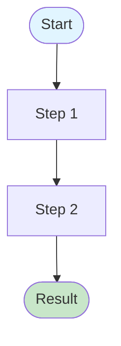

# Code Analysis Playbook: How to Analyze a Codebase Component

## Purpose

This playbook documents the process for conducting a comprehensive analysis of a codebase component. It covers exploration, documentation creation, example generation, code linking, and validation. Use this when you need to understand and document how a specific part of the codebase works.

**When to use this playbook:**
- Analyzing a new component you're unfamiliar with
- Creating reference documentation for a complex algorithm or system
- Onboarding new team members to a specific area
- Preparing for refactoring or migration work
- Building API documentation

**Time estimate:** 2-4 hours for a medium-sized component (3-5 files, ~500-1000 lines)

## Environment Assumptions

**Prerequisites:**
- Access to the codebase repository
- `docmgr` installed and configured (see `docmgr help how-to-use`)
- Go toolchain installed (if analyzing Go code)
- Basic familiarity with the codebase structure
- Terminal access with shell completion enabled

**Required tools:**
- `docmgr` - Documentation management
- `grep` / `ripgrep` - Code search
- `go` - Go toolchain (for Go projects)
- Code editor with Go support
- Git (for exploring history if needed)

## Step-by-Step Process

### Phase 1: Setup and Initial Exploration (15-30 minutes)

#### Step 1.1: Understand docmgr Workflow

Before starting, familiarize yourself with docmgr if you haven't used it:

```bash
# Read the how-to-use guide (redirect to file for full reading)
docmgr help how-to-use > /tmp/docmgr-how-to-use.txt
```

Read the file (it's ~1200 lines, read in chunks if needed)

**Key concepts to understand:**
- Tickets: Units of work with their own workspace
- Documents: Analysis, reference, design-doc, playbook types
- File linking: Using `docmgr doc relate` to link code to docs
- Changelog: Tracking what you've done

#### Step 1.2: Create Analysis Ticket

Create a ticket for your analysis work:

```bash
# Create ticket with descriptive name
docmgr ticket create-ticket \
  --ticket COMPONENT-ANALYSIS \
  --title "Component Name: Analysis" \
  --topics component-name,analysis,reference

# Verify ticket was created
docmgr ticket list --ticket COMPONENT-ANALYSIS
```

**Naming convention:** Use `COMPONENT-ANALYSIS` format (e.g., `ZINE-LAYOUT-ANALYSIS`, `AUTH-ANALYSIS`)

#### Step 1.3: Identify Component Boundaries

Determine what files belong to your component:

```bash
# Find all files in the component directory
find path/to/component -name "*.go" -type f

# Search for component usage across codebase
grep -r "component-name" --include="*.go" .

# List files matching component pattern
glob_file_search --glob "**/component/**/*.go"
```

**What to identify:**
- Core package files (types, functions, algorithms)
- Test files
- Integration points (where component is used)
- CLI commands (if applicable)
- API endpoints (if applicable)

**Document your findings:**
- List of files to analyze
- Dependencies (what this component uses)
- Dependents (what uses this component)

### Phase 2: Deep Code Reading (30-60 minutes)

#### Step 2.1: Read Core Types and Structures

Start with type definitions - they define the domain model:

```bash
# Read types file
read_file path/to/component/types.go

# Look for exported types
grep "^type\|^func\|^var" path/to/component/*.go
```

**What to document:**
- All exported types and their purposes
- Field meanings and constraints
- Relationships between types
- JSON/API contracts

**Questions to answer:**
- What is the primary data structure?
- What are the input/output types?
- What are the configuration options?

#### Step 2.2: Read Core Algorithms/Functions

Understand the main logic:

```bash
# Read main algorithm file
read_file path/to/component/engine.go

# Find all exported functions
grep "^func [A-Z]" path/to/component/*.go

# Read test files to understand expected behavior
read_file path/to/component/engine_test.go
```

**What to document:**
- Algorithm steps (high-level flow)
- Key functions and their purposes
- Edge cases and validation
- Error handling

**Questions to answer:**
- What is the main entry point?
- What are the key algorithm steps?
- How does data flow through the system?
- What are the failure modes?

#### Step 2.3: Read Integration Points

Understand how the component is used:

```bash
# Find where component is imported
grep -r "import.*component" --include="*.go" .

# Read service layer usage
read_file path/to/services/component_service.go

# Read CLI commands
read_file path/to/cmd/component/command.go

# Read API handlers
read_file path/to/api/component_routes.go
```

**What to document:**
- How the component is instantiated
- How it's called from other layers
- What wrappers/adapters exist
- API contracts (if applicable)

### Phase 3: Create Analysis Document (60-90 minutes)

#### Step 3.1: Create Reference Document

Create the main analysis document:

```bash
docmgr doc add \
  --ticket COMPONENT-ANALYSIS \
  --doc-type reference \
  --title "Component Name: Complete Analysis"
```

#### Step 3.2: Document Structure

Write the analysis document with these sections:

**1. Goal and Context**
- What is this component?
- Why does it exist?
- What problems does it solve?

**2. Package Structure**
- File organization
- Key modules/packages
- Dependencies

**3. Core Data Structures**
- All types with explanations
- Field meanings
- Relationships

**4. Algorithm Overview**
- High-level flow
- Key steps
- Decision points

**5. Detailed Algorithm Steps**
- Step-by-step breakdown
- Code references (see Phase 4)
- Edge cases

**6. API Reference**
- Function signatures
- Parameters
- Return values
- Error conditions

**7. Usage Examples**
- Real examples (see Phase 5)
- Common patterns
- Integration examples

**8. Integration Points**
- How other code uses it
- Service layer
- CLI/API usage

#### Step 3.3: Add Human-Readable Explanations

For each technical section, add:
- **"What is X?"** - Explain the concept
- **"Why does this matter?"** - Context and importance
- **"How does it work?"** - Mechanism explanation
- **Real-world analogies** - Help newcomers understand

**Example structure:**
```markdown
### SomeComplexType

**What is SomeComplexType?**

[Explain what it is in plain language]

**Why does this matter?**

[Explain why someone would care about this]

[Code reference here]

[Technical details]
```

### Phase 4: Link Code References (20-30 minutes)

#### Step 4.1: Link All Symbols

Link every type, function, and key algorithm section to source code:

```bash
# Link files to the analysis document
docmgr doc relate \
  --doc "path/to/analysis/reference/01-component-analysis.md" \
  --file-note "path/to/component/types.go:Core type definitions" \
  --file-note "path/to/component/engine.go:Main algorithm implementation" \
  --file-note "path/to/component/engine_test.go:Test suite"
```

#### Step 4.2: Add Code References in Document

For each algorithm section, add code references using the format:

```markdown
```startLine:endLine:filepath
// actual code from file
```
```

**What to link:**
- Type definitions → `types.go:start-end`
- Functions → `engine.go:start-end`
- Algorithm steps → specific line ranges
- Helper functions → their implementations
- Constants/variables → their definitions

**Example:**
```markdown
### ComputeResult Function

```242:399:component/engine.go
func ComputeResult(inp Inputs) (Result, error) {
	// ... implementation ...
}
```

This function performs the core computation...
```

#### Step 4.3: Link to Ticket Index

Link key files to the ticket index:

```bash
docmgr doc relate \
  --ticket COMPONENT-ANALYSIS \
  --file-note "path/to/component/types.go:Core type definitions" \
  --file-note "path/to/component/engine.go:Main algorithm" \
  --file-note "path/to/analysis/reference/01-component-analysis.md:Analysis document"
```

### Phase 5: Create Examples and Validate Understanding (30-45 minutes)

#### Step 5.1: Run CLI Examples

If the component has CLI commands, test them:

```bash
# Run basic command
go run cmd/app/main.go component command --param value

# Capture output
go run cmd/app/main.go component command --param value > /tmp/output.json

# Test different scenarios
go run cmd/app/main.go component command --scenario-1
go run cmd/app/main.go component command --scenario-2
go run cmd/app/main.go component command --scenario-3
```

**What to document:**
- Command invocations
- Actual output (JSON/YAML)
- Explanation of results
- What each example demonstrates

#### Step 5.2: Create Example Section

Add examples to your analysis document:

```markdown
## Usage Examples

### Example 1: Basic Usage

**Scenario**: [What this example shows]

**Command**:
```bash
go run cmd/app/main.go component command --param value
```

**Result**:
```json
{
  "result": { ... }
}
```

**Explanation**:
- What happened
- Why these values
- Key takeaways
```

**Include 3-5 examples covering:**
- Basic/common usage
- Edge cases
- Different modes/options
- Error scenarios (if applicable)

#### Step 5.3: Validate Your Understanding

Test your understanding by:
- Running examples and verifying output matches expectations
- Reading tests and confirming your understanding
- Tracing through code with a debugger (if needed)
- Asking questions if something doesn't make sense

### Phase 6: Add Visual Aids (20-30 minutes)

#### Step 6.1: Create Flow Diagram

If the component has complex flow, create a Mermaid diagram:

```markdown
## Algorithm Flow Diagram


```

**What to include:**
- Main algorithm flow
- Decision points
- Error paths
- Different modes/branches

#### Step 6.2: Add Diagrams for Complex Concepts

Create diagrams for:
- Data flow through the system
- State transitions (if applicable)
- Component relationships
- API request/response flow

### Phase 7: Finalize and Validate (15-20 minutes)

#### Step 7.1: Update Changelog

Document what you've done:

```bash
docmgr changelog update \
  --ticket COMPONENT-ANALYSIS \
  --entry "Created comprehensive analysis document covering [what]. Added examples, code references, and flow diagrams."
```

#### Step 7.2: Update Ticket Summary

```bash
docmgr meta update \
  --ticket COMPONENT-ANALYSIS \
  --field Summary \
  --value "Complete analysis of [component]: [key points covered]"
```

#### Step 7.3: Validate Documentation

Run docmgr doctor to check for issues:

```bash
docmgr doctor --ticket COMPONENT-ANALYSIS
```

**Fix any issues:**
- Missing file links
- Broken paths
- Invalid frontmatter

#### Step 7.4: Review Checklist

Before considering the analysis complete, verify:

- [ ] All core types documented
- [ ] All key functions documented
- [ ] Algorithm steps explained
- [ ] Code references added (with line numbers)
- [ ] Files linked to document
- [ ] Examples included and tested
- [ ] Flow diagram created (if applicable)
- [ ] Human-readable explanations added
- [ ] Integration points documented
- [ ] Changelog updated
- [ ] Ticket summary updated
- [ ] No docmgr validation errors

## Exit Criteria

The analysis is complete when:

1. **Completeness**: All major components, types, and functions are documented
2. **Accuracy**: Examples run successfully and match documented behavior
3. **Navigability**: Code references allow jumping from docs to source
4. **Clarity**: A newcomer can understand the component by reading the docs
5. **Validation**: `docmgr doctor` reports no errors

## Common Patterns and Tips

### Pattern: Analyzing an Algorithm

1. Start with types (inputs/outputs)
2. Read main function signature
3. Trace through algorithm step by step
4. Document each step with code references
5. Add examples showing each step's output

### Pattern: Analyzing an API

1. List all endpoints
2. Document request/response types
3. Show example requests/responses
4. Document error cases
5. Link to implementation code

### Pattern: Analyzing a Service Layer

1. Identify service interface
2. Document public methods
3. Show usage examples
4. Document dependencies
5. Link to repository/domain code

### Tips

- **Read tests first**: Tests show expected behavior and edge cases
- **Use grep liberally**: Find all usages to understand context
- **Run examples**: Don't just read code - execute it
- **Ask questions**: If something is unclear, document the question
- **Iterate**: Analysis improves with multiple passes
- **Link everything**: Make navigation easy with code references

## Failure Modes

**Problem**: Can't find where component is used
- **Solution**: Use broader grep patterns, check imports, look at test files

**Problem**: Algorithm is too complex to understand
- **Solution**: Break into smaller steps, add more examples, create diagrams

**Problem**: Examples don't work
- **Solution**: Check prerequisites, verify environment, read error messages

**Problem**: Code references break
- **Solution**: Use absolute paths from workspace root, verify file exists

**Problem**: Documentation feels incomplete
- **Solution**: Add more examples, explain edge cases, document "why" not just "what"

## Related Resources

- [docmgr how-to-use guide](docmgr help how-to-use)
- [Example analysis: imagelayout](../reference/01-image-layout-algorithm-complete-analysis.md)
- [Code citation format guidelines](../../../../AGENT.md#citing-code)

## Example: imagelayout Analysis

This playbook was used to create the imagelayout analysis. Reference that document as an example of:
- Comprehensive type documentation
- Algorithm step-by-step breakdown
- Code references with line numbers
- Real CLI examples with explanations
- Flow diagrams
- Human-readable explanations

See: `reference/01-image-layout-algorithm-complete-analysis.md`
