# Image Layout Algorithm: Complete Analysis

## Goal

This document provides a comprehensive technical analysis of the `imagelayout` package in zine-layout. It documents all algorithms, data structures, API contracts, and usage patterns for image cropping, scaling, and aspect ratio calculations.

## Context

The `imagelayout` package is the core engine for computing how images should be positioned, cropped, and scaled within viewports. It supports three main modes (page, crop, fit), multiple positioning strategies (anchor presets, focus points, manual offsets), and provides detailed trace information for debugging.

The package is used by:
- CLI commands (`cmd/zine-layout/cmds/imagelayout/compute.go`)
- Service layer (`pkg/services/layout.go`)
- Page renderer (`pkg/pagelayout/renderer/renderer.go`)
- Web API (TypeScript interfaces in `web/src/api.ts`)

## Package Structure

The `imagelayout` package consists of:

- **`types.go`**: Core data structures (ViewportSettings, ViewportResult, Rect, ImageMeta, etc.)
- **`defaults.go`**: Default settings factory function
- **`engine/engine.go`**: Core computation algorithms
- **`engine/engine_test.go`**: Comprehensive test suite

## Core Data Structures

### Rect

```4:9:zine-layout/pkg/imagelayout/types.go
type Rect struct {
	X float64 `json:"x"`
	Y float64 `json:"y"`
	W float64 `json:"w"`
	H float64 `json:"h"`
}
```

**What is Rect?**

`Rect` is the fundamental building block of the imagelayout system. It represents a rectangle using floating-point coordinates, which allows for sub-pixel precision - important when working with high-DPI images or when scaling produces fractional pixel values.

Think of `Rect` as answering the question: "Where is this rectangle, and how big is it?" The coordinates are always relative to a parent coordinate system:
- For `SourceRect`, coordinates are relative to the source image (0,0 is top-left of the image)
- For `TargetRect` and `CanvasRect`, coordinates are relative to the canvas (0,0 is top-left of the canvas)

The algorithm produces three key rectangles:
- **`SourceRect`**: The crop region within the source image - tells you "which part of the original image to use"
- **`TargetRect`**: Where the cropped image should be placed on the canvas - tells you "where to put it and at what size"
- **`CanvasRect`**: The content area (canvas minus margins) - tells you "what space is available for placing images"

These three rectangles work together: you crop from `SourceRect`, scale it, then place it at `TargetRect` within the `CanvasRect` boundaries.

### ImageMeta

```12:15:zine-layout/pkg/imagelayout/types.go
type ImageMeta struct {
	Width  int `json:"width"`
	Height int `json:"height"`
}
```

Captures source image dimensions when the actual image file is not available. Used as input to [`InputsFromSettings()`](#input-normalization-algorithm).

### ViewportSettings

**What is ViewportSettings?**

`ViewportSettings` is the "recipe" for how you want an image positioned. It's a comprehensive configuration object that captures every aspect of image placement: where it goes, how big it should be, what part to use, and how to scale it.

Think of it like a form you fill out with all your preferences:
- What kind of layout are you creating? (Mode: page, crop, or fit)
- What size is your canvas? (Paper dimensions and DPI)
- Do you want margins? (Margin settings)
- Should the image fill the space or fit within it? (CropToFill)
- Where should it be positioned? (Anchor preset, focus point, or manual positioning)
- Any special cropping requirements? (Crop ratio, explicit dimensions)

The beauty of `ViewportSettings` is that it's declarative - you describe *what* you want, not *how* to achieve it. The algorithm figures out the precise pixel coordinates needed to fulfill your requirements.

The canonical input structure for positioning an image. Contains all configuration:

```27:58:zine-layout/pkg/imagelayout/types.go
type ViewportSettings struct {
	Mode string `json:"mode,omitempty"` // page | crop | fit

	PaperWidthIn  float64 `json:"paper_width_in"`
	PaperHeightIn float64 `json:"paper_height_in"`
	DPI           float64 `json:"dpi"`
	Orientation   string  `json:"orientation"` // portrait|landscape

	MarginTopIn    float64 `json:"margin_top_in"`
	MarginRightIn  float64 `json:"margin_right_in"`
	MarginBottomIn float64 `json:"margin_bottom_in"`
	MarginLeftIn   float64 `json:"margin_left_in"`

	CropRatio    *float64 `json:"crop_ratio,omitempty"`
	CropToFill   bool     `json:"crop_to_fill"`
	CropWidthPx  *float64 `json:"crop_width_px,omitempty"`
	CropHeightPx *float64 `json:"crop_height_px,omitempty"`

	FitMode     string   `json:"fit_mode,omitempty"`      // width|height|auto
	FitWidthPx  *float64 `json:"fit_width_px,omitempty"`  // target width in pixels
	FitHeightPx *float64 `json:"fit_height_px,omitempty"` // target height in pixels

	UserScale float64 `json:"user_scale"`
	PositionX float64 `json:"position_x"`
	PositionY float64 `json:"position_y"`
	Units     string  `json:"units"` // normalized|px

	AnchorPreset string      `json:"anchor_preset,omitempty"` // e.g. center, top-right
	Focus        *FocusPoint `json:"focus,omitempty"`

	Export ExportOptions `json:"export"`
}
```

**Mode Configuration:**
- `Mode`: `"page" | "crop" | "fit"` - Determines how canvas/content area is calculated
- `Orientation`: `"portrait" | "landscape"` - Swaps paper dimensions

**Paper/Canvas Settings:**
- `PaperWidthIn`, `PaperHeightIn`: Physical paper size in inches
- `DPI`: Dots per inch (converts inches to pixels)
- `MarginTopIn`, `MarginRightIn`, `MarginBottomIn`, `MarginLeftIn`: Margins in inches

**Crop Configuration:**
- `CropRatio`: Optional aspect ratio (width/height) for cropping
- `CropToFill`: Boolean - if true, uses "cover" mode; if false, uses "contain" mode
- `CropWidthPx`, `CropHeightPx`: Explicit crop dimensions (used in "crop" mode)

**Fit Configuration:**
- `FitMode`: `"width" | "height" | "auto"` - How to fit image in fit mode
- `FitWidthPx`, `FitHeightPx`: Target dimensions for fit mode

**Positioning:**
- `UserScale`: Additional scale multiplier (default: 1.0)
- `PositionX`, `PositionY`: Offset in normalized (-1..1) or pixel units
- `Units`: `"normalized" | "px"` - Unit system for PositionX/Y
- `AnchorPreset`: `"center" | "top-left" | "top-right" | "bottom-left" | "bottom-right" | "top" | "bottom" | "left" | "right"` - Quick positioning
- `Focus`: Optional `FocusPoint` for precise source-to-target alignment

**Export Options:**
- `Export`: `ExportOptions` struct for downstream rendering preferences

### FocusPoint

```61:66:zine-layout/pkg/imagelayout/types.go
type FocusPoint struct {
	SourceX float64 `json:"source_x"`
	SourceY float64 `json:"source_y"`
	TargetX float64 `json:"target_x"`
	TargetY float64 `json:"target_y"`
}
```

Aligns a specific point in the source image with a target location in the viewport. When provided, overrides `PositionX`/`PositionY` for crop positioning.

### ViewportResult

The output of computation:

```69:75:zine-layout/pkg/imagelayout/types.go
type ViewportResult struct {
	SourceRect Rect    `json:"source_rect"`
	TargetRect Rect    `json:"target_rect"`
	CanvasRect Rect    `json:"canvas_rect"`
	Scale      float64 `json:"scale"`
	Mode       string  `json:"mode"` // cover|contain
}
```

### Trace

Debugging information showing step-by-step calculations:

```84:87:zine-layout/pkg/imagelayout/types.go
type Trace struct {
	Inputs map[string]interface{} `json:"inputs"`
	Steps  []TraceStep            `json:"steps"`
}
```

```78:81:zine-layout/pkg/imagelayout/types.go
type TraceStep struct {
	Label string                 `json:"label"`
	Data  map[string]interface{} `json:"data"`
}
```

### Computation

Bundles settings, result, and trace for persistence:

```90:94:zine-layout/pkg/imagelayout/types.go
type Computation struct {
	Settings ViewportSettings `json:"settings"`
	Result   ViewportResult   `json:"result"`
	Trace    *Trace           `json:"trace,omitempty"`
}
```

## Algorithm Overview

The computation happens in two phases:

1. **Input Normalization** (`InputsFromSettings`): Converts `ViewportSettings` + `ImageMeta` into normalized `Inputs` structure
2. **Viewport Computation** (`ComputeViewport`): Calculates crop region, scale, and placement

### Algorithm Flow Diagram

The following Mermaid diagram illustrates the complete algorithm flow from settings to final result:

```mermaid
flowchart TD
    Start([Start: ViewportSettings + ImageMeta]) --> Validate{Validate Inputs}
    Validate -->|Invalid| Error([Error: Invalid dimensions/DPI])
    Validate -->|Valid| Normalize[Input Normalization Phase]
    
    Normalize --> ModeCheck{Determine Mode}
    ModeCheck -->|page| PageMode[Page Mode:<br/>Canvas = Paper × DPI<br/>Content = Canvas - Margins]
    ModeCheck -->|crop| CropMode[Crop Mode:<br/>Canvas = CropWidth × CropHeight<br/>No Margins]
    ModeCheck -->|fit| FitMode[Fit Mode:<br/>Canvas = FitWidth × FitHeight<br/>Calculate from FitMode]
    
    PageMode --> Orientation{Check Orientation}
    CropMode --> ComputePhase
    FitMode --> ComputePhase
    Orientation -->|landscape| SwapDims[Swap Width/Height]
    Orientation -->|portrait| ComputePhase
    SwapDims --> ComputePhase
    
    ComputePhase[Viewport Computation Phase] --> CalcCanvas[Calculate Canvas Rect]
    CalcCanvas --> CalcRatio{Determine Aspect Ratio}
    
    CalcRatio -->|CropRatio set| UseCropRatio[Use CropRatio]
    CalcRatio -->|CropToFill true| UseTargetRatio[Use Target Ratio]
    CalcRatio -->|Neither| UseSourceRatio[Use Source Ratio]
    
    UseCropRatio --> CropCalc[Calculate Source Crop Region]
    UseTargetRatio --> CropCalc
    UseSourceRatio --> CropCalc
    
    CropCalc --> CompareRatios{Compare Ratios}
    CompareRatios -->|Source > Requested| CropWidth[Image wider:<br/>Crop width, keep height]
    CompareRatios -->|Source < Requested| CropHeight[Image taller:<br/>Crop height, keep width]
    CompareRatios -->|Source = Requested| NoCrop[Perfect match:<br/>Use full image]
    
    CropWidth --> PositionCheck{Positioning Method?}
    CropHeight --> PositionCheck
    NoCrop --> PositionCheck
    
    PositionCheck -->|Focus Point| FocusCalc[Calculate Focus Alignment:<br/>Align source point to target]
    PositionCheck -->|Anchor Preset| AnchorCalc[Map Preset to Position:<br/>-1..1 normalized coords]
    PositionCheck -->|Manual| ManualCalc[Use PositionX/Y directly]
    
    FocusCalc --> ScaleCalc[Calculate Scale Factors]
    AnchorCalc --> ScaleCalc
    ManualCalc --> ScaleCalc
    
    ScaleCalc --> ScaleMode{CropToFill?}
    ScaleMode -->|false: Contain| MinScale[Use min scaleX, scaleY<br/>Entire crop fits]
    ScaleMode -->|true: Cover| MaxScale[Use max scaleX, scaleY<br/>Fill target area]
    
    MinScale --> ApplyUserScale[Apply UserScale multiplier]
    MaxScale --> ApplyUserScale
    
    ApplyUserScale --> CalcTarget[Calculate Target Placement:<br/>Position offsets + dimensions]
    CalcTarget --> Result([ViewportResult:<br/>SourceRect, TargetRect,<br/>CanvasRect, Scale, Mode])
    
    style Start fill:#e1f5ff
    style Result fill:#c8e6c9
    style Error fill:#ffcdd2
    style ComputePhase fill:#fff9c4
    style CropCalc fill:#fff9c4
    style ScaleCalc fill:#fff9c4
```



This diagram shows the two-phase approach: first normalizing inputs based on mode, then computing the actual viewport geometry. The algorithm handles multiple positioning strategies and scaling modes to produce precise placement results.

## Input Normalization Algorithm

**What is Input Normalization?**

Before the algorithm can compute where to place an image, it needs to convert all the various input formats (inches, pixels, ratios, presets) into a consistent, normalized representation. Think of this phase as "translating" user-friendly settings into the precise pixel coordinates and ratios that the computation engine needs.

The [`InputsFromSettings`](zine-layout/pkg/imagelayout/engine/engine.go:59-214) function performs this translation:

### 1. Validation

```60:65:zine-layout/pkg/imagelayout/engine/engine.go
	if meta.Width <= 0 || meta.Height <= 0 {
		return Inputs{}, fmt.Errorf("imagelayout: invalid source dimensions %dx%d", meta.Width, meta.Height)
	}
	if settings.DPI <= 0 {
		return Inputs{}, fmt.Errorf("imagelayout: dpi must be positive")
	}
```
- Source dimensions must be positive
- DPI must be positive
- Units must be `"normalized"` or `"px"`
- Crop ratio must be positive if provided

### 2. Canvas/Content Area Calculation

**Page Mode (default):**

```80:95:zine-layout/pkg/imagelayout/engine/engine.go
	canvasW := widthIn * settings.DPI
	canvasH := heightIn * settings.DPI
	if canvasW <= 0 || canvasH <= 0 {
		return Inputs{}, fmt.Errorf("imagelayout: canvas dimensions must be positive")
	}

	mt := settings.MarginTopIn * settings.DPI
	mr := settings.MarginRightIn * settings.DPI
	mb := settings.MarginBottomIn * settings.DPI
	ml := settings.MarginLeftIn * settings.DPI

	contentW := canvasW - (ml + mr)
	contentH := canvasH - (mt + mb)
	if contentW <= 0 || contentH <= 0 {
		return Inputs{}, fmt.Errorf("imagelayout: margins exceed canvas size")
	}
```

- Canvas = Paper dimensions × DPI
- Content = Canvas - margins
- Margins are preserved

**Crop Mode:**

```126:145:zine-layout/pkg/imagelayout/engine/engine.go
	switch mode {
	case "crop":
		if cropWidth <= 0 {
			if settings.CropRatio != nil && *settings.CropRatio > 0 && cropHeight > 0 {
				cropWidth = cropHeight * *settings.CropRatio
			} else {
				cropWidth = float64(meta.Width)
			}
		}
		if cropHeight <= 0 {
			if settings.CropRatio != nil && *settings.CropRatio > 0 {
				cropHeight = cropWidth / *settings.CropRatio
			} else {
				cropHeight = float64(meta.Height)
			}
		}
		canvasW = cropWidth
		canvasH = cropHeight
		contentW = cropWidth
		contentH = cropHeight
		mt, mr, mb, ml = 0, 0, 0, 0
```

- Canvas = `CropWidthPx` × `CropHeightPx` (or derived from `CropRatio`)
- Content = Canvas (no margins)
- If `CropWidthPx`/`CropHeightPx` not provided, uses source dimensions or calculates from `CropRatio`

**Fit Mode:**

```146:180:zine-layout/pkg/imagelayout/engine/engine.go
	case "fit":
		switch fitMode {
		case "width":
			if fitWidth <= 0 {
				fitWidth = contentW
			}
			if fitHeight <= 0 {
				fitHeight = fitWidth / sourceRatio
			}
		case "height":
			if fitHeight <= 0 {
				fitHeight = contentH
			}
			if fitWidth <= 0 {
				fitWidth = fitHeight * sourceRatio
			}
		default:
			if fitWidth <= 0 && fitHeight > 0 {
				fitWidth = fitHeight * sourceRatio
			}
			if fitHeight <= 0 && fitWidth > 0 {
				fitHeight = fitWidth / sourceRatio
			}
			if fitWidth <= 0 {
				fitWidth = contentW
			}
			if fitHeight <= 0 {
				fitHeight = contentH
			}
		}
		canvasW = fitWidth
		canvasH = fitHeight
		contentW = fitWidth
		contentH = fitHeight
		mt, mr, mb, ml = 0, 0, 0, 0
```

- Canvas = `FitWidthPx` × `FitHeightPx` (or calculated from `FitMode`)
- Content = Canvas (no margins)
- `FitMode` logic:
  - `"width"`: Uses `FitWidthPx`, calculates height from source aspect ratio
  - `"height"`: Uses `FitHeightPx`, calculates width from source aspect ratio
  - `"auto"`: Uses both if provided, otherwise fills content area

### 3. Orientation Handling

```76:78:zine-layout/pkg/imagelayout/engine/engine.go
	if strings.ToLower(settings.Orientation) == "landscape" {
		widthIn, heightIn = settings.PaperHeightIn, settings.PaperWidthIn
	}
```

If `Orientation == "landscape"`, swaps `PaperWidthIn` and `PaperHeightIn` before calculating canvas.

### 4. Position Resolution

```11:21:zine-layout/pkg/imagelayout/engine/engine.go
var anchorPresets = map[string][2]float64{
	"top-left":     {-1, -1},
	"top":          {0, -1},
	"top-right":    {1, -1},
	"left":         {-1, 0},
	"center":       {0, 0},
	"right":        {1, 0},
	"bottom-left":  {-1, 1},
	"bottom":       {0, 1},
	"bottom-right": {1, 1},
}
```

```223:239:zine-layout/pkg/imagelayout/engine/engine.go
func resolveAnchor(settings imagelayout.ViewportSettings, units string, fallback float64, isX bool) float64 {
	if units != "normalized" {
		return fallback
	}
	preset := strings.ToLower(strings.TrimSpace(settings.AnchorPreset))
	if preset == "" {
		return fallback
	}
	vec, ok := anchorPresets[preset]
	if !ok {
		return fallback
	}
	if isX {
		return vec[0]
	}
	return vec[1]
}
```

If `Units == "normalized"` and `AnchorPreset` is set:
- Maps preset to normalized coordinates using `resolveAnchor()`:
  - `"center"`: (0, 0)
  - `"top-left"`: (-1, -1)
  - `"top-right"`: (1, -1)
  - `"bottom-left"`: (-1, 1)
  - `"bottom-right"`: (1, 1)
  - `"top"`: (0, -1)
  - `"bottom"`: (0, 1)
  - `"left"`: (-1, 0)
  - `"right"`: (1, 0)
- Overrides `PositionX`/`PositionY` with preset values

## Viewport Computation Algorithm

**What is Viewport Computation?**

Once inputs are normalized, the viewport computation phase answers three critical questions:
1. **What part of the source image should we use?** (SourceRect - the crop region)
2. **How big should it be?** (Scale factor)
3. **Where should it go?** (TargetRect - placement on canvas)

This phase is where the "magic" happens - it takes the normalized inputs and produces precise geometric coordinates that tell a renderer exactly how to crop, scale, and position an image. The algorithm is deterministic: given the same inputs, it always produces the same output, making it perfect for both interactive previews and batch processing.

The [`ComputeViewport`](zine-layout/pkg/imagelayout/engine/engine.go:242-399) function performs this computation:

### Step 1: Determine Canvas Rect

**Why does this matter?**

The canvas rect defines the "playground" where images can be placed. In page mode, you're working with physical paper that has margins - like a photo frame with a mat. The canvas rect accounts for these margins, so you know exactly where the "safe area" is for placing content.

In crop and fit modes, there are no margins - you're working with a raw canvas, so everything starts at the origin (0,0).

```265:278:zine-layout/pkg/imagelayout/engine/engine.go
	canvasRect := imagelayout.Rect{
		X: inp.MarginLeftPx,
		Y: inp.MarginTopPx,
		W: inp.ContentW,
		H: inp.ContentH,
	}
	if inp.Mode != "page" {
		canvasRect = imagelayout.Rect{
			X: 0,
			Y: 0,
			W: inp.ContentW,
			H: inp.ContentH,
		}
	}
```

- **Page mode**: Canvas rect accounts for margins (X = `MarginLeftPx`, Y = `MarginTopPx`, W = `ContentW`, H = `ContentH`)
  - Example: 8.5×11 inch paper at 300 DPI = 2550×3300px canvas
  - With 0.25 inch margins = 75px margins
  - Content area: starts at (75, 75), size 2400×3150px
  
- **Crop/Fit modes**: Canvas rect starts at origin (X = 0, Y = 0, W = `ContentW`, H = `ContentH`)
  - No margins, full canvas is available
  - Example: 1200×1200px crop = canvas rect (0, 0, 1200, 1200)

### Step 2: Calculate Requested Aspect Ratio

**Why aspect ratio matters:**

Aspect ratio (width/height) determines the "shape" of your crop. If your source image is 4000×3000px (ratio 1.333) but you want a square output (ratio 1.0), you need to crop. The algorithm needs to know what ratio to aim for.

The algorithm determines what aspect ratio to crop to using a priority system:

```284:290:zine-layout/pkg/imagelayout/engine/engine.go
	sourceRatio := safeDiv(inp.SourceW, inp.SourceH)
	requestedRatio := sourceRatio
	if inp.CropRatio != nil {
		requestedRatio = *inp.CropRatio
	} else if inp.CropToFill && targetRatio > 0 {
		requestedRatio = targetRatio
```

1. **If `CropRatio` is provided** → use it
   - Explicit user request: "I want a 1:1 square" or "I want 16:9 widescreen"
   - Highest priority - user knows exactly what they want
   
2. **Else if `CropToFill` is true** → use target (canvas) aspect ratio
   - "Fill the available space completely"
   - If canvas is 2400×3150px (ratio 0.762), crop to match that ratio
   - Ensures no empty space, but may crop significant portions of the image
   
3. **Else** → use source image aspect ratio (no cropping)
   - "Keep the image's natural shape"
   - Preserves the original composition
   - May leave empty space if source and target ratios don't match

This decision determines whether cropping happens and how much of the source image is used.

### Step 3: Calculate Source Crop Region (`SourceRect`)

**The crop region calculation:**

This is where the algorithm decides "which part of the source image should I use?" If your source is 4000×3000px but you need a square (3000×3000px), you can't use the full width - you need to crop 1000px from somewhere. This step figures out the exact crop rectangle.

The calculation depends on how the source aspect ratio compares to the requested ratio. Think of it like fitting a picture into a frame: if the picture is wider than the frame, you crop the sides. If it's taller, you crop the top/bottom.

The source crop region (`sx`, `sy`, `sw`, `sh`) is calculated based on requested ratio:

```292:323:zine-layout/pkg/imagelayout/engine/engine.go
	var sx, sy, sw, sh float64 = 0, 0, inp.SourceW, inp.SourceH
	var rangeX, rangeY float64
	focusApplied := false
	if requestedRatio > 0 && inp.SourceW > 0 && inp.SourceH > 0 {
		switch {
		case sourceRatio > requestedRatio:
			// crop width
			sh = inp.SourceH
			sw = sh * requestedRatio
			rangeX = math.Max(0, inp.SourceW-sw)
			if inp.Focus == nil {
				sx = computeOffset(inp.Units, inp.PositionX, rangeX)
			}
		case sourceRatio < requestedRatio:
			sw = inp.SourceW
			sh = sw / requestedRatio
			rangeY = math.Max(0, inp.SourceH-sh)
			if inp.Focus == nil {
				sy = computeOffset(inp.Units, inp.PositionY, rangeY)
			}
		default:
			rangeX = math.Max(0, inp.SourceW-sw)
			rangeY = math.Max(0, inp.SourceH-sh)
			if inp.Focus == nil {
				sx = computeOffset(inp.Units, inp.PositionX, rangeX)
				sy = computeOffset(inp.Units, inp.PositionY, rangeY)
			}
		}
	} else {
		rangeX = math.Max(0, inp.SourceW-sw)
		rangeY = math.Max(0, inp.SourceH-sh)
	}
```

**Case 1: Source ratio > Requested ratio**
- Image is wider than needed → crop width
- `sh = SourceH` (full height)
- `sw = sh × requestedRatio`
- `rangeX = max(0, SourceW - sw)` (how much we can shift horizontally)

**Case 2: Source ratio < Requested ratio**
- Image is taller than needed → crop height
- `sw = SourceW` (full width)
- `sh = sw / requestedRatio`
- `rangeY = max(0, SourceH - sh)` (how much we can shift vertically)

**Case 3: Source ratio == Requested ratio**
- Perfect match → use full image
- `sw = SourceW`, `sh = SourceH`
- Both ranges calculated (for positioning)

### Step 4: Apply Positioning

**Positioning: Where in the crop region?**

Once we know the crop region size (e.g., 3000×3000px from a 4000×3000px source), we need to decide *where* that region sits. If the crop is smaller than the source, we can shift it left/right or up/down. This step determines the exact offset (`sx`, `sy`) of the crop region.

The algorithm supports three positioning strategies, in priority order:

**If Focus Point is provided:**

```326:338:zine-layout/pkg/imagelayout/engine/engine.go
	if inp.Focus != nil {
		focusApplied = true
		fx := clampFloat(inp.Focus.SourceX, 0, inp.SourceW)
		fy := clampFloat(inp.Focus.SourceY, 0, inp.SourceH)
		targetNX := resolveFocusTarget(inp.Focus.TargetX, sw)
		targetNY := resolveFocusTarget(inp.Focus.TargetY, sh)
		sx = clampFloat(fx-targetNX*sw, 0, rangeX)
		sy = clampFloat(fy-targetNY*sh, 0, rangeY)
		focusInfo["focus_source_x"] = fx
		focusInfo["focus_source_y"] = fy
		focusInfo["focus_target_x"] = targetNX
		focusInfo["focus_target_y"] = targetNY
	}
```

- Clamps focus source coordinates to image bounds using `clampFloat()`
- Resolves focus target coordinates using `resolveFocusTarget()` (normalizes if needed)
- Calculates crop offset to align focus point:
  - `sx = clamp(focusSourceX - targetNX × sw, 0, rangeX)`
  - `sy = clamp(focusSourceY - targetNY × sh, 0, rangeY)`

**Else (using PositionX/PositionY):**

```408:418:zine-layout/pkg/imagelayout/engine/engine.go
func computeOffset(units string, value float64, rangePx float64) float64 {
	if rangePx <= 0 {
		return 0
	}
	if units == "normalized" {
		clamped := clampFloat(value, -1, 1)
		return (clamped + 1) * 0.5 * rangePx
	}
	half := rangePx / 2
	return clampFloat(value, -half, half) + half
}
```

- `computeOffset()` function:
  - **Normalized units**: Maps (-1..1) to (0..rangePx)
    - Formula: `(clamped + 1) × 0.5 × rangePx`
  - **Pixel units**: Clamps to (-half..half) + half
- `sx = computeOffset(Units, PositionX, rangeX)`
- `sy = computeOffset(Units, PositionY, rangeY)`

### Step 5: Calculate Scale

**Scaling: How big should it be?**

Now that we know what part of the source to use (`SourceRect`), we need to figure out how big to make it on the target canvas. This is where scaling comes in.

The algorithm calculates two scale factors - one for width, one for height:

```352:360:zine-layout/pkg/imagelayout/engine/engine.go
	scaleX := safeDiv(targetW, sw)
	scaleY := safeDiv(targetH, sh)
	mode := "contain"
	scale := math.Min(scaleX, scaleY)
	if inp.CropToFill {
		mode = "cover"
		scale = math.Max(scaleX, scaleY)
	}
	scale *= inp.UserScale
```

- `scaleX = targetW / sw` - "How much do I need to scale the width?" (using `safeDiv()` to handle division by zero)
- `scaleY = targetH / sh` - "How much do I need to scale the height?"

These are usually different because source and target rarely have the same aspect ratio. The choice of which one to use determines the scaling mode:

**Contain Mode** (`CropToFill == false`):
- **Philosophy**: "Show the entire crop region, even if it means empty space"
- Uses minimum scale: `scale = min(scaleX, scaleY)`
- Ensures entire crop region fits in target
- May leave empty space (letterboxing or pillarboxing)
- Example: If scaleX=0.6 and scaleY=0.8, uses 0.6 (width is limiting)
- Result: Image fits completely, but there's empty space on one axis

**Cover Mode** (`CropToFill == true`):
- **Philosophy**: "Fill the entire target area, even if it means cropping"
- Uses maximum scale: `scale = max(scaleX, scaleY)`
- Fills entire target area
- May crop beyond `SourceRect` (but that's handled by renderer)
- Example: If scaleX=0.6 and scaleY=0.8, uses 0.8 (height is limiting)
- Result: Target is completely filled, but some image content may be cropped

**Final scale**: `scale × UserScale` - applies any user-specified multiplier (useful for "zoom in 10%" or "zoom out 20%" adjustments)

### Step 6: Calculate Target Placement

**Final placement: Where exactly does it go?**

The last step combines everything: we know the crop region, we know the scale, now we need to place the scaled image on the canvas. This step calculates the final `TargetRect` - the exact position and size of the image on the canvas.

**Destination dimensions** (how big the scaled image will be):
- `dstW = sw × scale` - scaled crop width
- `dstH = sh × scale` - scaled crop height

**Position offsets** (`tx`, `ty`) - how much to shift from the canvas origin:

```420:429:zine-layout/pkg/imagelayout/engine/engine.go
func positionOffsets(units string, px, py float64, targetW, targetH, dstW, dstH float64) (float64, float64) {
	if units == "px" {
		return px, py
	}
	freeX := targetW - dstW
	freeY := targetH - dstH
	tx := (clampFloat(px, -1, 1) * freeX) / 2
	ty := (clampFloat(py, -1, 1) * freeY) / 2
	return tx, ty
}
```

The algorithm supports two unit systems for positioning:

- **Pixel units**: Uses `PositionX`, `PositionY` directly
  - Simple: "Move 100px right, 50px down"
  - Absolute positioning
  
- **Normalized units**: Relative positioning within available space
  - `freeX = targetW - dstW` - horizontal space available for positioning
  - `freeY = targetH - dstH` - vertical space available for positioning
  - `tx = (clamp(PositionX, -1, 1) × freeX) / 2` - maps -1..1 to offset
  - `ty = (clamp(PositionY, -1, 1) × freeY) / 2` - maps -1..1 to offset
  - Example: If freeX=600px and PositionX=0.5, then tx=150px (centers with slight right bias)
  - Normalized is useful because it adapts to different canvas sizes

**Final `TargetRect`** combines canvas position with offsets:

```362:381:zine-layout/pkg/imagelayout/engine/engine.go
	dstW := sw * scale
	dstH := sh * scale
	tx, ty := positionOffsets(inp.Units, inp.PositionX, inp.PositionY, targetW, targetH, dstW, dstH)
	addStep("scale", map[string]interface{}{
		"scale_x": scaleX,
		"scale_y": scaleY,
		"final":   scale,
		"mode":    mode,
		"dst_w":   dstW,
		"dst_h":   dstH,
		"tx":      tx,
		"ty":      ty,
	})

	targetRect := imagelayout.Rect{
		X: canvasRect.X + tx,
		Y: canvasRect.Y + ty,
		W: dstW,
		H: dstH,
	}
	sourceRect := imagelayout.Rect{X: sx, Y: sy, W: sw, H: sh}
```

- `X = CanvasRect.X + tx` - absolute X position on canvas
- `Y = CanvasRect.Y + ty` - absolute Y position on canvas
- `W = dstW` - final width
- `H = dstH` - final height

This gives you the exact rectangle where the renderer should place the cropped, scaled image.

## Algorithm Modes Deep Dive

### Page Mode

**Purpose**: Place image on a physical page with margins

**Canvas Calculation**:
- Canvas = Paper size × DPI
- Content = Canvas - margins

**Use Cases**:
- Printing layouts
- PDF generation
- Physical media preparation

**Example**:
```go
settings := imagelayout.ViewportSettings{
    Mode: "page",
    PaperWidthIn: 8.5,
    PaperHeightIn: 11.0,
    DPI: 300,
    MarginTopIn: 0.25,
    MarginRightIn: 0.25,
    MarginBottomIn: 0.25,
    MarginLeftIn: 0.25,
}
// Canvas: 2550×3300px
// Content: 2250×3000px (after margins)
```

### Crop Mode

**Purpose**: Extract a specific region from source image

**Canvas Calculation**:
- Canvas = `CropWidthPx` × `CropHeightPx`
- No margins

**Use Cases**:
- Thumbnail generation
- Image extraction
- Fixed-size output

**Example**:
```go
settings := imagelayout.ViewportSettings{
    Mode: "crop",
    CropWidthPx: floatPtr(1200),
    CropHeightPx: floatPtr(800),
}
// Canvas: 1200×800px
// Content: 1200×800px
```

### Fit Mode

**Purpose**: Fit image to specific dimensions

**Canvas Calculation**:
- Canvas = `FitWidthPx` × `FitHeightPx` (or calculated from `FitMode`)
- No margins

**FitMode Behavior**:
- `"width"`: Constrains to `FitWidthPx`, calculates height from aspect ratio
- `"height"`: Constrains to `FitHeightPx`, calculates width from aspect ratio
- `"auto"`: Uses provided dimensions or fills content area

**Use Cases**:
- Responsive layouts
- Web display
- Fixed-width/height containers

**Example**:
```go
settings := imagelayout.ViewportSettings{
    Mode: "fit",
    FitMode: "width",
    FitWidthPx: floatPtr(1600),
}
// Canvas: 1600×1200px (if source is 4:3)
```

## Scaling Modes

### Contain Mode (`CropToFill == false`)

- Ensures entire crop region is visible
- Uses `min(scaleX, scaleY)`
- May leave empty space (letterboxing/pillarboxing)
- Result `Mode`: `"contain"`

### Cover Mode (`CropToFill == true`)

- Fills entire target area
- Uses `max(scaleX, scaleY)`
- May crop beyond visible region
- Result `Mode`: `"cover"`

## Positioning Strategies

### Anchor Presets

Quick positioning using named presets:
- `"center"`: (0, 0) - Centers image
- `"top-left"`: (-1, -1) - Aligns to top-left
- `"top-right"`: (1, -1) - Aligns to top-right
- `"bottom-left"`: (-1, 1) - Aligns to bottom-left
- `"bottom-right"`: (1, 1) - Aligns to bottom-right
- `"top"`: (0, -1) - Centers horizontally, aligns to top
- `"bottom"`: (0, 1) - Centers horizontally, aligns to bottom
- `"left"`: (-1, 0) - Aligns to left, centers vertically
- `"right"`: (1, 0) - Aligns to right, centers vertically

### Focus Points

Precise alignment of source coordinates to target positions:

```go
focus := &imagelayout.FocusPoint{
    SourceX: 2000,  // Pixel in source image
    SourceY: 1500,
    TargetX: 0.2,   // 20% from left in target
    TargetY: 0.3,   // 30% from top in target
}
```

The algorithm calculates crop offset to align `(SourceX, SourceY)` with `(TargetX, TargetY)`.

### Manual Positioning

Direct control via `PositionX`/`PositionY`:
- **Normalized**: -1 (left/top) to +1 (right/bottom)
- **Pixels**: Direct pixel offsets

## API Reference

### Functions

#### `DefaultSettings() ViewportSettings`

```5:31:zine-layout/pkg/imagelayout/defaults.go
func DefaultSettings() ViewportSettings {
	return ViewportSettings{
		Mode:           "page",
		PaperWidthIn:   8.0,
		PaperHeightIn:  10.0,
		DPI:            300,
		Orientation:    "portrait",
		MarginTopIn:    0.25,
		MarginRightIn:  0.25,
		MarginBottomIn: 0.25,
		MarginLeftIn:   0.25,
		CropRatio:      nil,
		CropToFill:     false,
		UserScale:      1.0,
		PositionX:      0,
		PositionY:      0,
		Units:          "normalized",
		AnchorPreset:   "center",
		Export: ExportOptions{
			Format:           "png",
			Quality:          90,
			Background:       "white",
			FilenameTemplate: "{name}-{index}.{ext}",
			OutDir:           "./out",
		},
	}
}
```

Returns baseline settings:
- Mode: `"page"`
- Paper: 8.0×10.0 inches
- DPI: 300
- Orientation: `"portrait"`
- Margins: 0.25 inches all sides
- UserScale: 1.0
- Units: `"normalized"`
- AnchorPreset: `"center"`
- Export: PNG, quality 90, white background

#### `InputsFromSettings(settings ViewportSettings, meta ImageMeta) (Inputs, error)`

```59:214:zine-layout/pkg/imagelayout/engine/engine.go
func InputsFromSettings(settings imagelayout.ViewportSettings, meta imagelayout.ImageMeta) (Inputs, error) {
	// ... validation and normalization logic ...
}
```

Converts settings and image metadata into normalized algorithm inputs.

**Returns**: `Inputs` structure with all values in pixels, or error if validation fails.

**Errors**:
- Invalid source dimensions
- Invalid DPI
- Invalid units
- Invalid crop ratio
- Margins exceed canvas size
- Resulting canvas dimensions invalid

#### `ComputeViewport(inp Inputs) (ViewportResult, *Trace)`

```242:399:zine-layout/pkg/imagelayout/engine/engine.go
func ComputeViewport(inp Inputs) (imagelayout.ViewportResult, *imagelayout.Trace) {
	// ... core computation algorithm ...
}
```

Core computation function. Calculates crop region, scale, and placement.

**Returns**: 
- `ViewportResult`: Final geometry
- `*Trace`: Debugging information (may be nil)

**Algorithm Steps** (documented in trace):
1. `"crop"`: Source crop region calculation
2. `"scale"`: Scale factor calculation
3. `"result"`: Final rectangles

## Usage Examples

The following examples demonstrate real-world usage patterns with actual CLI output. Each example shows how different settings produce different results, helping you understand how the algorithm behaves in practice.

### Example 1: Basic Page Layout (Contain Mode)

**Scenario**: Place a 4000×3000px image on an 8.5×11 inch page with 0.25 inch margins at 300 DPI.

**Command**:
```bash
go run cmd/zine-layout/main.go imagelayout compute \
  --source-width 4000 --source-height 3000 \
  --mode page \
  --paper-width-in 8.5 --paper-height-in 11.0 \
  --dpi 300 \
  --margin-top-in 0.25 --margin-right-in 0.25 \
  --margin-bottom-in 0.25 --margin-left-in 0.25
```

**Result**:
```json
{
  "result": {
    "source_rect": {
      "x": 0,
      "y": 0,
      "w": 4000,
      "h": 3000
    },
    "target_rect": {
      "x": 75,
      "y": 75,
      "w": 2400,
      "h": 1800
    },
    "canvas_rect": {
      "x": 75,
      "y": 75,
      "w": 2400,
      "h": 3150
    },
    "scale": 0.6,
    "mode": "contain"
  }
}
```

**Explanation**:
- **Canvas**: 2550×3300px (8.5×11 inches × 300 DPI)
- **Content Area**: 2400×3150px (after removing 75px margins on all sides)
- **Source Rect**: Uses entire image (4000×3000px) - no cropping needed
- **Target Rect**: Scaled to 2400×1800px to fit within content area while maintaining aspect ratio
- **Scale**: 0.6 (2400/4000 = 0.6) - the limiting factor is width
- **Mode**: "contain" - entire image fits, leaving vertical space (3150px content height vs 1800px image height)

The image is centered horizontally and vertically within the content area, with empty space above and below.

### Example 2: Square Crop with Focus Point

**Scenario**: Extract a square (1:1 ratio) crop from a 4000×3000px image, centered on a specific point (2000, 1500) in the source image.

**Command**:
```bash
go run cmd/zine-layout/main.go imagelayout compute \
  --source-width 4000 --source-height 3000 \
  --mode page \
  --crop-ratio 1.0 \
  --focus-source-x 2000 --focus-source-y 1500 \
  --focus-target-x 0.5 --focus-target-y 0.5
```

**Result**:
```json
{
  "result": {
    "source_rect": {
      "x": 500,
      "y": 0,
      "w": 3000,
      "h": 3000
    },
    "target_rect": {
      "x": 75,
      "y": 75,
      "w": 2250,
      "h": 2250
    },
    "canvas_rect": {
      "x": 75,
      "y": 75,
      "w": 2250,
      "h": 2850
    },
    "scale": 0.75,
    "mode": "contain"
  }
}
```

**Explanation**:
- **Requested Ratio**: 1.0 (square)
- **Source Aspect Ratio**: 4000/3000 = 1.333 (wider than square)
- **Crop Calculation**: Since source is wider, we crop width:
  - Height: 3000px (full height)
  - Width: 3000px (height × ratio = 3000 × 1.0)
  - Range X: 4000 - 3000 = 1000px (can shift horizontally)
- **Focus Point Alignment**: 
  - Source point (2000, 1500) should align with target center (0.5, 0.5)
  - Crop offset X: 2000 - (0.5 × 3000) = 500px
  - Crop offset Y: 1500 - (0.5 × 3000) = 0px (clamped to 0)
- **Source Rect**: (500, 0, 3000, 3000) - extracts square region starting 500px from left
- **Scale**: 0.75 (2250/3000) - fits within content width

This demonstrates how focus points allow precise control over which part of the image is extracted, even when cropping to a different aspect ratio.

### Example 3: Fit Mode - Constrain to Width

**Scenario**: Fit a 4000×3000px image to exactly 1600px width, maintaining aspect ratio.

**Command**:
```bash
go run cmd/zine-layout/main.go imagelayout compute \
  --source-width 4000 --source-height 3000 \
  --mode fit \
  --fit-mode width \
  --fit-width 1600
```

**Result**:
```json
{
  "result": {
    "source_rect": {
      "x": 0,
      "y": 0,
      "w": 4000,
      "h": 3000
    },
    "target_rect": {
      "x": 0,
      "y": 0,
      "w": 1600,
      "h": 1200
    },
    "canvas_rect": {
      "x": 0,
      "y": 0,
      "w": 1600,
      "h": 1200
    },
    "scale": 0.4,
    "mode": "contain"
  }
}
```

**Explanation**:
- **Fit Mode**: "width" - constrains to width, calculates height from aspect ratio
- **Target Width**: 1600px
- **Target Height**: 1600 / (4000/3000) = 1600 / 1.333 = 1200px
- **Canvas**: 1600×1200px (no margins in fit mode)
- **Source Rect**: Full image (no cropping)
- **Scale**: 0.4 (1600/4000 = 0.4)
- **Result**: Perfect fit - image exactly matches canvas dimensions

This mode is useful for web display or when you need exact pixel dimensions while preserving aspect ratio.

### Example 4: Crop Mode - Fixed Size Output

**Scenario**: Extract a 1200×1200px square from a 4000×3000px image.

**Command**:
```bash
go run cmd/zine-layout/main.go imagelayout compute \
  --source-width 4000 --source-height 3000 \
  --mode crop \
  --crop-width 1200 --crop-height 1200
```

**Result**:
```json
{
  "result": {
    "source_rect": {
      "x": 0,
      "y": 0,
      "w": 4000,
      "h": 3000
    },
    "target_rect": {
      "x": 0,
      "y": 0,
      "w": 1200,
      "h": 900
    },
    "canvas_rect": {
      "x": 0,
      "y": 0,
      "w": 1200,
      "h": 1200
    },
    "scale": 0.3,
    "mode": "contain"
  }
}
```

**Explanation**:
- **Canvas**: 1200×1200px (exactly as specified)
- **Source Aspect Ratio**: 4000/3000 = 1.333
- **Target Aspect Ratio**: 1200/1200 = 1.0 (square)
- **Crop Calculation**: Since source is wider, crop width:
  - Height: 3000px (full height)
  - Width: 3000px (to make square)
  - But target is 1200×1200px, so we scale down
- **Scale**: 0.3 (1200/4000 = 0.3) - width is limiting factor
- **Target Rect**: 1200×900px - maintains aspect ratio, leaving vertical space

Note: The canvas is 1200×1200px, but the actual image placement is 1200×900px because the source aspect ratio doesn't match the square canvas. To fill the canvas completely, you'd need `--crop-to-fill true`.

### Example 5: Cover Mode with Anchor Preset

**Scenario**: Fill a page completely with an image, aligned to top-left corner.

**Command**:
```bash
go run cmd/zine-layout/main.go imagelayout compute \
  --source-width 4000 --source-height 3000 \
  --mode page \
  --crop-to-fill true \
  --anchor-preset top-left
```

**Explanation**:
- **CropToFill**: true → uses "cover" mode
- **Cover Mode**: Uses maximum scale (max(scaleX, scaleY)) to fill entire target
- **Anchor Preset**: "top-left" → positions at (-1, -1) normalized coordinates
- **Result**: Image fills entire content area, with excess cropped off, aligned to top-left

This is useful for background images or when you want to ensure no empty space, accepting that some image content may be cropped.

### Code Example: Basic Page Layout

```go
settings := imagelayout.DefaultSettings()
meta := imagelayout.ImageMeta{Width: 4000, Height: 3000}

inputs, err := engine.InputsFromSettings(settings, meta)
if err != nil {
    return err
}

result, trace := engine.ComputeViewport(inputs)
// result.SourceRect: crop region in source
// result.TargetRect: placement on canvas
// result.CanvasRect: content area
// result.Scale: applied scale factor
// result.Mode: "contain" or "cover"
```

### Square Crop with Focus Point

```go
settings := imagelayout.ViewportSettings{
    Mode: "crop",
    CropRatio: floatPtr(1.0),  // Square
    Focus: &imagelayout.FocusPoint{
        SourceX: 2000,
        SourceY: 1500,
        TargetX: 0.5,  // Center
        TargetY: 0.5,
    },
}
meta := imagelayout.ImageMeta{Width: 4000, Height: 3000}

inputs, _ := engine.InputsFromSettings(settings, meta)
result, _ := engine.ComputeViewport(inputs)
// Crop region centered on (2000, 1500) in source
```

### Cover Mode with Anchor

```go
settings := imagelayout.DefaultSettings()
settings.CropToFill = true
settings.AnchorPreset = "top-left"
meta := imagelayout.ImageMeta{Width: 4000, Height: 3000}

inputs, _ := engine.InputsFromSettings(settings, meta)
result, _ := engine.ComputeViewport(inputs)
// result.Mode == "cover"
// Image fills canvas, aligned to top-left
```

### Fit to Width

```go
settings := imagelayout.ViewportSettings{
    Mode: "fit",
    FitMode: "width",
    FitWidthPx: floatPtr(1600),
}
meta := imagelayout.ImageMeta{Width: 4000, Height: 3000}

inputs, _ := engine.InputsFromSettings(settings, meta)
result, _ := engine.ComputeViewport(inputs)
// Canvas: 1600×1200px (maintains 4:3 aspect ratio)
```

## Integration Points

### CLI Command

`cmd/zine-layout/cmds/imagelayout/compute.go`:
- Accepts YAML/JSON spec files or command-line parameters
- Calls `InputsFromSettings` and `ComputeViewport`
- Outputs JSON `Computation` structure

### Service Layer

`pkg/services/layout.go`:
- `CreateLaidOutImage`: Creates layout computation for asset+template
- `RecomputeLaidOutImage`: Recalculates existing layout
- Merges template settings with overrides
- Persists `LayoutComputation` as JSON

### Page Renderer

`pkg/pagelayout/renderer/renderer.go`:
- Accepts `ViewportResult` in `RenderContext.LayoutResult`
- Crops source image to `SourceRect` before rendering
- Places cropped image at `TargetRect` on canvas

## Edge Cases and Validation

### Invalid Inputs

The algorithm validates:
- Source dimensions > 0
- DPI > 0
- Units in `{"normalized", "px"}`
- Crop ratio > 0 (if provided)
- Margins don't exceed canvas size
- Resulting canvas dimensions > 0

### Zero Dimensions

```401:406:zine-layout/pkg/imagelayout/engine/engine.go
func safeDiv(a, b float64) float64 {
	if b == 0 {
		return 0
	}
	return a / b
}
```

- `safeDiv()` returns 0 if denominator is 0 (prevents division by zero)

```431:439:zine-layout/pkg/imagelayout/engine/engine.go
func clampFloat(v, lo, hi float64) float64 {
	if v < lo {
		return lo
	}
	if v > hi {
		return hi
	}
	return v
}
```

- `clampFloat()` ensures values stay in bounds
- Empty ranges result in centered positioning

### Focus Point Handling

```441:449:zine-layout/pkg/imagelayout/engine/engine.go
func resolveFocusTarget(value, length float64) float64 {
	if length <= 0 {
		return 0.5
	}
	if value < 0 || value > 1 {
		return clampFloat(value/length, 0, 1)
	}
	return clampFloat(value, 0, 1)
}
```

- Source coordinates clamped to image bounds using `clampFloat()`
- Target coordinates normalized using `resolveFocusTarget()` if > 1 (treated as pixels)
- Focus overrides `PositionX`/`PositionY` when provided

## Testing

Comprehensive test suite in `engine/engine_test.go`:
- Contain mode verification
- Crop ratio calculations
- Cover mode verification
- Input validation
- Crop mode dimensions
- Fit mode (width/height/auto)
- Anchor preset positioning
- Focus point alignment

## Performance Considerations

- All calculations use floating-point arithmetic
- No image decoding/encoding in this package (pure geometry)
- Trace generation adds minimal overhead (can be disabled)
- Suitable for real-time preview calculations

## Related

- CLI usage: `cmd/zine-layout/cmds/imagelayout/compute.go`
- Service integration: `pkg/services/layout.go`
- Rendering: `pkg/pagelayout/renderer/renderer.go`
- Web API types: `web/src/api.ts`
