# Zine Layout Algorithm: Complete Analysis

## Goal

This document provides a comprehensive technical analysis of the `zinelayout` package in zine-layout. It documents the page imposition algorithm that computes the final organization of pages to be folded into zines, including grid-based layouts, rotation, margins, borders, and sheet generation.

## Context

The `zinelayout` package is the core engine for computing how individual page images should be arranged on print sheets for folding into zines. Unlike `imagelayout` which handles single-image positioning within a viewport, `zinelayout` handles multi-page imposition - arranging multiple pages on a grid so that when printed and folded, they appear in the correct reading order.

**Key difference from imagelayout:**
- **imagelayout**: Positions a single image within a canvas/viewport (cropping, scaling, positioning)
- **zinelayout**: Arranges multiple page images on print sheets in a grid pattern for folding

The package is used by:
- CLI render command (`cmd/zine-layout/cmds/render.go`)
- Service layer (`pkg/services/imposition.go`)
- Export to PDF (`pkg/export/pdf.go`)

## Package Structure

The `zinelayout` package consists of:

- **`layout.go`**: Core data structures (`ZineLayout`, `OutputPage`, `Layout`) and the main `CreateOutputImage` algorithm
- **`margin.go`**: Margin type definitions and pixel value computation from expressions
- **`rotation.go`**: Image rotation algorithms (0°, 90°, 180°, 270°)
- **`border.go`**: Border drawing algorithms (plain, dotted, dashed, corner)
- **`color.go`**: Color parsing from YAML (hex, names, RGBA lists)
- **`image.go`**: Test image generation utilities
- **`parser/`**: Unit expression parser for margin calculations (supports mm, cm, in, px, etc.)

## Core Data Structures

### ZineLayout

**What is ZineLayout?**

`ZineLayout` is the root structure that defines how pages should be arranged on print sheets. Think of it as a "recipe" for creating a folded zine: it specifies the grid size, which input pages go where, how they should be rotated, and what margins/borders to apply.

The structure contains:
- **PageSetup**: Global grid configuration and margins
- **OutputPages**: One or more print sheets (e.g., "front" and "back" for double-sided printing)
- **Global**: Global settings like PPI and border configuration

```13:17:zine-layout/pkg/zinelayout/layout.go
type ZineLayout struct {
	PageSetup   *PageSetup    `yaml:"page_setup"`
	OutputPages []*OutputPage `yaml:"output_pages"`
	Global      *Global       `yaml:"global"`
}
```

**Why does this matter?**

When you print a zine, you can't just print pages 1, 2, 3, 4 in order - they need to be arranged on sheets so that after folding, cutting, and stapling, they appear in the correct reading order. For example, an 8-page zine printed on a single sheet needs pages arranged like:

```
Sheet layout (before folding):
┌─────────────────────────┐
│  5↓  4↓  3↓  2↓  │  Top row (upside down)
│  6   7   8   1   │  Bottom row (normal)
└─────────────────────────┘

After folding and cutting:
- Pages appear in order: 1, 2, 3, 4, 5, 6, 7, 8
```

The `ZineLayout` structure captures this arrangement declaratively.

### Global

```19:22:zine-layout/pkg/zinelayout/layout.go
type Global struct {
	Border *Border `yaml:"border"`
	PPI    float64 `yaml:"ppi"`
}
```

Global settings applied to all output pages:
- **Border**: Optional global border around entire sheet
- **PPI**: Pixels per inch for unit conversion (default: 300)

### PageSetup

```24:31:zine-layout/pkg/zinelayout/layout.go
type PageSetup struct {
	GridSize struct {
		Rows    int `yaml:"rows"`
		Columns int `yaml:"columns"`
	} `yaml:"grid_size"`
	Margin     *Margin `yaml:"margin"`
	PageBorder *Border `yaml:"border"`
}
```

Defines the grid structure and global page settings:
- **GridSize**: Number of rows and columns in the grid (e.g., 2 rows × 4 columns for 8 pages)
- **Margin**: Global margins applied to the entire sheet
- **PageBorder**: Optional border around the entire page

**What is a grid?**

The grid is a conceptual layout system. For example, a 2×4 grid means:
- 2 rows (top and bottom)
- 4 columns (left to right)
- Total: 8 cells for 8 pages

Each cell in the grid can contain one input page image.

### OutputPage

```33:38:zine-layout/pkg/zinelayout/layout.go
type OutputPage struct {
	ID           string    `yaml:"id"`
	Margin       *Margin   `yaml:"margin"`
	Layout       []*Layout `yaml:"layout"`
	LayoutBorder *Border   `yaml:"border"`
}
```

Represents a single print sheet (one side of paper):
- **ID**: Identifier for the output page (e.g., "front", "back", "single_sheet")
- **Margin**: Per-output-page margins (in addition to PageSetup margins)
- **Layout**: Array of `Layout` entries specifying which input pages go where
- **LayoutBorder**: Optional border around each layout cell

**Why multiple OutputPages?**

For double-sided printing, you need two output pages:
- **"front"**: One side of the sheet
- **"back"**: The other side (flipped)

Each output page has its own layout configuration.

### Layout

```40:46:zine-layout/pkg/zinelayout/layout.go
type Layout struct {
	InputIndex        int      `yaml:"input_index"`
	Position          Position `yaml:"position"`
	Rotation          int      `yaml:"rotation"`
	Margin            *Margin  `yaml:"margin"`
	InnerLayoutBorder *Border  `yaml:"border"`
}
```

Specifies where a single input page should be placed on the output sheet:
- **InputIndex**: Which input page to use (1-indexed: 1 = first page, 2 = second page, etc.)
- **Position**: Grid position (row, column) where the page should be placed
- **Rotation**: Rotation angle in degrees (0, 90, 180, 270)
- **Margin**: Per-layout margins (in addition to other margins)
- **InnerLayoutBorder**: Optional border around the page content within its cell

**Why rotation?**

When pages are arranged for folding, some pages need to be rotated 180° so they appear right-side-up after folding. For example, in an 8-page zine, the top row is typically rotated 180°.

### Position

```54:58:zine-layout/pkg/zinelayout/layout.go
// Position represents the position of an input page on the output page
type Position struct {
	Row    int `yaml:"row"`
	Column int `yaml:"column"`
}
```

Grid coordinates (0-indexed):
- **Row**: Grid row (0 = top row, 1 = second row, etc.)
- **Column**: Grid column (0 = leftmost column, 1 = second column, etc.)

### Margin

```12:18:zine-layout/pkg/zinelayout/margin.go
type Margin struct {
	Top    MarginValue `yaml:"top"`
	Bottom MarginValue `yaml:"bottom"`
	Left   MarginValue `yaml:"left"`
	Right  MarginValue `yaml:"right"`
	PPI    float64     `yaml:"-"`
}
```

Margins can be specified at three levels:
1. **PageSetup.Margin**: Global margins for entire sheet
2. **OutputPage.Margin**: Per-output-page margins
3. **Layout.Margin**: Per-layout (per-page) margins

Each margin value is a `MarginValue` that supports unit expressions (e.g., "0.25in", "10mm", "20px").

### MarginValue

```20:23:zine-layout/pkg/zinelayout/margin.go
type MarginValue struct {
	Expression string `yaml:"expression"`
	Pixels     int    `yaml:"-"`
}
```

Stores margin as both:
- **Expression**: Original YAML expression (e.g., "0.25in")
- **Pixels**: Computed pixel value (calculated during `ComputePixelValues()`)

### Border

```48:52:zine-layout/pkg/zinelayout/layout.go
type Border struct {
	Enabled bool        `yaml:"enabled"`
	Color   CustomColor `yaml:"color"`
	Type    BorderType  `yaml:"type"`
}
```

Border configuration:
- **Enabled**: Whether to draw the border
- **Color**: Border color (supports hex, color names, RGBA lists)
- **Type**: Border style (`plain`, `dotted`, `dashed`, `corner`)

Borders can be specified at:
- **Global.Border**: Around entire sheet
- **PageSetup.PageBorder**: Around page content area
- **OutputPage.LayoutBorder**: Around each layout cell
- **Layout.InnerLayoutBorder**: Around page content within cell

## Algorithm Overview

The zine-layout algorithm transforms a declarative YAML layout specification into rendered print sheets. The process happens in several phases:

1. **YAML Parsing**: Load layout specification from YAML file
2. **Margin Computation**: Convert all margin expressions to pixels
3. **Grid Calculation**: Determine cell sizes and positions
4. **Image Placement**: Rotate and place input images in grid cells
5. **Border Drawing**: Draw borders at various levels
6. **Margin Application**: Apply margins to final output

### Algorithm Flow Diagram

```mermaid
flowchart TD
    Start([Start: YAML Spec + Input Images]) --> Parse[Parse YAML:<br/>ZineLayout structure]
    Parse --> Validate{Validate Inputs}
    Validate -->|Invalid| Error([Error: Invalid spec])
    Validate -->|Valid| ComputeMargins[Compute All Margins:<br/>Convert expressions to pixels]
    
    ComputeMargins --> ForEachOutput{For Each OutputPage}
    ForEachOutput --> DetermineGrid[Determine Grid Size:<br/>From PageSetup or Layout positions]
    
    DetermineGrid --> CalcCellSizes[Calculate Cell Sizes:<br/>Input image size + Layout margins]
    
    CalcCellSizes --> CalcPositions[Calculate Cell Positions:<br/>Row/column layout with cell sizes]
    
    CalcPositions --> CreateCanvas[Create Output Canvas:<br/>Total width × height]
    
    CreateCanvas --> FillWhite[Fill Canvas White]
    
    FillWhite --> ForEachLayout{For Each Layout Entry}
    
    ForEachLayout --> ValidateIndex{Validate InputIndex}
    ValidateIndex -->|Invalid| LayoutError([Error: Invalid index])
    ValidateIndex -->|Valid| GetImage[Get Input Image<br/>by InputIndex]
    
    GetImage --> Rotate{Rotation?}
    Rotate -->|0°| NoRotate[Use Original]
    Rotate -->|90°| Rot90[Rotate 90°]
    Rotate -->|180°| Rot180[Rotate 180°]
    Rotate -->|270°| Rot270[Rotate 270°]
    
    NoRotate --> PlaceImage[Place Image at Cell Position<br/>+ Layout margins]
    Rot90 --> PlaceImage
    Rot180 --> PlaceImage
    Rot270 --> PlaceImage
    
    PlaceImage --> MoreLayouts{More Layouts?}
    MoreLayouts -->|Yes| ForEachLayout
    MoreLayouts -->|No| DrawBorders[Draw Borders:<br/>Layout borders, Inner borders]
    
    DrawBorders --> ApplyMargins[Apply Margins:<br/>PageSetup + OutputPage margins]
    
    ApplyMargins --> DrawPageBorder{Draw Page Border?}
    DrawPageBorder -->|Yes| PageBorder[Draw Page Border]
    DrawPageBorder -->|No| DrawGlobalBorder
    PageBorder --> DrawGlobalBorder{Draw Global Border?}
    
    DrawGlobalBorder -->|Yes| GlobalBorder[Draw Global Border]
    DrawGlobalBorder -->|No| Result
    GlobalBorder --> Result([Output Image:<br/>Print-ready sheet])
    
    Result --> MoreOutputs{More OutputPages?}
    MoreOutputs -->|Yes| ForEachOutput
    MoreOutputs -->|No| Done([Done: All sheets rendered])
    
    style Start fill:#e1f5ff
    style Done fill:#c8e6c9
    style Error fill:#ffcdd2
    style LayoutError fill:#ffcdd2
    style ComputeMargins fill:#fff9c4
    style CalcCellSizes fill:#fff9c4
    style PlaceImage fill:#fff9c4
```



## Detailed Algorithm Steps

### Phase 1: YAML Parsing and Validation

**What happens here?**

The YAML file is parsed into a `ZineLayout` structure. The parser supports:
- Go-Emrichen template processing (variables, functions)
- Multiple YAML documents in one file
- Unit expressions in margins (parsed later)

**Code reference:**

```32:82:zine-layout/pkg/app/render.go
// LoadLayoutsFromSpec loads one or more ZineLayout documents from a YAML file,
// processing Go-Emrichen templates.
func LoadLayoutsFromSpec(specPath string, env map[string]interface{}) ([]zinelayout.ZineLayout, error) {
	var layouts []zinelayout.ZineLayout

	yamlFile, err := os.ReadFile(specPath)
	if err != nil {
		return nil, fmt.Errorf("reading YAML file: %w", err)
	}

	_ = yamlFile // available for future debug hooks

	interpreter, err := emrichen.NewInterpreter(
		emrichen.WithVars(env),
		emrichen.WithFuncMap(sprig.TxtFuncMap()),
	)
	if err != nil {
		return nil, fmt.Errorf("creating Emrichen interpreter: %w", err)
	}

	f, err := os.Open(specPath)
	if err != nil {
		return nil, fmt.Errorf("opening spec: %w", err)
	}
	defer func() { _ = f.Close() }()

	decoder := yaml.NewDecoder(f)
	for {
		var document interface{}
		err = decoder.Decode(interpreter.CreateDecoder(&document))
		if err == io.EOF {
			break
		}
		if err != nil {
			return nil, fmt.Errorf("processing YAML with Emrichen: %w", err)
		}
		if document == nil {
			continue
		}
		processedYAMLBytes, err := yaml.Marshal(document)
		if err != nil {
			return nil, fmt.Errorf("marshaling processed YAML: %w", err)
		}
		var zl zinelayout.ZineLayout
		if err := yaml.Unmarshal(processedYAMLBytes, &zl); err != nil {
			return nil, fmt.Errorf("parsing processed YAML: %w", err)
		}
		layouts = append(layouts, zl)
	}
	return layouts, nil
}
```

### Phase 2: Margin Computation

**What happens here?**

All margin expressions (e.g., "0.25in", "10mm") are converted to pixel values using the PPI setting. This happens before any image placement calculations.

**Why does this matter?**

Margins can be specified in various units (inches, millimeters, pixels, etc.), but the algorithm needs pixel values for image placement. The unit parser handles expressions like:
- `"0.25in"` → 75px (at 300 PPI)
- `"10mm"` → ~118px (at 300 PPI)
- `"20px"` → 20px

**Code reference:**

```300:337:zine-layout/pkg/zinelayout/layout.go
func (zl *ZineLayout) ComputeAllMargins() error {
	if zl.PageSetup.Margin == nil {
		zl.PageSetup.Margin = &Margin{}
	}
	margins := []*Margin{
		zl.PageSetup.Margin,
	}

	for i := range zl.OutputPages {
		if zl.OutputPages[i].Margin == nil {
			zl.OutputPages[i].Margin = &Margin{}
		}
		margins = append(margins, zl.OutputPages[i].Margin)
		for j := range zl.OutputPages[i].Layout {
			if zl.OutputPages[i].Layout[j].Margin == nil {
				zl.OutputPages[i].Layout[j].Margin = &Margin{}
			}
			margins = append(margins, zl.OutputPages[i].Layout[j].Margin)
			fmt.Printf("Margin: %+v\n", zl.OutputPages[i].Layout[j].Margin)
		}
	}

	for _, margin := range margins {
		log.Trace().
			Interface("margin", margin).
			Float64("ppi", zl.Global.PPI).
			Msg("Margin before")
		if err := margin.ComputePixelValues(zl.Global.PPI); err != nil {
			return fmt.Errorf("error computing margin values: %w", err)
		}

		log.Trace().
			Interface("margin", margin).
			Msg("Margin after")
	}

	return nil
}
```

The `ComputePixelValues` method parses expressions and converts to pixels:

```71:109:zine-layout/pkg/zinelayout/margin.go
func (m *Margin) ComputePixelValues(ppi float64) error {
	m.PPI = ppi
	uc := parser.UnitConverter{PPI: ppi}
	p := parser.ExpressionParser{PPI: ppi}

	for _, mv := range []*MarginValue{&m.Top, &m.Bottom, &m.Left, &m.Right} {
		log.Trace().
			Interface("marginValue", mv).
			Float64("ppi", ppi).
			Msg("MarginValue before")

		if strings.TrimSpace(mv.Expression) == "" {
			mv.Pixels = 0
			continue
		}
		val, err := p.Parse(mv.Expression)
		if err != nil {
			return err
		}
		log.Trace().
			Str("value", val.String()).
			Msg("MarginValue after parse")

		pixels, err := uc.ToPixels(val.Val, val.Unit)
		if err != nil {
			return err
		}
		log.Trace().
			Float64("pixels", pixels).
			Msg("MarginValue after to pixels")

		mv.Pixels = int(pixels)
		log.Trace().
			Interface("marginValue", mv).
			Msg("MarginValue after")
	}

	return nil
}
```

### Phase 3: Grid Size Determination

**What happens here?**

The algorithm determines the grid size (rows × columns). This can be:
1. Explicitly specified in `PageSetup.GridSize`
2. Derived from the maximum row/column values in layout positions

**Code reference:**

```78:89:zine-layout/pkg/zinelayout/layout.go
    // Determine grid size; if not set, derive from layout positions
    rows := zl.PageSetup.GridSize.Rows
    cols := zl.PageSetup.GridSize.Columns
    maxRow, maxCol := 0, 0
    for _, l := range outputPage.Layout {
        if l.Position.Row > maxRow { maxRow = l.Position.Row }
        if l.Position.Column > maxCol { maxCol = l.Position.Column }
    }
    if rows <= 0 || rows <= maxRow { rows = maxRow + 1 }
    if cols <= 0 || cols <= maxCol { cols = maxCol + 1 }
    zl.PageSetup.GridSize.Rows = rows
    zl.PageSetup.GridSize.Columns = cols
```

**Why does this matter?**

If the grid size isn't explicitly set, the algorithm infers it from layout positions. For example, if layouts use rows 0-1 and columns 0-3, it creates a 2×4 grid.

### Phase 4: Cell Size Calculation

**What happens here?**

For each cell in the grid, the algorithm calculates its size based on:
- Input image dimensions
- Layout-specific margins (if any)

**Code reference:**

```103:130:zine-layout/pkg/zinelayout/layout.go
	type CellSize struct {
		Margin *Margin
		Width  int
		Height int
		X      int
		Y      int
	}

	// Create a 2D array to store CellSize for each cell
    cells := make([][]CellSize, zl.PageSetup.GridSize.Rows)
    for row := range cells {
        cells[row] = make([]CellSize, zl.PageSetup.GridSize.Columns)
        for column := range cells[row] {
            cells[row][column] = CellSize{Margin: &Margin{}}
        }
    }

	// Calculate cell sizes and update cells
    for _, layout := range outputPage.Layout {
        row, col := int(layout.Position.Row), int(layout.Position.Column)
        if row < 0 || col < 0 || row >= len(cells) || col >= len(cells[row]) {
            return nil, fmt.Errorf("layout position out of bounds row=%d col=%d", row, col)
        }
        if layout.Margin == nil { layout.Margin = &Margin{} }
        cells[row][col].Margin = layout.Margin
        cells[row][col].Width = inputSize.X + layout.Margin.Left.Pixels + layout.Margin.Right.Pixels
        cells[row][col].Height = inputSize.Y + layout.Margin.Top.Pixels + layout.Margin.Bottom.Pixels
    }
```

**Key insight:**

Cell size = Image size + Layout margins. This ensures each cell is large enough to accommodate the image plus its margins.

### Phase 5: Cell Position Calculation

**What happens here?**

The algorithm calculates the absolute pixel positions (X, Y) for each cell in the grid. Cells are arranged left-to-right, top-to-bottom, with each row's height determined by the tallest cell in that row.

**Code reference:**

```132:148:zine-layout/pkg/zinelayout/layout.go
	totalHeight := 0
	totalWidth := 0
	// Calculate output image size and cell positions
	width, height := 0, 0
	for row := range cells {
		maxCellHeight := 0
		for column := range cells[row] {
			cells[row][column].X = width
			cells[row][column].Y = height
			width += cells[row][column].Width
			maxCellHeight = intMax(maxCellHeight, cells[row][column].Height)
		}
		height += maxCellHeight
		totalWidth = intMax(totalWidth, width)
		totalHeight += maxCellHeight
		width = 0 // Reset width for the next row
	}
```

**How it works:**

1. For each row:
   - X starts at 0 (left edge)
   - For each column in the row:
     - Set cell X = current width
     - Add cell width to running width
     - Track maximum cell height in row
   - After row completes, add max height to total height
   - Reset width to 0 for next row

2. Final canvas size:
   - Width = maximum row width (in case rows have different widths)
   - Height = sum of all row heights

### Phase 6: Canvas Creation

**What happens here?**

A blank RGBA image canvas is created with the calculated dimensions, filled with white.

**Code reference:**

```150:160:zine-layout/pkg/zinelayout/layout.go
	// Final output image size
	width = totalWidth
	height = totalHeight

	fmt.Printf("Total width: %d, Total height: %d\n", width, height)

	// Create the output image without global margins
	outputImage := image.NewRGBA(image.Rect(0, 0, width, height))

	// Fill the output image with white color
	draw.Draw(outputImage, outputImage.Bounds(), image.White, image.Point{}, draw.Src)
```

### Phase 7: Image Placement

**What happens here?**

For each layout entry, the algorithm:
1. Validates the input index
2. Gets the input image
3. Rotates it if needed
4. Places it at the calculated cell position + layout margins

**Code reference:**

```168:189:zine-layout/pkg/zinelayout/layout.go
	for _, layout := range outputPage.Layout {
		if layout.Rotation != 0 && layout.Rotation != 180 {
			return nil, fmt.Errorf("invalid rotation %d for input index %d", layout.Rotation, layout.InputIndex)
		}

        if layout.InputIndex <= 0 || layout.InputIndex-1 >= len(inputImages) {
            return nil, fmt.Errorf("invalid input_index %d", layout.InputIndex)
        }
        if layout.Margin == nil { layout.Margin = &Margin{} }
        inputImage := inputImages[layout.InputIndex-1]
        destPoint := image.Point{
            X: cells[layout.Position.Row][layout.Position.Column].X + layout.Margin.Left.Pixels,
            Y: cells[layout.Position.Row][layout.Position.Column].Y + layout.Margin.Top.Pixels,
        }

		// Handle rotation
		rotatedImage := rotateImage(inputImage, layout.Rotation)
		rotatedSize := rotatedImage.Bounds().Size()

		// Draw the rotated input image onto the output image
		draw.Draw(outputImage, image.Rect(destPoint.X, destPoint.Y, destPoint.X+rotatedSize.X, destPoint.Y+rotatedSize.Y), rotatedImage, image.Point{}, draw.Over)
	}
```

**Rotation algorithm:**

```8:21:zine-layout/pkg/zinelayout/rotation.go
// rotateImage handles image rotation
func rotateImage(img image.Image, degrees int) image.Image {
	switch degrees {
	case 0:
		return img
	case 90:
		return rotate90(img)
	case 180:
		return rotate180(img)
	case 270:
		return rotate270(img)
	default:
		return img
	}
}
```

**180° rotation example:**

```34:42:zine-layout/pkg/zinelayout/rotation.go
func rotate180(img image.Image) image.Image {
	bounds := img.Bounds()
	newImg := image.NewRGBA(bounds)
	for x := bounds.Min.X; x < bounds.Max.X; x++ {
		for y := bounds.Min.Y; y < bounds.Max.Y; y++ {
			newImg.Set(bounds.Max.X-x-1, bounds.Max.Y-y-1, img.At(x, y))
		}
	}
	return newImg
}
```

### Phase 8: Border Drawing

**What happens here?**

Borders are drawn at multiple levels:
1. Layout borders (around each cell)
2. Inner layout borders (around page content within cell)

**Code reference:**

```191:206:zine-layout/pkg/zinelayout/layout.go
	// Draw layout borders and inner layout borders
	for _, layout := range outputPage.Layout {
		cell := cells[layout.Position.Row][layout.Position.Column]
		if outputPage.LayoutBorder != nil && outputPage.LayoutBorder.Enabled {
			drawBorder(outputImage, image.Rect(cell.X, cell.Y, cell.X+cell.Width, cell.Y+cell.Height), outputPage.LayoutBorder.Color.RGBA, outputPage.LayoutBorder.Type)
		}
		if layout.InnerLayoutBorder != nil && layout.InnerLayoutBorder.Enabled {
			innerRect := image.Rect(
				cell.X+layout.Margin.Left.Pixels,
				cell.Y+layout.Margin.Top.Pixels,
				cell.X+cell.Width-layout.Margin.Right.Pixels,
				cell.Y+cell.Height-layout.Margin.Bottom.Pixels,
			)
			drawBorder(outputImage, innerRect, layout.InnerLayoutBorder.Color.RGBA, layout.InnerLayoutBorder.Type)
		}
	}
```

**Border types:**

- **Plain**: Solid line border
- **Dotted**: Dotted border (every other pixel)
- **Dashed**: Dashed border (4-pixel dashes)
- **Corner**: Corner marks only (20-pixel lines at corners)

### Phase 9: Margin Application

**What happens here?**

The final image is expanded with PageSetup and OutputPage margins, creating a new larger canvas.

**Code reference:**

```208:226:zine-layout/pkg/zinelayout/layout.go
	// Add global margins to the final image
    // Guard nil margins
    if zl.PageSetup.Margin == nil { zl.PageSetup.Margin = &Margin{} }
    if outputPage.Margin == nil { outputPage.Margin = &Margin{} }
    finalWidth := width + zl.PageSetup.Margin.Left.Pixels + zl.PageSetup.Margin.Right.Pixels + outputPage.Margin.Left.Pixels + outputPage.Margin.Right.Pixels
    finalHeight := height + zl.PageSetup.Margin.Top.Pixels + zl.PageSetup.Margin.Bottom.Pixels + outputPage.Margin.Top.Pixels + outputPage.Margin.Bottom.Pixels
	finalImage := image.NewRGBA(image.Rect(0, 0, finalWidth, finalHeight))

	// Fill the final image with white color
	draw.Draw(finalImage, finalImage.Bounds(), image.White, image.Point{}, draw.Src)

	// Draw the output image onto the final image with margins
	outputRect := image.Rect(
		zl.PageSetup.Margin.Left.Pixels+outputPage.Margin.Left.Pixels,
		zl.PageSetup.Margin.Top.Pixels+outputPage.Margin.Top.Pixels,
		finalWidth-zl.PageSetup.Margin.Right.Pixels-outputPage.Margin.Right.Pixels,
		finalHeight-zl.PageSetup.Margin.Bottom.Pixels-outputPage.Margin.Bottom.Pixels,
	)
	draw.Draw(finalImage, outputRect, outputImage, image.Point{0, 0}, draw.Over)
```

**Margin stacking:**

Margins are additive:
- Final margin = PageSetup margin + OutputPage margin
- The content area is inset by both margins

### Phase 10: Page and Global Border Drawing

**What happens here?**

Optional borders are drawn:
1. Page border (around page content area)
2. Global border (around entire sheet)

**Code reference:**

```228:244:zine-layout/pkg/zinelayout/layout.go
	// Draw page border
    if zl.PageSetup.PageBorder != nil && zl.PageSetup.PageBorder.Enabled {
        borderRect := image.Rect(
            zl.PageSetup.Margin.Left.Pixels,
            zl.PageSetup.Margin.Top.Pixels,
            finalWidth-zl.PageSetup.Margin.Right.Pixels,
            finalHeight-zl.PageSetup.Margin.Bottom.Pixels,
        )
		fmt.Printf("Output page border: Top: %d, Bottom: %d, Left: %d, Right: %d, Color: %v, Type: %v\n",
			borderRect.Min.Y, borderRect.Max.Y, borderRect.Min.X, borderRect.Max.X, zl.PageSetup.PageBorder.Color.RGBA, zl.PageSetup.PageBorder.Type)
		drawBorder(finalImage, borderRect, zl.PageSetup.PageBorder.Color.RGBA, zl.PageSetup.PageBorder.Type)
	}

	// Draw global border
    if zl.Global != nil && zl.Global.Border != nil && zl.Global.Border.Enabled {
        drawBorder(finalImage, finalImage.Bounds(), globalBorderColor, zl.Global.Border.Type)
    }
```

## API Reference

### Functions

#### `CreateOutputImage(outputPage *OutputPage, inputImages []image.Image) (image.Image, error)`

**What it does:**

The main algorithm function. Takes an output page specification and array of input images, returns a rendered print sheet image.

**Parameters:**
- `outputPage`: Output page configuration (ID, layout, margins, borders)
- `inputImages`: Array of input page images (must all be same size)

**Returns:**
- `image.Image`: Rendered print sheet (RGBA format)
- `error`: Error if validation fails or rendering fails

**Errors:**
- Invalid layout or page
- No input images provided
- Invalid input index
- Invalid rotation value
- Layout position out of bounds

**Code reference:**

```60:260:zine-layout/pkg/zinelayout/layout.go
func (zl *ZineLayout) CreateOutputImage(outputPage *OutputPage, inputImages []image.Image) (image.Image, error) {
    // ... full implementation ...
}
```

#### `ComputeAllMargins() error`

Converts all margin expressions to pixel values using the global PPI setting.

**Code reference:**

```300:337:zine-layout/pkg/zinelayout/layout.go
func (zl *ZineLayout) ComputeAllMargins() error {
    // ... implementation ...
}
```

#### `AllImagesSameSize(images []image.Image) bool`

Validates that all input images have the same dimensions.

**Code reference:**

```263:274:zine-layout/pkg/zinelayout/layout.go
func AllImagesSameSize(images []image.Image) bool {
	if len(images) == 0 {
		return true
	}
	firstSize := images[0].Bounds().Size()
	for _, img := range images[1:] {
		if img.Bounds().Size() != firstSize {
			return false
		}
	}
	return true
}
```

## Usage Examples

### Example 1: 8-Page Zine (Single Sheet)

**Scenario**: Create an 8-page zine from 8 input pages arranged on a single sheet.

**Layout YAML** (`data/presets/10_8_sheet_zine.yaml`):

```yaml
global:
  ppi: 300

page_setup:
  grid_size:
    rows: 2
    columns: 4
  margin:
    top: 0.25in
    bottom: 0.25in
    left: 0.25in
    right: 0.25in

output_pages:
  - id: single_sheet
    layout:
      # Top row (right to left, upside down)
      - input_index: 2
        position: {row: 0, column: 3}
        rotation: 180
      - input_index: 3
        position: {row: 0, column: 2}
        rotation: 180
      - input_index: 4
        position: {row: 0, column: 1}
        rotation: 180
      - input_index: 5
        position: {row: 0, column: 0}
        rotation: 180
      # Bottom row (right to left, normal)
      - input_index: 1
        position: {row: 1, column: 3}
        rotation: 0
      - input_index: 8
        position: {row: 1, column: 2}
        rotation: 0
      - input_index: 7
        position: {row: 1, column: 1}
        rotation: 0
      - input_index: 6
        position: {row: 1, column: 0}
        rotation: 0
```

**Command**:

```bash
go run cmd/zine-layout/main.go render \
  --spec data/presets/10_8_sheet_zine.yaml \
  --test \
  --test-dimensions 600px,800px \
  --output-dir /tmp/zine-layout-test \
  --verbose
```

**Output**:

```
Parsed ZineLayout:
PageSetup:
  GridSize: Rows: 2, Columns: 4
  Margin: Margin(Top: 0.25in (75px), Bottom: 0.25in (75px), Left: 0.25in (75px), Right: 0.25in (75px))
  PPI: 300
OutputPages:
  Page 1:
    ID: single_sheet
    Layout:
      Layout 1: InputIndex: 2, Position: Row: 0, Column: 3, Rotation: 180
      Layout 2: InputIndex: 3, Position: Row: 0, Column: 2, Rotation: 180
      Layout 3: InputIndex: 4, Position: Row: 0, Column: 1, Rotation: 180
      Layout 4: InputIndex: 5, Position: Row: 0, Column: 0, Rotation: 180
      Layout 5: InputIndex: 1, Position: Row: 1, Column: 3, Rotation: 0
      Layout 6: InputIndex: 8, Position: Row: 1, Column: 2, Rotation: 0
      Layout 7: InputIndex: 7, Position: Row: 1, Column: 1, Rotation: 0
      Layout 8: InputIndex: 6, Position: Row: 1, Column: 0, Rotation: 0

Creating output image
Input image size: (600,800)
[... 8 images ...]
Total width: 2400, Total height: 1600
Global Margins - Top: 0.25in (75px), Bottom: 0.25in (75px), Left: 0.25in (75px), Right: 0.25in (75px)
Output Page Margins - Top: 0px, Bottom: 0px, Left: 0px, Right: 0px
Saved output image: /tmp/zine-layout-test/single_sheet.png (Size: 26542 bytes)
```

**Explanation**:

- **Grid**: 2 rows × 4 columns = 8 cells
- **Top row**: Pages 2, 3, 4, 5 rotated 180° (upside down)
- **Bottom row**: Pages 1, 8, 7, 6 normal orientation
- **Canvas size**: 2400×1600px (4 columns × 600px width, 2 rows × 800px height)
- **Final size**: 2550×1750px (with 75px margins on all sides)

**Visual layout**:

```
┌─────────────────────────────────────────┐
│ 75px margin                             │
│  ┌───────────────────────────────────┐   │
│  │  5↓  4↓  3↓  2↓  │  Row 0       │   │
│  │  ────────────────────            │   │
│  │  6   7   8   1   │  Row 1       │   │
│  └───────────────────────────────────┘   │
│ 75px margin                             │
└─────────────────────────────────────────┘
```

### Example 2: 16-Page Zine (Double-Sided)

**Scenario**: Create a 16-page zine requiring two sheets (front and back).

**Layout YAML** (`data/presets/11_16_sheet_zine.yaml`):

```yaml
global:
  ppi: 300

page_setup:
  grid_size:
    rows: 2
    columns: 4
  margin:
    top: 0.25in
    bottom: 0.25in
    left: 0.25in
    right: 0.25in

output_pages:
  - id: back
    layout:
      # Back side layout (16 pages total)
      - input_index: 7
        position: {row: 0, column: 0}
        rotation: 180
      # ... more layouts ...
  - id: front
    layout:
      # Front side layout
      - input_index: 5
        position: {row: 0, column: 0}
        rotation: 180
      # ... more layouts ...
```

**Command**:

```bash
go run cmd/zine-layout/main.go render \
  --spec data/presets/11_16_sheet_zine.yaml \
  --test \
  --test-dimensions 600px,800px \
  --output-dir /tmp/zine-layout-test-16
```

**Output**: Two PNG files:
- `back.png`: Back side of sheet
- `front.png`: Front side of sheet

**Explanation**:

- **Two output pages**: One for each side of the paper
- **Each sheet**: 2×4 grid with 8 pages
- **Total**: 16 pages across 2 sheets
- **Printing**: Print back side, flip paper, print front side

### Example 3: Custom Margins and Borders

**Scenario**: Create a layout with custom per-layout margins and borders.

**Command**:

```bash
go run cmd/zine-layout/main.go render \
  --spec custom-layout.yaml \
  --test \
  --layout-border \
  --inner-border \
  --border-color black \
  --border-type dotted
```

**Explanation**:

- `--layout-border`: Draw borders around each layout cell
- `--inner-border`: Draw borders around page content within cells
- `--border-color`: Set border color
- `--border-type`: Set border style (dotted for cutting guides)

## Edge Cases and Validation

### Input Validation

The algorithm validates:

1. **Input index bounds**:
```173:175:zine-layout/pkg/zinelayout/layout.go
        if layout.InputIndex <= 0 || layout.InputIndex-1 >= len(inputImages) {
            return nil, fmt.Errorf("invalid input_index %d", layout.InputIndex)
        }
```

2. **Rotation values**:
```169:171:zine-layout/pkg/zinelayout/layout.go
		if layout.Rotation != 0 && layout.Rotation != 180 {
			return nil, fmt.Errorf("invalid rotation %d for input index %d", layout.Rotation, layout.InputIndex)
		}
```
Note: Only 0° and 180° are currently supported (90° and 270° exist in rotation.go but aren't validated here).

3. **Layout position bounds**:
```123:125:zine-layout/pkg/zinelayout/layout.go
        if row < 0 || col < 0 || row >= len(cells) || col >= len(cells[row]) {
            return nil, fmt.Errorf("layout position out of bounds row=%d col=%d", row, col)
        }
```

4. **Image size consistency**:
```139:141:zine-layout/cmd/zine-layout/cmds/render.go
		if !zinelayout.AllImagesSameSize(inputImages) {
			return fmt.Errorf("input images are not the same size")
		}
```

### Empty Cells

If a grid cell has no layout entry, it remains empty (white). The cell size is still calculated based on other cells in the same row/column.

### Margin Handling

- Empty margin expressions default to 0 pixels
- Margins are computed before image placement
- Margins stack: PageSetup + OutputPage + Layout

### Rotation Limitations

Currently, the validation only allows 0° and 180° rotations, though the rotation functions support 90° and 270°. This may be intentional for zine layouts (which typically only need 180° flips).

## Integration Points

### CLI Command

`cmd/zine-layout/cmds/render.go`:
- Accepts YAML spec file path
- Accepts input image files or generates test images
- Calls `LoadLayoutsFromSpec()` and `CreateOutputImage()`
- Writes PNG files to output directory

### Service Layer

`pkg/services/imposition.go`:
- `ImposeZine()`: Loads zine pages and applies preset layout
- Uses `pkg/presets/presets.go` to load preset YAML files
- Calls `CreateOutputImage()` for each output page
- Returns `SheetResult` structures for PDF export

### Export to PDF

`pkg/export/pdf.go`:
- Accepts rendered sheet images
- Combines into multi-page PDF
- Handles double-sided printing (front/back pages)

## Performance Considerations

- All image operations use Go's `image` package (in-memory)
- Rotation creates new image copies (memory intensive for large images)
- Border drawing is pixel-by-pixel (can be slow for large sheets)
- Margin computation is done once per layout (efficient)
- Suitable for batch processing of zine layouts

## Related

- CLI usage: `cmd/zine-layout/cmds/render.go`
- Service integration: `pkg/services/imposition.go`
- PDF export: `pkg/export/pdf.go`
- Preset layouts: `data/presets/*.yaml`
- Unit parser: `pkg/zinelayout/parser/parser.go`
